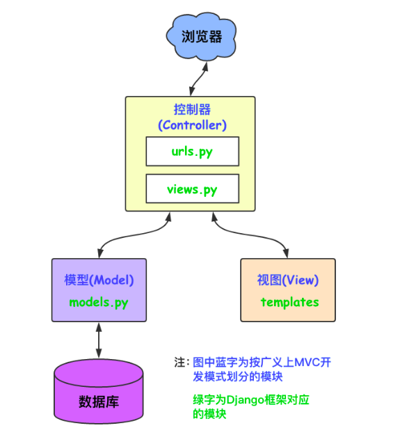

# Django-01

## CS/BS应用语言

CS/BS 客户端与服务器端的交互模式

client：客户端

Browser：浏览器

Server：web后端

后端语言框架：

python：django  8  flask  1   tornado  1

java：struts2/struts1  hibernate spring springmvc mybatis springboot sprintclude

php：yii ci thinkphp

## MVC和MTV

MTV的结构图



## Django

### 简介

Django是一个开源的web应用框架，它最初是被用来管理劳伦斯出版集团旗下的一些以新闻内容为主的网站，即CMS(内容管理系统)软件，于2005年7月在BSD许可证下发布，以吉他手Django Reinhardt来命名

重量级框架，内置了很多的功能

官方网站：http://www.djangoproject.com

使用版本1.11.7，LTS：长期支持版本

### 创建虚拟环境

+ virtualenv 虚拟环境名(一个文件夹)
+ source ./虚拟环境名/bin/activate
+ pip list 产看虚拟环境中下载的第三方库
+ 退出虚拟环境：deactivate

### 安装

pip install django==1.11.7

查看是否安装成功

pip freeze

pip list

### 创建django项目

django-admin startproject 项目名

tree 命令观察项目结构

```txt
------->$tree HelloDjango/
HelloDjango/
├── db.sqlite3
├── HelloDjango  -----------------------------------> 项目名字
│   ├── __init__.py
│   ├── settings.py   -------------------------------->项目全局配置文件
│   ├── urls.py  -------------------------------------->根路由 url(r'^路由名称', 视图函数路径)
│   └── wsgi.py  ------------------------------------->用于以后项目部署，服务器网管接口
├── manage.py     ------------------------------------>管理整个项目的文件，基本命令都通过它来调用
```

修改settings.py文件：

将页面换成中文：LANGUAGE_CODE = 'zh-hans'

将时间修改成：TIME_ZONE = 'Asia/Shanghai'

设置所有人都可以访问：ALLOWED_HOSTS = ['*']

### 启动项目

python manage.py runserver

使用开发者服务器启动项目，默认会运行在本机的8000端口

启动服务器命令：

1. python manage.py runserver
2.  python manage.py runserver 端口号
3. python manage.py runserver 主机ip:端口号

注意：不能单独设置ip地址

### 创建一个应用

创建的命令

1. python manage.py startapp 应用名

2. django-admin startapp 应用名

App结构

```txt
App
├── admin.py  ---------------------- 后台管理
├── apps.py   ----------------------- 应用配置
├── __init__.py   
├── migrations   ------------------- 迁移目录
│   └── __init__.py
├── models.py   -------------------- 模型
├── __pycache__
│   ├── __init__.cpython-36.pyc
│   ├── urls.cpython-36.pyc
│   └── views.cpython-36.pyc
├── tests.py  ------------------------- 单元测试
├── urls.py   -------------------------- 自己创建的子路由文件
└── views.py  ------------------------- 视图函数 视图函数中的参数为request，方法的返回值类型HttpResponse
```

### 拆分路由

新建一个应用：python manage.py startapp app

创建urls 

```python
urlpatterns = [
    url(r'^index2/', views.index2),
 
]
```

创建view 方法

```python
def index2(request):
    return HttpResponse('index2')
```

主路由引用

```python
url(r'^app/', include('App.urls'))
```

### 视图函数的返回值

1. HttpResponse()

   1. 字符串：HttpResponse('123')

      ```python
      def index3(request):    
      	return HttpResponse('index3')
      ```

   2. 标签：HttpResponse('<h1>123</h1>')

      ```python
      def testReturn(request):
          return HttpResponse('<h1>index4</h1>')
      ```

2. render返回模板，第一个参数是request 第二个参数是页面

   ```python
   def testReturnTem(request):
       return render(request, 'testReturnTem.html')
   ```

   + 在App下创建templates

   render方法返回的也是一个HttpResponse类型

   需要在settings里的INSTALLED_APPS中设置App路径，即将应用注册到项目中

   两种方法：

   1. INSTALLED_APPS ------> '应用名'

      ```
      INSTALLED_APPS ------>'Two'
      ```

   2. INSTALLED_APPS ------> '应用名.apps.应用名Config'

      ```
      INSTALLED_APPS ------>'Two.apps.TwoConfig'  # 这个有版本要求，1.9之后版本支持
      ```

   + 在项目目录下进行模板配置

   需要在项目目录中创建templates文件夹并标记

   需要在settings中进行注册 settings---->TEMPLATES---->DIR---->os.path.join(BASE_DIR, 'templates')

   ```python
   'DIRS': [os.path.join(BASE_DIR, 'templates')]
   ```

   注意：开发中常用项目下的模板 理由：模板可以继承，复用

### Django的工作机制

1. 使用manage.py runserver启动Django服务器时，载入在同一目录下的settings.py，该文件包含了项目中的配置信息，其中最重要的就是ROOT_URLCONF,它告诉Django哪个Python模块应该用作本站的URLConf,默认为urls.py

2. 当访问url的时候，Django会根据ROOT_URLCONF的设置来装载URLConf

3. 然后按顺序逐个匹配URLConf里的URLpatterns，如果找到则会调用相关的视图函数，并把HttpRequest对象最为第一个参数(通常是request)

4. 最后该view函数负责返回一个HttpRequest对象

   
