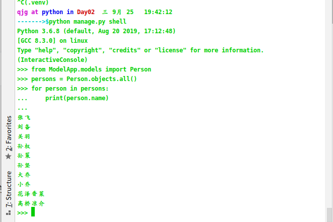

# Django-02

## 模板显示

### HTML文件

使用变量接受python传来的数据，变量的写法{{ 变量名 }}

渲染模板的时候传递上下文进来，上下文是一个字典，所以变量名必须是字典的键

模板的兼容性很强，不传入也不会报错，多传入会自动优化掉

浏览器不认模板，浏览器也叫html解析器 只识别html文件，在到达浏览器，已经进行了转换，将模板语言转换成html

支持for循环

```html
<!DOCTYPE html>
<html lang="en">
<head>
    <meta charset="UTF-8">
    <title>Title</title>
</head>
<body>
    人间繁华多笑语

    {{ name }}
    {{ age }}

    <hr>
<ul>
    
        <li>{{ score }}</li>
    
</ul>

</body>
</html>
```


### python文件

render底层实现：应用场景为发送邮件，邮件的内容需要使用render方法来操控

直接传递数据，并渲染

```python
render底层实现：应用场景为发送邮件，邮件的内容需要使用render方法def testTem(request):
    score_list = [100, 90, 80, 70, 60, 59]

    context = {
        'name': 'zs',
        'age': 18,
        'score_list': score_list
    }
    # render方法如果想传递参数给模板  那么参数的数据类型必须是字典
    # 在模板中接受参数的格式 必须接受的是key值
    return render(request, 'testTem.html', context=context)
```

加载：

```python
index = loader.get_template('three.html')
content={'xxx':'xxx'}
```

渲染：

```python
result = three_index.render(content=content)
return HtppResponse(result)
```

views.py

```python
def testTem1(request):
    # 应用场景  发送邮件

    # 加载
    tem = loader.get_template('testTem1.html')

    context = {
        'name': 'zs'
    }

    # 渲染
    ren = tem.render(context=context)

    print(type(ren))

    return HttpResponse(ren)
```


## 修改数据库直接传递数据，并渲染

### 修改配置文件

在setting.py中对DATABASE进行修改

引擎：'ENGINE': 'django.db.backends.mysql'

数据库名：'NAME': 'Django01',

用户名：'USER': 'root',

密码：'PASSWORD': 'abc123',

主机地址：'HOST': 'localhost',

端口号：'port': '3306'

端口号的值可以加引号，也可以不加引号

### mysql数据库的迁移

 在init文件进行驱动配置

```python
import pymysql

pymysql.install_as_MySQLdb()
```

mysql驱动：

+ mysqlclient：python2,3都能直接使用，但是致命缺点为：对mysql安装有要求，必须指定位置存在配置文件
+ msyql-python：对python2支持很好，对python3不支持
+ pymysql：会伪装成mysqlclient和mysql-python,python2,3都支持

生成迁移：python manage.py makemigrations

执行迁移：python manage.py migrate

## DML

### ORM

Object Relational Mapping 对象关系映射

将业务逻辑和sql进行了一个解耦合

通过models定义实现 数据库表的定义

### 模型定义

+ 继承models.Model
+ 会自动添加主键列
+ 必须制定字符串类型属性的长度

```python
class Student(models.Model):
    name = models.CharField(max_length=32)
    age = models.IntegerField()
```

### 数据存储

创建对象进行save()

```python
def addStudent(request):
    student = Student()
    student.name = '王五'
    student.age = 18

    student.save()

    return HttpResponse('添加成功')
```

### 数据查询

模型.objects.all()

模型.objects.get(pk=2)

```python
def findStudent(request):
    # 查询所有
    # student_list = Student.objects.all()

    # for student in student_list:
    #     print(student.id,student.name,student.age)

    # 查询单个对象  get是根据主键查询，主键使用pk代替
    student = Student.objects.get(pk=1)
    print(student.id,student.name,student.age)

    return HttpResponse('查询成功')
```

### 数据更新

基于查询之后进行修改和保存save()

```python
def updateStudent(request):
	# 先进行查询
    student = Student.objects.get(pk=3)

    student.name = '李逵'

    student.save()

    return HttpResponse('修改成功')
```

### 数据删除

基于查询，之后删除 delete()

```python
def deleteStudent(request):

    student = Student.objects.get(pk=3)

    student.delete()

    return HttpResponse('删除成功')
```

## Django Shell

使用：django终端，python manage.py shell

集成django环境的python终端

通常用来进行调试



## 元信息

主要用来指定表名的字段名

```txt
class Meta:
	db_table = '表名'
```

注意：表的字段一般都是下划线 ， u_name

类的属性一般都是驼峰式 ，userName

```python
class Cat(models.Model):
    name = models.CharField(max_length=32)
    age = models.IntegerField()

    class Meta:
        # 指定创建的表名
        db_table = 'cat'
```


## 数据级联

## 一对多模型

```python
class Men(models.Model):
    name = models.CharField(max_length=32)
    age = models.IntegerField()

    class Meta:
        db_table = 'men'

class Women(models.Model):
    name = models.CharField(max_length=32)
    age = models.IntegerField()
    w_men = models.ForeignKey(Men)

    class Meta:
        db_table = 'women'
```

主查从，即一查多，通过主表的隐性属性进行查询，获取从表的数据

当一对多的关系时，可以通过主表的对象，从表模型的小写_set来获取从表中所有的对应数据，

```
dept emp           dept.emp_set
grade stduent   grade.student_set
```

```python
def getWomen(request):
    men = Men.objects.get(pk=1)

    women_list = men.women_set.all()

    for women in women_list:
        print(women.id, women.name, women.age)

    return HttpResponse('查询成功')
```

通过从表查询主表数据，利用显性属性

```python
def getMen(request):
    women = Women.objects.get(pk=1)

    men = women.w_men

    print(men.id, men.name, men.age)

    return HttpResponse('查询成功')
```

## 定义属性

### 概述

Django根据属性的类型确定以下信息：

+ 当前选择的数据库支持的字段类型
+ 渲染管理表单时使用的默认html控件
+ 在管理站点最低限度的验证

Django会为表添加自增长得到主键列，每个模型只能有一个主键列，如果使用选项设置某属性为主键列后，Django不会再生成默认的主键列

属性命名规则：

+ 遵循标识符规则
+ 由于Django的查询方式，不允许使用连续下划线，连续下划线代表了私有属性

### 使用库

定义属性时，需要字段类型，字段类型被定义在django.db.models.fields目录下。为了方便使用，被导入django.db.models中

使用方式

导入from django.db import models

通过models.field创建字段类型的对象 赋值给属性

### 逻辑删除

对于重要数据都做逻辑删除，不做物理删除

逻辑删除：文件没有被真正的删除，只不过是文件名的第一个字节被改成操作系统无法识别的字符，通常这种删除操作是可逆的，就是说用适当的工具或软件可以把删除的文件恢复出来。

物理删除：指文件存储所用到的磁存储区域被真正的擦除或清零，这样删除的文件是不可以恢复的，物理删除是计算机处理数据时的一个概念。

逻辑删除就是对要被删除的数据打上一个删除标记，在逻辑上是数据是被删除的，但数据本身依然存在！而物理删除则是把数据从介质上彻底删除掉

实现方法：定义isDelete属性，类型为BoleanField，默认值False

### 字段类型

+ AutoField：一种自增长的IntegerField，通常不指定，如果不指定一个字段将自动添加到模型
+ CharField(max_length=字符长度)：字符串，默认的表单样式为TextInput
+ TextField：大文本字段，一般超过4000使用，默认表单控件为Textarea
+ IntegerField：整数类型
+ DecimalField(max_digits=None, decimal_places=None)
  + 使用python的Decimal实例表示的十进制浮点数
  + 参数说明：DecimalField.max_digits:位数总数，decimal_place：小数部分位数
+ FloatField：浮点型
+ BooleanField：true/false实例来表示的浮点数
+ NullBooleanField：支持null,true,false三种值
+ DateField([auto_now=False, auto_now_add=False])使用python的datetime.date实例表示的日期
  + 参数说明：DateField.auto_now：每次保存对象时，自动设置该字段为当前时间，用于"最后一次修改"的时间戳，它总是使用当前日期，默认为false
  + DateField.auto_now_add：当对象第一次被创建时自动设置当前时间，用于创建的时间戳，它总是使用当前日期，默认为false
  + 说明
    + 该字段默认对应的表单控件是一个TextInput. 在管理员站点添加了一个JavaScript写的日历控件，和一个“Today"的快捷按钮，包含了一个额外的invalid_date错误消息键
  + 注意
    + auto_now_add, auto_now, and default 这些设置是相互排斥的，他们之间的任何组合将会发生错误的结果
+ TimeField：·使用Python的datetime.time实例表示的时间，参数同DateField
+ DateTimeField：使用Python的datetime.datetime实例表示的日期和时间，参数同DateField
+ FileField：一个上传文件的字段
+ ImagesField：继承了FileField的所有属性和方法，但对上传的对象进行校验，确保它是个有效的image

### 字段约束

+ null：如果为True，Django 将空值以NULL 存储到数据库中，默认值是 False

+ blank：如果为True，则该字段允许为空白，默认值是 False

+ 注意：null是数据库范畴的概念，blank是表单验证证范畴的

+ db_column：字段的名称，如果未指定，则使用属性的名称

+ db_index：若值为 True, 则在表中会为此字段创建索引

+ default：默认值

+ primary_key：若为 True, 则该字段会成为模型的主键字段

+ unique：如果为 True, 这个字段在表中必须是唯一值

### 关系

+ 分类：ForeignKey：一对多，将字段定义在多的一端中
+ ManyToManyField：多对多，将字段定义在两端中
+ OneToOneField：一对一，将字段定义在任意一端中

用一访问多：对象.模型类的小写_set，grade.student_set

用一访问一：对象.模型类小写，grade.student

访问id：对象.属性_id，student.sgrade_id

## 模型过滤(查询)

Django默认通过模型的objects对象实现模型数据查询。

Django有两种过滤器用于筛选记录：

+ filter:返回符合筛选条件的数据集
+ exclude:返回不符合筛选条件的数据集

```python
def testFilder(request):
    # filter  返回一个queryset类型
    # person = Person.objects.filter(age=12)[0]
    # print(person)
    # print(type(person))

    # exclude
    # persons = Person.objects.exclude(age=12)
    # for person in persons:
    #     print(persons.name, persons.age)

    # 链式调用 无线嵌套，多个filter和exclude连接在一起查询
    # person = Person.objects.exclude(age=12).filter(age=12)[0]
    # print(person.name, person.age)

    # 应用
    # gt great than
    # lt less than
    # lte less than equals
    # gte great than equals
    # persons = Person.objects.filter(age__gt=20)
    # for person in persons:
    #     print(person.name, person.age)
    persons = Person.objects.filter(age__in=[12, 21])
    for person in persons:
        print(person.name, person.age)

    return HttpResponse('查询成功')
```

## 创建对象

方式：

1. 常用方式

   ```python
   person = Person()
   person.p_name = 'zs'
   person.p_age = 18
   ```

2. 直接实例化对象，设置属性，创建对象，传入属性

   ```python
   person = Person(name='藏金控', age=18)
   person.save()
   ```

3. 自己封装类方法创建

   ```python
   person = Person.objects.create(name='花泽香菜', age=18)
   person.save()
   ```

4. 在模型类中增加类方法取创建对象

   ```python
   class Person(models.Model):
       name = models.CharField(max_length=32)
       age = models.IntegerField()
   
       class Meta:
           db_table = 'person'
   
       @classmethod
       def create(cls, name, age):
           return cls(name=name, age=age)
   ```

   ```python
   person = Person.create(name='高桥凉介', age=20)
   person.save()
   ```

## 查询集

查询集表示从数据库获取的对象集合，查询集可以有多个过滤器。

### 过滤器

+ 过滤器就是一个函数，基于所给的参数限制查询集结果，返回查询集的方法称为过滤器。
+ 查询经过过滤器筛选后返回新的查询集，所以可以写成链式调用。
+ 获取查询结果集  QuerySet

```python
def testFilder1(request):
    # all 查询所有数据
    persons = Person.objects.all()
    print(type(persons))
    for person in persons:
        print(person.id, person.name, person.age)

    # filter 查询符合条件的数据
    persons = Person.objects.filter(age__gt=20)
    print(type(persons))
    for person in persons:
        print(person.id, person.name, person.age)

    # exclude 不包含
    persons = Person.objects.exclude(age__gt=20)
    print(type(persons))
    for person in persons:
        print(person.id, person.name, person.age)

    # order_by
    # 默认是升序
    # persons = Person.objects.order_by('age')
    # 降序
    persons = Person.objects.order_by('-age')
    print(type(persons))
    for person in persons:
        print(person.id, person.name, person.age)

    # values
    persons = Person.objects.values()
    print(type(persons))
    for person in persons:
        print(person['id'], person['name'], person['age'])

    # 切片
    persons = Person.objects.all()[0:5]
    print(type(persons))
    for person in persons:
        print(person.id, person.name, person.age)

    return HttpResponse('查询成功')
```

注意:

切片

+ 限制查询集，可以使用下标的方法进行限制,左闭右开区间,不支持负数,下标没有负数,实际上相当于 limit  offset
+ `studentList = Student.objects.all()[0:5]`  第一个参数是offset  第二个参数是limit

懒查询/缓存集

+ 查询集的缓存：每个查询集都包含一个缓存，来最小化对数据库的访问
  		在新建的查询集中，缓存首次为空，第一次对查询集求值，会发生数据缓存，django会将查询出来的数据做	一个缓存，并返回查询结果，以后的查询直接使用查询集的缓存。

  - 都不会真正的去查询数据库
  
+ 懒查询
    + 只有我们在迭代结果集，或者获取单个对象属性的时候，它才会去查询数据
    + 为了优化我们结果和查询	

### 获取单个对象

+ get
  + 不存在会抛异常  DoesNotExist
  + 存在多于一个 MultipleObjectsReturned
  + 使用这个函数 记得捕获异常
+ last：返回查询集种的最后一个对象
+ first：需要主动进行排序
  		persons=Person.objects.all().first()
+ 内置函数：框架自己封装得方法 帮助我们来处理业务逻辑
  + count：返回当前查询集中的对象个数，应用场景：登录
  + exists：判断查询集中是否有数据，如果有数据返回True没有反之

```python
def getOne(request):
    # get
    person = Person.objects.get(pk=2)
    print(type(person))
    print(person.id,person.name,person.age)

    # last
    person = Person.objects.last()
    print(type(person))
    print(person.id, person.name, person.age)

    # first
    person = Person.objects.first()
    print(type(person))
    print(person.id, person.name, person.age)

    # count
    person = Person.objects.filter(name='张飞').filter(age=24)
    # print(person.count())
    if person.count() > 0:
        print('exists')
    else:
        print('not exists')

    # exists
    person = Person.objects.filter(name='张飞').filter(age=23)
    if person.exists():
        print('exists')
    else:
        print('not exists')

    # 扩展get
    # get方法如果找不到对象，报错Person matching query does not exist
    person = Person.objects.get(pk=100)

    # 如果get返回了多个值， 报错 get() returned more than one Person -- it returned 3!
    person = Person.objects.get(age=22)

    return HttpResponse('查询成功')
```

### 字段查询

对sql中where的实现，作为方法filter(),exclude(),get()的参数
语法:属性名称\_\_比较运算符=值
		Person.objects.filter(p_age__gt=18)
条件:属性\_\_操作符=临界值

+ 大于gt:great than
+ 大于等于gte:great than equals
+ 小于lt:less than
+ 小于等于lte:less than equals
+ in=[2,4,6,8])单引号可以使用
+ exact：判断，大小写不敏感，filter(isDelete = False)
+ startswtith：以什么开头，类似于 模糊查询 like
+ endswith：以 xx 结束  也是like
+ contains：是否包含，大小写敏感，filter(sname\_\_contains='赵')
+ isnull：是否为空，filter(sname\_\_isnull=False)
+ ignore 忽略大小写
  			iexact
        			icontains
        			istartswith
        			iendswith
  以上四个在运算符前加上 i(ignore)就不区分大小写了 iexact

```python
def fieldQuery(request):
    # 大于 __gt
    persons = Person.objects.filter(age__gt=20)
    for person in persons:
        print(person.id, person.name, person.age)

    print('=' * 30)

    persons = Person.objects.filter(age__gte=20)
    for person in persons:
        print(person.id, person.name, person.age)

    print('=' * 30)

    # 大于等于 __gte
    persons = Person.objects.filter(age__gte=20)
    for person in persons:
        print(person.id, person.name, person.age)

    print('=' * 30)

    # 小于 __lt
    persons = Person.objects.filter(age__lt=20)
    for person in persons:
        print(person.id, person.name, person.age)

    print('=' * 30)

    # 小于等于  __lte
    persons = Person.objects.filter(age__lte=20)
    for person in persons:
        print(person.id, person.name, person.age)

    print('=' * 30)

    # 大小写不敏感 __exact
    person = Person.objects.filter(name__exact='stack')[0]
    print(person.id, person.name, person.age)

    print('=' * 30)

    # 以什么开头 __startswith
    persons = Person.objects.filter(name__startswith='S')
    for person in persons:
        print(person.id, person.name, person.age)
    print('='*30)

    # 以什么结尾 __endswith
    persons = Person.objects.filter(name__endswith='乔')
    for person in persons:
        print(person.id, person.name, person.age)
    print('=' * 30)

    # 是否包含，且大小写不敏感
    persons = Person.objects.filter(name__contains='m')
    for person in persons:
        print(person.id, person.name, person.age)

    print('='*30)

    # 判断是否为空 
    persons = Person.objects.filter(name__isnull=False)
    for person in persons:
        print(person.id, person.age)

    print('=' * 30)

    return HttpResponse('查询成功')
```


### 时间

```python
def addOrder(request):
    order = Order()
    order.save()
    return HttpResponse('添加成功')


def getYear(request):
    order = Order.objects.filter(o_time__year=2020)[0]
    print(order.o_time)
    return HttpResponse('查询成功')

# 会出现时区问题  需要在settings中的USE-TZ中设置为 False
def getMonth(request):
    order = Order.objects.filter(o_time__month=8)[0]
    print(order.o_time)
    return HttpResponse('查询成功')
```

除了上面列举出来的几种，还有：day、week_day、hour、minute、second

### 聚合函数(组函数/多行函数/高级函数)

常用的聚合函数有:

```python
def getAggr(request):
    # 返回的是一个字典
    # 总和
    sum_cost = Custom.objects.aggregate(Sum('cost'))

    print(sum_cost)

    # 最大值
    max_cost = Custom.objects.aggregate(Max('cost'))
    print(max_cost)

    # 最小值
    min_cost = Custom.objects.aggregate(Min('cost'))
    print(min_cost)

    # 个数
    count_cost = Custom.objects.aggregate(Count('cost'))
    print(count_cost)

    # 平均值
    avg_cost = Custom.objects.aggregate(Avg('cost'))
    print(avg_cost['cost__avg'])

    return HttpResponse('查询成功')
```

### 跨关系查询

模型结构

```python
class Grade(models.Model):
    g_name = models.CharField(max_length=32)

    class Meta:
        db_table = 'grade'


class Student(models.Model):
    s_name = models.CharField(max_length=32)
    s_grade = models.ForeignKey(Grade)

    class Meta:
        db_table = 'student'
```

视图函数

```python
def getGrade(request):
    grade = Grade.objects.filter(student__s_name='王五')[0]
    print(grade.g_name)

    students = Student.objects.filter(s_grade__g_name='python')
    for stduent in students:
        print(stduent.id, students.s_name, stduent.s_grade)

    return HttpResponse('查询成功')
```

### F对象

常适用于表内属性的值的比较,获取字段信息，通常是模型的自我数星星比较，支持算术运算

模型

```python
class Company(models.Model):
    c_name = models.CharField(max_length=32)
    c_girl_num = models.IntegerField()
    c_boy_num = models.IntegerField()

    class Meta:
        db_table = 'company'
```

视图函数

```python
def testF(request):
    # 查询哪些公司的女生比男生多

    # company_list = Company.objects.filter(c_girl_num__gt=F('c_boy_num'))
    # for company in company_list:
    #     print(company.c_name)

    # 查询哪些公司的女生比男生多10个以上
    company_list = Company.objects.filter(c_girl_num__gt=F('c_boy_num') + 10)
    for company in company_list:
        print(company.c_name)
    return HttpResponse('查询成功')
```

### Q对象

常用于逻辑运算：与、或、非

```python
def testQ(request):
    # 哪些公司的男生大于10，女生也大于10
    # company = Company.objects.filter(c_girl_num__gt=10).filter(c_boy_num___gt=10)[0]

    # company = Company.objects.filter(Q(c_girl_num__gt=10)&Q(c_boy_num__gt=10))[0]
    # 哪些公司的男生大于10，或者女生大于10
    # companys = Company.objects.filter(Q(c_girl_num__gt=10) | Q(c_boy_num__gt=10))
    # for company in companys:
    #     print(company.c_name)

    # 哪些公司的女生大于10
    # companys = Company.objects.filter(c_girl_num__gt=10)
    companys = Company.objects.filter(~Q(c_girl_num__lte=10))
    for company in companys:
        print(company.c_name)

    return HttpResponse('查询成功')
```


