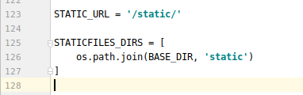
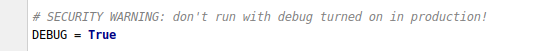

# Django-03

## Template(模板)

### 概念

在Django框架中，模板是可以帮助开发者快速生成，呈现给用户页面的工具

模板的设计方式实现了我们MVT中VT的解耦，VT有着N:M的关系，一个V可以调用任意

T，一个T可以供任意V使用

模板处理分为两个过程：加载、渲染

模板中的动态代码段除了做基本的静态填充，可以实现一些基本的运算，转换和逻辑

早期的web服务器  只能处理静态资源请求  模板能处理动态资源请求 依据计算能生成相

应的页面

注意：在Django中使用的就是Django模板，在flask种使用得是jinja2模板

模板组成：模板主要有2个部分

+ HTML静态代码
+ 动态插入的代码段（挖坑，填坑）

### 模板语法

#### 变量

视图传递给模板的数据，获取视图函数传递的数据使用{{ 变量名 }}

遵守标识符规则：拒绝关键字，保留字，数字

如果变量不村子啊，则插入空字符串

来源：视图传递过来的，标签中，逻辑创建出来的

#### 点语法

模板中的点语法：属性或者方法

```python
# models.py
class Dog(models.Model):
    d_name = models.CharField(max_length=32)

    class Meta:
        db_table = 'dog'

    def get_name(self):
        return self.d_name
```

```python
# views.py
def testPoint(request):
    dog = Dog.objects.first()
    dog_list = Dog.objects.all()
    dog_dict = {
        'sex': 'x'
    }
    context = {
        'dog': dog,
        'dog_list': dog_list,
        'dog_dict': dog_dict
    }

    return render(request, 'testPoint.html', context=context)
```


testPoint.html

```html
<!DOCTYPE html>
<html lang="en">
<head>
    <meta charset="UTF-8">
    <title>Title</title>
</head>
<body>
    快要放长假啦
    <hr>
    {{ dog.d_name }}
    {{ dog.get_name }}
    {{ dog_list.1.d_name }}
    <hr>
    <ul>
        
            <li>{{ dog.d_name }}</li>
        
    </ul>
    <hr>
    {{ dog_dict.sex }}
</body>
</html>
```

缺点：模板中的小弊端，调用对象的方法，不能传递参数

索引 dog_list.0.d_name

字典：dog_dict.sex

#### 标签

特征：标签分为单标签和双标签，双标签必须闭合

功能标签：

1. for

   + for i in x
   + empty：，判断之前的代码有没有数据 如果没有电视empty下面的代码
   + forloop：循环状态的记录
     + {{ forloop counter }}表示当前是第几次循环，从1开始
     + {{ forloop.counter0 }}表示当前是第几次循环，从0开始
     + {{ forloop.revcounter }}表示当前是第几次循环，倒着数，到1结束
     + {{ forloop.revconuter0 }}表示当前第几次循环， 倒着数，到0结束
     + {{ forloop.first }}是否是第一个 布尔值
     + {{ forloop.last }}是否是最后一个 布尔值

2. if

   + if -elif-else
   + 进行判断

3. widthratio:乘，

   :num * 5

   :num * 1/5

4. divisibleby整除：

   :奇偶行变色

5. ifequal是否等于:：value1是否等于value2

```html
<ul>
        
            <li>{{ dog.d_name }}</li>
            
            我爱我的祖国
        

    </ul>
    <hr>
    <ul>
       
           <li>{{ dog.d_name }}::::{{ forloop.counter }}::::{{ forloop.counter0 }}::::{{ forloop.revcounter }}::::{{ forloop.revcounter0 }}</li>
           {{ forloop.first }}::::{{ forloop.last }}
       
    </ul>
    <hr>
    <ul>
        
            
                <li style="color:green">{{ dog.d_name }}</li>
                }
                <li style="color: red">{{ dog.d_name }}</li>
                
                <li style="color: aqua">{{ dog.d_name }}</li>

            
        

    </ul>
    <hr>
    {# 春天来啦 #}

    
        冬天来了
        秋天过去啦
    
    <hr>
    {{ num }}
    
    

    <hr>

    <ul>
        
            
                <li style="color: red">{{ dog.d_name }}</li>
                
                <li style="color: aqua">{{ dog.d_name }}</li>


            

        

    </ul>
    <hr>
    <ul>
        
            
                <li style="color: red">{{ dog.d_name }}</li>
                
                <li style="color: aqua">{{ dog.d_name }}</li>
            

        

    </ul>

    <hr>
    <ul>
        
            
                <li style="color: red">{{ dog.d_name }}</li>
                
                <li style="color: aqua">{{ dog.d_name }}</li>
            

        

    </ul>
    <hr>
```

#### 注释

单行注释：{# 被注释的内容 #}

多行注释：{# comment #} 内容 {# endcomment #}

#### 过滤器( | )

将前面的输入作为后面的输出

add(加)

+ {{ num|add:2 }},num加上2
+ {{ num|add:-2 }},num减去2

upper：将字符串中所有的字母转换为大写

lower：将字符串中的所有的字母转换为小写

safe:确认安装，进行渲染

autoescape:进行标签渲染，双标签

```python
{# 过滤器 #}
    {{ num1 }}
    {{ num1 | add:5 }}
    {{ num1 | add:-5}}
    <br>
    {{ code }}
    {{ code|upper }}
    {{ code|upper|lower }}

    {{ code1 }}
    {{ code1|safe }}

    {{ code2|safe }}

    {{ code3 }}
    
        {{ code3 }}
    
```

### 结构标签

1. block：用来规划页面布局，填充页面，多层使用，不想被覆盖使用{ block.super }
2. extends：继承，面向对象的体现，提高模板的复用率
3. include：包含，将其他模板作为一部分，包裹我们的页面

父页面

```html
<!DOCTYPE html>
<html lang="en">
<head>
    <meta charset="UTF-8">
    <title>Title</title>
    
    
</head>
<body>
    

    

    

    

    

    

    

    
</body>
</html>
```

子页面

```html



    起来不愿做奴隶的人们

```

子页面的子页面

```python


    {{ block.super }}
    把我们的血肉筑成我们新的长城



    

```

base_c.html

```html
<ul>
    <li>李</li>
    <li>赵</li>
    <li>钱</li>
    <li>孙</li>
    <li>周</li>
</ul>
```

### 加载静态资源

静态资源包括：html css js img font

静态资源路径：/static/css/static.css

不推荐硬编码，需要在settings中添加 STATICFILES_DIRS=[os.path.join(BASE_DIR, 'static')]



推荐使用：

{% load static% }



注意：只能在模板中使用，html不能使用，

在DEBUG模式下可以使用，如果settings中的DEBUG=False那么不可以使用



```html
<!DOCTYPE html>
<html lang="en">
<head>
    <meta charset="UTF-8">
    <title>Title</title>
{#    <link rel="stylesheet" href="/static/getStatic.css">#}
    
    <link rel="stylesheet" href="">
</head>
<body>
    <ul>
        <li>洪世贤</li>
        <li>何书桓</li>
        <li>杨晨曦</li>
        <li>陈世美</li>
        <li>张三</li>
    </ul>
</body>
</html>
```

### 请求状态码

2xx：成功 200

3xx：

+ 重定向 302
+ 永久重定向 303

4xx：客户端错误

+ 防跨站攻击

+ 路径错误：404
+ 请求方式错误：405

5xx:服务端错误

+ 业务逻辑错误：500

## 视图函数

### 概念和基础

视图函数MTV中的View，相当于MVC中的Controller作用，控制器 接受用户输入

协调模板模型，对数据进行处理，负责的模型和模板的数据交互

视图函返回值类型

1. 以Json数据形式返回，前后端分离 return JsonResponse
2. 以网页形式返回，HttpResponse render redirect，重定向到另一个网页，错误视图(40x,50x)

### url正则匹配

正则匹配时从上到下进行遍历，匹配到就不会继续向后查找

匹配的正则前方不需要叫反斜线

正则前需要加r，表示字符串不转义

规则：按照书写顺序，从上到下匹配，没有最优匹配，匹配到就停止

urls.py

```python
# 正则匹配规则
    url(r'^he/', views.he),
    url(r'^hehe/', views.hehe),
    url(r'^hehehe/', views.hehehe),
```

views.py

```python
def hehe(request):
    return HttpResponse('hehe')


def hehehe(request):
    return HttpResponse('hehehe')


def he(request):
    return HttpResponse('he')
```

访问路径：127.0.0:8000/vie/hehehe

输出：he

### url接受参数

1. 如果需要从url中获取一个值，需要对正则加小括号
2. 如果需要获取url路径中的多个参数，添加多个括号，默认按照顺序匹配路径名字
3. 使用关键字参数，多个参数指定位置

注意：url中有参数，对应的视图函数，也得有参数，进行接收

urls.py

```python
# 路由参数接收的参数默认是字符串类型
    url(r'^testRoute/(\d+)/', views.testRoute),
    # 路由位置参数
    url(r'^testRoute1/(\d{4})/(\d+)/(\d+)/', views.testRoute1),
    # 路由关键字参数
    url(r'^testRoute2/(?P<year>\d{4})/(?P<month>\d+)/(?P<day>\d+)/', views.testRoute2),
```

views.py

```python
def testRoute(request, id):
    print(id)
    print(type(id))
    return HttpResponse('testRoute')


def testRoute1(request, month, day, year):
    return HttpResponse(year+'/'+month+'/'+day)


def testRoute2(request, month, day, year):
    return HttpResponse(year+'/'+month+'/'+day)
```

总结路径参数：
位置参数

+ 使用圆括号包含规则
+ 一个圆括号代表一个参数
+ 代表视图函数上的一个参数
+ 参数个数和视图函数上的参数一一对应（除默认request）

关键字参数

+ 可以在圆括号指定参数名字 （?P<name>reg）
+ 视图函数中存在和圆括号中name对应的参数
+ 参数不区分顺序
+ 个数也需要保持一致，一一对应

### 内置函数

local()

+ 将局部变量使用字典的形式打包
+ key是变量的名字
+ value是变量的值

views.py

```python
def testLocals(request):
    name = '张三'
    age = 28
    return render(request, 'testLocals.html', context=locals())
```

### 反向解析

#### 配置

在根路由中添加参数 namespace，namespace是根路由下的include方法的参数

```python
url(r'^vie/', include('ViewApp.urls', namespace='vie'))
```

在子路由中添加参数 name，name 是子路由下的参数

```python
url(r'^testReverse/', views.testReverse, name='testReverse'),
url(r'^testReverse1/', views.testReverse1, name='testReverse1'),
```

在html中写上{{ url 'namespace:name' }}

```html
<a href="">反向解析的基本应用</a>
 <a href="">葵花宝典</a>
```

视图函数

```python
def testReverse(request):
    return HttpResponse('测试反向解析的基本应用')


def testReverse1(request):
    return HttpResponse('天下武功唯快不破')
```

如果存在位置参数：

```html
<a href="">反向解析的位置参数</a>
```

子路由中

```python
 # 反向解析的位置参数
url(r'^testReverseLocal/(\d{4})/(\d+)/(\d+)/', views.testReverseLocal, name='testReverseLocal'),
```

如果存在关键字参数

```html
<a href="">反向解析的关键字参数</a>
```

子路由中

```python
    url(r'^testReverseKey/(?P<year>\d{4})/(?P<month>\d+)/(?P<day>\d+)/', views.testReverseKey, name='testReverseKey')
```

在视图函数中也需要使用参数进行接收

```python
def testReverseLocal(request, month, day, year):
    return HttpResponse(year+'/'+month+'/'+day)


def testReverseKey(request, month, day, year):
    return HttpResponse(year+'/'+month+'/'+day)
```

