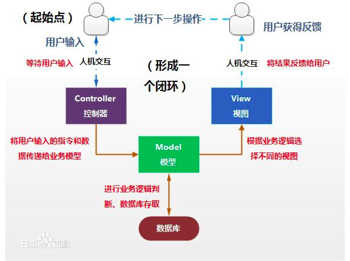
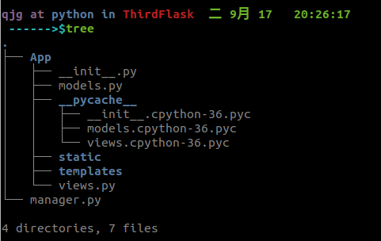
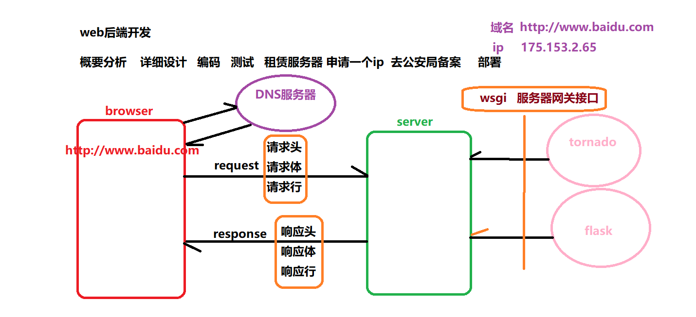
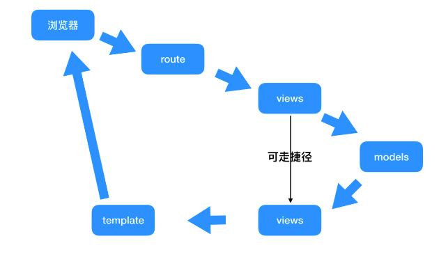

#  Flask-01

## 框架介绍

1. 基于python的web(微)框架

+ 重量级框架django
  + 为了方便业务程序的开发，提供了丰富的工具及其组件

+ 轻量级框架flask
  + 只提供web核心功能，自由灵活，高度定制，Flask也被称为'microframework'，因为它使用简单的核心，用extension增加其他功能

轻量级和重量级框架的区别：

1、启动程序时需要加载的资源

+ EJB应用启动时，需要消耗大量的资源，比如内存、CPU等，把所有的服务都加载进来；而Spring则是可定制服务，需要加载什么就加载什么。

2、框架的侵入性程度或者框架的依赖性，耦合性程度（轻量级的框架侵入性程度较低）

+ 轻量级框架不一定需要继承和实现框架的接口和抽象类来注册和实例化组件。

+ 重量级框架需要继承和实现框架的类或者实现框架的接口，以方便使用框架中间件特性。这就意味着，需要实例化大量的类并且注册到应用中去，虽然可能用不到。

3、轻量级框架一般是一组独立的特性实现集，重量级框架往往依赖于某些或其他类型的容器支持框架的特性。

4、开发的方便程度

+ 轻量级框架在开发中应用非常简单方便

+ 重量级框架开发时则要写一些框架绑定的类，部署、运行及测试过程都较为复杂，开发起来并不方便。

5、解决问题的侧重点

+ 轻量级框架侧重于减小开发的复杂度，相应它的处理能力较弱（事务功能弱，不具备分布式处理能力），适用于开发中小型企业应用。

+ 重量级框架则强调高可伸缩性，适合于开发大型企业应用。

2. 官方文档

   ```
   http://flask.pocoo.org/docs/0.12/      英文
   http://docs.jinkan.org/docs/flask/     中文
   ```

3. flask依赖库

   ```
   1、jinjia2                     模板引擎
   2、Werkzeug              WSGI工具集
   3、Itsdangerous       基于Django的签名模块
   现在还有其他三个，主要的还是jinjia2和Werkzeug
   ```

4. flask流行的主要原因

   ```
   1、有非常齐全的官方文档、上手非常方便
   2、有非常好的扩展机制和第三方扩展环境，工作中常见的软件都会有对应的扩展，动手实现扩展也很容易
   3、社区活跃度非常高
   4、微型框架的形式给了开发者更大的选择空间
   ```

## BS/CS

### 概念

```
BS：B borwser浏览器 Sserver 服务器 主流
CS：C client 客户端  S server 服务器
BS结构时WEB星兴起之后的一种网络结构模式，WEB浏览器时客户端最主要的应用软件，这种模式统一了客户端，将系统功能实现的核心部分集中到服务器上，简化了系统开发、维护和使用
```

| 对象 | 硬件环境                                           | 客户端要求                     | 软件安装                                       | 升级和维护                                |
| ---- | -------------------------------------------------- | ------------------------------ | ---------------------------------------------- | ----------------------------------------- |
| CS   | 用户固定，并且处于相同区域，要求拥有相同的操作系统 | 客户端计算机电脑配置要求较高   | 每一个客户端都必须安装和配置软件               | C/S每一个客户端都要升级程序，可以采用自动 |
| BS   | 要有操作系统和浏览器，与操作系统平台无关           | 客户端的计算机电脑配置要求较低 | 可以在任何地方进行操作而不用安装任何专门的软件 | 不必安装和维护                            |

安全            

一般面向相对应固定的用户群，程序更加注重流程，它可以对权限进行多层校验，提供了更安全的存取模式，对信息安全的控制能力很强，一般高度机密的信息系统采用C/S结构适宜

## MVC/MTV

### MVC：软件架构思想

#### 简介：

MVC开始是存在与桌面程序中，M指的是业务模型model ，V是指用户界面，C则是控制器controler，使用MVC的目的是将M和V实现代码分离，从而使用同一个程序可以使用不同的表现形式，比如一批数据可以使用饼状图和条形图来表示，C存在的目的则是确保M和V的同步，一旦其中一方发生改变，另一方应该同步改变

#### 核心思想

解耦合：解除类之间的直接关系，将直接关系转换成间接关系，把模块之间的关联放松到必要的程度

- 模块只对外暴露最小限度的接口，形成最低的依赖关系。
- 只要对外接口不变，模块内部的修改，就不得影响其他模块；
- 删除一个模块，应当只影响有依赖关系的其他模块，而不应该影响其他无关部分；

耦合：也称块间联系。指软件系统结构中各模块间相互联系紧密程度的一种度量。模块之间联系越紧密，其耦合性就越强，模块的独立性则越差。块间的耦合度是指模块之间的依赖关系，包括控制关系、调用关系、数据传递关系

内聚：又称块内联系。指模块的功能强度的度量，即一个模块内部各个元素彼此结合的紧密程度的度量。若一个模块内各元素（语句之间、程序段之间）联系的越紧密，则它的内聚性就越高

面向对象语言：高内聚，低耦合

从表查询主表使用显性属性emp.e_dept

View：视图，用来将数据呈现给用户的

Controller：控制器，接受用户输入输出，用来协调Model和View的关系，并对数据进行操作，筛选

流程：控制器接受用户请求，调用模型，获取数据，控制器将数据展示到视图层中



### MVT/MTV

MVT/MTV：本质上就是MVC的变种，

model：同MVC中的Model

Template：模板。只是一个HTML，充当的是View的角色，用来做数据展示

Views：视图函数，相当于MVC中的Controler

## flask的基本使用

### 虚拟环境

创建：进入到需要虚拟环境的目录，使用命令`virtualenv  .env`创建虚拟环境，激活：`source /.venv/bin/activate`

查看虚拟环境：

`pip freeze`：以需求格式输出下载包

`pip list`：罗列出所有下载包

虚拟环境迁移

迁入：`pip freeze > requirements.txt`

迁出：`pip install -r requirements.txt`

### Flask项目的创建

#### 安装

国外源  `pip install flask`
国内源  `pip install flask -i https://pypi.douban.com/simple`

#### 创建项目

```python
from flask import Flask

app = Flask(__name__)

@app.route('/')
def hello():
 	return 'hello world'
 	
 app.run()
```

#### 启动服务

python 文件名.py

#### 连接服务器

使用默认端口和主机：`127.0.0.1:5000`

#### 修改服务器参数

在run方法中添加参数

在启动的时候可以添加参数

`app.run(port='9999', host='0.0.0.0',)`

一共可以设置4个参数：

**`debug`**: 是否开启调试模式，开启后修改python代码自动重启，如果修改的是html、js、css代码不会自动重启

**`host`**:主机，默认主机地址是127.0.0.1，可以制定为0.0.0.0

**`port`**:制定服务器的端口号

**`threaded`**：是否开启多线程

#### PIN码

```
全称Personal Identification Number.就是SIM卡的个人识别密码。手机的PIN码是保护SIM卡的一种安全措施，防止别人盗用SIM卡，如果启用了开机PIN码，那么每次开机后就要输入4到8位数PIN码。
在输入三次PIN码错误时，手机便会自动锁卡，并提示输入PUK码解锁，需要使用服务密码拨打运营商客服热线，客服会告知初始的PUK码，输入PUK码之后就会解锁PIN码。
```

#### 命令行参数

1. 安装：`pip install flask-script`，启动命令行参数

2. 初始化：

   修改文件名，将文件名修改为：`manager.py`

   添加代码：`manager = Manager(app=app)`

   修改代码：`app.run()`---->`manager.run()`

3. 运行

   `python manager.py runserver -p 端口号 -h 主机地址 -d -r`

   参数解释：

   -p: 指定端口号

   -h: 指定主机ip

   -d: 调试模式 debug

   -r: 重启(重新加载) `reload(restat)`

   连接时：使用启动时的端口和ip进行连接

### 视图函数返回值

1. index返回字符串

   ```python
   # 视图函数的返回值
   # 视图函数的返回值必须是字符串 字典 元祖 response
   @app.route('/testreturn/')
   def testreturn():
       # 视图函数不能时一个整数
       # return 1
       return '1'
   ```

2. 模板first.html

   ```python
   @app.route('/testreturn1/')
   def testreturn1():
       # render_template方法返回的是字符串
       s = render_template('testreturn1.html')
       print(type(s))
   
       return s
   ```

3. 静态文件scc

   在html文件中引入css文件：

   ```html
   <link rel="stylesheet" href="/static/testreturn1.css">
   ```

   注意，一定要加上rel='stylesheet'

### Flask基础结构

App

​	templates: 模板，默认也需要和项目保持一致

​	static:静态资源，默认和项目保持一致，在一个目录中，指的Flask对象创建的路径

​	view: 视图函数，专门用来控制的

​	models：数据模型 与数据库一一对应

注意：1、执行过程中manager.py和其他文件的路径问题

2、封装`__init__.py`文件

具体目录树：



### 蓝图

1、宏伟蓝图

2、蓝图是一种规划，主要用来规划urls(路由)

3、蓝图的基本使用：

安装：pip install flask-blueprint

初始化：blue = Blueprint('first', \_\_name__)

​	注意：1、蓝图导入的时候使用`from flask import blueprint`

​		2、初始化必须在views中

调用蓝图进行路由注册，`app.register_blueprint(blueprint=blue)`

循环导入问题：运行时连续三个from错误提示，解决方法：删除没有用的导入包语句

manager.py

```python
from App import create_app
from flask_script import Manager

from App.views import blue

app = create_app()
manager = Manager(app=app)
app.register_blueprint(blueprint=blue)

if __name__ == '__main__':
    app.run()
```

views.py

```python
from flask import Blueprint


blue = Blueprint('first', __name__)


@blue.route('/index/')
def index():
    return 'index'
```

`__init__.py`

```python
from flask import Flask


def create_app():
    app = Flask(__name__)
    return app
```

### web后端开发流程



接口：接口泛指实体把自己提供给外界的一种抽象化物（可以为另一实体），用以由内部操作分离出外部沟通方法，使其能被修改内部而不影响外界其他实体与其交互的方式

### Flask请求流程

​	请求路由(app.route())----->视图函数----->视图函数和Models交互----->模型返回数据到视图函数----->视图函数渲染模板----->模板返回给用户



