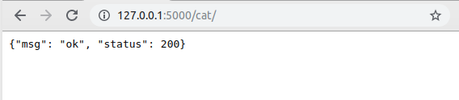
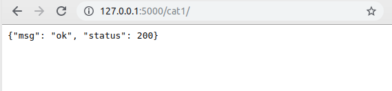
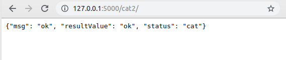
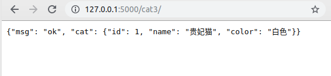
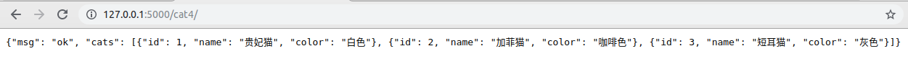

# Flsak-06

## 缓存flask-cache

1. 缓存目的：缓存优化加载，减少数据库的IO操作

2. 实现方案：

   1. 数据库
   2. 文件
   3. 内存
   4. 内存中的数据库redis 最优策略

3. 实现流程：

   1. 从路由函数进入程序
   2. 路由函数到视图函数
   3. 视图函数取缓存中查找
   4. 缓存中找到，直接进行数据返回
   5. 如果没有找到，去数据库中查找
   6. 查找到之后，添加到缓存中
   7. 返回到页面上

4. 使用

   1. 安装flask-cache：pip insatll flask-cache
   2. 初始化：指定使用的缓存方案

   ```python
   cache = Cache(config={'CACHE_TYPE':默认是simple/'redis'})
   cache.init_app(app=app)
   ```

       注意：
       如果cache在方法内，是局部变量，无法进行导包
       cache = Cache(config={'CACHE_TYPE': 'redis'})
       如果报错 ModuleNotFoundError: No module named 'flask.ext'
       解决办法：
       1、打开site-packages,找到flask-cache
       2、找到jinjia2ext.py
       3、修改导入包的路径 from flask.ext.cache import make_template_fragment_key
       =====》from flask_cache import make_template_fragment_key

   3. 用法

      1. 装饰器：

         ```python
         @blue.route('/helloCache')
         @cache.cached(timeout=30)
         def helloCache():
             print('hello world')
             return 'hellocache'
         ```

         注意：缓存的装饰器必须放在视图函数的路由下面

      2. 原生

         ```python
         # 缓存的原生
         @blue.route('/testCache/')
         def testCache():
             # 需求：第一次访问，显示欢迎光临
             # 如果是第二次访问 那么显示 小爬虫快走开
             value = cache.get('ip')
             if value:
                 return '小爬虫快走开'
             else:
                 ip = request.remote_addr
                 cache.set('ip', ip)
                 return '欢迎光临'
         ```

         


## 钩子

在客户端和服务器交互的过程中，有些准备工作或扫尾工作需要处理，比如：在请求开始时，建立数据库连接；在请求结束时，指定数据的交互格式。为了让每个视图函数避免编写重复功能的代码，Flask提供了通用设施的功能，即请求钩子。

请求钩子是通过装饰器的形式实现，Flask支持如下四种请求钩子：

+ before_first_request：在处理第一个请求前运行。

**注意**:该函数不需要任何参数，如果其返回了一个非空的值，则其将会作为当前视图的返回值,看下面的例子

+ before_request：在每次请求前运行。

**注意**:和 `before_request` 不同的是, 它的非空返回值会被忽略。

before_first_request 和 before_request 加载顺序是：first_request 先执行

+ after_request：如果没有未处理的异常抛出，在每次请求后运行。

after_request 这个函数带有一个参数，用来接收[response_class，一个响应对象，般用来统一修改响应的内容，比如修改响应头

+ teardown_request：在每次请求后运行，即使有未处理的异常抛出。

在每次请求结束调用，**不管是否出现异常**，同样 teardown_request 也需要一个参数，这个参数用来接收异常，当然没有异常的情况下这个参数的值为 `None`,一般它用来释放程序所占用的资源，比如释放数据库连接

**after_request 和 teardown_request 的区别**

两者最大的区别是在于，从Flask 0.7开始，如果出现未处理的异常，`after_request` 将不会被执行,而后者将正常运行并接收异常，其次还有两者的执行顺序：`after_request` 先执行

```python
# 钩子 在代码执行过程中，添加了另一种方法的执行
# aop 面向切面编程
# 使用print，代码过于冗余
# 使用getConn()，耦合度太强
# 使用钩子的好处：减少代码的冗余，降低代码的耦合度
def getConn():
    print('连接数据库')


@blue.before_request
def beforeRequest():
    print('连接数据库.......')


@blue.route('/add/')
def add():
    # print('连接数据库')
    # getConn()
    return 'add'


@blue.route('/delete/')
def delete():
    # print('连接数据库')
    # getConn()
    return 'delete'


@blue.route('/update/')
def update():
    # print('连接数据库')
    # getConn()
    return 'update'


@blue.route('/find/')
def find():
    # print('连接数据库')
    # getConn()
    return 'find'
```

## 四大内置对象

1. request：请求的所有信息

2. session：服务端会话的接口

3. config：当前项目的配置文件

   1. 模板中可以直接使用

      ```python
      
      	<li>{{ c|lower }}</li>
      
      ```

   2. 在python代码中使用

      ```python
      @blue.route('/testTemConfig/')
      def testTemConfig():
          return render_template('testTemConfig.html')
      
      
      @blue.route('/testPythonConfig/')
      def testPythonConfig():
          for c in current_app.config:
              print(c)
      
          return 'testPythonConfig'
      ```

      

4. g：global全局变量，可以帮助开发者实现跨函数传递数据

   ```python
   # g
   @blue.route('/g/')
   def g():
       g.ip = request.remote_addr
       return g
   
   
   @blue.route('/testG/')
   def testG():
       print(g.ip)
       return 'testG'
   ```

## 路径问题

​	在\_\_init\_\_.py文件中设置路径

```python
import os

from flask import Flask

from App import settings
from App.ext import get_ext
from App.models import db

template_folder = os.path.join(os.path.dirname(os.path.dirname(os.path.abspath(__file__))), 'templates')
static_folder = os.path.join(os.path.dirname(os.path.dirname(os.path.abspath(__file__))), 'static')

def create_app(env_name):
    app = Flask(__name__, template_folder=template_folder, static_folder=static_folder)
    app.config.from_object(settings.ENV_NAME.get(env_name))
    
    # 当前文件的绝对路径
    # a = os.path.abspath(__file__)
    # print(a)
    # 当前文件的上级目录的路径
    # b = os.path.dirname(os.path.abspath(__file__))
    # print(b)

    get_ext(app)

    return app
```
## 前后端分离

整合网络和软件的一种架构模式

表现层状态转移：“表现层”其实指的是“资源(Resource)”的“表现层”

### 资源

```
就是网络上的一个实体，或者说是网络上的一个具体信息。它可以是一段文本，一张图片，一首歌曲，一种服务，总之就是一个具体的实例，你可以使用一个URI（统一资源定位符）指向它，每种资源对应一个特定的URI。要获取这个资源，访问它的URI就可以了，因此URI就成了每一个资源，的地址或独一无二的识别符。所谓“上网”就是与互联网上一系列的“资源”互动，调用它们的URI
```

### 表现层

```txt
“资源”是一种信息实体，它可以有多种外在表现形式。我们把“资源”具体呈现出来的形式，叫做它的”表现层“（Representation）。URI只代表资源的实体，不代表它的形式。严格地说，有些网站最后的”
.html“后缀名是不必要的，因为这个后缀表示格式，属于”表现层“范畴，而URI应该只代表”资源“的位置。它的具体表现形式，应该在HTTP请求头的信息中使用Accept和Content-Type字段指定。
```

### 状态转换

```txt
访问一个网站，就代表客户端和服务端的一个互动过程。在这个过程中，
势必涉及到数据和状态的变化。
互联网通信协议HTTP协议，是一个无状态协议。这意味着，
所有的状态都保存在服务端。因此，如果客户端想要操作服务器，
就必须通过某种手段，让服务器端发生”状态转换（State Transfer）“。
而这种转换是建立在表现层之上的，所以就是”表现层状态转化“。
客户端用到的手段，只能是HTTP协议。具体来说，就是HTTP协议中，
四个表示操作方式的动词：GET，POST，PUT，DELETE。
它们分别对应四种基本操作：GET用来获取资源，POST用来新建资源
（也可用于更新资源），PUT用来更新资源，DELETE用来删除资源
到底什么是RESTful架构
```

### 什么是RESTful架构

```txt
每一个URI代表一种资源
客户端和服务器之间，传递这种资源的某种表现层
客户端通过四个HTTP动词，对服务端资源进行操作，实现”表现层状态转换“
RESTful API设计
```

### HTTP动词

```txt
对于资源的具体操作类型，由HTTP动词表示。
HTTP常用动词
GET（SELECT）：从服务器取出资源
POST（CREATE or UPDATE）：在服务器创建资源或更新资源
PUT（UPDATE）：在服务器更新资源（客户端提供改变后的完整资源）
PATCH（UPDATE）：在服务器更新资源（客户端提供改变的属性）
DELETE（DELETE）：从服务器删除资源
HEAD：获取资源的元数据
OPTIONS：获取信息，关于资源的哪些属性是客户端可以改变的
```

示例：

```txt
GET /students：获取所有学生
POST /students：新建学生
GET /students/id：获取某一个学生
PUT /students/id ：更新某个学生的信息（需要提供学生的全部信息）
PATCH /students/id：更新某个学生的信息（需要提供学生变更部分信息）
DELETE /students/id：删除某个学生
```

### 状态码

```txt
服务器向用户返回的状态码和提示信息，常见的有以下一些
200 OK - [GET]：服务器成功返回用户请求的数据
201 CREATED -[POST/PUT/PATCH]：用户新建或修改数据成功
202 Accepted - [*] ：表示一个请求已经进入后台排队（异步任务）
204 NO CONTENT - [DELETE]：表示数据删除成功
400 INVALID REQUEST - [POST/PUT/PATCH]：用户发出的请求有错误
401 Unauthorized - [*] ：表示用户没有权限（令牌，用户名，密码错误）
403 Forbidden - [*]：表示用户得到授权，但是访问是被禁止的
404 NOT FOUND - [*]：用户发出的请求针对的是不存在的记录
405 Method Not Allowed	- [*]：客户端请求中的方法被禁止
406 Not Acceptable - [*]：用户请求格式不可得，服务器无法根据客户端请求的内容特性完成请求
410 Gone - [GET] ：用户请求的资源被永久移除，且不会再得到的
422 Unprocesable entity -[POST/PUT/PATCH]：当创建一个对象时，
发生一个验证错误
500 INTERNAL SERVER EROR - [*] ：服务器内部发生错误
501	Not Implemented	- [*] ：服务器不支持请求的功能，无法完成请求
502	Bad Gateway	- [*] ：作为网关或者代理工作的服务器尝试执行请求时，从远程服务器接收到了一个无效的响应
503	Service Unavailable	- [*] ：由于超载或系统维护，服务器暂时的无法处理客户端的请求。延时的长度可包含在服务器的Retry-After头信息中
504	Gateway Time-out	- [*] ：充当网关或代理的服务器，未及时从远端服务器获取请求
505	HTTP Version not supported	- [*] ：服务器不支持请求的HTTP协议的版本，无法完成处理
```

### 错误处理

如果状态码是4xx，就应该向用户返回出错信息。一般来说，
返回的信息中将error做为键名

### 返回结果

```txt
针对不同操作，服务器想用户返回的结果应该符合以下规范
GET /collection：返回资源对象的列表（数组，集合）
GET /collection/id：返回单个资源对象
POST /collection：返回新生成的资源对象
PUT /collection/id：返回完整的资源对象
PATCH /collection/id：返回完整的资源对象
DELETE /collection/id：返回一个空文档
```

### 其他

服务器返回的数据格式，应该尽量使用JSON

API的身份认证应该使用OAuth2.0框架

## 前后端分离-原生实现

### 概念

就是判断不同的请求方式，实现请求方法

### 查询-get

```python
# 前后端分离-查询
@blue.route('/getAnimal/')
def getAnimal():
    # animal = Animal.query.first()
    animal_list = Animal.query.all()

    animals = []

    for animal in animal_list:
        animals.append(animal.to_dict())

    data = {
        'msg':'ok',
        'status':200,
        'animals':animals
    }
    # return data
    return jsonify(data)
```


### 添加

```python
# 前后端分离 -----添加
@blue.route('/toRegister/')
def toRegister():
    return render_template('register.html')


@blue.route('/register/')
def register():
    name = request.args.get('name')

    animal = Animal()
    animal.name = name

    db.session.add(animal)
    db.session.commit()

    data = {
        'msg': 'ok',
        'status': 200,
        'animal': animal.to_dict()
    }

    return jsonify(data)
```

### 修改 -PUT/PATCH

```python
# put 和 patch 的区别： put 修改全部 patch 修改部分数据
@blue.route('/testPut/', methods=['put'])
def testPut():
    animal = Animal.query.first()

    animal.name = 'Python'

    db.session.add(animal)
    db.session.commit()

    data = {
        'msg': 'ok',
        'status': 200,
    }

    return jsonify(data)


@blue.route('/testPatch/', methods=['patch'])
def testPatch():
    animal = Animal.query.first()

    animal.name = 'Python'

    db.session.add(animal)
    db.session.commit()

    data = {
        'msg': 'ok',
        'status': 200,
    }

    return jsonify(data)
```

### 删除-delete

```python
# 删除
@blue.route('/testDelete/')
def tetsDelete():
    animal = Animal.query.first()

    db.session.delete(animal)
    db.session.commit()

    data = {
        'msg': 'ok',
        'status': 200,
    }

    return jsonify(data)
```


一个函数，判断请求方式不同

```python
@blue.route('/animal/',methods = ['get','post','put','patch','delete'])
def animal():
    # 注意：判断请求方式的时候，请求方式一定要使用大写
    if request.method == 'GET':
        data = {
            'msg': 'get',
            'status': 200
        }

        return jsonify(data)

    elif request.method == 'POST':
        data = {
            'msg': 'post',
            'status': 200
        }

        return jsonify(data)

    elif request.method == 'PUT':

        data = {
            'msg': 'put',
            'status': 200
        }

        return jsonify(data)

    elif request.method == 'PATCH':
        data = {
            'msg': 'patch',
            'status': 200
        }

        return jsonify(data)

    elif request.method == 'DELETE':
        data = {
            'msg': 'delete',
            'status': 200
        }

        return jsonify(data)
```

## flask-restful

**Flask-RESTful** 是一个 Flask 扩展，它添加了快速构建 REST APIs 的支持。它当然也是一个能够跟你现有的ORM/库协同工作的轻量级的扩展。Flask-RESTful 鼓励以最小设置的最佳实践。如果你熟悉 Flask 的话，Flask-RESTful 应该很容易上手

### 使用

1. 安装：pip install flask-restful

2. 初始化：

   创建：urls文件

   1. api = Api()

   2. def init_urls(app)

      ​	api.init_app(app=app)

      注意：在init中调用init_urls

   3. api.add_resource(Hello,'/hello/')

      注意：Hello是一个类的名字 hello是路由

3. apis基本用法

   创建apis文件夹

   1. 继承Resource：class Hello(Resource)

   2. 实现请求方法对应的函数

      def get(self):

      ​	return {'msg':'ok'}

      def post(self):

      ​	return {'msg':'create success'}

4. 编码问题：init中的app.config.update(RESTFUL_JSON=dict(ensure_ascii=False))

### 定制输入输出

1. 结构化输出：按照制定的格式输出数据
   1. 总结：
      1. 默认返回的数据如果在预定义结构中不存在，数据会被自动过滤
      2. 如果返回的数据类型在预定义的结构中存在，数据正常返回
      3. 如果返回的数据比预定义结构中的字段少，预定义的字段会呈现一个默认值
         1. 如果类型是Integer，默认值为0
         2. 如果类型是String，那么默认值为null
      4. fields后面的类型可以加(),也可以不加
   2. 说明：
      1. fields中的类型
         1. String
         2. Integer
         3. Nested 嵌套
         4. List
      2. fields的约束
         1. attribute(指定连接对应名字) `attribute=名字`
         2. default(设置默认值)`default=ok`

```python
# urls.py

from flask_restful import Api

from App.apis.Cat1Apis import Cat1Resource
from App.apis.Cat2Apis import Cat2Resource
from App.apis.CatApis import CatResource

api = Api()


def init_urls(app):
    api.init_app(app=app)


api.add_resource(CatResource, '/cat/')

api.add_resource(Cat1Resource, '/cat1/')

api.add_resource(Cat2Resource, '/cat2/')

api.add_resource(Cat3Resource, '/cat3/')

api.add_resource(Cat4Resource, '/cat4/')
```

```python
# apis---->CatApis.py

from flask_restful import Resource


class CatResource(Resource):

    def get(self):
        # 返回的数据
        data = {
            'msg': 'ok',
            'status': 200,
        }
        return data

```



```python
# apis--->CatApis.py
from flask_restful import Resource, marshal_with, fields


class Cat1Resource(Resource):
    # 预定义结构
    r1Fileds = {
        'msg': fields.String,
        'status': fields.Integer,

    }

    @marshal_with(r1Fileds)
    def get(self):
        # 返回的数据
        data = {
            'msg': 'ok',
            'status': 200,
            'abc':'123'
        }
        return data
```



```python
# apis---->Cat2Apis.py

# @marshal_with()基本使用2
# 不再使用装饰器，而是定义全局变量，使用marshal进行结构化输出
from flask_restful import Resource, fields, marshal

r1fields = {
    'msg': fields.String(default='ok'),
    'resultValue': fields.String(),
    'status': fields.String(attribute='animal')
}


class Cat2Resource(Resource):

    def get(self):
        data = {
            'resultValue': 'ok',
            'animal': 'cat'
        }
        return marshal(data=data, fields=r1fields)
```



@marshal_with()返回一个类对象

```python
catfields = {
    'id': fields.Integer,
    'name': fields.String,
    'color': fields.String,
}

r1fields = {
    'msg': fields.String,
    'cat': fields.Nested(catfields)
}


class Cat3Resource(Resource):
    @marshal_with(r1fields)
    def get(self):
        cat = Cat.query.first()

        data = {
            'msg': 'ok',
            'cat': cat
        }
        # print(type(data['cat']))  # <class 'App.models.Cat'>
        return data
```



@marshal_with()返回一个列表

```python
catfields = {
    'id': fields.Integer,
    'name': fields.String,
    'color': fields.String,
}

r1fields = {
    'msg': fields.String,
    'cats': fields.List(fields.Nested(catfields))
}


class Cat3Resource(Resource):
    def get(self):
        cats = Cat.query.all()
        data = {
            'msg': 'ok',
            'cats': cats
        }
        # print(type(data['cats']))   # <class 'list'>
        return marshal(data=data, fields=r1fields)
```



2. 结构化输入

   ```python
   from flask_restful import Resource, reqparse
   
   parser=reqparse.RequestParser()
   # name 是要接受那个参数 type代表的是参数类型 required=True是不是必须填写   help如果没有添加那么他的默认参数
   name=parser.add_argument("name", type=str, required=True, help="name不能为空")
   age=parser.add_argument(name="id", type=int, required=True, help="id不能为空")
   
   
   class Cat5Resource(Resource):
   
       def get(self):
           # name = request.args.get('name')
           # print('name')
           
           # 获取请求参数
           parse = parse.parse_args()
           name = parse.get('name')
           print(name)
           return {'msg':'ok'}
   
       def post(self):
           # age = request.form.get('age')
           # print(age)
           parse = parse.parse_args()
           age = parse.get('age')
           print(age)
           
           return {'msg': 'ok'}
   ```
   
   ```
   parser.add_argument参数解释：
       name 是要接受那个参数 ，name可以省略，其他的不能省略
       type代表的是参数类型 
       required=True是不是必须填写   
       help如果没有添加那么他的默认参数
   ```
   
   