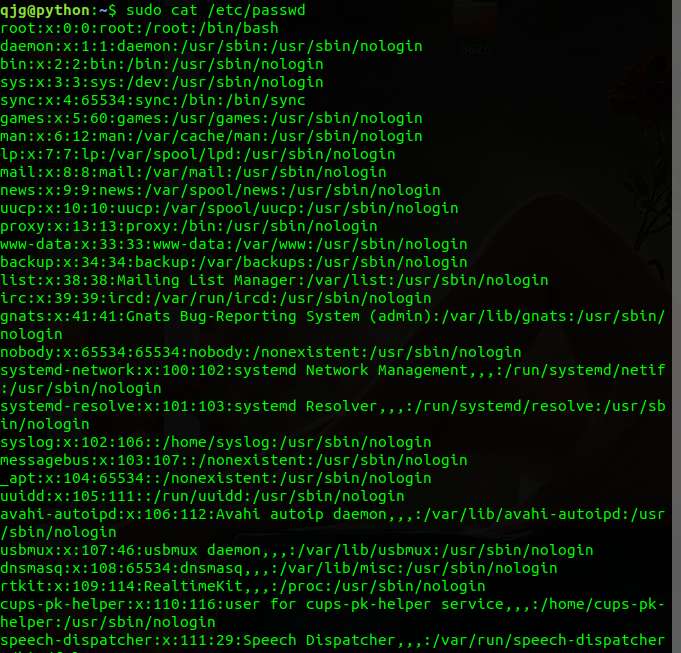
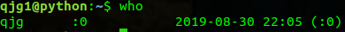
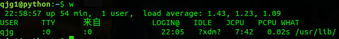
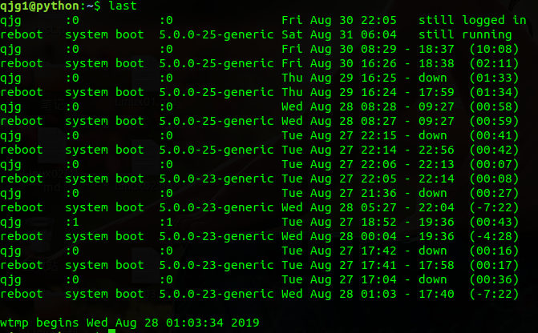
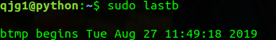
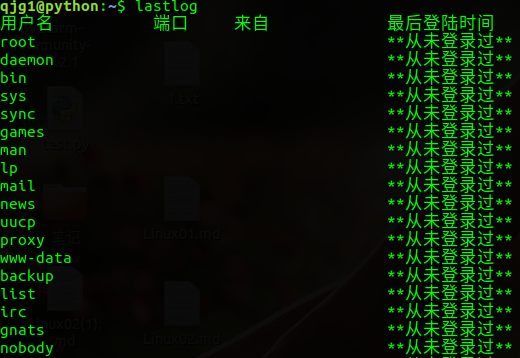
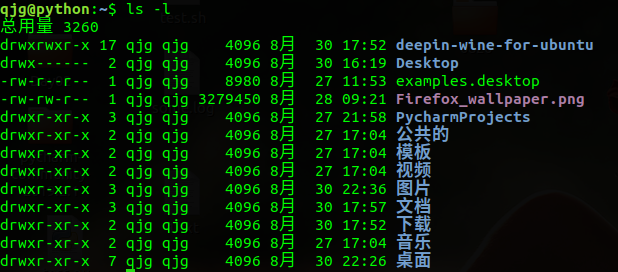
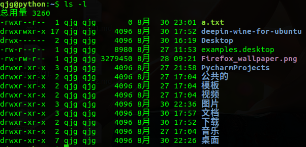
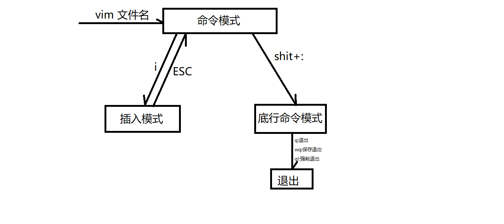

# 用户权限

查看所有的用户：

> cat /etc/passwd


查看所有用户(显示加密后的密码信息)

> cat /etc/shadow



查看所有的组

> cat /etc/group


## 用户管理

### 添加用户

`useradd -mU -G 组名 -p 密码 用户名`

```
sudo useradd -mU -G adm,sudo -s /bin/bash qjg1
```

注：多个组名之间用逗号隔开

+ -G `GROUPS`：新账户的附加组列表
+ -m：在/home目录下创建用户的家目录
+ -U：创建与用户同名的组
+ -p：加密之后的新账户密码，注一般这里没法设置密码，可以常见成功后通过修改密码来设置新密码
+ `-s /bin/bash`：指定用户登入后所使用的shell

###  删除用户

`userdel -r 用户名`

+ -r：删除主目录和邮件池

```
sudo userdel -r qjg1
```


### 修改用户密码

`passwd 用户名`

```
sudo passwd qjg1
```


### 切换用户

`su - 用户名`

+ `-`：完全以这个用户进行登录，会初始化当前用户的设置
+ 不加`-`，仅仅是切换用户身份

```
su - qjg1
```


## 用户组管理

### 添加用户组

`groupadd [选项] 组名`

选项：

+ `-g GID`：为新组使用GID
+ `-p PASSWORD`：为新组使用次加密后的密码
+ `-r`：创建一个系统账户

```
sudo groupadd -g 1012 qjg2
```


### 删除组

`groupdel 组名`

```
sudo groupdel qjg2
```


### 修改用户信息

`usermod [选项] 用户名`

选项：

+ `-d HOME_DIR`：用户的新主目录
+ `-g GROUP`：强制使用GUROP为新组
+ `-G GROUPS`：新的附加组列表
+ `-a GROUP`：将用户追加到上边的-G中提到的附加组中，并不从其他组中删除
+ `-L`：锁定用户账号
+ `-m`：将家目录内容移至新位置，仅与-d一起使用
+ `-U`：解锁用户账号

```
sudo usermod -g qjg qjg1
```


### 查看登录用户

`who`：显示当前用户



`w`：显示当前用户的详细登录信息



`last`：显示之前登录成功的用户



`lastb`：显示登录失败的用户



`lastlog`：显示全部用户最后一次登录的时间



## 文件权限

### 权限定义

+ r ：可读
+ w ：可写
+ x ：可执行

同时规定了不同用户对该文件的权限，用户身份有三种：

> 1、user  文件拥有者
>
> 2、group  同组人
>
> 3、other  其他人

`ls -l`：查看文件的权限信息



最右边一列(第一位是文件类型，`d`表示文件夹，`-`表示文件)就是每个文件的权限信息，共9个基本权限，前三位表示拥有者权限，中间表示同组用户的权限，最后三位表示其他人的权限，每三位各自的含义：

+ 第一位：是否具有可读权限，有则是`r`，否则为`-`
+ 第二位：是否具有可写权限，有则是`w`，否则为`-`
+ 第三位：是否具有可执行权限，有则是`x`，否则为`-`

### 权限修改

1、通过符号修改

`chmod 用户+/-/=权限 文件名/目录名`

+ 用户：指定是拥有者(u)、同组用户(g)还是其他人(o)，或者是全部用户(a)
+ `+/-/=`
  + `+`表示增加权限
  + `-`表示删除权限
  + `=`表示设定权限



2、通过数字修改

`chmod 用户名 数字(777) 文件名/目录名`

可读(r)对应的数字为4

可写(w)对应的数字为2

可执行(x)对应的数字为1

`777`：表示的是三个用户都拥有读写和执行的权利

多个权限之间通过数字加法来表示

### 修改文件拥有者

`chwon 用户:组 文件`

## 文本操作

+ `echo abc`：打印abc
+ `echo abc>a.txt`：将abc重定向到a.txt文件中，会直接覆盖掉文件原本的内容
+ `echo abc`>>a.txt：将abc追加到a.txt文件中
+ `cat 文件名`：查看文件中的内容
+ `head -n N 文件名`：查看文件的前N行，可以直接写成`head -N 文件名`
+ `tail -n N 文件名`：查看文件的后N行，可以直接写成`tail -N 文件名`
+ `less 文件名`：快速浏览文件
  + j：向下
  + k：向上
  + f：向下翻屏
  + b：向上翻屏
  + g：光标定位到文本开头
  + G：光标定位到文本末尾
  + q：退出
+ `sort 文本或文件`：将结果进行升序排序
+ `sort -r 文本或文件`：将结构进行降序排序
+ `uniq`：去重，依赖排序，常跟在sort后面使用
+ `awk'{print $N}'`：打印指定列
+ `wc`：统计字符数
  + `-c`：统计字符数
  + `-w`：统计单词数
  + `-l`：统计行数
+ `|`：管道符
  + 管道符可以连接连个命令，将前面的输出当做后面的输入

## vim

vim拥有三种模式：命令模式，插入模式，底行命令模式

三种模式的转换：



1、命令模式：

+ `h,j,k,l`：光标向左，下，上，右移动
+ `ctrl+e`：向下滚动
+ `ctrl+y`：向上滚动
+ `ctrl+f`：向下翻屏
+ `ctrl+b`：向上翻屏
+ `yy`：复制一行
+ `dd`：删除一行
+ `yw`：复制一个单词，`y3w`：删除三个单词
+ `dw`：删除一个单词，`d3w`：删除三个单词
+ `小写p`：粘贴到下一行
+ `大写P`：粘贴到前一行
+ `7x`：删除7个字符
+ `u`：撤销
+ `ctrl+r`：重做
+ `c3w`：剪切3个单词
+ `gg`：回到文本开头
+ `shit+g`：来到文本末尾
+ `shit+h`：调至屏幕首行
+ `shit+m`：调至屏幕中间
+ `shit+l`：调至屏幕末尾
+ `ctrl+v`：列操作，进入可视块模式，通过上下(k,j)选取要操作的行，`shit+i`进入插入模式，输入让插入的内容，ESC按两次，回下每个选定的区域出现插入的内容
+ `shit+>`：向右缩进
+ `shit+<`：向左缩进

2、插入模式：

+ `i`：在光标所在位置插入
+ `小写o`：在光标下方打开新的一行并将光标置于新开的行首，进入插入模式
+ `大写o`：在光标上方打开新的一行并将光标置于新开的行首，进入插入模式
+ `a`：a 可以在光标所在位置之后插入文本
+ `A`：在光标所在行的行末之后插入文本

3、底行模式;

+ `23`：调至文件的第23行
+ `%s/abc/123/g`：查找文本中的所有abc并替换成123
+ `set nu`：显示行数
+ `set nonu`：关闭行数
+ `w`：保存
+ `q`：不保存退出
+ `wq`：保存退出
+ `q!`：强制退出
+ `r filename`：读入指定文件内容，并写入当前编辑器中
+ `w filename`：将当前编辑器中的内容写入指定文件中
+ `sh`：进入shell命令行,执行完命令后ctrl+d退出重新进入vim编辑继续编辑

vim的配置文件 ~/.vimrc

`vim 文件名 +10`：进入文件并将光标指定到第十行

`vim -p 文件1 文件2 文件3`

