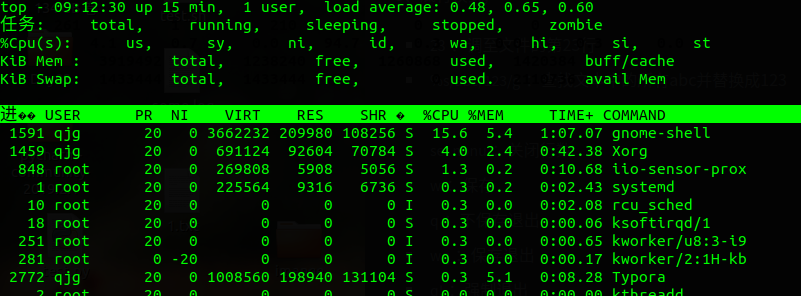
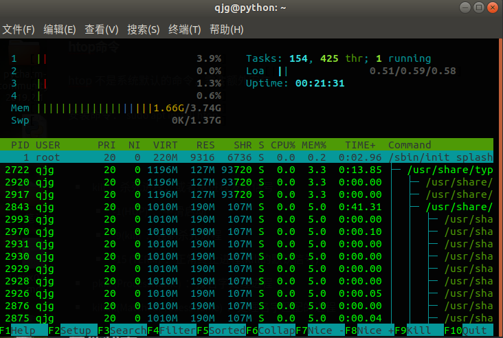
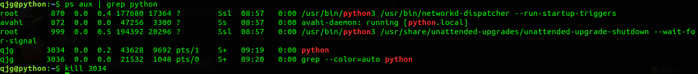
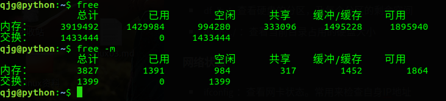

# 系统状态和管理

## 进程状态

Linux是一个多任务操作系统，同一时刻允许多个任务同时工作，运行中的每一个任务就是一个进程，查看进程信息常用的命令`ps`和`top`

### `ps`命令

`ps`即process status，用来查看进程状态，它显示的是敲下命令后的一瞬间的进程状态

`ps`支持三种不同类型的命令参数：

+ `ps -ef`：Unix风格的参数

+ ```
  UID        PID  PPID  C STIME TTY          TIME CMD
  root         1     0  0 08:57 ?        00:00:02 /sbin/init splash
  root         2     0  0 08:57 ?        00:00:00 [kthreadd]
  root         3     2  0 08:57 ?        00:00:00 [rcu_gp]
  root         4     2  0 08:57 ?        00:00:00 [rcu_par_gp]
  root         6     2  0 08:57 ?        00:00:00 [kworker/0:0H-kb]
  root         8     2  0 08:57 ?        00:00:00 [mm_percpu_wq]
  root         9     2  0 08:57 ?        00:00:00 [ksoftirqd/0]
  ```

  

  + 参数说明
    + `-e`：指定显示所有运行在系统上的进程
    + `-f`：扩展输出
  + 每一列的说明：
    + UID：启动这些进程的用户
    + PID：进程ID
    + PPID：父进程的进程ID(如果该进程是有另一个进程启动的)
    + C：进程生命周期时是的终端设备
    + TTY：进程启动是的终端设备
    + STIME：程序启动是的系统时间
    + TTY：进程启动时的终端设备
    + TIME：程序累计占用的终端设备
    + CMD：进程运行的命令

+ `ps aux`：BSD风格的参数

+ ```
  USER       PID  %CPU %MEM    VSZ   RSS TTY      STAT START   TIME COMMAND
  root         1  0.2  0.2 225564  9316 ?        Ss   08:57   0:02 /sbin/init spla
  root         2  0.0  0.0      0     0 ?        S    08:57   0:00 [kthreadd]
  root         3  0.0  0.0      0     0 ?        I<   08:57   0:00 [rcu_gp]
  root         4  0.0  0.0      0     0 ?        I<   08:57   0:00 [rcu_par_gp]
  root         6  0.0  0.0      0     0 ?        I<   08:57   0:00 [kworker/0:0H-k 
  root         8  0.0  0.0      0     0 ?        I<   08:57   0:00 [mm_percpu_wq]
  root         9  0.0  0.0      0     0 ?        S    08:57   0:00 [ksoftirqd/0]
  root        10  0.2  0.0      0     0 ?        I    08:57   0:01 [rcu_sched]
  root        11  0.0  0.0      0     0 ?        S    08:57   0:00 [migration/0]
  root        12  0.0  0.0      0     0 ?        S    08:57   0:00 [idle_inject/0]
  root        13  0.0  0.0      0     0 ?        I    08:57   0:00 [kworker/0:1-mm
  ```

  

  + 参数说明：
    + `-a`：显示跟任意终端关联的所有进程
    + `u`：基于用户的格式显示
    + `x`：显示所有进程，包括未分配任何终端的进程
  + 每列说明：
    + USER：执行这个进程的用户
    + PID：进程ID
    + %CUP：当前进程的CUP占用
    + %MEM：当前进程的内存占用
    + VSZ：进程占用的虚拟内存
    + RSS：进程占用的物理内存
    + TTY：进程启动时的终端设备
    + STAT：进程状态
      + 第一个参数代表的含义
        + `o`：运行状态
        + `s`：睡眠状态
        + `R`：可运行状态，正在等待CPU
        + `Z`：僵尸进程，是当子进程比父进程先结束，而父进程又没有回收子进程
        + `T`：代表停止
      + 第二个参数代表的含义：
        + `<`：进程运行在高优先级上
        + `N`：进程运行在低优先级上
        + `L`：该进程有页面锁定在内存中
        + `S`：该进程是控制进程
        + `l`：该进程是多线程
        + `+`：该进程运行在前台
      + `START`：进程启动时刻
      + `TIME`：程序累计占用CPU的时间
      + `COMMAND`：启动进程的命令

+ `ps --pid 进程号`：GUN风格的长参数

  使用进程号查看指定进程的信息

### top命令

持续动态的查看进程的状态



+ 头信息说明：
  + 系统运行的整体状态：开机时间长，登录用户数，系统负载
    + 系统负载：`load average:0.00,0.02,0.05`
    + 分别代表：一分钟负载，五分钟负载，十五分钟到负载
    + 负载值越高代表服务器的压力越大
    + 负载值不要超过CUP的核心数，如果超过核心数意味着很多进程在等待使用CPU
    + 与`uptime`命令的结果一样(查看进程状态)
  + 任务情况：任务总数，运行中的数量，休眠数量，停止数量，僵尸进程数量
  + CUP使用情况
    + `us(user)`：用户态占用
    + `sy(system)`：内核态占用
    + `id(idle)`：空间的CUP
  + 内存使用情况，内存总量，空闲内存，缓冲区占用的内存
  + 交换分区的占用：交换分区是一种将内存数据保存到硬盘的技术，一般在内存不足的时候使用
+ 进程区详情：
  + `PID`：进程的ID
  + `USER`：进程属主的名字
  + `PR`：进程的优先级
  + `NI`：进程谦让度值
  + `VIRT`：进程占用的虚拟内存总量
  + `RES`：进程和其他进程共享的内存总量
  + `SHR`：进程占用的物理内存总量
  + `S`：进程的状态(与`ps`基本相同)
  + `%CUP`：当前进程的CUP占用
  + `%MEM：`当前进程的内存占用
  + `TIME+`：进程累计占用CPU的时间
  + `COMMAND`：启动进程的命令

进程太多可以通过`-p`参数指定需要查看的进程ID，让进程信息更加精简

`top -p PID1,PID2,PID3,...`

### htop命令

htop 不是系统默认的命令，需要额外安装

安装命令：`sudo apt install htop`



## 进程的管理

+ `kill`：杀死进程，或者给进程发送信号,县通过ps查看进程的id,然后进行操作
+ 
  + `-1(HUP)`：平滑启动
  + `-9(kill)`：强制杀死进程
  + `-15 (TERM)`：正常终止进程(kill的默认信号)
+ `pkill (ProcessName)`：按名字处理进程
+ `killall(MatchedProcessName)`：处理名字匹配的进程

## 其他状态

### 内存状态

`free`命令，可以通过`-m`或者`-g`参数调整free命令显示数值单位

+ -m：以MB为单位显示
+ -g：以GB为单位



### 硬盘

+ `iostat`：查看硬盘的写入和读取的状态

  ```
  Linux 5.0.0-25-generic (python) 	2019年08月31日 	_x86_64_	(4 CPU)
  
  avg-cpu:  %user   %nice %system %iowait  %steal   %idle
            			 5.55          0.02     2.00              2.53        0.00      89.90
  
  Device             tps    kB_read/s    kB_wrtn/s    kB_read    kB_wrtn
  loop0             0.02         0.07         0.00        116          0
  loop1             0.03         0.07         0.00        128          0
  loop2             0.02         0.19         0.00        330          0
  loop3             0.12         0.29         0.00        497          0
  loop4             0.06         0.65         0.00       1114          0
  loop5             4.90         5.49         0.00       9477          0
  loop6             0.01         0.03         0.00         46          0
  loop7             0.06         0.65         0.00       1117          0
  sda              21.19       580.15        46.69    1001977      80643
  
  ```

  +  kB_read/s  :每秒的读取
  +  kB_wrtn/s：每秒的写入

+ `df -lh`：查看硬盘的分区，及每个分区的剩余空间

+ `du -hs images/`：查看当前目录占用的硬盘大小

### 网络状态

+ `ifconfig`：查看网卡状态。常用来检查自身IP地址

  + `ifconfig  网卡名 up` 开启网卡

  + `ifconfig  网卡名 down` 关闭网卡 

  + `ifconfig  网卡名 reload` 重启

    ```
    qjg@python:~$ ifconfig
    eno1: flags=4163<UP,BROADCAST,RUNNING,MULTICAST>  mtu 1500
            inet 10.11.55.145  netmask 255.255.255.0  broadcast 10.11.55.255
            inet6 fe80::4ecc:7bce:9901:f46e  prefixlen 64  scopeid 0x20<link>
            ether 98:e7:f4:65:4d:93  txqueuelen 1000  (以太网)
            RX packets 84927  bytes 67718052 (67.7 MB)
            RX errors 0  dropped 0  overruns 0  frame 0
            TX packets 39772  bytes 3508596 (3.5 MB)
            TX errors 0  dropped 0 overruns 0  carrier 0  collisions 0
    
    lo: flags=73<UP,LOOPBACK,RUNNING>  mtu 65536
            inet 127.0.0.1  netmask 255.0.0.0
            inet6 ::1  prefixlen 128  scopeid 0x10<host>
            loop  txqueuelen 1000  (本地环回)
            RX packets 838  bytes 79514 (79.5 KB)
            RX errors 0  dropped 0  overruns 0  frame 0
            TX packets 838  bytes 79514 (79.5 KB)
            TX errors 0  dropped 0 overruns 0  carrier 0  collisions 0
    
    ```

  + inet :ip地址

  + netmask：子网掩码

  + mtu:数据报文

  + lo：本地回环

+ `netstat -natp`：查看网络连接状态
  
  ```
  qjg@python:~$ netstat -natp
  （并非所有进程都能被检测到，所有非本用户的进程信息将不会显示，如果想看到所有信息，则必须切换到 root 用户）
  激活Internet连接 (服务器和已建立连接的)
  Proto Recv-Q Send-Q Local Address           Foreign Address         State       PID/Program name    
  tcp        0      0 127.0.0.53:53           0.0.0.0:*               LISTEN      -                   
  tcp        0      0 0.0.0.0:22              0.0.0.0:*               LISTEN      -                   
  tcp        0      0 127.0.0.1:631           0.0.0.0:*               LISTEN      -                   
  tcp        0      0 10.11.55.145:40402      35.166.120.35:443       TIME_WAIT   -                   
tcp        0      0 10.11.55.145:56464      52.41.59.170:443        ESTABLISHED 3334/firefox        
  tcp        0      0 10.11.55.145:56352      117.18.237.29:80        ESTABLISHED 3334/firefox 
  ```
  
  + `-a`：显示所有选项
  + `-t`：显示所有与TCP相关的选项
  + `-u` : 显示所有与UDP相关的选项
  + `-x` : 显示所有与Unix域相关的套接字选项
  + `-n` : 拒绝显示别名，能显示数字的全部转换为数字显示
  + `-p` : 显示建⽴相关连接的程序名。
  + `-l` : 显示所有状态为Listen的连接
  + `-e` : 显示扩展信息,如当前链接所对应的⽤户
  + `-c` : 间隔⼀段时间执⾏⼀次netstat命令。
  + `-s` : 显示统计信息。对每种类型进⾏汇总
  
+ `ping -i 0.01 -c 100 -p 140.143.191.23`通过ping来检查自己的网络是否连接正常
  
  + `-i`:每个数据包之间的时间间隔
  + `-c`：一共发送100个数据包
  + `-p`：不显示中间的发送过程
  
+ `lsof`
  
  + `lsof -i :[PORT]`查看占用端口的程序
  + `lsof -i tcp`：查看所有TCP连接
  + `lsof -u abc`：查看用户`abc`打开的所有文件
  + `lsof -p 123`：查看`pid`为123的进程打开的所有文件
  
+ 路由追踪：`traceroute [HOST]`

  ```
  qjg@python:~$ traceroute www.baidu.com
  traceroute to www.baidu.com (112.80.248.76), 30 hops max, 60 byte packets
   1  localhost (10.11.55.1)  1.077 ms  1.061 ms  1.046 ms
   2  211.95.6.65 (211.95.6.65)  3.952 ms  3.939 ms  3.930 ms
   3  139.226.224.30 (139.226.224.30)  4.279 ms  4.276 ms  3.899 ms
  ```

+ `DNS`查询
  + `dig [DOMAIN]`
  
    ```
    qjg@python:~$ dig www.baidu.com
    
    ; <<>> DiG 9.11.3-1ubuntu1.8-Ubuntu <<>> www.baidu.com
    ;; global options: +cmd
    ;; Got answer:
    ;; ->>HEADER<<- opcode: QUERY, status: NOERROR, id: 39715
    ;; flags: qr rd ra; QUERY: 1, ANSWER: 3, AUTHORITY: 0, ADDITIONAL: 1
    
    ;; OPT PSEUDOSECTION:
    ; EDNS: version: 0, flags:; udp: 65494
    ;; QUESTION SECTION:
    ;www.baidu.com.			IN	A
    
    ;; ANSWER SECTION:
    www.baidu.com.		32	IN	CNAME	www.a.shifen.com.
    www.a.shifen.com.	198	IN	A	112.80.248.75
    www.a.shifen.com.	198	IN	A	112.80.248.76
    
    ;; Query time: 0 msec
    ;; SERVER: 127.0.0.53#53(127.0.0.53)
    ;; WHEN: Sat Aug 31 09:50:11 CST 2019
    ;; MSG SIZE  rcvd: 101
    ```
  
  + `hist [DOMAIN]`
  
  + `nslookup [DOMAIN]`

### 时间和日期

+ `date`：查看日期与时间

  ```
  python1905@cluom:~$ date
  Sat 31 Aug 2019 09:51:51 AM CST
  ```

+ `cal`：查看日历
  
  + -3 2019 ：查看2019年3月的日历
  + `-y`：查看全年的日历
  + -1 显示一个月的月历
  + -3 显示系统前一个月，当前月，下一个月的月历
  + -j  显示在当年中的第几天（一年日期按天算，从1月1号算起，默认显示当前月在一年中的天数）

### 下载

+ `curl`执行HTTP访问
+ `wget`：下载
+ `scp`：服务器之间上传和下载`scp root@x.x.x:/root/abc images/abc`