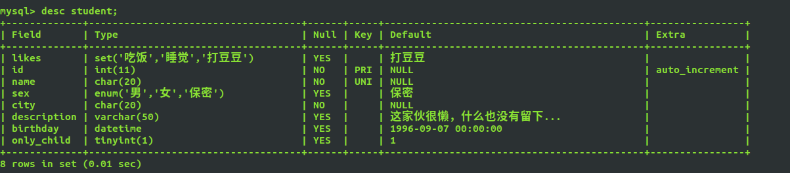

## 一、数据库及其发展历史

### 1.萌芽阶段

所有数据都是存储在文件中，安全性低，操作性繁琐。

### 2.层次模型

1、优点：

​	查询分类的效率比较高

2、缺点：

1. 没有导航结构，导致分类困难
2. 数据不完整

注意：数据的不完整，如果不能准确地分辨两条数据有什么不同，我们称之为失去了数据的完整性。

### 3.网状模型

没有解决导航问题，但解决了数据完整性问题。

### 4.关系模型(主流)

**特点：**

​	**1.每张表都是独立的，没有导航结构**

​	**2.表与表之间建立公共字段，也就将两张表之间建立了关系**

注意：公共的字段名可以不一样，但是数据类型必须相同(数据类型相同的不一定是公共字段)，两个字段的含义必须也要一致。

关系型数据库，解决了数据的完整性，也解决了导航问题，但是带来的是低效率。

**NOSQL（非关系型数据库）：MongoDB，Redis**

## 二、列、行、字段的属性

* 一行就是一条记录也是一条数据

* 一列就是一个字段，也是表的一个属性

* 字段的属性：是用来描述这个列的功能

* 数据的冗余：相同的数据不要多次存储
  * 冗余只能减少，不能杜绝
  * 冗余减少了，标的体积就减小了，更新的速度提高了，保证了数据的完整性。
  * 减少了冗余, 表的数量一定会增加, 多表查询的效率就下降了（在项目中，我们一般牺牲效率来保证完整性;但是在机器性能严重不足的时候, 一定要保证效率)

```tex
数据库: 数据库是一些关联表的集合。
数据表: 表是数据的矩阵。在一个数据库中的表看起来像一个简单的电子表格。
列: 一列(数据元素) 包含了相同类型的数据, 例如邮政编码的数据。
行: 一行(=元组,或记录)是一组相关的数据,例例如一条用户订阅的数据。
冗余: 存储两倍数据,冗余降低了了性能,但提高了数据的安全性。
主键: 主键是唯一的。一个数据表中只能包含一个主键。你可以使用主键来查询数据。
外键: 外键用于关联两个表。
复合键: 复合键(组合键)将多个列作为一个索引键,一般用于复合索引。
索引: 使用索引可快速访问数据库表中的特定信息。索引是对数据库表中一列或多列的值进行行排序的一种结构。类似于书籍的目录。
参照完整性: 参照的完整性要求关系中不允许引用不存在的实体。与实体完整性是关系模型必须满足的完整性约束条件,目的是保证数据的一致性。
```

## 三、Linux数据库的开启和连接

### 安装数据库

```shell
sudo apt install -y mysql-server mysql-client
```

### 开启数据库服务相关命令：

1. Ubuntu : `service mysql start(开启服务)|stop(关闭服务)|restart(重启服务)|reload(重新加载)|status(mysql服务器状态)`
2. Deepin : `systemctl stop|start mysqld`
3. CentOS7 : `systemctl stop|start mysqld`
4. CentOS6 :` service mysqld start|stop|restart|reload|status`

### 连接数据库:

语法：`mysql -hlocalhost -uroot -proot -P3306`

* -h：host(ip地址)  localhost = 127.0.0.1
* -u：username(用户账号)
* -p：password(密码)
* -P(大写)：port(端口号，默认端口3306)

**备注:**
第一次使用 root 连接后最好添加一个新的用户来操作。出于安全考虑,日常开发中最好不要使用 root用户。

```mysql
-- 创建新用用户,并设置密码
-- *.* 代表该用户可以操作任何库、任何表
-- 主机名可以使用 '%', 代表允许该用户从任何机器登陆
GRANT ALL PRIVILEGES on *.* to '用户名'@'主机(localhost)' IDENTIFIED BY "密码" WITH GRANT OPTION;

-- 刷新使权限生生效
flush privileges;
```

修改密码：

```
首先使用sudo 进入数据库：sudo mysql -u root -p，直接回车
查看数据库：show databases;
进入到mysql数据库：usr mysql;
修改密码：update user set authentication_string=PASSWORD("abc123") where user='root';
 更新配置：update user set plugin="mysql_native_password";
刷新，使更改生效： flush privileges;
```


### 退出数据库:

* exit
* quit
* \q
* 快捷键：Ctrl + D

### 解决忘记密码:

1. 修改配置：`vim /etc/my.cnf`
2. 找到`[mysqld]`在下面添加一句`skip-grant-tables`
3. 修改完重新启动`sudo service mysql restart`

## 四、SQL语言

SQL（Structured Query language，结构化查询语言）

**关系型数据库**

| 数据库     | SQL 类型         | 公司               |
| ---------- | ---------------- | ------------------ |
| Access     | SQL              | 微软               |
| SQL-Server | T-SQL            | 微软               |
| Oracle     | PL/SQL           | 甲骨文             |
| MySQL      | My/SQL           | 甲骨文             |
| SQLite     | 内嵌型小型数据库 | 移动前端用的比较多 |

## 五、数据库操作

### 1.创建数据库

**末尾一定要加分号作为一条语句的结束标志**

```mysql
create database [if not exists] `数据库名` charset=字符编码(utf8mb4);
--创建简单数据库
create database `数据库名`; 
```

1. 如果多次创建同名数据库会报错
2. 字符编码不指定，默认utf8mb4(类似utf-16) /utf8
3. 数据库命名一定要习惯加上反引号，防止和关键字冲突

```mysql
mysql> create database qjg charset=utf8;
Query OK, 1 row affected (0.37 sec)
```

### 2.查看数据库

```mysql
show databases;
```


### 选中当前数据库并使用

 ```mysql
use `数据库名`;
 ```

### 修改数据库

```mysql
--只能修改已创建数据库的字符集utf8mb4/utf8
alter database `数据库名` charset=字符集;
```

### 删除数据库

```mysql
drop database [if exists] `数据库名`;
```

### 查看数据库的创建

```mysql
show create database 数据库名;
```


### 查看数据版本

```mysql
select version();
```


### 查看当前数据库

```mysql
select database();
```


## 六、表的操作

表示建立在数据库中的数据结构，是一类数据的存储集。

### 表的创建

```sql
create table [if not exists] `表名`(
	id int not null auto_increment primary key comment '主键',
	username char(255) comment '用户名' default 'admin',
	pwd varchar(65535) comment '密码' not null
) charset=utf8mb4 engine=innodb;
```

* 字符集如果不指定，默认继承库的字符集
* engine(引擎) innodb /myisam，默认为innodb;
* auto_increment自动增长(只适用于整型int)，comment注释，default默认

```mysql
create table student(id int primary key auto_increment,
   name char(20) not null unique,
   sex enum('男','女','保密') default '保密',
   city char(20) not null,
   description varchar(50) default '这家伙很懒，什么也没有留下...',
   birthday datetime default '1996-9-7',
   only_child bool default 1,
   )charset=utf8 engine=innodb;
```


###  查看所有的表

```mysql
-- 前提是选择数据库：use `数据库名` 才能查看表
show tables;
```

### 查看表的创建

```mysql
show create table 表名;
```


### 删除表

```mysql
--删除表必须在数据库中
drop table [if exists] `表名`;
```


### 显示表结构

```sql
desc `表名`;
--descibe `表名`;
```


### 修改表

+ 修改表名称
  `alter table 旧表名 vrename 新表名`;

```sql
mysql> alter table student rename stu;
Query OK, 0 rows affected (0.12 sec)
```

+ 修改表的引擎
  `alter table 表名 engine = innodb|myisam;`

```mysql
mysql> alter table stu engine=myisam;
Query OK, 0 rows affected (0.31 sec)
Records: 0  Duplicates: 0  Warnings: 0
```

+ 移动表 到指定的数据库
  `alter table 表名 rename to 数据库名.表名;`

  ```mysql
  mysql> alter table stu rename to test.student;
  Query OK, 0 rows affected (0.00 sec)
  ```

### 修改字段

+ 增加一个新的字段 alter table...add...
  alter table 表名 add 字段名 数据类型  [属性];

  ```mysql
  mysql> alter table student add likes set('吃饭','睡觉','打豆豆') default '打豆豆';
  Query OK, 0 rows affected (0.07 sec)
  Records: 0  Duplicates: 0  Warnings: 0
  ```

  

+ 删除字段,如果数据表中只剩余一个字段则无法使用DROP来删除字段。
  alter table 表名 drop 字段名;

  ```mysql
  mysql> alter table student drop likes;
  Query OK, 0 rows affected (0.05 sec)
  Records: 0  Duplicates: 0  Warnings: 0
  ```

  

+ 将字段添加在第一个位置
  alter table 表名 add 字段名 数据类型  [属性] first;

  ```mysql
  mysql> alter table student add likes set('吃饭','睡觉','打豆豆') default '打豆豆' first;
  Query OK, 0 rows affected (0.03 sec)
  Records: 0  Duplicates: 0  Warnings: 0
  ```

  

+ 添加在某一字段之后
  alter table 表名 add 字段名 数据类型 [属性] after `指定字段名`;

  ```mysql
  mysql> alter table student add score float(4,1) default 0 after sex;
  Query OK, 0 rows affected (0.05 sec)
  Records: 0  Duplicates: 0  Warnings: 0
  ```

  

+ 修改字段数据类型或属性(先 `desc 表名`查看表结构，再修改)
  alter table `表名` modify `字段名` 数据类型 [属性];

  ```mysql
  mysql> alter table student modify city varchar(20);
  Query OK, 0 rows affected (0.04 sec)
  Records: 0  Duplicates: 0  Warnings: 0
  ```

  

+ 修改字段名称alter table ...change...
  alter table `表名` change `旧字段名` `新字段名` 数据类型 [属性];

  ```mysql
  mysql> alter table student change city localtion varchar(30);
  Query OK, 0 rows affected (0.06 sec)
  Records: 0  Duplicates: 0  Warnings: 0
  ```

  

+ 修改字段的位置
  alter table `表名` change `原字段名` `原字段名不变` 数据类型 after `指定字段名`;

  ```mysql
  mysql> alter table student change city city varchar(20) after sex;
  Query OK, 0 rows affected (0.05 sec)
  Records: 0  Duplicates: 0  Warnings: 0
  ```


### 复制表

+ 复制表，并且复制数据
  + `create table 表名 select * from  要被复制的表名 ;`

    ```mysql
    mysql> create table login_bak select * from login;
    Query OK, 3 rows affected (0.40 sec)
    Records: 3  Duplicates: 0  Warnings: 0
    ```

    

    特点: 把所有数据和表结构给复制过来了, 但是没有复制主键

+ 仅复制表结构，不复制数据
  + `create table 表名 like 要被复制的表名; `
    特点: 复制所有表结构, 但是不复制数据

    ```mysql
    mysql> create table login_bak1 like login;
    Query OK, 0 rows affected (0.41 sec)
    ```

  + 数据可以单独复制：(前提是往已经存在的表里插入)

    `insert into 表名 select* from 要被复制的表名`

## 七、CURD语句的基本使用

* C：创建  (Create)
* U：更新  (Update)
* R：读取  (Retrieve)
* D：删除  (Delete)

### insert into(插入)

+ not null 的字段，一定要输入数据

+ 一次插入一行数据
  insert into `表名` set `字段`=值, `字段`=值;

  ```mysql
  mysql> insert login set username='张三',password=md5(1234);
  Query OK, 1 row affected (0.05 sec)
  ```

+ 一次插入多行数据
  insert into \`表名\`(字段1, 字段2....) values (值1, 值2...), (值1, 值2...);
  insert into \`表名\` values (null, 值1, 值2....), (null, 值1, 值2....);

注：给表名和字段名加上反引号是为了当表名或者字段名和关键字重复时，也可以操作成功

```mysql
mysql> insert into login values(null,'admin',md5(123)),(null,'admin1',md5(456));
Query OK, 2 rows affected (0.05 sec)
Records: 2  Duplicates: 0  Warnings: 0
```

### select(查询)

```sql
-- * 是一个结果集，代表所有的字段名
select * from `表名`;
select 字段1, 字段2 from `表名`;
```


### update(更新)

+ 在更新某一条具体的数据的时候，要加上where条件,where相当于if条件, 只执行返回结果为True的语句
  update \`表名\` set \`字段1\`=值, \`字段2\`=值 where \`字段\`=值;
  update \`表名\` set \`字段1\`=值, \`字段2\`=值 where \`字段\`=值 and \`字段\`=值;

```mysql
mysql> update login set username='李四',password=md5(378);
Query OK, 3 rows affected (0.06 sec)
Rows matched: 3  Changed: 3  Warnings: 0
```

### delete from(删除)

```sql
-- 删除表中的所有数据，但是保留表结构
delete from `表名`;
-- 在删除的时候一定要加上where条件，否则表示删除表中所有数据
delete from `表名` where `字段` = 值;
delete from `表名` where `字段` in (1, 2, 3, 4);
-- 一旦数据被删除, 接着插入数据, 位置在原来删除的位置;再次插入数据，自原来列的最大值的下一次开始。

-- 清空全表(一次性整表删除)【delete逐行操作，不会记录日志】
truncate `表名`
```

```sql
-- mysql中创建一个远程连接的用户并且授权
-- root不可以执行远程连接
grant all privileges on *.* to 'admin'@'%'identified by '123456' with grant option;
```

## 总结：

```tex
增
    数据库: create database `库名`;
    表: create table `表名`;
    字段: alter table `表名` add `字段名` 类型 [属性];
    数据: insert into `表名`;
删
    数据库: drop database `库名`;
    表: drop  table `表名`;
    字段: alter table `表名` drop `字段名`;
    数据: delete from `表名` where ...;
改
    数据库: alter database `库名` ...;
    表: alter table `表名` ...;
    字段: alter table `表名` modify | change ...;
    数据: update `表名` set ...;

查
    数据库: show database [like ...];
    表: show tables [like ...];
    字段: desc `表名`;
    数据: select * from `表名` where ...;
```

## SQL语言的分类

SQL语言共分为四大类：

* 数据查询语言DQL，
* 数据操纵语言DML，
* 数据定义语言DDL，
* 数据控制语言DCL。

### 数据查询语言DQL

数据查询语言DQL基本结构是由`SELECT`子句，`FROM`子句，`WHERE`
子句组成的查询块：
SELECT <字段名表>
FROM <表或视图名>
WHERE <查询条件>

### 数据操纵语言DML

数据操纵语言DML主要有三种形式：

* 1) 插入：`INSERT`
* 2) 更新：`UPDATE`
* 3) 删除：`DELETE`

### 数据定义语言DDL

数据定义语言DDL用来创建数据库中的各种对象

---------              表、视图、
索引、同义词、聚簇等如：

`CREATE TABLE  /VIEW /INDEX  /SYN  /CLUSTER
`

 

DDL操作是隐性提交的！不能rollback 

### 数据控制语言DCL

数据控制语言DCL用来授予或回收访问数据库的某种特权，并控制
数据库操纵事务发生的时间及效果，对数据库实行监视等。如：

* `GRANT`：授权。

* `ROLLBACK [WORK] TO [SAVEPOINT]`：回退到某一点。

  回滚---ROLLBACK
  回滚命令使数据库状态回到上次最后提交的状态。其格式为：
  SQL>ROLLBACK;

*  `COMMIT [WORK]`：提交。

  在数据库的插入、删除和修改操作时，只有当事务在提交到数据
  库时才算完成。在事务提交前，只有操作数据库的这个人才能有权看
  到所做的事情，别人只有在最后提交完成后才可以看到。

  提交数据有三种类型：显式提交、隐式提交及自动提交。下面分别说明这三种类型。

  *  显式提交
    * 用COMMIT命令直接完成的提交为显式提交。其格式为：
      SQL>COMMIT；
  *  隐式提交
    * 用SQL命令间接完成的提交为隐式提交。这些命令是：
      `ALTER，AUDIT，COMMENT，CONNECT，CREATE，DISCONNECT，DROP，
      EXIT，GRANT，NOAUDIT，QUIT，REVOKE，RENAME。`
  *  自动提交
    * 若把AUTOCOMMIT设置为ON，则在插入、修改、删除语句执行后，
      系统将自动进行提交，这就是自动提交。其格式为：
      `SQL>SET AUTOCOMMIT ON;`


