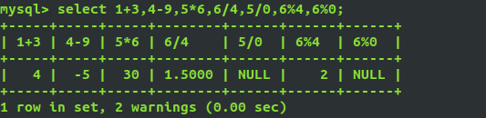
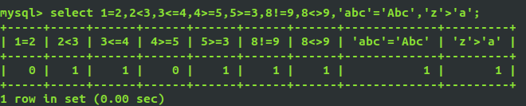
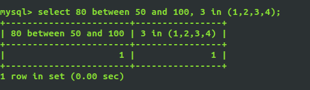
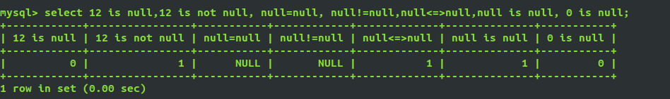
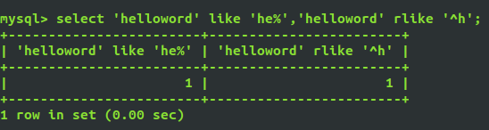
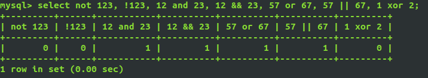
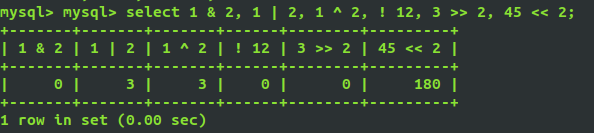

# 一、字符集

## 1、字符集作用:

* 保存数据需要使用字符集

* 数据传输需要使用字符集

* 存储的时候需要字符集
  * 在数据库中，在表的使用上
  * 在服务器安装的时候，可以指定默认的字符集

## 2、常见字符集：

* ASCII：基于罗马字符表的一套字符集，它采用1个字节的低7位表示字符，高位始终为0。
* LATIN1：相对于ASCII字符集做了扩展，任然使用一个字节表示字符，但启用了高位，扩展了字符集。
* GB2312：简体中文字符，一个汉字最多占用2个字节（3000多个汉字）。
* GBK：支持所有的中文字符(繁体)，一个汉字最多占用2个字节。
* UTF8：国际通用编码，一个汉字最多占用3个字节。
* UTF8MB4：在utf8的基础上加强了对新文字的识别，一个汉字最多占用4个字节。

```sql
/*gbk字符集最大字符串长度：65535/2-1*/
create table test1(
	text varchar(32767)
) charset=gbk;

/*utf8字符集最大字符串长度：65535/3-1*/
create table test2(
	text varchar(21844)
) charset=utf8;

/*utf8mb4最大字符串长度：65535/4-1*/
create table test3(
	text varchar(16382)
) charset=utf38mb4;

```

## 3、查看当前MySQL支持的字符集

```sql
mysql> show variables like 'character_%';

/*  输出结果
+--------------------------+----------------------------+
| Variable_name            | Value                      |
+--------------------------+----------------------------+
| character_set_client     | utf8                       |	客户端来源数据使用的字符集
| character_set_connection | utf8                       |	连接层字符集
| character_set_database   | latin1                     |	当前选中数据库的默认字符集
| character_set_filesystem | binary                     |	文件系统字符集
| character_set_results    | utf8                       |	查询结构使用的字符集
| character_set_server     | latin1                     |	默认的内部操作字符集
| character_set_system     | utf8                       |	系统源数据(字段名、表名等)的字符集
| character_sets_dir       | /usr/share/mysql/charsets/ |
+--------------------------+----------------------------+
*/
```

## 4、修改当前的MySQL系统的字符集编码

* 全部修改

  ```mysql
  mysql> set names gbk;
  Query OK, 0 rows affected (0.01 sec)
  ```

* 指定修改

  ```mysql
  set character_set_client = gbk;--修改客户端来源数据使用的字符集
  set character_set_results = gbk;--修改查询结果使用的字符集
  ```

* 它是临时命令，MySQL连接断开以后，再次连接会恢复原状

# 二、校对集

**概念：**在某一种字符集下，为了**使字符之间可以互相比较**，让字符和字符形成一种关系的集合，称之为校对集。

例：比如ASCII码中的a(97)和B(66),如果区分大小写a>B,如果不区分a<B;

不同字符集有不同的校对规则, 命名约定:以其相关的字符集名开始, 通常包括一个语言名, 并且以

`_ci` 、` _cs `或 `_bin`结束。

* `_ci `: 大小写不敏感 ignore
* `_cs` : 大小写敏感
* `_bin` : binary collation 二元法, 直接比较字符的编码, 可以认为是区分大小写的, 因为字符集
  中'**A**'和'**a**'的编码显然不同。

```sql
/* 数据库默认的排序方式，是升序 */
create table t1(
	str char(1)
) charset=utf8mb4 collate=utf8mb4_general_ci;
-- _general_ci 后缀的都是不区分大小写的

create table t2(
	str char(1)
)charset=utf8mb4 collate=utf8mb4_bin;
-- 看到后缀边是_bin的都是区分大小的

/* 
Linux中MySQL是区分大小的
需要自己去配置
vim /etc/mysql/my.cnf
找到[mysqld]
1是不区分大小写,0是区分大小写
*/
lower_case_table_names=1
```

```sql
show character set; -- 查看字符集 和 校对集
show collation;     -- 显示所有的校对集
```

# 三、MySQL数据类型

## 1.整型

| 整数类型     | 字节 | 最小值                         | 最大值                                 |
| ------------ | ---- | ------------------------------ | -------------------------------------- |
| tinyint      | 1    | 有符号：-2**8/2<br />无符号:0  | 有符号:2**8/2-1<br />无符号:255        |
| smallint     | 2    | 有符号：-2**16/2<br />无符号:0 | 有符号:2**16/2-1<br />无符号:2\*\*16-1 |
| mediumint    | 3    | 有符号：-2**24/2<br />无符号:0 | 有符号:2**24/2-1<br />无符号:2\*\*24-1 |
| int、integer | 4    | 有符号：-2**32/2<br />无符号:0 | 有符号:2**32/2-1<br />无符号:2\*\*32-1 |
| bigint       | 8    | 有符号：-2**64/2<br />无符号:0 | 有符号:2**64/2-1<br />无符号:2\*\*64-1 |


*  **一个无符号数一定是非负数**

  ```sql
  create table t3(
  	age tinyint unsigned
  );
  ```

* **显示宽度(zerofill)**

  *  整型显示宽度，位数不足时用 0 填充。
  
  ```sql
  create table t4(
  	id int(10) zerofill primary key auto_increment;
      name char(32)
  );
  insert into t4 values(12345,'5个');
  insert into t4 values(1234567890,'10个')
  /*insert into t4 values(123456789012,'12个')*/ -- 报错
  select * from t4;
  /* 输出
  +------------+------+
  | id         | name |
  +------------+------+
  | 12345      | 5个  |
  | 1234567890 | 10个 |
  +------------+------+
  */
  ```

## 2.浮点型

| 浮点型 | 字节 | 有符号范围                                                   | 无符号范围                                                   | 用途           |
| ------ | ---- | ------------------------------------------------------------ | ------------------------------------------------------------ | -------------- |
| float  | 4    | (-3.402 823 466 E+38，-1.175 494 351 E-38)，0，(1.175 494 351 E-38，3.402 823 466 351 E+38) | 0，(1.175 494 351 E-38，3.402 823 466 E+38)                  | 单精度浮点数值 |
| double | 8    | (-1.797 693 134 862 315 7 E+308，-2.225 073 858 507 201 4 E-308)，0，(2.225 073 858 507 201 4 E-308，1.797 693 134 862 315 7 E+308) | 0，(2.225 073 858 507 201 4 E-308，1.797 693 134 862 315 7 E+308) | 双精度浮点数值 |

| 定点数类型                 | 字节                                     | 有符号范围     | 无符号范围     | 用途   |
| -------------------------- | ---------------------------------------- | -------------- | -------------- | ------ |
| dec(M,D)<br />decimal(M,D) | 对DECIMAL(M,D) ，如果M>D，为M+2否则为D+2 | 依赖于M和D的值 | 依赖于M和D的值 | 小数值 |

| 位类型 | 字节 | 最小值 | 最大值 |
| ------ | ---- | ------ | ------ |
| bit(M) | 1~8  | bit(1) | bit(8) |

定点数的位数更加长。

使用方式：

* float(M,D)
* double(M,D)
* decima(M,D)
* M 是支持多少个长度，D是小数点后面的位数。

```mysql
create table table t5(
	a float(10,2),
    b float(10,2),
    c decimal(10,2)
);
```

超过设置的长度报错

```mysql
mysql> insert t5 value(33333333.55,666666666.22,5555555555.22);
ERROR 1264 (22003): Out of range value for column 'b' at row 1
```

注意：长度M是整个数字的长度，D是指小数部分的长度，则整数位的长度为M-D

```mysql
mysql> insert t5 value(33333333.55,66666666.22,55555555.22);
Query OK, 1 row affected (0.04 sec)
```


## 3.字符串类型

| 字符串类型   | 大小                                                | 用途                            |
| ------------ | --------------------------------------------------- | ------------------------------- |
| CHAR(M)      | M为0-255之间的整数                                  | 定长字符串                      |
| VARCHAR(M)   | M为0-65535 之间的整数，值的长度+1个字节             | 变长字符串                      |
| TINYBLOB     | 允许长度0-255字节，值的长度+1个字节                 | 不超过 255 个字符的二进制字符串 |
| BLOB         | 允许长度0-65535 之间的整数，值的长度+2个字节        | 二进制形式的长文本数据          |
| MEDIUMBLOB   | 允许长度0-16 777 215字节，值的长度+3个字节          | 二进制形式的中等长度文本数据    |
| LONGBLOB     | 允许长度0-4 294 967 295字节，值的长度+4个字节       | 二进制形式的极大文本数据        |
| TINYTEXT     | 允许长度0-255字节，值的长度+2个字节                 | 短文本字符串                    |
| TEXT         | 允许长度 0-65 535字节 ，值的长度+2个字节            | 长文本数据                      |
| MEDIUMTEXT   | 允许长度0-16 777 215字节，值的长度+3个字节          | 中等长度文本数据                |
| LONGTEXT     | 允许长度0-4 294 967 295字节，值的长度+4个字节       | 极大文本数据                    |
| VARBINARY(M) | 允许长度0~M个字节的变长字节字符串，值的长度+1个字节 |                                 |
| BINARY(M)    | 允许长度0~M个字节的变长字节字符串                   |                                 |

+ `CHAR` 和` VARCHAR` 类型类似，但它们保存和检索的方式不同。它们的最大长度和是否尾部空格被保留等方面也不同。在存储或检索过程中不进行大小写转换。

+ `BINARY` 和 `VARBINARY` 类似于 `CHAR` 和`VARCHAR`，不同的是它们包含二进制字符串而不要非二进制字符串。也就是说，它们包含字节字符串而不是字符字符串。这说明它们没有字符集，并且排序和比较基于列值字节的数值值。

+ `BLOB `是一个二进制大对象，可以容纳可变数量的数据。有 4 种 BLOB 类型：`TINYBLOB`、`BLOB`、`MEDIUMBLOB` 和 `LONGBLOB`。它们区别在于可容纳存储范围不同。 

+ 有 4 种 TEXT 类型：`TINYTEXT`、`TEXT`、`MEDIUMTEXT` 和` LONGTEXT`。对应的这 4 种 BLOB 类型，可存储的最大长度不同，可根据实际情况选择。 
+ `BINARY`和`VARBINARY`类型类似于`CHAR`和`VARCHAR`类型，但是不同的是，它们存储的不是字符字符串，而是二进制串。所以它们没有字符集，并且排序和比较基于列值字节的数值值。

`char`和`varchar`的区别：BLOB二进制、单行存储长度有限制

| 类型       | 输入      | 在数据库存储 | 大小    | 描述                                    |
| ---------- | --------- | ------------ | ------- | --------------------------------------- |
| char(5)    | "a"       | "a     "     | 5 bytes | 固定占5个字节，不足的用空格补齐         |
| varchar(5) | "a"       | "a"          | 2 bytes | 字符占1个字节，额外用1个字节记录位长    |
| char(5)    | "abc  "   | "abc  "      | 5 bytes | 保留结尾空格，依然占5个字节             |
| varchar(5) | "abc  "   | "abc"        | 4 bytes | 删除结尾空格，再加位长记录，共占4位字节 |
| char(5)    | "abcdefg" | "abcde"      | 5 bytes | 截掉超出的字符，会报错                  |
| varchar(5) | "abcdefg" | "abcde"      | 6 bytes | 截掉超出的字符，会报错                  |

**注意：数据类型不是越大越好，越大的类型会造成数据臃肿，存储空间占用过大，数据检索速度变慢。**

在`mysql`中，不同的存储引擎对`CHAR`和`VARCHAR`的使用原则有所不同，这里简单概括如下。

- `MyISAM`存储引擎：建议使用固定长度的数据列代替可变长度的数据列。
- `MEMORY`存储引擎：目前都使用固定长度的数据行存储，因此无论使用`CHAR`或`VARCHAR`列都没有关系。两者都是作为`CHAR`类型处理。
- `InnoDB`存储引擎：建议使用`VARCHAR`类型。对于`InnoDB`数据表，内部的行存储格式没有区分固定长度和可变长度列（所有数据行都使用指向数据列值的头指针），因此在本质上，使用固定长度的`CHAR`列不一定比使用可变长度`VARCHAR`列性能要好。因而，主要的性能因素是数据行使用的存储总量。由于CHAR平均占用的空间多于`VARCHAR`，因此使用`VARCHAR`来最小化需要处理的数据行的存储总量和磁盘I/O是比较好的。

## 4.枚举(enum)

多选一的时候使用的一种数据类型；在前端使用单选框的时候，枚举类型可以发挥作用。

枚举类型的优点：

* 限制了可选值
* 节省空间
* 运行效率高

```sql
create table t6(
	name vachar(32),
    sex enum('男','女','保密') default '保密'
)charset=utf8;

-- 枚举类型的计数默认从1开始
insert into t6 set name='张三',sex='男';
/*
+--------+-----+
| name   | sex |
+--------+-----+
| 张三  | 男  |
+--------+-----+
*/
```

## 5.集合(set)

set最多可以有64个不同的成员。类似于复选框，有多少可以选多少。

```sql
create table t7(
	name varchar(32),
    hobby set('吃','喝','玩','睡','开车')
)charset=utf8;

insert into t7 values('张三','睡,玩,喝')
insert into t7 values('李四','睡,开车')
```

实际问题：

```sql
为什么不用set类型：在网站开发中，多选框的值有上千个，值存储空间没有索引用的多
复选框问题如何解决：将复选框的值单独设计成一张表。
```

## 6.时间类型

| 日期和时间类型 | 字节 | 最小值              | 最大值              |
| -------------- | ---- | ------------------- | ------------------- |
| DATE           | 4    | 1000-01-01          | 9999-12-31          |
| DATETIME       | 8    | 1000-01-01 00:00:00 | 9999-12-31 23:59:59 |
| TIMESTAMP      | 4    | 197001010800001     | 2038-1-19 11:14:07  |
| TIME           | 3    | -838:59:59          | 838:59:59           |
| YEAR           | 1    | 1901                | 2155                |


### 1、datetime

```mysql
mysql> create table datetime_test(
    -> create_at datetime
    -> );
Query OK, 0 rows affected (0.26 sec)

mysql> insert into datetime_test values('2019-4-2 16:54:00');
Query OK, 1 row affected (0.04 sec)

mysql> insert into datetime_test values('2019/4/2 16:54:00');
Query OK, 1 row affected (0.05 sec)

mysql> insert into datetime_test values(now());
Query OK, 1 row affected (0.07 sec)

mysql> insert into datetime_test values('10000/4/2 16:54:00');
ERROR 1292 (22007): Incorrect datetime value: '10000/4/2 16:54:00' for column 'create_at' at row 1
mysql> insert into datetime_test values('9999/4/2 16:54:00');
Query OK, 1 row affected (0.04 sec)
```

### 2、time(时:分:秒)

```sql
create table time_test (
	create_at time
);
insert into time_test values('12:12:12');
insert into time_test values('100:12:12');--超过12，换算成天数
insert into time_test values('-100:12:12');
insert into time_test values('10 10:12:12');
-- [-838:59:59-838:59:59]
/*insert into time_test values('839:12:12'); -- 报错*/

/*
+-------------------+
| create_at         |
+-------------------+
| 12:12:12          |
| 4 days, 4:12:12   |	100:12:12 = 4 days, 4:12:12
| -5 days, 19:47:48 |	19:47:48+100:12:12 = 5 days
| 10 days, 10:12:12 |	10 10:12:12 = 10 days, 10:12:12
+-------------------+
*/
```

### 3、timestamp时间戳类型

* 时间戳类型在显示方面和datetime是一样的，但在存储上不一样
* 范围从【1970-1-1 0:0:0 到 2038-1-19 11:14:07】
* 时间戳使用4个字符表示
* 该值大小与存储的位长有关：2 ** (4 * 8 -1)

```sql
create table timestamp_test(
	create_at timestamp
);

insert into timestamp_test values(now());
insert into timestamp_test values('2038-1-19 11:14:07');
/*insert into timestamp_test values('2038-1-19 11:14:08');--报错*/
```

### 4、year年份

```sql
create table `year`(
	create_at year
);
-- 从1900年年开始   1900+255=2155
insert into `year` values(now());
insert into `year` values('2155');
insert into `year` values('2156'); -- 报错
+-----------+
| create_at |
+-----------+
| 2019      |
| 2155      |
+-----------+
```

## 7.布尔型

```sql
/*mysql中的bool类型也是1和0，底层用int*/

create table `bool`(
	cond boolean
);
insert into `bool` set cond=True; -- 成功
insert into `bool` set cond=False; -- 成功
insert into `bool` set cond=1; -- 成功
insert into `bool` set cond=10; -- 成功
insert into `bool` set cond=-1; -- 成功
insert into `bool` set cond=0; -- 成功
insert into `bool` set cond=0.1; -- 成功
insert into `bool` set cond='True'; -- 失败，底层用的是int,字符串无法转换为整型
+------+
| cond |
+------+
| 1    |
| 0    |
| 1    |
| 10   |
| -1   |
| 0    |
| 0    |
+------+
```

## 8.列的属性

### null是否为空

* `null` : 可以为空,系统默认就是可以为空，可以省略不写
* `not null` : 不可以为空,如果插入的时候,某个字段的值为空,则报错

```sql
create table null_test (
	id int primary key auto_increment,
	username varchar(32) not null,
	pwd varchar(16) null
);

insert into  null_test values(null,null,null);
```

### default默认值

* 一般是和null做搭配

```sql
mysql> create table default_test (
    -> id int primary key auto_increment,
    -> username varchar(32) default 'admin' not null,
    -> pwd varchar(16) default 123456
    -> );
Query OK, 0 rows affected (0.31 sec)

-- 当设有默认值的字段没有赋值时，自动使用默认值
mysql> insert into default_test (pwd) values ('abc123');
Query OK, 1 row affected (0.06 sec)

mysql> select * from default_test;
+----+----------+--------+
| id | username | pwd    |
+----+----------+--------+
|  1 | admin    | abc123 |
+----+----------+--------+
1 row in set (0.00 sec)

```


### auto_increment自动增长

* 自动增长的列
* 默认从 1 开始
* 常配合主键使用
* **只能用于整型**

```sql
create table auto_inc (
id int primary key auto_increment,
name varchar(32)
);
insert into auto_inc (name) values ('aaa'), ('bbb'), ('ccc');

select * from auto_inc;
/* 输出:
+----+------+
| id | name |
+----+------+
| 1 | aaa 	|
| 2 | bbb 	|
| 3 | ccc 	|
+----+------+
*/
```

### primary key主键

* 一般是唯一的标识
* 特性:不能为空,也**不能重复**,一张表当中只可以拥有一个主键

```sql
-- 这里只有一个主键,这种主键叫做联合主键, 在项目中使用用较少
create table double_pri_test (
id int,
sid int,
primary key(id,sid)
);
insert into double_pri_test values (1, 1);
insert into double_pri_test values (1, 2); -- 成功
insert into double_pri_test values (2, 1); -- 成功
insert into double_pri_test values (1, 1); -- 失败
```

### unique唯一键

* 保证列当中的每一个数据都不重复

```sql
/*ID不可以重复,手机号不可以重复*/

create table test_uniq (
	id int auto_increment primary key,
	mobile char(11) unique
);
mysql> insert into test_uniq set mobile='13728889378';
Query OK, 1 row affected (0.04 sec)
-- 当插入的值已经存在，报错
mysql> insert into test_uniq set mobile='13728889378';
ERROR 1062 (23000): Duplicate entry '13728889378' for key 'mobile'
```

### comment注释

*  给开发者看的, 用来对相应字段进行说明，不会影响sql语句的正常执行

```mysql
create table test_cmt (
	ctime datetime comment '这个字段代表创建日期'
);
Query OK, 0 rows affected (0.28 sec)
```

## 9.SQL注释

* 单行注释: `-- 报错`

* 多行注释: `/*   */`

* MySQL 独有的单行注释:  `# 注释`

# 四、MySQL的运算符

## 算术运算符

+、-、*、/、%

注意：当除数为零和对0求余时，不会报错，结果为NULL




## 比较运算符

| 运算符          | 作用           |
| --------------- | -------------- |
| =               | 等于           |
| <>或!=          | 不等于         |
| <=>             | NULL安全的等于 |
| <               | 小于           |
| <=              | 小于等于       |
| >               | 大于           |
| \>=             | 大于等于       |
| BETWEEN Ａand B | 在A和Ｂ之间    |
| IN(a,b,c)       | 在a,b,c中      |
| IS NULL         | 是否为空       |
| IS NOT NULL     | 是否不为空     |
| BEGEXP 或RLIKE  | 正则表达式匹配 |
|                 |                |


* **常规比较**




* 范围比较



* null比较




* **模糊比较：like**



## 逻辑运算符

| 运算符     | 作用     |
| ---------- | -------- |
| NOT 或　!  | 逻辑非   |
| AND 或 &&  | 逻辑与   |
| OR 或 \|\| | 逻辑或   |
| XOR        | 逻辑异或 |



位运算符

| 运算符号 | 作用     |
| -------- | -------- |
| &        | 按位与   |
| \|       | 按位或   |
| ^        | 按位异或 |
| !        | 取反     |
| <<       | 左移     |
| >>       | 右移     |



