## 数据库的查询

## 查询语句

### 1.select：字段表达式

* `select` **既可以做查询，也可以做输出**。
* 例如：

```mysql
select rand(); 			 -- 随机数
select unix_timestamp(); -- 显示Unix时间戳

# 查询指定字段
select id, name from student;
# 查询全部信息
select * from student;
```

```mysql
select id,name from student;
-- 在 select 语句之前增加 explain 关键字，MySQL 会在查询上设置一个标记，执行查询时，会返回执行计划的信息，而不是执行这条SQL
 explain select id,name from student;
```

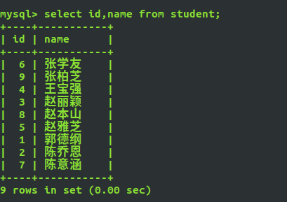

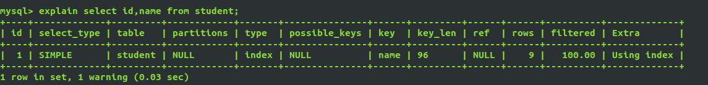

explian中的字段解释

+ id

  + id列的编号是 select 的序列号，有几个 select 就有几个id，并且id的顺序是按 select 出现的顺序增长的
  + MySQL将 select 查询分为简单查询和复杂查询。复杂查询分为三类：简单子查询、派生表（from语句中的子查询）、union 查询

+ select_type

  + select_type 表示对应行是是简单还是复杂的查询，如果是复杂的查询，又是上述三种复杂查询中的哪一种。
  + **simple**：简单查询。查询不包含子查询和union
  + **primary**：复杂查询中最外层的 select
  + **subquery**：包含在 select 中的子查询（不在 from 子句中）
  + **derived**：包含在 from 子句中的子查询。MySQL会将结果存放在一个临时表中，也称为派生表（derived的英文含义）
  + **union**：在 union 中的第二个和随后的 select
  + **union result**：从 union 临时表检索结果的 select

+ table

  + 这一列表示 explain 的一行正在访问哪个表
  + 当 from 子句中有子查询时，table列是 <derivenN> 格式，表示当前查询依赖 id=N 的查询，于是先执行 id=N 的查询。当有 union 时，UNION RESULT 的 table 列的值为 <union1,2>，1和2表示参与 union 的 select 行id

+ type

  + 这一列表示关联类型或访问类型，即MySQL决定如何查找表中的行。

  + 依次从最优到最差分别为：

    > system > const > eq_refref > fulltext > ref_or_null > index_merge > unique_subquery >index_subquery > range > index > ALL

+ possible_keys
  + 这一列显示查询可能使用哪些索引来查找
  + explain 时可能出现 possible_keys 有列，而 key 显示 NULL 的情况，这种情况是因为表中数据不多，mysql认为索引对此查询帮助不大，选择了全表查询
  + 如果该列是NULL，则没有相关的索引。在这种情况下，可以通过检查 where 子句看是否可以创造一个适当的索引来提高查询性能，然后用 explain 查看效果
+ key
  + 这一列显示mysql实际采用哪个索引来优化对该表的访问
  + 如果没有使用索引，则该列是 NULL。如果想强制mysql使用或忽视possible_keys列中的索引，在查询中使用 force index、ignore index
+ key_len
  
  + 这一列显示了mysql在索引里使用的字节数，通过这个值可以算出具体使用了索引中的哪些列
+ ref
  
  + 这一列显示了在key列记录的索引中，表查找值所用到的列或常量，常见的有：const（常量），func，NULL，字段名（例：film.id）
+ rows
  
  + 这一列是mysql估计要读取并检测的行数，注意这个不是结果集里的行数
+ extra
  + 这一列展示的是额外信息。常见的重要值如下： 
  + **distinct**: 一旦mysql找到了与行相联合匹配的行，就不再搜索了
  + **Using index**：这发生在对表的请求列都是同一索引的部分的时候，返回的列数据只使用了索引中的信息，而没有再去访问表中的行记录,是性能高的表现
  + **Using where**：mysql服务器将在存储引擎检索行后再进行过滤。就是先读取整行数据，再按 where 条件进行检查，符合就留下，不符合就丢弃
  + **Using temporary**：mysql需要创建一张临时表来处理查询。出现这种情况一般是要进行优化的，首先是想到用索引来优化
  + **Using filesort**：mysql 会对结果使用一个外部索引排序，而不是按索引次序从表里读取行。此时mysql会根据联接类型浏览所有符合条件的记录，并保存排序关键字和行指针，然后排序关键字并按顺序检索行信息。这种情况下一般也是要考虑使用索引来优化的

### 2.from 子句

* `select 字段 from 表名;`
* `from `后面是**数据源**可以写多个，数据源一般是表名，也可以是其他select查询结果集。

`select student.name, score.math from student,score;`

注意：这样查询会产生笛卡尔积，数据库表连接数据行匹配时所遵循的算法就是以上提到的笛卡尔积，表与表之间的连接可以看成是在做乘法运算

### 3.where子句：按指定条件过滤

* `select 字段 from 表名 where 条件;`
* where 是做条件查询，只返回结果为True的数据。

`select name from student where city = '上海';`

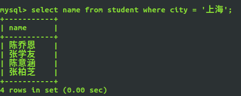

* 空值判断：`is null  /   is not null`

  * 查询描述信息为null的学生姓名

    `select name from student where description is null;`

  * 查询描述信息不为null的学生姓名

    ``select name from student where description is not null;`

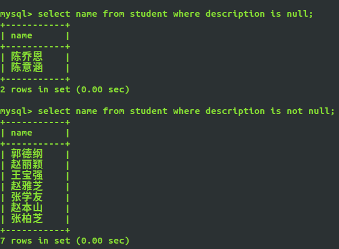

* 范围判断：`between ... and ... /  not between ... and ...`

  * 查询成绩在60~70之间的同学id,math

  ​    `select id, math from score where math between 60 and 70;`

  

  + 查询成绩不在60~70之间的同学id,math

  ​	`select id, math from score where math not between 60 and 70;`

  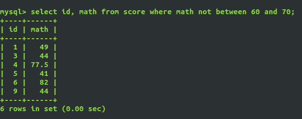

  + 查询数学成绩大于80且英语成绩小于60的同学id,math

  ​	`select * from score where math >= 80 and english<=60;`

  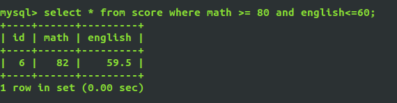

### 4.group by：分组查询

* **概念：**按照某一字段进行分组，会把该字段中的值相同的归为一组，将查询的结果分类显示，方便统计。
* **如果有group by要放在where的后面。**
* 语法：`select 字段名 from 表名 group by 分组字段;`
* 注意：
  * select的列如果不在group by的列当中，并且根据group by 后面的列分组后任意列不能有唯一值，则这些不包含在group by 中的列都应该使用max或者min聚合函数
  * select的列如果不在group by的列当中，并且根据group by 后面的列分组后任意列均有唯一值，则这些不包含在group by 中的列可以不使用max或者min聚合函数

`select sex, count(id) from student group by sex;`

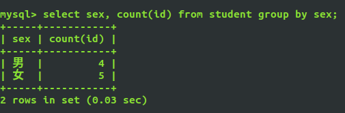

在group将需要的结果通过 "聚合函数" 拼接
`select sex, group_concat(name) from student group by sex;`

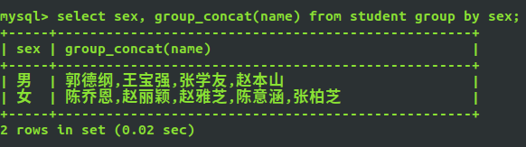

添加where语句,按性别分组，将上海地区的男生女生姓名连接起来
`select sex, group_concat(name) from student where city = '上海' group by sex;`

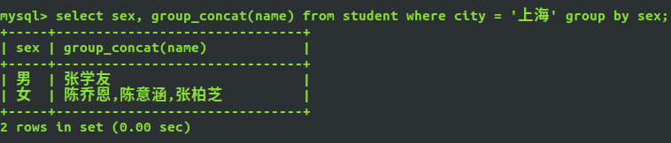


### 5.having

* **在SQL中增加 having 子句的原因是：**`where`关键字后面无法与聚合函数一起使用。

  `select 字段 from 表名 having 条件;`

* where和having的区别

  * `where`：后面不能加上聚合函数，只能写在数据源的后面。

    ```mysql
    mysql> select city, group_concat(birthday) from student where min(birthday) > '1995-1-1' group by city;
    ERROR 1111 (HY000): Invalid use of group function
    ```

    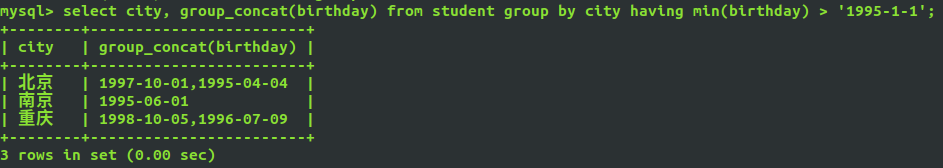

  * `having`：select 查询的条件字段必须要在结果集中出现，可以写在`group by`的后面。

    ```mysql
    mysql> select name, city from student having id > 5;
    ERROR 1054 (42S22): Unknown column 'id' in 'having clause'
    ```

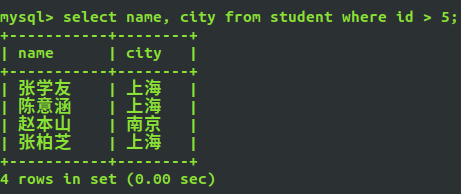

where和having的混合使用

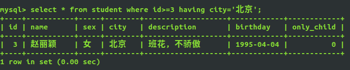

### 6.`order by`：按字段排序

* 语法：`select 字段名 from 表名 ordey by 排序字段 asc|desc;`

* **`order by`写在`group by `后面，如果有`having`也要写在`group by`后面。**
* 分为`升序asc`/`降序desc`，默认asc (可不写)

`select * from score order by math desc;`
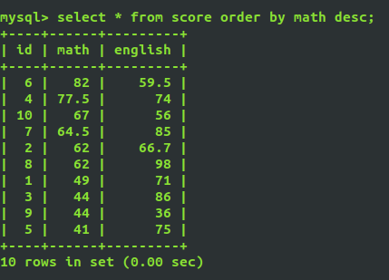

### 7.limit限制取出的数量/分页

+ 限制显示的个数

  `select 字段名 from 表名 where 条件 limit 个数 `

  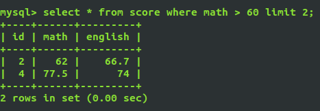

+ 从第m行开始，显示n条数据

  `select 字段 from 表名 limit m, n;`

  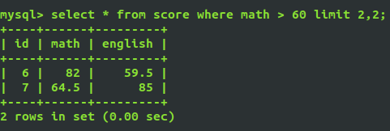

+ 跳过n行，显示m条数据

  `select 字段 from 表名 limit m offset n;`

  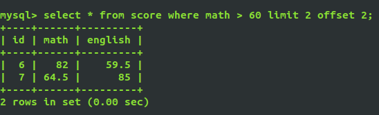

### 8.distinct：去重

`select distinct 字段名 from 表名;`

group by 也有一定的去重效果，但是效率不高

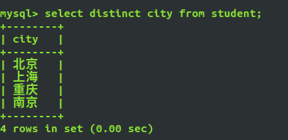

### 9.dual虚表

dual 是一个虚拟表，仅仅为了保证`select ... from ... `语句的完整性。

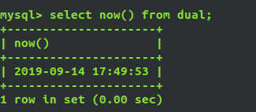


### 模糊查询

like

+ % 替换1个或多个字符

  匹配姓张的同学

  `select 字段名 from 表名 where 字段名 like ='张%'`

  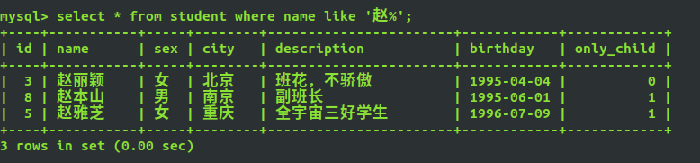

+ _ 替换一个字符

  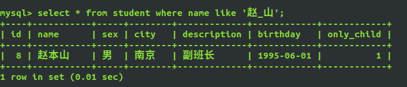

rlike：正则表达式匹配

`select 字段名 from 表名 where 字段名 rlike '正则表达式'；`

查询描述信息以'全'开头的学生信息

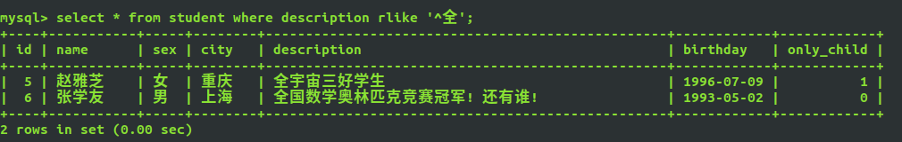

### 查询时关键字的顺序

select ...
	from ...
	where ...
	group by ...
	having ...
	order by ...

## 聚合函数

| Name             | Description                                  |
| ---------------- | -------------------------------------------- |
| **avg()**        | **返回参数的平均值**                         |
| bit_and()        | 按位返回and                                  |
| bit_or()         | 按位返回or                                   |
| bit_xor()        | 按位返回异或                                 |
| **count()**      | **返回总数**                                 |
| count(distinct)  | 返回不重复值的计数                           |
| group_concat()   | 返回连接的字符串                             |
| json_arrayagg()  | 将结果集作为单个json数组                     |
| json_objectagg() | 将结果集作为单个json对象                     |
| **max()**        | **返回最大值**                               |
| **min()**        | **返回最小值**                               |
| std()            | 返回 expr 的总体标准偏差                     |
| stddev()         | 返回样本标准差                               |
| stddev_pop()     | 返回expr 的总体标准偏差(VAR_POP() 的平方根)  |
| stddev_samp()    | 返回expr 的样本标准差 ( VAR_SAMP() 的平方根) |
| **sum()**        | **归还总和**                                 |
| var_samp()       | 返回expr 的样本方差                          |
| variance()       | 返回expr 的总体标准方差                      |

常用：count(),min(),max(),count(distinct),avg(),sum()

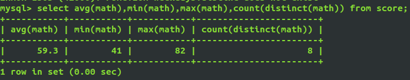

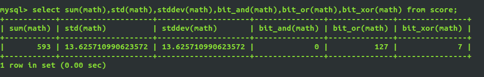

### 数值计算类函数

| 函数          | 功能                               |
| ------------- | ---------------------------------- |
| ABS(x)        | 返回x的绝对值                      |
| CEIL(x)       | 对x向上取整                        |
| FLOOR(x)      | 对x向下取整                        |
| MOD(x,y)      | 返回x/y的模                        |
| RAND()        | 返回0到1内的随机数                 |
| ROUND(x,y)    | 返回参数x的四舍五入的有y位小数的值 |
| TRUNCATE(x,y) | 返回数字x阶段为y为小数的结果       |

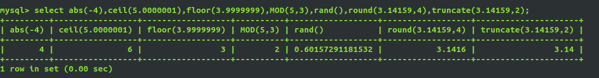

### 日期计算类函数

| 函数                              | 功能                                         |
| --------------------------------- | -------------------------------------------- |
| CURDATE()                         | 返回当前日期                                 |
| CURTIME()                         | 返回当前时间                                 |
| NOW()                             | 返回当前的日期和时间                         |
| UNIX_TIMESTAMP(date)              | 返回日期的UNIX时间戳                         |
| FROM_UNIXTIME                     | 返回UNIX时间戳的日期值                       |
| WEEK(date)                        | 返回日期date为一年中的第几周                 |
| YEAR(date)                        | 返回日期date的年份                           |
| HOUR(time)                        | 返回time的小时值                             |
| MINUTE(time)                      | 返回time的分钟值                             |
| MONTHNAME(date)                   | 返回date的月份名                             |
| DATE_FORMAT(date,fmt)             | 返回按字符串fmt格式化日期date值              |
| DATE_ADD(date,INTERVAL expr type) | 返回一个日期或时间加上另一个时间间隔的时间值 |
| DATEDIFF(expr,expr2)              | 返回起始时间expr和结束时间expr2之间的天数    |

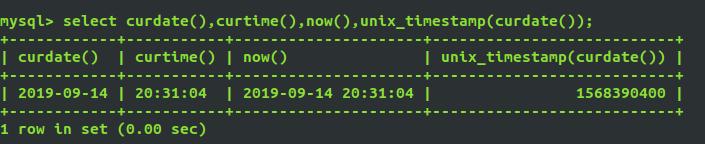

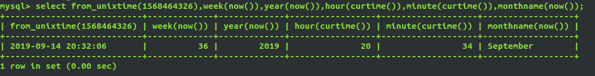

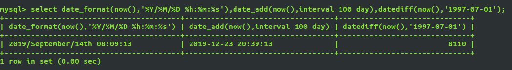

### 字符串相关函数

| 函数                   | 功能                                                       |
| ---------------------- | ---------------------------------------------------------- |
| **CONCAT(s1,s2...sn)** | 连接s1,s1,...,sn为一个字符串                               |
| INSERT(str,x,y,instr)  | 将字符串str从第x位置开始，y个字符长的子串替换成字符串instr |
| LOWER(str)             | 将字符串中所有字母改成小写                                 |
| UPPER(str)             | 将字符串中所有字母改成大写                                 |
| LEFT(str,x)            | 返回字符串str最左边的x个字符                               |
| RIGHT(str,x)           | 返回字符串str最右边的x个字符                               |
| LPAD(str,n,pad)        | 用字符串pad对str最左边进行填充知道长度为n个字符长度        |
| RPAD(str,n,pad)        | 用字符串pad对str最右边进行填充知道长度为n个字符长度        |
| TRIM(str)              | 去掉字符串行尾和行头的空格                                 |
| LTRIM(str)             | 去掉字符串左边的空格                                       |
| RTRIM(str)             | 去掉字符串str行尾的空格                                    |
| REPEAT(str,x)          | 返回str重复x的结果                                         |
| REPLACE(str,a,b)       | 用字符串b替换字符串str中所有出现发的字符串a                |
| STRCMP(s1,s2)          | 比较字符串s2和s2                                           |
| SUBSTRING(str,x,y)     | 返回从字符串str的x位置起到y个字符串长度的子串              |

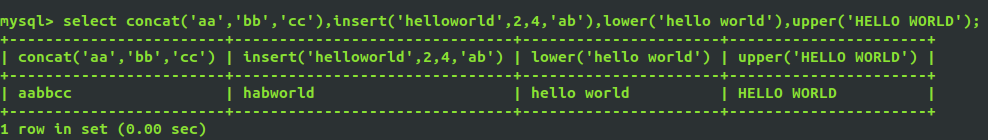

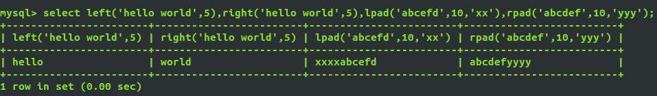

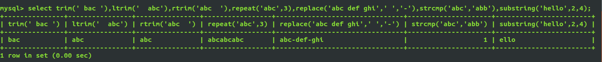


### 其他函数

| 函数           | 功能                 |
| -------------- | -------------------- |
| DATABASE()     | 返回当前数据库名     |
| VERSION()      | 返回当前数据库版本   |
| USER()         | 返回当前登录用户名   |
| INET_ATON(IP)  | 返回IP地址的数字表示 |
| INET_NTOA(num) | 返回数字表示的ip地址 |
| PASSWORD(str)  | 返回字符串的加密版本 |
| MD5()          | 返回字符串的MD5值    |

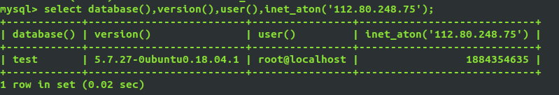

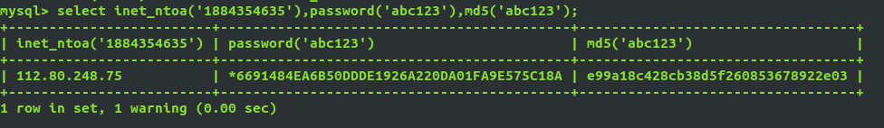

## 多表查询

### `UNION`联合查询

**作用：union操作符用于合并两个或多个select语句的结果集。**

要求：

1. 两边select语句的字段必须一样
2. 两边可以具有不同数据类型的字段
3. 字段名默认按照左边的表来设置

` select id from student union select id from score;`

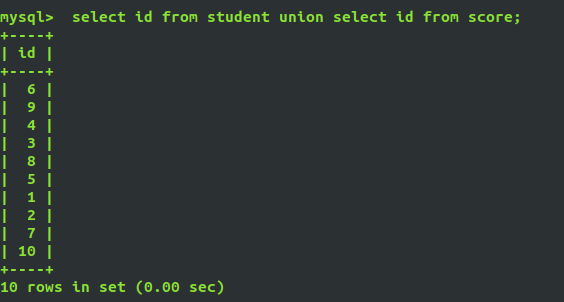


### INNER JOIN：内连接(交集)

* inner join 关键字在表中存在至少一个匹配时返回所有的行。

`select 字段名 from 表1 inner join 表2 on 表1.字段 = 表2.字段`

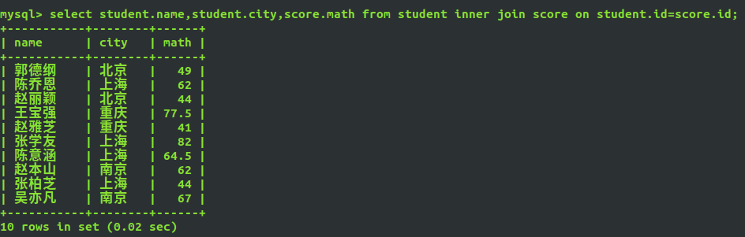

### LEFT JOIN：左连接

* left join 关键字从左表（table1）返回所有的行，即使右表（table2）中没有匹配。如果右表中没有匹配，则结果为NULL

  `select 字段名 from 表1 left join 表2 on 表1.字段 = 表2.字段;`

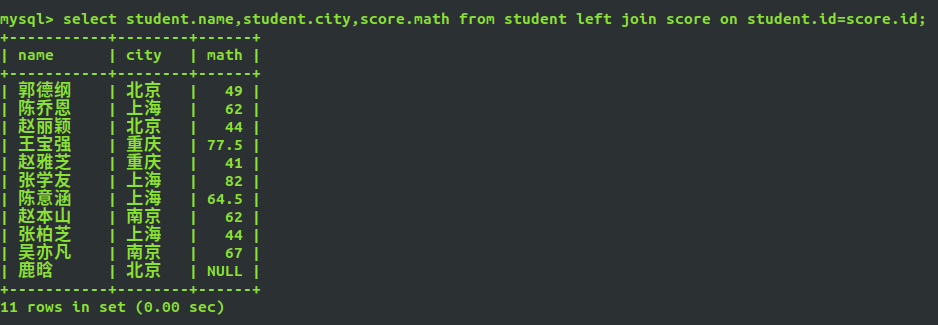

### RIGHT JOIN：右连接

right join关键字从右表（table2）返回所有的行，即使左（table1）中没有匹配。如果左表中没有匹配，则结果为NULL。

`select 字段名 from 表1 right join 表2 on 表1.字段 = 表2.字段;`

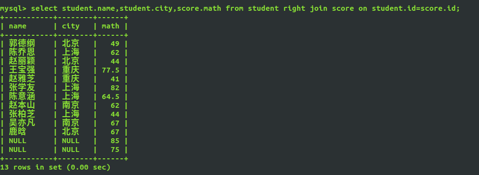

### 子查询

也就是嵌套查询，查询语句中还嵌套一个查询：

```sql
select name from student where id in (select id from score where math > 60)
```

  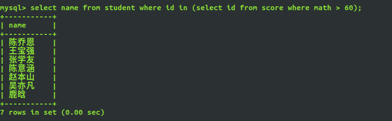

## MySQL的权限管理分为两个阶段：

1.第一阶段为连接验证，主要限制用户连接MySQL-server时使用的ip及密码。

2.第二阶段为操作检查，主要检查用户执行的指令是否被允许，一般非管理员不允许执行drop、delete等危险操作。

### 权限控制安全准则：

1. 只授予能满足需要的最小权限,防止用户执行危险操作。
2. 限制用户的登录主机,防止止不速之客登录数据库。
3. 禁止或删除没有密码的用户。
4. 禁止用户使用弱密码(123456)。
5. 定期清理无效的用户,回收权限或者删除用户。

### 常用操作：

1. 创建用户、授予权限：

   - mysql 8.0 之前的版本

     ```sql
     grant all privileges on *.* to '用户名'@'主机名' identified by '密码' with grant option;
     flush privileges; -- 刷新使权限生效
     ```

     - `		*.*`：允许操作的数据库和表。
     - `with crant option`：该子句说明允许用户将自己拥有的权限授予别人。

   - mysql 8.0 之后的版本

```sql
   create user `用户名`@`主机` identified by `密码`; -- 创建用户
   grant all on *.* to `用户名`@`主机` with grant option; -- 授权
```

2. 修改密码

   `alter user 'root'@'localhost' identified with mysql_naive_password by 密码`

3. 查看权限

   ```sql
   show grants; -- 查看当前用户的权限
   show grants for 'xcw'@'localhost'; -- 查看用户 xcw 的权限
   ```

4. 回收权限

   ```sql
   revoke delete on *.* from 'xcw'@'localhost';
   ```

5. 删除用户

   ```sql
   user mysql;
   select host, user from user;
   drop user `用户名`@'%';
   /*在mysql里 % 代表 通配符*/
   ```

## 视图(虚拟表)

- 视图是数据的特定子集，是从其他表里提取出来的数据而形成的虚拟表，或者说临时表。
- 创建视图依赖一个select查询语句。
- 视图是永远不会自己消失的除非手动删除它。
- 视图有时会对提高效率有帮助。临时表不会对性能有帮助，是资源的消耗者。
- 视图一般随该数据库存放在一起，临时表永远都是在tempdb里的。
- 试图适用于**多表连接浏览**时使用；**不适合增、删、改**，这样可以提高执行效率。
- 一般视图表的名称以v_为前缀，用来与正常表进行区分。
- 对原表的修改会影响到视图中的数据。

### 创建视图

- 语法：`create view 视图名 as 查询语句;`

```sql
mysql> create view v_exam as
    -> select l.id, l.name, r.math,r.english
    -> from student l inner join score r on l.id = r.id order by id;
Query OK, 0 rows affected (0.06 sec)
```

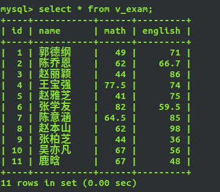

### 删除视图

- 语法：`drop view 视图名`

```mysql
mysql> drop view v_exam;
Query OK, 0 rows affected (0.00 sec)
```

