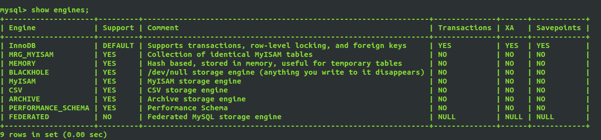
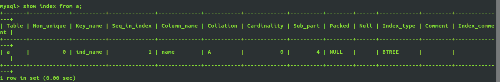
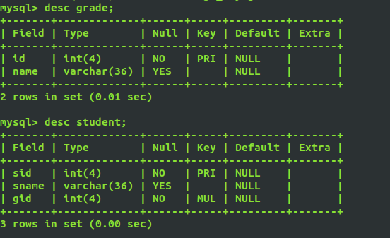
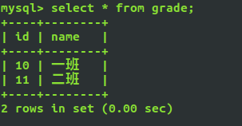

# 数据库的高级特性

## 存储引擎

**概念：**就是如何存储引擎、如何为数据建立索引和如何更新、查询数据等技术的实现方法。

MySQL默认支持多种存储引擎，以适用于不同领域的数据库应用需要，用户可以通过选择使用不同的存储引擎提高应用的效率，提供灵活的存储方式。

查看当前的存储引擎
`show variables like '%storage_eng';`
`show engines;`



### MySQL常用的存储引擎

| 功能         | MYISAM  | Memory | InnoDB  | Archive |
| ------------ | ------- | ------ | ------- | ------- |
| 存储限制     | 256TB   | RAM    | 64TB    | None    |
| 支持事务     | No      | No     | **Yes** | No      |
| 支持全文索引 | **Yes** | No     | No      | No      |
| 支持树索引   | Yes     | Yes    | Yes     | No      |
| 支持哈希索引 | No      | Yes    | No      | No      |
| 支持数据缓存 | No      | N/A    | Yes     | No      |
| 支持外键     | No      | No     | **Yes** | No      |

`innodb` 在写的操作上非常的有优势(事务) ,CUD全是写的操作;

`myisam` 在 读的操作上非常的有优势(健全的索引) R操作。

### 引擎的存储方式

**myisam将一张表存储为三个文件：**

* student.frm -> 表的结构
* student.MYD -> 存储的是数据
* student.MYI -> 存储的是表的索引
* myisam的文件可以任意的移动

**innodb将一张表存储为两个文件：**

* student.frm -> 表的结构+表的索引
* student.ibd -> 存储的是数据
* innodb的文件存储在哪个数据库中，不能任意移动

### 存储引擎简介

#### InnoDB

事务型数据库的首选引擎，支持事务安全表（ACID），支持行锁定和外键，InnoDB是默认的MySQL引擎。

主要特性：

+ 给MySQL提供了具有提交、回滚、崩溃恢复能力的事务安全存储引擎。

+ 是为处理巨大的数据量的最大性能设计。它的CPU效率比其他基于磁盘的关系型数据库引擎高。

+ 自带缓冲池，可以将数据和索引缓存在内存中。

+ 支持外键完整性约束。

+ 被用在众多需要高性能的大型数据库站点上。

+ 支持行表级锁。

#### MyISAM

MyISAM基于ISAM存储引擎，并对其进行扩展。它是在Web、数据存储和其他应用环境下最常用的存储引擎之一。MyISAM拥有较高的插入、查询速度，但不支持事务。

主要特性：

+ 大文件支持更好

+ 当删除、插入、更新混用时，产生更少的碎片

+ 每个MyISAM表最大索引数是64，这可以通过重新编译来改变。每个索引最大列数是16.

+ 最大的键长度是1000字节。

+ BLOB和TEXT列可以被索引

+ NULL 被允许在索引的列中,这个值占每个键的0~1个字节

+ 所有数字键值以高字节优先被存储以允许一个更高的索引压缩

+ MyISAM 类型表的 auto_increment列更新比 InnoDB 类型的 auto_increment更快

+ 可以把数据文件和索引文件放在不同目录

+ 每个字符列可以有不同的字符集

+ 有 varchar的表可以固定或动态记录长度

+ varchar和 char列可以多达 64KB

+ 只支持表锁

#### MEMORY

MOMERY 存储引擎将表中数据存储到内存中为查询和引用其他表数据提供快速访问。（临时表）

### 存储引擎的选择

```sql
一般来说,对插入和并发性能要求较高的,或者需要外键及事务支持的选择 InnoDB;
插入较少,查询较多的场景,优先考虑 MyISAM。
```

### 使用引擎

```sql
-- 一般在建表时添加
create table abc(
	name char(10)
)engine=InnoDB charset=utf8;

create table xyz(
	name char(10)
)engine=MyISAM charset=utf8;
```

## 索引

索引就是为特定的 mysql 字段进行一些特定的算法排序,比如二叉树的算法和哈希算法；哈希算法是通过建立特征值,然后根据特征值来快速查找。

> B-tree索引(log2 N)：用的最多,并且是 mysql 默认的索引数据结构。
>
> 哈希索引

* **优点：**
  * 使用索引能极大提升查询速度(快)

* **缺点：**
  * 额外使用一些存储空间
  * 索引让写操作变慢

**索引的创建原则**

1. 适用于频繁查找的列

2. 适用于条件判断的列
3. 适用于排序的列
4. 不适合数据少的列
5. 不适合查询少的列

### 创建索引

**建表时添加索引**

create table 表名(
	字段1 类型 属性,

​	字段2 类型 属性,

​	......

​    index 索引名(字段名(长度))
);

```mysql
mysql> create table a (id int not null,name varchar(16) not null,index idx_a(name(5)));
Query OK, 0 rows affected (0.54 sec)
```

后期添加索引

```sql
create index `索引名` on 表名 (字段名(长度));
```

### 删除索引

```sql
drop index [索引名] on 表名;
```

### 唯一索引

与普通索引相似，不同的是：列的值必须唯一，但允许有空值。如果是组合索引，则列值的组合必须唯一。主键、唯一值

```sql
create unique index 索引名 on 表名(字段名(长度));

-- 或
create table 表名(
	id int not null,
    username varchar(16) not null,
    index 索引名 (字段名(长度))
);
```

```mysql
mysql> create unique index ind_name on a(name(4));
Query OK, 0 rows affected (0.21 sec)
Records: 0  Duplicates: 0  Warnings: 0
```


### 查看索引

```sql
show index from 表名;
```



## 关系和外键

### 关系

* 一对一：学生表和成绩表，一个学生只能有一个成绩数据，一条成绩数据只能对应着一个学生

* 一对多/多对一：学生表和班级表，一个学生只能属于一个班级，一个班级可以对应多个学生
* 多对多：选课时，学生表与课程表，一个学生可以选多门课程，一门课程也可以被多个学生选

### 外键

> 外键是一种约束。他只是保证数据的一致性,并不能给系统性能带来任何好处。
>
> 建立外键时,都会在外键列上建立对应的索引。外键的存在会在每一次数据插入、修改时进行约束检查,如果不满足外键约束,则禁止数据的插入或修改,这必然带来一个问题,就是在数据量特别大的情况下,每一次约束检查必然导致性能的下降。
> 出于性能的考虑,如果我们的系统对性能要求较高,那么可以考虑在生产环境中不使用外键。

```mysql
mysql> create table grade(
    -> id int(4) not null primary key,
    ->  name varchar(36)
    -> );
Query OK, 0 rows affected (0.23 sec)
```

```mysql
mysql> create table student (
    -> sid int(4) not null primary key,
    -> sname varchar(36),
    ->  gid int(4) not null
    ->  )charset=utf8;
Query OK, 0 rows affected (0.30 sec)
```

添加外键

```
alert table 表名 add constraint FK_ID foreign key(外键字段名) references 外表表名(主键字段名)
```

```mysql
mysql> alter table student add constraint fk_id foreign key (gid) references grade (id)charset=utf8;
Query OK, 0 rows affected (0.69 sec)
Records: 0  Duplicates: 0  Warnings: 0
```

查看两张表的结构



可以看出表grade中id为主键，student表中gid为外键

插入数据：

```mysql
mysql> insert into student (sid, sname, gid) values(1000, 'wusong', 123);
ERROR 1452 (23000): Cannot add or update a child row: a foreign key constraint fails (`foreign_key`.`student`, CONSTRAINT `fk_id` FOREIGN KEY (`gid`) REFERENCES `grade` (`id`))
```

可以看出，向外键表student表中插入数据会报错，因为，此时student中的gid为外检，必须先向grade表中插入数据，只有在grade中存在gid的值，才能往student表中插入数据

```mysql
mysql> insert grade values(10, '一班');
Query OK, 1 row affected (0.04 sec)

mysql> insert grade values(11, '二班');
Query OK, 1 row affected (0.09 sec)
```



```mysql
mysql> insert into student(sid, sname, gid) values(1000, '周华健', 10);
Query OK, 1 row affected (0.04 sec)

mysql> insert into student(sid, sname, gid) values(1001, '周芷若', 10);
Query OK, 1 row affected (0.07 sec)

mysql>  insert into student(sid, sname, gid) values(1002, '周杰伦', 10);
Query OK, 1 row affected (0.04 sec)

mysql> insert into student(sid, sname, gid) values(10003, '赵云', 11), (10004, '赵子龙', 11);
Query OK, 2 rows affected (0.06 sec)
Records: 2  Duplicates: 0  Warnings: 0

```

删除数据：

```mysql
mysql> delete from grade where id=10;
ERROR 1451 (23000): Cannot delete or update a parent row: a foreign key constraint fails (`foreign_key`.`student`, CONSTRAINT `fk_id` FOREIGN KEY (`gid`) REFERENCES `grade` (`id`))
```

可以看出，当先删除被关联的表grade表中的数据，会报错，因为此时，student表中的数据关联了，或者说用到了grade表中数据，不能直接删除grade表中的数据，只能先删除student表中所有用到了你想删除的grade数据的数据

```mysql
mysql> delete from student where sid in (1001,1002,1000);
Query OK, 3 rows affected (0.04 sec)

mysql> delete from grade where id=10;                                    
Query OK, 1 row affected (0.03 sec)
```

### 总结

在有外键 的情况下，插入数据时，先往被关联的数据内插入数据，再往有外键的表中插入数据，删除数据时，先删除有外键的表中的数据，再删除被关联的表中数据

