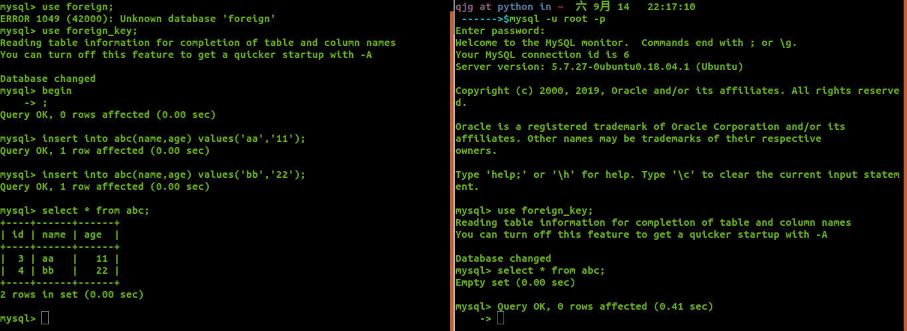
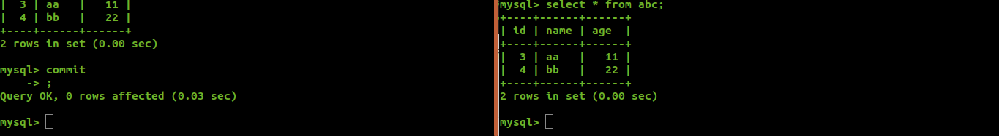
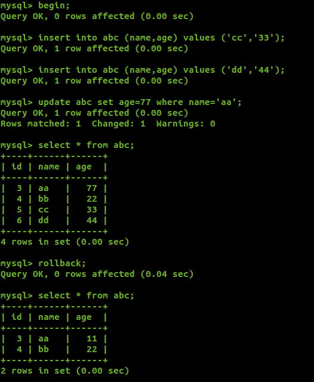
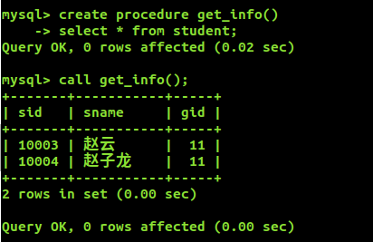
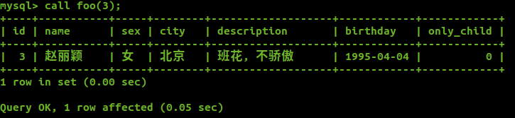
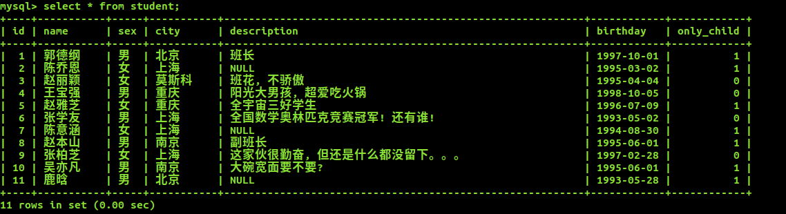
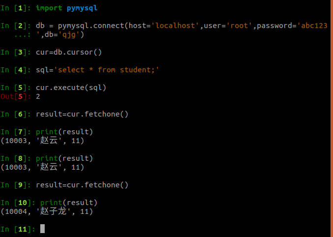

## 一、数据库事务扩展

### 1.事务简介

事务主要用于处理理操作量大、复杂度高、并且关联性强的数据。

在 MySQL 中只有 Innodb 存储引擎支持事务。
事务处理可以用来维护数据库的完整性, 保证成批的 SQL 语句**要么全部执行, 要么全部不执行**。主要针对
insert, update, delete 语句而设置

### 2.事务四大特性

1. 原子性(Atomicity)

   * 事务中的所有操作，要么全部完成，要么全部不完成，不会结束中间某个环节。
   * 事务在执行过程中，会被回滚(Rollback)到事务开始前的状态，就像这个事务从来没有执行过一样。

2. 一致性(Consisency)

   在事务开始之前和事务结束以后，数据库的完整性没有被破坏。

   这表示写入的资料必须符合所有的预设规则，这包含资料的精确度、串联性以及后续数据库可以自发性地完成一定的工作。

3. 隔离性(lsolation)

   事务允许多个并发事务同时对其数据进行读写和修改的能力，隔离性可以防止多个事务并发执行时由于交叉执行而导致数据的不一致。

   事务的隔离性分为不同的级别，包括：

   1. 读取未提交(Read uncommitted)

      * 所有事物都可以看到其他未提交事务的执行结果
      * 本隔离级别很少用于实际应用，因为它的性能也不比其他级别好多少。
      * 该级别引发的问题是---脏读(Dirty Read)：读取到了未提交的数据

   2. 读提交(read committed)

      * 这是大多数数据库系统默认的隔离级别（但不是MySQL默认的

      * 他满足了隔离的简单定义：一个事物只能看见已经提交事务做的改变

      * 这种隔离级别出现的问题是：不可重复读(Nonrepeatable Read)

        不可重复读意味着我们在同一事务中执行完全相同的select语句时可能看到不一样的结果。

        导致这种情况的原因可能有：

        * 有一个交叉的事务有新的commit，导致了数据的改变。；
        * 一个数据库被多个实例操作时，同一事务的其他实例处理期间可能有新的commit

   3. 可重复读(repeatable read)

      * 这是MySQL的默认事务隔离级别
      * 它确保同一事务的多个实例在并发读取数据时，会看到同样的数据行
      * 次级别可能出现的问题：幻读(Phantom Read)：当用户读取的某一行的数据时，另一个事务又在该范围内插入新的行，当用户在读取该范围的数据行时，会发现有新的“幻影”行
      * InnoDB通过多版本并发控制（MVCC、Multiversion Concurrency Control）机制解决幻读问题；
      * InnoDB还通过间隙解决幻读问题

   4. 串行化(Serializable)

      * 这是最高的隔离级别
      * 他通过强制事务排序，使之不可能相互冲突，从而解决幻读问题。简言之，它是在每个读的数据行加上共享锁，MySQL锁终结
      * 在这个在这个级别，可能导致大量的超时现象和锁竞争。

4. 持久性(Durability)

   事务处理结束后吗，对数据的修改就是永久的，即使系统故障也不会丢失。

### 3.语法与使用

* 开启事务: BEGIN 或 START TRANSACTION

* 提交事务: COMMIT , 提交会让所有修改生生效

* 回滚: ROLLBACK , 撤销正在进行行行的所有未提交的修改

* 创建保存点: SAVEPOINT identifier

* 删除保存点: RELEASE SAVEPOINT identifier

* 把事务回滚到保存点: ROLLBACK TO identifier

* 设置事务的隔离级别: SET TRANSACTION

  InnoDB 提供的隔离级别有

  * READ
  * UNCOMMITTED
  * READ COMMITTED
  * REPEATABLE READ
  * SERIALIZABLE

4.实例

```sql
create table abc(
	id int unsigned primary key auto_increment,
    name varchar(32) unique,
    age int unsigned
)charset=utf8;
Query OK, 0 rows affected (0.41 sec)

-- 开启事务
begin;
insert into abc (name,age) values ('aa','11');
insert into abc (name,age) values ('bb','22');
```



事务没有提交之前，在另一个窗口查看表中数据，，是没有变化的

```mysql
-- 提交事务
commit 
```



提交事务之后，所有操作生效，此时在另一个窗口也可以看到数据的变化

```
begin;
insert into abc (name,age) values ('cc','11');
insert into abc (name,age) values ('dd','22');
update abc set age=77 where name='aa';
--在事务中查看一下数据
select * from abc;
rollback;
select * from abc;--事物结束后查看一下数据
```



可以看出在没有事务没有提交之前，进行回滚(rollback)，那么之前所有的操作无效

## 二、锁

锁是计算机协调多个进程或线程并发访问某一资源的机制。

锁保证数据并发访问的一致性、有效性;

锁冲突也是影响数据库并发访问性能的一个重要因素。

锁是Mysql在服务器层和存储引擎层的的并发控制。

分类

* 行级锁
  * 行级锁是Mysql中锁定粒度最细的一种锁,表示只针对当前操作的行进行加锁。
  * 行级锁只有 InnoDB 引擎支持。
  * 行级锁能大大减少数据库操作的冲突。其加锁粒度最小,但加锁的开销也最大。
  * 特点:开销大,加锁慢;会出现死锁;锁定粒度最小小,发生锁冲突的概率最低,并发度也最高。

* 表级锁
  * 表级锁是MySQL中锁定粒度最大的一种锁
  * 对当前操作的整张表加锁,它实现简单,资源消耗较少,被大部分MySQL引擎支持。
  * 特点:开销小,加锁快;不会出现死锁;锁定粒度大,发出锁冲突的概率最高,并发度最低。

* 共享锁 (读锁)
  * 其他用户可以并发读取数据,但任何事务都不能对数据进行修改,直到已释放所有共享锁。

* 排他锁 (写锁)
  * 如果事务 T 对数据 A 加上排他锁后,则其他事务不能再对 A 加任何类型的封锁。
  * 持有排他锁的事务既能读数据,又能修改数据。

* 乐观锁(Optimistic Lock)
  * 假设不会发生并发冲突,只在提交操作时检查是否违反数据完整性。 
  * 乐观锁不能解决脏读的问题。
  * 乐观锁, 顾名思义,就是很乐观,每次去拿数据的时候都认为别人不不会修改,所以不会上锁,但是在更新的时候会判断一下在此期间别人有没有去更新这个数据,可以使用版本号等机制。乐观锁适
    用用于多读的应用类型,这样可以提高吞吐量,像数据库如果提供类似于write_condition机制的其
    实都是提供的乐观锁。

* 悲观锁(Pessimistic Lock)
  * 假定会发生并发冲突,屏蔽一切可能违反数据完整性的操作。
  * 悲观锁,顾名思义,就是很悲观,每次去拿数据的时候都认为别人会修改,所以每次在拿数据的时
    候都会上锁,这样别人想拿这个数据就会block直到它拿到锁。传统的关系型数据库里边就用到了
    很多这种锁机制,比如行锁,表锁等,读锁,写锁等,都是在做操作之前先上锁。

## 三、存储过程

存储过程(Stored Procedure)是一种在数据库中存储复杂程序,以便外部程序调用用的一种数据库对象。

存储过程是为了完成特定功能的SQL语句集,经编译创建并保存在数据库中,用户可通过指定存储过程的名字并给定参数(需要时)来调用执行。

存储过程思想上很简单,就是数据库 SQL 语言层面的代码封装与重用。

1. 优点
* 存储过程可封装,并隐藏复杂的商业逻辑。
* 存储过程可以回传值,并可以接受参数。
* 存储过程无法使用 SELECT 指令来运行,因为它是子程序,与查看表,数据表或用户定义函
  数不同。
* 存储过程可以用在数据检验,强制实行商业逻辑等。
2. 缺点
  * 存储过程,往往定制化于特定的数据库上,因为支持的编程语言不同。当切换到其他厂商的
    数据库系统时,需要重写原有的存储过程。
  * 存储过程的性能调校与撰写,受限于各种数据库系统。

### 语法

1. 声明语句结束符，可以自定义：

   存储过程中有很多的SQL语句，SQL语句到后面为了保证语法结构必须要有分号 ； 但是默认情况下表示客户端代码发送到服务器执行，必须更改结束符。

   ```sql
   DELIMITER $S
   -- 或者
   DELIMITER //
   ```

2. 声明存储过程：

   ```sql
   create procedure demo_in_parmeter(IN p_in int)
   ```

3. 存储过程开始和结束符号：

   ```sql
   DEGIN ... END
   ```

4. 变量赋值:

   ```sql
   set @p_in = 1
   ```

5. 变量定义：

   ```sql
   declare l_int int unsigned default 4000000;
   ```

6. 创建mysql存储过程、存储函数：

   ```sql
   create prodedure 存储过程名(参数)
   ```

7. 存储过程体：

   ```sql
   create function 存储函数名(参数)
   ```

### 用法

简单用法

```sql
-- 定义
-- 如果存储过程就是一条SQL语句，begin...end两个关键字可以省略
create procedure get_info()
select * from student;

-- 调用
call get_info();
```



复杂一点

```mysql
mysql> delimiter //  -- 将sql语句的结束符改为 //
mysql> create procedure foo(in uid int) -- 定义函数和形参
    -> begin
    -- 封装语句
    -> select * from student where id=uid;
    -> update student set city='莫斯科' where id=uid;
    -> end//
Query OK, 0 rows affected (0.00 sec)

mysql> delimiter ;  -- 将结束符改回;
```

使用call 函数名(参数)，进行调用



可以看出封装的两条语句都执行成功了



## 四、Python操作

1. 安装：`pip install pymysql`
2. 使用:


```python
# 导入数据库包
import pymysql

# 创建数据库对象
db = pymysql.connect(host='localhost',user='root', password='abc123',db='qjg',charset=utf8)

try:
    # 创建游标对象
    with db.cursor() as cursor:
        # 插入
        # 注意：sql语句进行匹配时，只能使用%s进行占位，即便传入的数据时int类型也需要写成%s
        sql = 'insert into `user` (`email`,`password`) vlause(%s,%s)'
        cursor.execute(sql,('webmaster@python.org','very-secret'))
    # 需要手动提交
    db.commit()
    
    with db.cursor() as cursor:
        # 读取记录
        sql = "select `id`,`password`from `users` where `email`=%s"
        cursor.execute(sql,('webmaster@python.org','very-secret'))
        # 获得数据，fetchone():获得一条数据，每次执行，等到下一条数据
        # fetchmany(m):得到指定数量的数据
        # fetchall():得到所有数据
        result = cursor.fetchone()
        print(result)
finally:
    db.close()
```

## 五、数据备份与恢复

1. 备份

   ```sql
   mysqldump -h localhost -u root -p密码 数据库名 > 文件名.sql
   ```

   这样操作是将数据库的信息重定向到一个文件中，得到的将是一个.sql文件，文件都是一些sql语句

   ```bash
   mysqldump -h localhost -u root -pabc123 qjg > db_qjg.sql
   ```

2. 恢复

   ```sql
   mysql -h localhost -u root -proot dbname < ./dname.sql
   ```

   将得到的.sql文件的内容在重定向回去

```mysql
-- 删除数据库，
mysql> drop database qjg;
Query OK, 3 rows affected (0.47 sec)

mysql> show databases;
+--------------------+
| Database           |
+--------------------+
| information_schema |
| foreign_key        |
| mysql              
| performance_schema |
| sys                |
| test               |
| weekday3           |
+--------------------+
7 rows in set (0.00 sec)

# 创建数据库，此时数据库什么数据都没有
mysql> create database qjg;
Query OK, 1 row affected (0.00 sec)

```

进行数据回复操作

```bash
qjg at python in 桌面  六 9月 14   23:10:30 
 ------>$mysql -h localhost -u root -pabc123 qjg < ./db_qjg.sql
mysql: [Warning] Using a password on the command line interface can be insecure.

```

再次进入数据库，发现数据全部恢复

```mysql
mysql> use qjg;
Reading table information for completion of table and column names
You can turn off this feature to get a quicker startup with -A

Database changed
mysql> show tables;
+---------------+
| Tables_in_qjg |
+---------------+
| score         |
| stu           |
| student       |
+---------------+
3 rows in set (0.00 sec)
```

