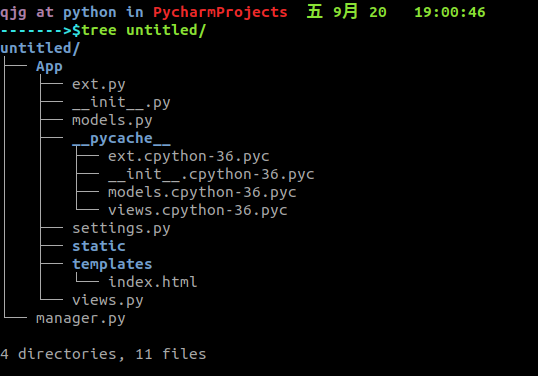

# flask-04

## 项目拆分

### 环境划分

- 开发环境：假数据
- 测试环境：用于测试的数据，数据量大
- 演示环境：类似线上环境，也叫作预生产环境
- 线上环境：也叫生产环境

### 规划项目结构

`manager.py`

- app的创建
- manager（flask-script管理对象）

`APP`

- `__init__.py`
  - 创建Flask对象
  - 加载setting文件
  - 调用init_ext方法
  - 调用init_blue方法
- setting
  - APP运行环境配置
  - 运行环境
- ext:扩展的，额外的
  - 用来初始化第三方的各种插件
  - Sqlalchemy对象初始化数据库
  - Session初始化
- views
  - 蓝图
  - 创建
  - 注册到app上
- models
  - 定义模型

项目文件目录树



manager.py

```python
from flask_script import Manager
from App import create_app
from App.views import blue

app = create_app()
manager = Manager(app=app)
app.register_blueprint(blueprint=blue)

if __name__ = '__main__':
	manager.run()
```

`__init__.py`

```python
from flask import Flask

def create_app():
    app = Flask(__name__)
    get_ext(app)
    return app
```

`ext.py`

```python
from flask import Session
def get_ext(app):
    app.config['SECRET_KEY'] = '110'
    app.config['SESSION_TYPE'] = 'reids'
    app.config['SESSION_KEY_PRIFIX'] = 'flask'
    
    Session(app=app)
    
   app.config.from_object('DevelopConfig')
    
    db.app_init(app=app)
```

`models.py`

```python
from flask_sqlalchemy import SQLAlchemy
db = SQLAlchemy()

class User(db.Model):
    id = db.Column(db.Integer, primary_key=True, autoincrement=True)
    name = db.Column(db.String(20))
```

`setting.py`

```python
def get_database_uri(DATABASE):
    dialect = DATABASE.get('dialect')
    driver = DATABASE.get('driver')
    username = DATABASE.get('username')
    password = DATABASE.get('password')
    host = DATABASE.get('host')
    port = DATABASE.get('port')
    database = DATABASE.get('database')
    
    return '{}+{}://{}:{}@{}:{}/{}'.format(dialect, driver, username, password, host, port, database)
    
class Config():
    app.config['SQLALCHEMY_TRACK_MODIFICATIONS'] = False
    
class DevelopConfig(Config):
    DATABASE = {
        'dialect' = 'mysql',
        'driver' = 'pymysql',
        'username' = 'root',
        'password' = 'abc123',
        'host' = 'localhost',
        'port' = '3306',
        'database' = 'flaskday04'
    }
    
    SQLALCHEMY_DATABASE_URI = get_database_uri(DATABASE)
    

class TestConfig(Config):
    DATABASE = {
        'dialect' = 'mysql',
        'driver' = 'pymysql',
        'username' = 'root',
        'password' = 'abc123',
        'host' = 'localhost',
        'port' = '3306',
        'database' = 'flaskday04'
    }
    
    SQLALCHEMY_DATABASE_URI = get_database_uri(DATABASE)
    
   
class ShowConfig(Config):
    DATABASE = {
        'dialect' = 'mysql',
        'driver' = 'pymysql',
        'username' = 'root',
        'password' = 'abc123',
        'host' = 'localhost',
        'port' = '3306',
        'database' = 'flaskday04'
    }
    
    SQLALCHEMY_DATABASE_URI = get_database_uri(DATABASE)
    
    
class ProductConfig(Config):
    DATABASE = {
        'dialect' = 'mysql',
        'driver' = 'pymysql',
        'username' = 'root',
        'password' = 'abc123',
        'host' = 'localhost',
        'port' = '3306',
        'database' = 'flaskday04'
    }
    
    SQLALCHEMY_DATABASE_URI = get_database_uri(DATABASE)
    
    
ENV_NAME = {
    'develop':'DevelopConfig',
    'test':'TestConfig',
    'show':'ShowCOnfig',
    'product':'ProductConfig'
}
```

`views.py`

```python
from falsk import Blueprint
from App.models import db
blue = Blueprint('first', __name__)

@blue.route('/')
def index():
    return 'index'

@blue.addTable('/addTable/')
def addTable():
    db.create_all()
    return '创建完成'

```

## 模型迁移

将models中的模型迁移成数据库中的表

步骤：

1. 下载：`pip install falsk_migrate`

2. 在ext文件中初始化：

   ```python
   migrate = Migrate()
   migrate.init_app(app=app, db=db)
   ```

3. 在managet文件中

   ```python
   manager.add_command('db', MigrateCommand)
   ```

4. 命令行操作

   1. 初始化：python manager.py db init
   2. 生成migrations目录：python manager.py db migrate
   3. 升级，也就是生成表格：python manager.py db upgrade
   4. 降级，也就是删除表格：python manager.py db downgrade
   5. 创建用户文件：`python manager.py db migrate --message '创建用户'`

注意：

1. 如果之前没有migrations文件夹 那么必须先init，如果有这个文件夹就不需要init了
2. 在升级和降级时出现错误，是底层错误，在init初始化的时候，整个数据库中最好应该是空的

## DML

数据语言分类：

- DDL：数据定义语言
  - 针对表的操作  create alter drop
- DML：数据操纵语言
  - 针对数据的操作 insert delete update
- DQL：数据查询语言 select
- TCL：事务 commit rollback

### 增

- 创建单个对象

```python
@blue.route('/addStudent/')
def addStudent():
    s = Student()
    s.name = 'zs'
    s.age = 18

    db.session.add(s)
    db.session.commit()

    return '添加成功'
```

- 创建多个对象

```python
# 增加多条数据
@blue.route('/addStudentList/')
def addStudentList():
    student_list = []

    for i in range(5):
        s = Student()
        s.name = 'xm%d' % i
        s.age = i

        student_list.append(s)

    db.session.add_all(student_list)
    db.session.commit()
    return '添加成功'

```

### 删除

```python
# 删除，基于查询的基础上
@blue.route('/deleteStudent/')
def deleteStudent():
    s = Student.query.first()

    db.session.delete(s)
    db.session.commit()

    return '删除成功'
```

### 修改

注意flask中修改不是update，而是add

```python
# 修改
@blue.route('/updateStudent/')
def updateStudent():
    s = Student.query.first()
    s.name = 'ls'

    db.session.add(s)
    db.session.commit()
    return '修改成功'
```

### 查询

- 获取单个数据

```python
# 获取单个数据
@blue.route('/getOne/')
def getOne():
    # 注意只有first,没有last，得到的是一个对象类型
    s = Student.query.first()
    print(s.name, s.age)

    s1 = Student.query.get(2)
    print(type(s1))
    print(s1.name, s1.age)

    return '查询成功'
```

- 获取结果集
  - 返回的数据类型：
    - all：方法返回一个对象列表
    - filter_by:返回一个BaseQuery对象
    - filter：返回一个BaseQuery对象
  - filter和filter_by的区别
    - 对主键字段的操作：条件判断时，filter_by用`字段名=值`，filter用`字段名==值`
    - 对非主键字段的操作：条件判断时，filter_by用`字段名=值`，filter用`对象名.字段名==值`
- 条件查询
  - 支持魔法方法：`__gt__()、__lt__()`等
  - 支持数学符号：`>、<、=`
  - `startwith()`：以什么开头
  - `endwith()`：以什么结尾
  - `contains()`：包含什么
  - `in_`：在指定数据内，一个列表的形式

```python
# 获取结果集
@blue.route('/getResult/')
def getResult():
    # all方法返回的是列表
    # student_list = Student.query.all()
    #
    # for student in student_list:
    #     print(student.name, student.name)

    # filter_by 返回值类型是BaseQuery
    # tornado =====> Query
    # django =====> QuerySet

    # filter_by和filter返回的是BaseQuery
    # filter和filter_by对主键字段的操作
    # student_list = Student.query.filter_by(id=2)
    # print(type(student_list))
    # student_list = Student.query.filter(id == 2)
    # print(type(student_list))

    # filter和filter_by对非主键字段的操作
    # student_list = Student.query.filter_by(age=2)
    # print(type(student_list))
    # student_list = Student.query.filter(Student.age == 2)
    # print(type(student_list))

    # 条件查询
    # student_list = Student.query.filter(Student.age.__gt__(2))
    # student_list = Student.query.filter(Student.age.__lt__(2))
    # student_list = Student.query.filter(Student.age > 2)
    # student_list = Student.query.filter(Student.name.startswith('x'))
    # student_list = Student.query.filter(Student.name.endswith('s'))
    # student_list = Student.query.filter(Student.name.contains('x'))
    student_list = Student.query.filter(Student.age.in_([1, 2]))
    print(type(student_list))
    for student in student_list:
        print(student.name, student.age)

    return '查询成功'
```

- 排序

  order_by()：默认升序排序

  order_by(db.desc())：降序排序

  ```python
  student_list = Student.query.order_by('age')
  # student_list = Student.query.order_by(db.desc('age'))
  	for student in student_list:
  	print(student.name, student.age)
  ```

  

- limit

  取前面指定个数的数据

  ```python
  student_list = Student.query.limit(3)
  for student in student_list:
  	print(student.name, student.age)
  
  ```

  

- offset

  跳过前面指定的数据

  ```python
  student_list = Student.query.offset(3)
  for student in student_list:
       print(student.name, student.age)
  ```

  

总结：当limit和offset同时使用时，无论谁在前面，都是先执行offset

```python
 # student_list = Student.query.offset(3).limit(2)
student_list = Student.query.limit(3).offset(2)
for student in student_list:
    print(student.name, student.age)
```


当三者同时使用时，无论语法还是执行顺序，都是order_by最先

```python
 # 先排序再取值
student_list = Student.query.order_by('age').limit(3).offset(2)
for student in student_list:
	print(student.name, student.age)
```

- 分页

```python
    # 分页
    # page 第几页 page_per/pagesize 一页几条数据
    @blue.route('/getPage/')
    def getPage():
        page = request.args.get('page')
        page_per = request.args.get('page_per')
		
        student_list = Student.query.limit(page).offset((page_per-1)*page)
```


