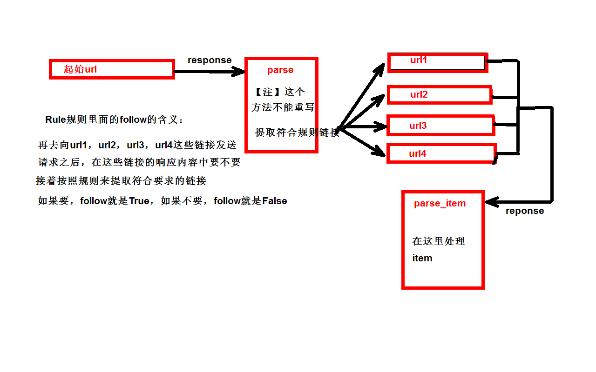

# Spider-06

## yield

+ 带有yield的函数不是一个普通的函数，而是一个生成器generator,可用于迭代
+ yield是一个类似return的关键字，迭代一次遇到yield后面的值。重点是：下一次迭代时，从上一次迭代遇到的yield后面的代码开始执行
+ 简单理解：yield就是return返回一个值，并且记住这个返回值的位置，下次迭代就从这个位置后的下一行开始

```python
# 生成器就是一个普通的函数，只不过把return换成了yield
def my_generator(n):
    current = 0
    # if current < n:
    while current < n:
        yield current
        current += 1


gen = my_generator(5)

# print(next(gen))
# print(next(gen))
# print(next(gen))

for g in gen:
    print(g)
```

```python
# -*- coding: utf-8 -*-
import scrapy

from ..items import DianyingItem


class MovieSpider(scrapy.Spider):
    name = 'movie'
    allowed_domains = ['www.dytt8.net']
    start_urls = ['https://www.dytt8.net']

    def parse(self, response):
        a_list = response.xpath('/html/body/div[1]/div/div[3]/div[2]/div[2]/div[1]/div/div[2]/div[2]//a[2]')

        for a in a_list:
            href = a.xpath('./@href').extract_first()
            alt = a.xpath('./text()').extract_first()

            url = 'https://www.dytt8.net' + href

            yield scrapy.Request(url=url, callback=self.parse1, meta={'alt': alt})

    def parse1(self, response):
        alt = response.meta['alt']
        img = response.xpath('//div[@id="Zoom"]//p/img[1]')
        src = img.xpath('./@src').extract_first()

        movie = DianyingItem(src=src, alt=alt)

        yield movie
```

## pymysql的使用步骤

```python
class ReadMysqlPipeline(object):

    def open_spider(self, spider):
        self.conn = self.getconn()

        self.cursor = self.conn.cursor()

    def getconn(self):
        # pymysql.connect(host=DB_HOST)
        setting = get_project_settings()
        conn = pymysql.Connect(host=setting['DB_HOST'],
                               user=setting['DB_USER'],
                               password=setting['DB_PASSWORD'],
                               database=setting['DB_DATABASE'],
                               port=setting['DB_PORT'],
                               charset=setting['DB_CHARSET'])

        return conn

    def process_item(self, item, spider):
        sql = 'insert into book(name, src) values ("{}", "{}")'.format(item['alt'], item['src'])
        self.cursor.execute(sql)

        return item

    def close_spider(self, spider):
        self.conn.commit()
        self.cursor.close()
        self.conn.close()
```

## 日志信息和日志等级

1）日志级别：

+ CRITICAL：严重错误

+ ERROR：一般错误

+ WARNING：警告

+ INFO: 一般信息

+ DEBUG：调试信息

  默认的日志等级是DEBUG，只要出现了DEBUG或者DEBUG以上等级的日志，那么这些日志将会打印   

2）settings.py文件设置：
		   默认的级别为DEBUG，会显示上面所有的信息
           在配置文件中  settings.py
           LOG_FILE  : 将屏幕显示的信息全部记录到文件中，屏幕不再显示，注意文件后缀一定是.log
           LOG_LEVEL : 设置日志显示的等级，就是显示哪些，不显示哪些

```python
# LOG_LEVEL = 'ERROR'    # 设置日志等级为error

LOG_FILE = 'spiders.log'  #将日志输入到日文件中
```


## CrawlSpider

CrawlSpider可以定义规则，再解析html内容的时候，可以根据链接规则提取出指定的

链接，然后再向这些链接发送请求，所以，如果有需要跟进链接的需求，意思就是爬取

了网页之后，需要提取链接再次爬取，使用CrawlSpider是非常合适的

提取链接：链接提取器，在这里就可以写规则提取指定链接

scrapy.linkextractors.LinkExtractor(
	 allow = (),           # 正则表达式  提取符合正则的链接
	 deny = (),            # (不用)正则表达式  不提取符合正则的链接
	 allow_domains = (),   # （不用）允许的域名
	 deny_domains = (),    # （不用）不允许的域名
	 restrict_xpaths = (), # xpath，提取符合xpath规则的链接
	 restrict_css = ()     # 提取符合选择器规则的链接)

模拟使用

正则用法：links1 = LinkExtractor(allow=r'list_23_\d+\.html')

xpath用法：links2 = LinkExtractor(restrict_xpaths=r'//div[@class="x"]')

css用法：links3 = LinkExtractor(restrict_css='.x')

提取连接：link.extract_links(response)

注意事项：callback只能写函数名字符串，callback='parse_item'

在基本的Spider中，如果重新发送请求，那里的callback写的是callback=self.parse.parse_item

follow=true 是否跟进 就是按照提取连接规则进行提取

案例读书网

readbook.py

```python
# -*- coding: utf-8 -*-
import scrapy
from scrapy.linkextractors import LinkExtractor
from scrapy.spiders import CrawlSpider, Rule

from ..items import ReadItem


class ReadbookSpider(CrawlSpider):
    name = 'readbook'
    allowed_domains = ['www.dushu.com']
    start_urls = ['https://www.dushu.com/book/1107_1.html']

    # 会提取当前页符合规则的链接
    rules = (
        Rule(LinkExtractor(allow=r'/book/1107_\d+.html'), callback='parse_item', follow=True),
    )

    def parse_item(self, response):
        print('======================')
        print(response.text)
        img_list = response.xpath('//div[@class="bookslist"]//img')
        for img in img_list:
            src = img.xpath('./@data-original').extract_first()
            alt = img.xpath('./@alt').extract_first()

            book = ReadItem(src=src, alt=alt)

            yield book
```

pipelines.py

```python
# -*- coding: utf-8 -*-

# Define your item pipelines here
#
# Don't forget to add your pipeline to the ITEM_PIPELINES setting
# See: https://docs.scrapy.org/en/latest/topics/item-pipeline.html
import pymysql

from scrapy.utils.project import get_project_settings


class ReadPipeline(object):
    def open_spider(self, spider):
        self.fp = open('book.json', 'w', encoding='utf-8')

    def process_item(self, item, spider):
        self.fp.write(str(item))
        return item

    def close_spider(self, spider):
        self.fp.close()


class ReadMysqlPipeline(object):

    def open_spider(self, spider):
        self.conn = self.getconn()

        self.cursor = self.conn.cursor()

    def getconn(self):
        # pymysql.connect(host=DB_HOST)
        setting = get_project_settings()
        conn = pymysql.Connect(host=setting['DB_HOST'],
                               user=setting['DB_USER'],
                               password=setting['DB_PASSWORD'],
                               database=setting['DB_DATABASE'],
                               port=setting['DB_PORT'],
                               charset=setting['DB_CHARSET'])

        return conn

    def process_item(self, item, spider):
        sql = 'insert into book(name, src) values ("{}", "{}")'.format(item['alt'], item['src'])
        self.cursor.execute(sql)

        return item

    def close_spider(self, spider):
        self.conn.commit()
        self.cursor.close()
        self.conn.close()

```

## Request和response总结

request是一个类

get请求：

​	scrapy.Request(url=url, callback=self.parse_item, meta={'item':item}, hreders=headers)

url：请求地址

callback：响应成功后的回调函数，注意没有()

meta：参数传递，接收语法：item=response.meta['item']

headers：定制头信息，一般不需要

注意：parse方法中的response参数就是url执行之后的请求结果

parse_item方法中的response参数就是url执行之后的请求结构

response是一个对象 函数的第二个参数

response.text：字符串格式的文本

response.content:二进制格式的文本

response.body:二进制格式的文本

response.url：当前响应的url地址

response.status：当前的响应状态码

response.xpath()：筛选你想要的内容

response.css():筛选你想要的内容


## scarpy的post请求

重写start_requests方法：

def start_requests(self)

start_requests的返回值

​	scrapy.FormRequest(url=url, headers=headers, callback=self.parse_item, formdata=data)

+ url:     要发送的post地址
+  headers：可以定制头信息
+ callback:回调函数   
+ formdata:post所携带的数据，这是一个字典

```python
# -*- coding: utf-8 -*-
import scrapy
import json


class BdfySpider(scrapy.Spider):
    name = 'bdfy'
    allowed_domains = ['https://fanyi.baidu.com/sug']
    # start_urls = ['https://fanyi.baidu.com/sug/']

    # def parse(self, response):
    #     pass

    def start_requests(self):
        url = 'https://fanyi.baidu.com/sug'

        data = {
            'kw': 'preserve',
        }

        yield scrapy.FormRequest(url=url, formdata=data, callback=self.parse_second)


    def parse_second(self, response):
        content = response.text

        obj = json.loads(content)
        s = json.dumps(obj, ensure_ascii=False)
        print(s)
```

## cookie登录

```python
# -*- coding: utf-8 -*-
import scrapy


class WbSpider(scrapy.Spider):
    name = 'wb'
    allowed_domains = ['weibo.cn']

    def start_requests(self):
        print('1111111111')
        url = 'https://passport.weibo.cn/sso/login'
        headers={
            'Accept': '*/*',
            # 'Accept-Encoding': 'gzip, deflate, br',
            'Accept-Language': 'zh-CN,zh;q=0.9',
            'Connection': 'keep-alive',
            # 'Content-Length': '216',
            'Content-Type': 'application/x-www-form-urlencoded',
            'Cookie': 'SCF=Ahi2Sm3XHpcYIJvIsbJd8AnqkyO8t5RFmHXn8yHeTOMYgumvEqFGsgNbZbD6BmzlV7GA-B8sNWcbTcHeVmF3eNc.; _T_WM=1f1272ae0786a2a2ef34c961901b618b; SUHB=0rrLDdNlZe5bVf; login=d434df472bb5ab59af1d4577b2b5d916',
            'Host': 'passport.weibo.cn',
            'Origin': 'https://passport.weibo.cn',
            'Referer': 'https://passport.weibo.cn/signin/login?entry=mweibo&r=https%3A%2F%2Fweibo.cn%2F&backTitle=%CE%A2%B2%A9&vt=',
            'Sec-Fetch-Mode': 'cors',
            'Sec-Fetch-Site': 'same-origin',
            'User-Agent': 'Mozilla/5.0 (Windows NT 10.0; Win64; x64) AppleWebKit/537.36 (KHTML, like Gecko) Chrome/78.0.3904.70 Safari/537.36',
        }
        data={
            'username': '18326972207',
            'password': 'action1234',
            'savestate': '1',
            'r': 'https://weibo.cn/',
            'ec': '0',
            'pagerefer': 'https://weibo.cn/pub/?vt=',
            'entry': 'mweibo',
            'wentry': '',
            'loginfrom': '',
            'client_id': '',
            'code': '',
            'qq': '',
            'mainpageflag': '1',
            'hff': '',
            'hfp': '',
        }
        yield scrapy.FormRequest(url=url,formdata=data,headers=headers,callback=self.parse_second)

    def parse_second(self,response):
        url = 'https://weibo.cn/6451491586/info'

        yield scrapy.Request(url=url,callback=self.parse_third)

    def parse_third(self,response):
        content = response.text
        with open('wb.html','w',encoding='utf-8')as fp:
            fp.write(content)

```

## 分布式爬虫

scrapy和scrapy_redis的区别

（1）scrapy是一个通用的爬虫框架，但是这个框架不支持分布式

（2）scrapy_redis就是为了实现scrapy的分布式而诞生的，它提供了一些基于redis的组件
	（https://www.cnblogs.com/nick477931661/p/9135497.html）

分布式爬虫的步骤：

setting的基本配置

（1）继承了RedisSpider

（2）from scrapy_redis.spiders import RedisSpider

（3）添加一个redis_key = 'myspider:start_urls'

（4）注意官网提供的init方法不好用，所以还需要我们自己手动
				添加allowed_domains
（5）在settings中添加
                指纹去重

​				DUPEFILTER_CLASS = "scrapy_redis.dupefilter.RFPDupeFilter"

​				调度器组件

​				SCHEDULER = "scrapy_redis.scheduler.Scheduler"

​				在爬取的过程中允许暂停

​				SCHEDULER_PERSIST = True

​				指定连接的数据库 如果本地连接就不需要写了

​				REDIS_HOST = '10.11.52.62' master端的主机地址

​				REDIS_PORT = 6379
（6）在settings的管道中添加
​            'scrapy_redis.pipelines.RedisPipeline': 400， 会将数据添加到redis数据库中

（7）DOWNLOAD_DELAY = 1 素质 道德高度【注】在爬取网站的时候，将这个选项打开，给对方一条活路

（8）slave端执行scrapy runspider mycrawler_redis.py

（9）master端向队列中添加起始url

​				这个key就是你代码中写的  redis_key
​		        lpush fen:start_urls 'http://www.dytt8.net/html/gndy/dyzz/index.html'

## 多台电脑部署分布式

```
现在有4台电脑：windows   centos  ubuntu   macos
windows上面安装的是redis服务器，master端
	centos、ubuntu、macos都从redis上面获取请求，或者将请求添加到redis服务器中，   slave端
	slave端首先启动，页面就会停止在那里等待指令
	这个时候master通过lpush向队列中添加一个起始url，其中一个slave端获取到这个url开始爬取，这个slave端会将解析之后的很多url再次的添加到redis服务中，然后redis服务再从请求队列中向每个slave端分发请求，最终直到所有请求爬取完毕为止
```

```txt
分布式settings基本配置：
             （1）使用的是scrapy_redis的去重类
              	  DUPEFILTER_CLASS = "scrapy_redis.dupefilter.RFPDupeFilter"
             （2）调度器使用是scrapy_redis的调度器
              	  SCHEDULER = "scrapy_redis.scheduler.Scheduler"
             （3）爬取的过程中是否允许暂停
                  SCHEDULER_PERSIST = True
             （4）配置存储的redis服务器
                  REDIS_HOST = '10.11.52.62'
                  REDIS_PORT = 6379
                  ITEM_PIPELINES = {
                     'scrapy_redis.pipelines.RedisPipeline': 400,
                  }
```

```
:
    name = 'movie_ScrapyRedis'
    allowed_domains = ['www.ygdy8.net']
    # start_urls = ['http://www.ygdy8.net/']
    redis_key = 'movie:start_urls'

    def parse(self, response):
        a_list = response.xpath('//div[@class="co_content8"]//b/a')
        for a in a_list:
            name = a.xpath('./text()').extract_first()
            href = a.xpath('./@href').extract_first()
            url = 'https://www.ygdy8.net' + href
            yield scrapy.Request(url=url, callback=self.parse_second, meta={'name': name})

    def parse_second(self, response):
        name = response.meta['name']
        src = response.xpath('//div[@id="Zoom"]//img[1]/@src').extract_first()
        movie = MovieItem(name=name, src=src)
        yield movie
```

进行链接提取

```python
# -*- coding: utf-8 -*-
import scrapy
from scrapy.linkextractors import LinkExtractor
from scrapy.spiders import Rule

from movie.items import MovieItem
from scrapy_redis.spiders import RedisSpider


class MovieCrawlredisSpider(RedisCrawlSpider):
    name = 'movie_crawlRedis'
    allowed_domains = ['www.ygdy8.net']
    redis_key = 'crawl1:start_urls'

    rules = (
        Rule(LinkExtractor(allow=r'list_23_\d+.html'), callback='parse', follow=True),
    )


    def parse(self, response):
        print('=====================================')
        print(response.text)
        a_list = response.xpath('//div[@class="co_content8"]//b/a')
        for a in a_list:
            name = a.xpath('./text()').extract_first()
            href = a.xpath('./@href').extract_first()
            url = 'https://www.ygdy8.net' + href
            yield scrapy.Request(url=url, callback=self.parse_second, meta={'name': name})

    def parse_second(self, response):
        name = response.meta['name']
        src = response.xpath('//div[@id="Zoom"]//img[1]/@src').extract_first()
        movie = MovieItem(name=name, src=src)
        yield movie
```

