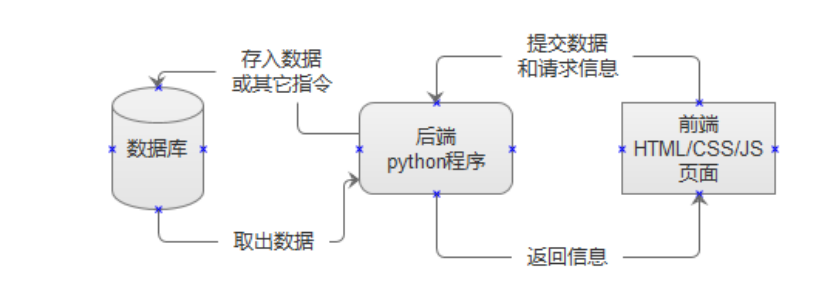

# HTTP 和Tornado入门

- 构建在长链接的的基础上的短连接协议

TCP 协议

* 建立连接：三次握手

* 断开连接：四次挥手

* 可靠

* 长连接

## 一、HTTP 服务器

HTTP 协议是建立在 TCP 协议之上的短连接协议。
它利用了 TCP 协议的可靠性,用来传输超文本 (HTML),通信一次连接一次,通信完成后 TCP 连接关
闭。
所以如果想创建一个 HTTP Server 需要通过 Socket 搭建一个服务端程序。

```tex
步骤：
1.导入socket模块
	import socket
2.创建socket对象
	sock = socket.socket(socket.AF_INET, socket.SOCK_STREAM)
3.绑定服务器地址
	sock.bind('0.0.0.0',8000)
4.设置监听队列
	sock.listen(100)
5.定义'响应报文'
    html = b'''
    HTTP/1.1 200 OK

    <html>
        <head>
            <title>home</title>
        </head>
        <body>
            Hello world
        </body>
    </html>
    '''
6.等待接受客户端连接
	cli_sock, cli_addr = sock.accept()
    # 第一个返回值是客户端的 socket 对象
    # 第二个返回值是客户端的地址
7.接收客户端传来的数据
	cli_data = cli_sock.recv(1024)
8.向客户端发送请求
	cli_sock.sendall(html)
9.断开与客户端的连接
	cli_sock.close()
```

### 简单的HTTP服务器

```shell
#!/usr/bin/env python

import socket
import time


# 创建 socket 对象
sock = socket.socket(socket.AF_INET, socket.SOCK_STREAM)  
 # 为 sock 打开地址可重用选项，防止出现端口号被占用的情况
sock.setsockopt(socket.SOL_SOCKET, socket.SO_REUSEADDR, 1) 

# 设置绑定的ip地址和端口号，如果不设置ip地址则默认为127.0.0.1
addr = ('127.0.0.1', 8000)
 # 绑定服务器地址
sock.bind(addr)  
# 设置监听队列
sock.listen(100)  

# 定义 "响应报文"
template = '''
# 响应头第一行，成功响应参数
HTTP/1.1 200 OK

<html>
    <head>
        <title>home</title>
    </head>
    <body>%s</body>
</html>
'''


def get_url(request_str):
    '''从 "请求报文" 中获取请求的 URL'''
    first_line = request_str.split('\n')[0]  # 取出第一行
    url = first_line.split(' ')[1]  # 按空格切分，取出中间的 URL
    return url


while True:

    # 等待接受客户端连接
    # 第一个返回值是客户端的 socket 对象
    # 第二个返回值是客户端的地址
    cli_sock, cli_addr = sock.accept()
    print('接收到来自客户端 %s:%s 的连接' % cli_addr)

    # 接收客户端传来的数据，1024是接收缓冲区的大小
    cli_request = cli_sock.recv(1024).decode('utf8')
    print('接收到客户端发来的 "请求报文": \n%s' % cli_request)

    # 获取用户的 URL
    url = get_url(cli_request)

    # 根据 URL 生成不同的返回值
    if url == '/login':
        response = template % '这是登录界面'
    elif url == '/index':
        response = template % '这是主界面'
    else:
        response = template % 'hello world'

    print(url, response)
    cli_sock.sendall(response.encode('utf8'))  # 向客户端发送数据

    # 断开与客户端的连接
    cli_sock.close()
    print('连接断开, 退出！')

```


```html
'<form action="/test/post" method="post">'
    '姓名:<input type="text" name="name">'
    '<br/>'
    '城市:<input type="text" name="city">'
    '<input type='submit'>'
'</form>'
```

## Web 框架概述

随着技术的发展,我们每天的要处理的信息量都在爆炸新的增加。传统的静态页面技术早已跟不上时代
需求,因而催生了动态页面技术。
所谓动态页面,即所有的页面用程序来生成,以细节实现上的不同,又可分为“前端动态页面”和“后端动态页面”。

 Web 前端阶段所学 Ajax、VUE 等技术,就是前端动态页面。而今后我们所学的主要是后端动态页面技术,甚至是两者结合使用。

### Web服务器原理



### 常见的 Web 框架

如果想完成更复杂的功能,还需要深入开发很多东西,比如模版系统、ORM系统、路由系统、会话机制。

| 框架          | **描述**                                                     |
| ------------- | ------------------------------------------------------------ |
| **`Django`**  | 全能型框架，大而全，插件丰富，文档丰富，社区活跃, 适合快速开发, 内部耦合比较紧 |
| **`Flask`**   | 微型框架, 适合新手学习, 极其灵活, 便于二次开发和扩展, 生态环境好, 插件丰富 |
| **`Tornado`** | 异步处理, 事件驱动 (`epoll`), 性能优异                       |
| `Bottle`      | 单文件框架, 结构紧凑,适合初学者阅读源码,了解 Web 原理        |
| `web.py`      | 代码优美, 且适合学习源码                                     |
| `Falcon`      | 性能优异适合写 `API` 接口                                    |
| `Quixote`     | 一个爷爷级别的框架,著名的豆瓣网用的便是这个                  |
| `Sanic`       | 后起之秀,性能秒杀以上所有前辈,但没有前辈们稳定。             |

### 高内聚与低耦合

+ 内聚：每个模块尽可能独立完成自己的功能，不依赖于模块外部的代码。
+ 耦合：模块与模块之间接口的复杂程度，模块之间联系越复杂耦合度越高，牵一发而动全身。

目的：使得模块的“可重用性”、“移植性”大大增强，通常程序结构中各模块的内聚程度越高，模块间的耦合程度就越低

+ 『函数』
  高内聚：尽可能类的每个成员方法只完成一件事（最大限度的聚合）
  低耦合：减少类内部，一个成员方法调用另一个成员方法
+ 『类』
  高内聚低耦合：减少类内部，对其他类的调用
+ 『功能块』
  高内聚低耦合：减少模块之间的交互复杂度（接口数量，参数数据）

横向：类与类之间、模块与模块之间
纵向：层次之间尽可能，内容内聚，数据耦合

### 多路复用

多路复用是指使用一个线程来检查多个文件描述符（Socket）的就绪状态，比如调用select和poll函数，传入多个文件描述符，如果有一个文件描述符就绪，则返回，否则阻塞直到超时。得到就绪状态后进行真正的操作可以在同一个线程里执行，也可以启动线程执行（比如使用线程池）。
三种实现：`select` | `poll` | `epoll`

## Tornado入门

Tornado 最大大的特点就是他实现了了一一个 “异步非非阻塞” 的 HTTP Server,性能非非常优异。

### 安装

使用pip进行模块安装

```shell
pip install tornado
```

### `helloword`实例

```python
import tornado.ioloop
import tornado.web

class MainHandler(tornado.web.RequestHandler):
    def get(self):
        self.write('Hello,World')
def make_app():
    return tornado.web.Application([
        (r"/",MainHandler),
    ])

if __name__ == "__main__":
    app = make_app()
    app.listen(8000)
    tornado.ioloop.IOLoop.current().start()
```

### 启动参数

```python
from tornado.option import parse_command_line,define,options

# 设置启动时可传入的IP地址和端口号，default：如果没有传入则使用默认值
define("host",default='0.0.0.0',help="主机地址",type=str)
define("port",default=8888,help="主机端口"，type=int)
parse_command_line()

print('传入的主机：%s' % options.host)
print('传入的端口：%s' % options.post)
```

传入参数：

```bash
python demo.py --host=127.0.0.1 --port=8000
```

### 路由处理

通过不同的url路径访问不同的网页

```python
import tornado.ioloop
from tornado.web import RequestHandler, Application

class MainHandler(tornado.web.RequestHandler):
    def get(self):
        self.write("欢迎进入主页面")

class LoginHandler(tornado .web.RequestHandler):
    def get(self):
        self.write("欢迎进入登录界面")
 # 针对不同的请求，给出不同的响应
app = Application([
    (r'/',MainHandler),
    (r'/Login/',LoginHandler)
])

app.listen(8000)
tornado.ioloop.IOLoop.curren().start()
```

### 5.处理GET和POST请求

```python
class TestPostHandler(tornado.web.RequestHandler):
    def get(self):
        html = '''
			<form action="/test/post" method="POST">
            姓名: <input type="text" name="name">
            <br />
            城市: <input type="text" name="city">
            <br />
            <input type="submit">
            </form>
        '''
        self.write(html)
    def post(self):
        name = self.get_argument('name')
        city = self.get_argument('city')
        self.write('%s 生活在 %s'%(name,city))
        
app = listen(8000)
tornado.ioloop.IOLoop.current().start()
```

get请求通过URL获取参数，用户输入url格式为：`127.0.0.1:8000?id=7&name=张三`

post请求获取参数，一般是在页面通过表单标签，让用户输入内容，获取数据

### HTTP的请求方法：

| Method  | Description                                                  |
| ------- | ------------------------------------------------------------ |
| POST    | 向指定资源提交数据进行处理请求，数据被包含在请求体中         |
| GET     | 请求指定的页面信息，并返回实体主体                           |
| PUT     | 从客户端向服务器传送的数据取代指定的文档的内容               |
| DELETE  | 请求服务器删除指定的页面                                     |
| HEAD    | 类似于GET请求，只不过返回的响应中没有具体的内容，用于获取报头 |
| PATCH   | 是对PUT方法的补充，用来对资源进行局部更新。                  |
| OPTIONS | 允许客户端查看服务器的性能。                                 |

### URL链接分析

URL全球统一资源定位符

`http://127.0.0.1:8080/index.html?id=9&name=zhangsan#`

第一部分：所用协议，可以为`https/ftp/sockets/redis/mysql` :

第二部分：IP地址(主机名)或域名、端口号和绝对路径，
第三部分：query string(查询字符串)，以?开头，不同参数之间用&间隔

第四部分：为锚点，#代表网页中的一个位置。其右面的字符，就是该位置的标识符。比如，`http://www.example.com/index.html#print`就代表网页`index.html`的print位置。浏览器读取这个URL后，会自动将print位置滚动至可视区域

？的作用：

+ 连接作用

+ 清除缓存

  ```
  http://www.xxxxx.com/index.html 
  http://www.xxxxx.com/index.html?test123123
  ```

  两个`url`打开的页面一样，但是后面这个有问号，说明不调用缓存的内容，而认为是一个新地址，重新读取。

http方法的定义有两点：safe and Idempotent，即安全性和幂等性POST/DELETE/PUT/GET/PATCH/OPTION/HEAD

### 常见的局域网地址

**`A类`：**10.0.0.0 - 10.255.255.255

**`B类`：**172.16.0.0 - 172.31.255.255 

**`C类`：**192.168.0.0 - 192.168.255.255 

### demo.py

```python
#!/usr/bin/env python

import tornado.ioloop
import tornado.web
from tornado.options import parse_command_line, define, options

define("host", default='localhost', help="主机地址", type=str)
define("port", default=8000, help="主机端口", type=int)


class MainHandler(tornado.web.RequestHandler):
    def get(self):
        self.write("Hello, world")


class LoginHandler(tornado.web.RequestHandler):
    def get(self):
        self.write("欢迎来到界面")


class RegisterHandler(tornado.web.RequestHandler):
    def get(self):
        self.write("欢迎来到注册界面")


class TestGetHandler(tornado.web.RequestHandler):
    def get(self):
        # 接收 URL 中的参数
        name = self.get_argument('name')
        self.write("%s但求一醉" % name)

html = '''
<form action="/test/post" method="POST"> 
姓名: <input type="text" name="name">
<br>
城市: <input type="text" name="city">
<input type="submit">
</form>
'''

class TestPostHandler(tornado.web.RequestHandler):
    def get(self):
        
        self.write(html)

    def post(self):
        name = self.get_argument('name')
        city = self.get_argument('city')

        self.write('%s 生活在 %s' % (name, city))


def make_app():
    return tornado.web.Application([
        (r"/", MainHandler),
        (r"/login", LoginHandler),
        (r"/register", RegisterHandler),
        (r"/test/get", TestGetHandler),
        (r"/test/post", TestPostHandler),
    ])


if __name__ == "__main__":
    parse_command_line()

    app = make_app()
    print('server running on %s:%s' % (options.host, options.port))
    app.listen(options.port, options.host)

    loop = tornado.ioloop.IOLoop.current()
    loop.start()

```

练习

```python
import tornado.ioloop
import tornado.web
from tornado.options import parse_command_line, define, options

import pymysql

db = pymysql.connect(host='localhost', user='root', password='abc123', db='qjg')

cur = db.cursor()

define("host", default='localhost', help="主机地址", type=str)
define("port", default=8000, help="主机端口", type=int)


class MainHandler(tornado.web.RequestHandler):
    def get(self):
        id = self.get_argument('id')
        sql = 'select * from stu where id=%s;'
        cur.execute(sql, (id,))
        result = str(cur.fetchone())
        self.write(result)


html = '''
<form action="/update" method='post'>
    输入您要修改的id:
    <input type="text" name="id">
    <br />
    new_name:
    <input type="text" name="name">
    <br />
    new_city:
    <input type="text" name="city">
    <br />
    new_description:
    <input type="text" name="desc">
    <br />
    <input type="submit">
</form>
'''


class UpdateHandler(tornado.web.RequestHandler):
    def get(self):
        self.write(html)

    def post(self):
        id = self.get_argument('id')
        name = self.get_argument('name')
        city = self.get_argument('city')
        desc = self.get_argument('desc')

        sql = 'update stu set name=%s,city=%s,description=%s where id=%s'
        cur.execute(sql, (name, city, desc, id))
        db.commit()
        self.write('修改之后的数据为：')
        sql2 = 'select * from stu where id=%s;'
        cur.execute(sql2, (id,))
        result = str(cur.fetchone())
        self.write(result)


def make_app():
    return tornado.web.Application([
        (r"/", MainHandler),
        (r'/update', UpdateHandler)
    ])


if __name__ == "__main__":
    parse_command_line()

    app = make_app()
    print('server running on %s:%s' % (options.host, options.port))
    app.listen(options.port, options.host)

    tornado.ioloop.IOLoop.instance().start()
```


