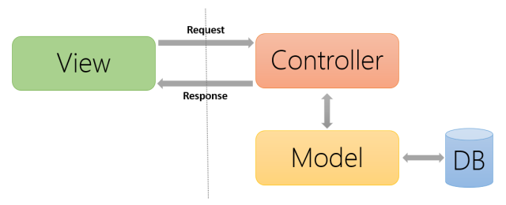
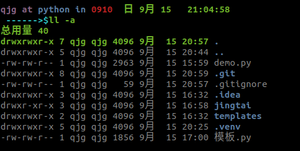
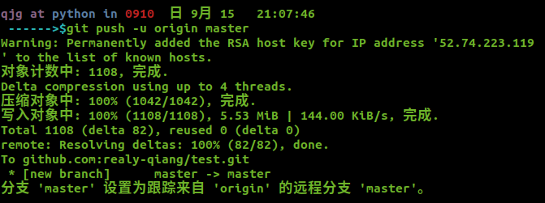
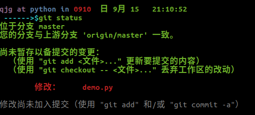
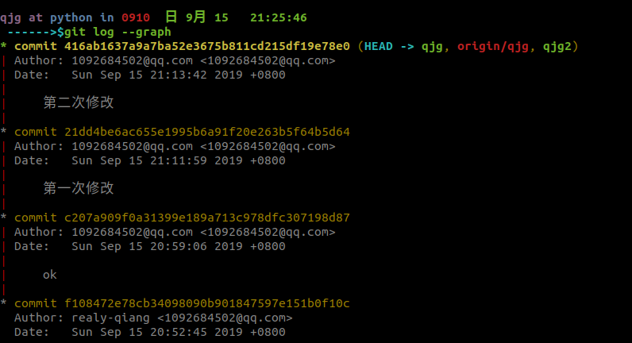
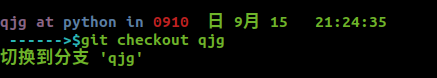
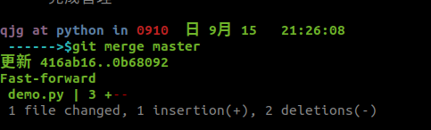

# 虚拟环境与git

## MVC网络框架

为了更好的开发我们的服务器, 我们需要对我们的程序进行一些规划。通常使用的一种方式便是 MVC 式的结构。


MVC模式(Model–view–controller)是软件工程中的一种软件架构模式, 把软件系统分为三个基本部分:

+ 模型 (Model), 它是程序需要操作的数据或信息。
+ 视图 (View), 它提供给用用户的操作界面面, 是程序的外壳。
+ 控制器 (Controller), 它负责根据用户从"视图层"输入的指令, 选取"数据层"中的数据, 然后对其进行相应的操作, 产生最终结果。

详细解释：

+ 模型层

  + 模型层表示你的应用程序中实现业务逻辑的部分。负责检索数据，并把它转换成对应用程序 有意义的概念。这包括处理，验证，关联或其他与处理数据有关的任务。

  + 初看起来，模型对象可看作是与你的应用程序可能会使用的数据库进行交互的第一层，但通常而言，他们是用来实现应用程序的主要概念。
  + 在一个社交网络中，模型层将会负责这样的任务，比如，保存用户数据，保存朋友关系，存 储和检索用户的照片，寻找新朋友的建议，等等。模型对象可以认为是“朋友”、“用户”、 “评论”或“相片”。

+ 视图层
  + 视图层将模型化的数据渲染为某种表现形式。它和模型对象是分开的，负责用它得到的信息 生成应用程序需要的任何表现界面。
    + 例如，在模型层返回一组数据之后，视图将使用这些数据来渲染一个包含这些数据的 HTML 页面，或一个 XML 格式的结果以供调用。
  + 视图层并非只限于 HTML 或文本格式的数据表现形式，它可以根据需要生成多种多样的格式， 比如视频、音乐、文档或其它任何你能想到的格式。

+ 控制器层
  + 控制器层处理来自用户的请求。它负责借助模型层和视图层，渲染生成响应。
  + 控制器可以被看作是一个管理者，负责将完成任务所需要的所有资源交给正确的执行者们。 它等待来自客户端的请求，根据验证或授权的规则检查其有效性，委派模型获取或处理数据， 并选择客户端能够接受的表现数据类型，最终把渲染过程委派给视图层。

这种模式的特点是构建简单, 层次清晰, 代码可复用性好, 模块之间耦合度低

对应到我们的服务器程序,简单来说,就是一些模块只负责前端页面显示,另一些模块只负责数据模型的定义和数据的操作,其他模块负责连接这两部分,并进行必要的逻辑处理理。
对应到程序细节，我们可以按照程序功能不不同,分为 3 个模块。

## 虚拟环境

当不同项目所需软件的版本不同时，为避免软件的版本之间相互冲突，我们要为不同的项目单独设置它运行所需的环境,这就需要借助虚拟环境管理。

### 安装

```bash
pip install virtualenv
```

### 创建虚拟环境

创建虚拟环境，虚拟环境可以创建到任何位置,但一般与项目文件夹放到一起

`cd ~/你的项目目文文件夹`

`virtualenv .venv`

```bash
qjg at python in ~  日 9月 15   20:32:48 
 ------>$cd ~/PycharmProjects/0910/
qjg at python in 0910  日 9月 15   20:33:00 
 ------>$virtualenv .venv
 Using base prefix '/usr'
New python executable in /home/qjg/PycharmProjects/0910/.venv/bin/python
Installing setuptools, pip, wheel...
done.
```

### 加载虚拟环境

激活虚拟环境

`source ~/项目目文文件夹/.venv/bin/activate`

```bash
qjg at python in 0910  日 9月 15   20:25:55 
 ------>$source ~/PycharmProjects/0910/.venv/bin/activate
(.venv) 
```

### 虚拟环境迁移

迁出：`pip freeze > requirement.txt`

迁入：`pip install -r requirement.txt`

### 退出虚拟环境

当开发完成后,可以退出当前虚拟环境

`deactivate`

```bash
qjg at python in 0910  日 9月 15   20:33:38 
 ------>$deactivate
```

## 版本控制工具与Git

### 版本控制工具的作用

+ 能够追踪全部代码的状态

+ 能够进行行行版本之间的差异对比比

+ 能够进行行行版本回滚

+ 能够协助多个开发者进行行行代码合并

### 常见的版本控制工具

+ `CVS`: 基本退出了了历史舞台
+ `svn`: 中心心化的版本控制工工具, 需要有一一台中心心服务器器
+ `git`: 分布式的版本控制工工具, 中心心服务器器不不再是必需的
+ `hg`: 纯 Python 开发的版本控制工工具
+ `Github`: 依托 Git 而而创建的一一个平台,有独立立的公司在运作。

备注:所有文文本类的东⻄西都可以交由版本控制工工具来管理理

### 使用流程

1. 配置自己的账号和邮箱

   `git config --global user.name '你的名字'
   git config --global user.email '你的邮箱'`

   ```bash
   qjg at python in 0910  日 9月 15   20:41:28 
    ------>$git config --global user.name 'realy-qiang'
   
   qjg at python in 0910  日 9月 15   20:41:33 
    ------>$git config --global user.email '1092684502@qq.com'
   ```

2. 设置忽略文件

有些文件是不需要进行追踪的，不如一些软件自动生成的无用的软件就不需要进行追踪

首先创建一个`.gitignore`文件，在文件中写上不需要追踪的文件名或者是一类文件的通配符

```bash
touch .gitignore
vim .gitignore
```

`gitignore`文件内的内容

```shell
*.pyc
*.log
*.sqlite3
.DS_Store
.venv/
.idea/
__pycache__/
```


3. 对仓库初始化

   产生了一个 .git 的目录，这个文件夹就是本地仓库

   git init

   

4. 将文件添加到 “暂存区”

   git add ./   # 这是将当前文件夹下的所有文件添加到缓存区

5. 将 “暂存区” 中的代码提交到本地仓库

   git commit -m '完成管理'  # -m后跟的时当一个注释

6. 在github中新建一个仓库，并在终端中进行连接

   `git remote add origin git@github.com:realy-qiang/仓库名.git`

7.  在 ~/.ssh 目录下生成一对公钥和密钥
   ssh-keygen

   这个过程一路回车

8. 将公钥复制到`github`中

   `cd ~/.ssh`

   `cat id_rsa.pub`

   将内容复制到`github->setting->SSH and GPR keys->new SSH key ->key框中`

9. 将本地仓库中的内容推送到`github`中

   `git push -u origin master`

   

### 其他git命令

+ `git reset xxx` ：将 “暂存区” 中的文件取消暂存状态

+ `git pull`：将远程仓库的更新，拉取到本地仓库中

+ `git status`：查看工作区

  

+ `git log --graph`：查看日志信息

  

+ `git checkout 分支名`：切换分支

  

+ `git merge 其他分支名`：合并两个分支

  

+  `git clone 仓库网址`：将远程仓库克隆到本地

+ `git blame 文件名`：查看文件每行代码最后一次是谁修改的

