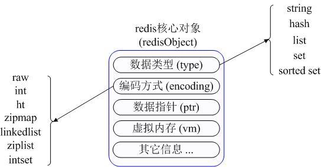
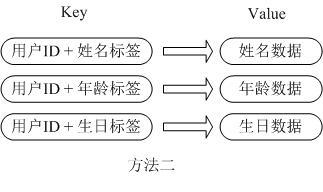

# `Redis` 与 `MongoDB`

## `NoSQL`概述

`NoSQL`，泛指非关系型的数据库。随着互联网`web2.0`网站的兴起，传统的关系数据库在应付`web2.0`网站，特别是超大规模和高并发的`SNS`类型的`web2.0`纯动态网站已经显得力不从心，暴露了很多难以克服的问题，而非关系型的数据库则由于其本身的特点得到了非常迅速的发展。`NoSQL`数据库的产生就是为了解决大规模数据集合多重数据种类带来的挑战，尤其是大数据应用难题

`NoSQL`按照存储类型，可分为以下几类

| **分类**              | **Examples举例**                                   | 典型应用场景                                                 | 数据模型                                        | 优点                                                         | 缺点                                                         |
| --------------------- | -------------------------------------------------- | ------------------------------------------------------------ | ----------------------------------------------- | ------------------------------------------------------------ | ------------------------------------------------------------ |
| **键值（key-value）** | Tokyo Cabinet/Tyrant, Redis, Voldemort, Oracle BDB | 内容缓存，主要用于处理大量数据的高访问负载，也用于一些日志系统等等。 | Key 指向 Value 的键值对，通常用hash table来实现 | 查找速度快                                                   | 数据无结构化，通常只被当作字符串或者二进制数据               |
| **列存储数据库**      | Cassandra, HBase, Riak                             | 分布式的文件系统                                             | 以列簇式存储，将同一列数据存在一起              | 查找速度快，可扩展性强，更容易进行分布式扩展                 | 功能相对局限                                                 |
| **文档型数据库**      | CouchDB, MongoDb                                   | Web应用（与Key-Value类似，Value是结构化的，不同的是数据库能够了解Value的内容） | Key-Value对应的键值对，Value为结构化数据        | 数据结构要求不严格，表结构可变，不需要像关系型数据库一样需要预先定义表结构 | 查询性能不高，而且缺乏统一的查询语法。                       |
| **图形(Graph)数据库** | Neo4J, InfoGrid, Infinite Graph                    | 社交网络，推荐系统等。专注于构建关系图谱                     | 图结构                                          | 利用图结构相关算法。比如最短路径寻址，N度关系查找等          | 很多时候需要对整个图做计算才能得出需要的信息，而且这种结构不太好做分布式的集群方案 |
| 对象存储              | db4o<br />Versant                                  | 通过类似面向对象语言的语法操作数据库，通过对象的方式存取数据。 |                                                 |                                                              |                                                              |

### 共同特性

对于NoSQL并没有一个明确的范围和定义，但是他们都普遍存在下面一些共同特征：

1. 不需要预定义模式：不需要事先定义数据模式，预定义表结构。数据中的每条记录都可能有不同的属性和格式。当插入数据时，并不需要预先定义它们的模式。
2. 无共享架构：相对于将所有数据存储的存储区域网络中的全共享架构。NoSQL往往将数据划分后存储在各个本地服务器上。因为从本地磁盘读取数据的性能往往好于通过网络传输读取数据的性能，从而提高了系统的性能。
3. 弹性可扩展：可以在系统运行的时候，动态增加或者删除结点。不需要停机维护，数据可以自动迁移。
4. 分区：相对于将数据存放于同一个节点，NoSQL数据库需要将数据进行分区，将记录分散在多个节点上面。并且通常分区的同时还要做复制。这样既提高了并行性能，又能保证没有单点失效的问题。
5. 异步复制：和RAID存储系统不同的是，NoSQL中的复制，往往是基于日志的异步复制。这样，数据就可以尽快地写入一个节点，而不会被网络传输引起迟延。缺点是并不总是能保证一致性，这样的方式在出现故障的时候，可能会丢失少量的数据。
6. BASE：相对于事务严格的ACID特性，NoSQL数据库保证的是BASE特性。BASE是最终一致性和软事务。

NoSQL数据库并没有一个统一的架构，两种NoSQL数据库之间的不同，甚至远远超过两种关系型数据库的不同。可以说，NoSQL各有所长，成功的NoSQL必然特别适用于某些场合或者某些应用，在这些场合中会远远胜过关系型数据库和其他的NoSQL。

### 使用场景

NoSQL数据库在以下的这几种情况下比较适用：

1、数据模型比较简单；

2、需要灵活性更强的IT系统；

3、对数据库性能要求较高；

4、不需要高度的数据一致性；

5、对于给定key，比较容易映射复杂值的环境。

## Redis入门

### Redis简介

Redis 是一种基于键值对的NoSQL数据库,它提供了对多种数据类型(字符串、哈希、列列表、集合、有序集合、位图等)的支持,能够满足很多应用场景的需求。Redis将数据放在内存中,因此读写性能是非常惊人的。

与此同时,Redis也提供了持久化机制,能够将内存中的数据保存到硬盘上,在发生意外
状况时数据也不会丢掉。此外,Redis还支支持键过期、地理理信息运算、发布订阅、事务、管道、Lua脚本扩展等功能,总而言之,Redis的功能和性能都非常强大,如果项目中要实现高速缓存和消息队列这样的服务,直接交给Redis就可以了

### 应用场景

1. 高高速缓存 
+  将不不常变化但又又经常被访问的热点数据放到Redis数据库中,可以大大降低关系型数据库的压力,从而提升系统的响应性能。
2. 排行榜 
  + 很多网站都有排行榜功能,利用Redis中的列表和有序集合可以非常方便便的构造各种排行榜系统。
3. 商品秒杀/投票点赞
  + Redis提供了对计数操作的支持,网站上常见的秒杀、点赞等功能都可以利用Redis的计数器通过+1或-1的操作来实现,从而避免了使用关系型数据的 update 操作。
4. 分布式锁 
  + 利用Redis可以跨多台服务器实现分布式锁(类似于线程锁,但是能够被多台机器上的多个线程或进程共享)的功能,用于实现一个阻塞式操作。
5. 消息队列列 
  + 消息队列和高速缓存一样,是一个大型网站不可缺少的基础服务,可以实现业务解耦和非实时业务削峰等特性

### 安装

+ 通过apt安装：`apt install redis`

  + 手动安装，通过官网`https://redis.io/`下载，解压缩解归档之后通过make工具对源代码进行构建并安装

    ```bash
    wget http://download.redis.io/releases/redis-5.0.5.tar.gz
    tar -xvf redis-5.0.5.tar
    cd redis-5.0.5
    make && make install
    ```

    make install出错`没有tcl8.5`解决方法：

    ```bash
    http://downloads.sourceforge.net/tcl/tcl8.5.10-src.tar.gz
    tar -zxvf tcl8.5.tar.gz
    ./configure
    make
    make install
    ```

### 配置

1. 配置将 Redis 服务绑定到指定的IP地址和端口口。bind 127.0.0.1

  ```
  port 6379
  ```

  

2. 设置后台运行行行 (以守护进程方方式运行行行)

  ```
  daemonize yes
  ```

  

3. 设置日日志级别, 可选值: ( debug : 调试, verbose : 详细, notice : 通知, warning : 警告)

  ```
  loglevel warning
  ```

  

4. 配置数据库的数量量, 默认为 16 个

  ```
  databases 16
  ```

  

5. 配置数据写入入规则

  ```
  save 900 1 # 900 秒 (15 分钟) 内修改过 1 个 key, , 写入一次数据库
  save 300 10 # 300 秒 (5 分钟) 内修改过 10 个 key, 写入一次数据库
  save 60 10000 # 60 秒 (1 分钟) 内修改过 10000 个 key, 写入一次数据库
  ```

  

6. 配置Redis的持久化机制 - RDB。

  ```
  dir ./ # RDB 文件保存的目录
  rdbcompression yes # 压缩 RDB 文件
  rdbchecksum yes # 对 RDB 文件进行校验
  dbfilename dump.rdb # RDB 数据库文件的文件名
  dir ./ # RDB 文件保存的目录
  ```

7. 配置Redis的持久化机制 - AOF。

   ```
   appendonly no
   appendfilename "appendonly.aof"
   ```

8. 配置Redis的主从复制,通过主从复制可以实现读写分离。

   ```
   # Master-Replica replication. Use replicaof to make a Redis instance a
   copy of
   # another Redis server. A few things to understand ASAP about Redis
   replication.
   #
   # +-------------------------+      +--------------------+
   # |       Master                    |--->|      Replica           |
   # |     (receive writes)    |        |   (excat   copy)  |
   # +-------------------------+        +-------------------+
   # 1) Redis replication is asynchronous, but you can configure a master to
   # stop accepting writes if it appears to be not connected with at least
   # a given number of replicas.
   # 2) Redis replicas are able to perform a partial resynchronization with
   the
   #
   master if the replication link is lost for a relatively small amount
   of
   #
   time. You may want to configure the replication backlog size (see the
   next
   #
   sections of this file) with a sensible value depending on your needs.
   # 3) Replication is automatic and does not need user intervention. After a
   # network partition replicas automatically try to reconnect to masters
   # and resynchronize with them.
   #
   replicaof 主机IP地址 主机端口口
   ```

   9. 配置慢查询。

     ```
     slowlog-log-slower-than 10000 # 一次操作超过 10000 毫秒被视作一次慢查询
     slowlog-max-len 128 # 最多纪录 128 次满查询
     ```

   ### reids的服务器和客户端

   通过制定配置文件启动redis服务

   ```
   redis-server redis.conf
   ```

   注意：redis的服务器一般默认开启，不需要手动开启

   客户端连接服务器

   ```
   redis-cli -h localhost -p 6379
   ```

   ### python中redis的使用

   首先下载redis模块

   ```bash
   pip install redis
   ```

   

   Redis最为常用的数据类型主要有以下：

   - String
   - Hash
   - List
   - Set
   - Sorted set
   - pub/sub
   - Transactions

   在具体描述这几种数据类型之前，我们先通过一张图了解下Redis内部内存管理中是如何描述这些不同数据类型的：

   

   ​         首先Redis内部使用一个redisObject对象来表示所有的key和value,redisObject最主要的信息如上图所示：

   ​         type代表一个value对象具体是何种数据类型，

   ​         encoding是不同数据类型在redis内部的存储方式，

   ​         比如：type=string代表value存储的是一个普通字符串，那么对应的encoding可以是raw或者是int,如果是int则代表实际redis内部是按数值型类存储和表示这个字符串的，当然前提是这个字符串本身可以用数值表示，比如:"123" "456"这样的字符串。

   ​       这里需要特殊说明一下vm字段，只有打开了Redis的虚拟内存功能，此字段才会真正的分配内存，该功能默认是关闭状态的，该功能会在后面具体描述。通过上图我们可以发现Redis使用redisObject来表示所有的key/value数据是比较浪费内存的，当然这些内存管理成本的付出主要也是为了给Redis不同数据类型提供一个统一的管理接口，实际作者也提供了多种方法帮助我们尽量节省内存使用，我们随后会具体讨论。

    

    

    

   ## 

   各种数据类型应用和实现方式

   下面我们先来逐一的分析下这7种数据类型的使用和内部实现方式:

   ### 

   - String:

   > Strings 数据结构是简单的key-value类型，value其实不仅是String，也可以是数字.
   >
   > 常用命令:  set(存储键和值),get(得到键的值),decr(将键的整数值减1),incr(将存储的数字增加1),mget（获取所有给定键的值） 等。
   >
   >  
   >
   > **应用场景：**String是最常用的一种数据类型，普通的key/ value 存储都可以归为此类.即可以完全实现目前 Memcached 的功能，并且效率更高。还可以享受Redis的定时持久化，操作日志及 Replication等功能。除了提供与 Memcached 一样的get、set、incr、decr 等操作外，Redis还提供了下面一些操作：

    

   ```bash
   localhost:6379> set name qjg
   OK
   localhost:6379> get name
   "qjg"
   localhost:6379> mget name
   1) "qjg"
   localhost:6379> set age 18
   OK
   localhost:6379> incr age
   (integer) 19
   localhost:6379> decr age
   (integer) 18
   localhost:6379> mget name age
   1) "qjg"
   2) "18"
   localhost:6379> 
   ```

    

   - - 获取字符串长度

       `str key`

       ```bash
       localhost:6379> strlen name
       (integer) 3
       ```

     - 往字符串append内容

       `append key value`

       ```bash
       localhost:6379> append name 123
       (integer) 6
       localhost:6379> get name
       "qjg123"
       ```

       

     - 设置和获取字符串的某一段内容

       `getrange key start end`

       ```bash
       localhost:6379> getrange name 2 4
       "g12"
       ```

       

     - 设置及获取字符串的某一位（bit）

     - 批量设置一系列字符串的内容

       `mset key value key value`

       ```bash
       localhost:6379> mset sex 'man' city 'shanghai'
       OK
       localhost:6379> mget sex city
       1) "man"
       2) "shanghai"
       ```

       

    

   > **实现方式：**String在redis内部存储默认就是一个字符串，被redisObject所引用，当遇到incr,decr等操作时会转成数值型进行计算，此时redisObject的encoding字段为int。

   ### 

   - Hash

   > **常用命令：**hget,hset,hgetall 等。
   >
   > **应用场景：**在Memcached中，我们经常将一些结构化的信息打包成HashMap，在客户端序列化后存储为一个字符串的值，比如用户的昵称、年龄、性别、积分等，这时候在需要修改其中某一项时，通常需要将所有值取出反序列化后，修改某一项的值，再序列化存储回去。**这样不仅增大了开销，也不适用于一些可能并发操作的场合**（比如两个并发的操作都需要修改积分）。而Redis的Hash结构可以使你像在数据库中Update一个属性一样只修改某一项属性值。
   >
   > ​        我们简单举个实例来描述下Hash的应用场景，比如我们要存储一个用户信息对象数据，包含以下信息：
   >
   > 用户ID为查找的key，存储的value用户对象包含姓名，年龄，生日等信息，如果用普通的key/value结构来存储，主要有以下2种存储方式：
   >
   >  
   >
   > 
   >
   > 第一种方式将用户ID作为查找key,把其他信息封装成一个对象以序列化的方式存储，这种方式的缺点是，增加了序列化/反序列化的开销，并且在需要修改其中一项信息时，需要把整个对象取回，并且修改操作需要对并发进行保护，引入CAS等复杂问题。
   >
   > 
   >
   > 第二种方法是这个用户信息对象有多少成员就存成多少个key-value对儿，用用户ID+对应属性的名称作为唯一标识来取得对应属性的值，虽然省去了序列化开销和并发问题，但是用户ID为重复存储，如果存在大量这样的数据，内存浪费还是非常可观的。
   >
   > 那么Redis提供的Hash很好的解决了这个问题，Redis的Hash实际是内部存储的Value为一个HashMap，并提供了直接存取这个Map成员的接口，如下图：
   >
   > 
   >
   > 也就是说，Key仍然是用户ID, value是一个Map，这个Map的key是成员的属性名，value是属性值，这样对数据的修改和存取都可以直接通过其内部Map的Key(Redis里称内部Map的key为field), 也就是通过 key(用户ID) + field(属性标签) 就可以操作对应属性数据了，既不需要重复存储数据，也不会带来序列化和并发修改控制的问题。很好的解决了问题。
   >
   > 这里同时需要注意，Redis提供了接口(hgetall)可以直接取到全部的属性数据,但是如果内部Map的成员很多，那么涉及到遍历整个内部Map的操作，由于Redis单线程模型的缘故，这个遍历操作可能会比较耗时，而另其它客户端的请求完全不响应，这点需要格外注意。
   >
   > **实现方式：**
   >
   > 上面已经说到Redis Hash对应Value内部实际就是一个HashMap，实际这里会有2种不同实现，这个Hash的成员比较少时Redis为了节省内存会采用类似一维数组的方式来紧凑存储，而不会采用真正的HashMap结构，对应的value redisObject的encoding为zipmap,当成员数量增大时会自动转成真正的HashMap,此时encoding为ht。

   ```bash
   localhost:6379> hset myhash field1 "你好"
   (integer) 1
   localhost:6379> hget myhash field1
   "\xe4\xbd\xa0\xe5\xa5\xbd"
   localhost:6379> hgetall myhash
   1) "field1"
   2) "\xe4\xbd\xa0\xe5\xa5\xbd"
   localhost:6379> 
   ```

   

   - List

   > **常用命令：**lpush,rpush,lpop,rpop,lrange等。
   >
   > **应用场景：**
   >
   > Redis list的应用场景非常多，也是Redis最重要的数据结构之一，比如twitter的关注列表，粉丝列表等都可以用Redis的list结构来实现。
   >
   > Lists 就是链表，相信略有数据结构知识的人都应该能理解其结构。使用Lists结构，我们可以轻松地实现最新消息排行等功能。Lists的另一个应用就是消息队列，
   > 可以利用Lists的PUSH操作，将任务存在Lists中，然后工作线程再用POP操作将任务取出进行执行。Redis还提供了操作Lists中某一段的api，你可以直接查询，删除Lists中某一段的元素。
   >
   > **实现方式：**
   >
   > Redis list的实现为一个双向链表，即可以支持反向查找和遍历，更方便操作，不过带来了部分额外的内存开销，Redis内部的很多实现，包括发送缓冲队列等也都是用的这个数据结构。

   ```bash
   localhost:6379> lpush runoobkey redis
   (integer) 1
   localhost:6379> lpush runoobkey mongodb
   (integer) 2
   localhost:6379> lpush runoobkey mysql
   (integer) 3
   localhost:6379> lrange runoobkey 0 10
   1) "mysql"
   2) "mongodb"
   3) "redis"
   localhost:6379> rpush runoobkey sqlserver
   (integer) 4
   localhost:6379> rpush runoobkey oracle
   (integer) 5
   localhost:6379> lrange runoobkey 0 10
   1) "mysql"
   2) "mongodb"
   3) "redis"
   4) "sqlserver"
   5) "oracle"
   localhost:6379> lpop runoobkey
   "mysql"
   localhost:6379> rpop runoobkey
   "oracle"
   localhost:6379>
   ```

   - Set

   > **常用命令：**
   >
   > sadd,spop,smembers,sunion 等。
   >
   > **应用场景：**
   >
   > Redis set对外提供的功能与list类似是一个列表的功能，特殊之处在于set是可以自动排重的，当你需要存储一个列表数据，又不希望出现重复数据时，set是一个很好的选择，并且set提供了判断某个成员是否在一个set集合内的重要接口，这个也是list所不能提供的。
   >
   > Sets 集合的概念就是一堆不重复值的组合。利用Redis提供的Sets数据结构，可以存储一些集合性的数据，比如在微博应用中，可以将一个用户所有的关注人存在一个集合中，将其所有粉丝存在一个集合。Redis还为集合提供了求交集、并集、差集等操作，可以非常方便的实现如共同关注、共同喜好、二度好友等功能，对上面的所有集合操作，你还可以使用不同的命令选择将结果返回给客户端还是存集到一个新的集合中。
   >
   > **实现方式：**
   >
   > set 的内部实现是一个 value永远为null的HashMap，实际就是通过计算hash的方式来快速排重的，这也是set能提供判断一个成员是否在集合内的原因。

   ```sql
   localhost:6379> sadd setkey redis   -- 向集合中添加数据
   (integer) 1
   localhost:6379> sadd setkey mysql
   (integer) 1
   localhost:6379> sadd setkey mongodb
   (integer) 1
   localhost:6379> sadd setkey mysql  -- 集合是不能重复添加同一数据的
   (integer) 0
   localhost:6379> smembers setkey   -- 得到集合中的全部数据
   1) "mongodb"
   2) "mysql"
   3) "redis"
   localhost:6379> spop setkey 1  -- 删除集合中的指定下标数据
   1) "mysql"
   localhost:6379> smembers setkey
   1) "mongodb"
   2) "redis"
   localhost:6379> sadd  setkey2 redis
   (integer) 1
   localhost:6379> sunion setkey setkey2
   1) "mongodb"
   2) "redis"
   localhost:6379> sadd  setkey2 sqlserver
   (integer) 1
   localhost:6379> sunion setkey setkey2  -- 取两个集合的合集
   1) "mongodb"
   2) "sqlserver"
   3) "redis"
   localhost:6379>
   ```

   

   - Sorted Set

   > **常用命令：**
   >
   > zadd,zrange,zrem,zcard等
   >
   > **使用场景：**
   >
   > Redis sorted set的使用场景与set类似，区别是set不是自动有序的，而sorted set可以通过用户额外提供一个优先级(score)的参数来为成员排序，并且是插入有序的，即自动排序。当你需要一个有序的并且不重复的集合列表，那么可以选择sorted set数据结构，比如twitter 的public timeline可以以发表时间作为score来存储，这样获取时就是自动按时间排好序的。
   >
   > 另外还可以用Sorted Sets来做带权重的队列，比如普通消息的score为1，重要消息的score为2，然后工作线程可以选择按score的倒序来获取工作任务。让重要的任务优先执行。
   >
   > **实现方式：**
   >
   > Redis sorted set的内部使用HashMap和跳跃表(SkipList)来保证数据的存储和有序，HashMap里放的是成员到score的映射，而跳跃表里存放的是所有的成员，排序依据是HashMap里存的score,使用跳跃表的结构可以获得比较高的查找效率，并且在实现上比较简单。

    

   ```sql
   localhost:6379> zadd sort_set 1 redis
   (integer) 1
   localhost:6379> zadd sort_set 1 mysql
   (integer) 1
   localhost:6379> zrange sort_set 0 10
   1) "redis"
   2) "mysql"
   localhost:6379> zadd sort_set 2 mongodb -- 向指定位置插入数据
   (integer) 1
   localhost:6379> zrange sort_set 0 10  -- 查询集合内指定索引范围内的元素
   1) "redis"
   2) "mongodb"
   3) "mysql"
   localhost:6379> zadd sort_set 2 sqlserver
   (integer) 1
   localhost:6379> zrange sort_set 0 10
   1) "redis"
   2) "mongodb"
   3) "mysql"
   4) "sqlserver"
   localhost:6379> zrem sort_set mysql  -- 删除指定元素
   (integer) 1
   localhost:6379> zrange sort_set 0 10
   1) "redis"
   2) "mongodb"
   3) "sqlserver"
   localhost:6379> zcard sort_set  -- 返回集合的元素个数
   (integer) 3
   ```

   

   ### 

   - Pub/Sub

    

   > Pub/Sub 从字面上理解就是发布（Publish）与订阅（Subscribe），在Redis中，你可以设定对某一个key值进行消息发布及消息订阅，当一个key值上进行了消息发布后，所有订阅它的客户端都会收到相应的消息。这一功能最明显的用法就是用作实时消息系统，比如普通的即时聊天，群聊等功能。

    订阅：

   ```sql
   localhost:6379> subscribe redisChat
   Reading messages... (press Ctrl-C to quit)
   1) "subscribe"
   2) "redisChat"
   3) (integer) 1
   ```

   在另一个窗口，进行发布

   ```sql
   calhost:6379> publish redisChat "redis is a great caching technique"
   (integer) 1
   ```

   此时订阅的窗口内容自动更新：

   ```sql
   Reading messages... (press Ctrl-C to quit)
   1) "subscribe"
   2) "redisChat"
   3) (integer) 1
   1) "message"
   2) "redisChat"
   3) "redis is a great caching technique"
   ```

   

   ### 

   - Transactions(事务)

    

   > 谁说NoSQL都不支持事务，虽然Redis的Transactions提供的并不是严格的ACID的事务（比如一串用EXEC提交执行的命令，在执行中服务器宕机，那么会有一部分命令执行了，剩下的没执行），但是这个Transactions还是提供了基本的命令打包执行的功能（在服务器不出问题的情况下，可以保证一连串的命令是顺序在一起执行的，中间有会有其它客户端命令插进来执行）。Redis还提供了一个Watch功能，你可以对一个key进行Watch，然后再执行Transactions，在这过程中，如果这个Watched的值进行了修改，那么这个Transactions会发现并拒绝执行。

   ```sql
   localhost:6379> multi   -- 开启事务
   OK
   localhost:6379> set book-name "Mastering C++ in 21 day"  -- 添加数据
   QUEUED
   localhost:6379> get book-name -- 得到数据
   QUEUED
   localhost:6379> sadd tag "C++" "Programming" "Mastering Series"  -- 创建集合，并添加数据
   QUEUED
   localhost:6379> smembers tag  -- 得到集合中的数据
   QUEUED
   localhost:6379> exec  -- 执行操作
   1) OK
   2) "Mastering C++ in 21 day"
   3) (integer) 3
   4) 1) "C++"
      2) "Mastering Series"
      3) "Programming"
   localhost:6379> 
   ```

   

   ## MongoDB

   ### 简介

   + MongoDB 是由C++语言编写的，是一个基于分布式文件存储的开源数据库系统。

   + 在高负载的情况下，添加更多的节点，可以保证服务器性能。

   + MongoDB 旨在为WEB应用提供可扩展的高性能数据存储解决方案。

   + MongoDB 将数据存储为一个文档，数据结构由键值(key=>value)对组成。
   + MongoDB 文档类似于 JSON 对象。字段值可以包含其他文档，数组及文档数组

   ### 主要特点

   - MongoDB 是一个面向文档存储的数据库，操作起来比较简单和容易。
   - 你可以在MongoDB记录中设置任何属性的索引 (如：FirstName="Sameer",Address="8 Gandhi Road")来实现更快的排序。
   - 你可以通过本地或者网络创建数据镜像，这使得MongoDB有更强的扩展性。
   - 如果负载的增加（需要更多的存储空间和更强的处理能力） ，它可以分布在计算机网络中的其他节点上这就是所谓的分片。
   - Mongo支持丰富的查询表达式。查询指令使用JSON形式的标记，可轻易查询文档中内嵌的对象及数组。
   - MongoDb 使用update()命令可以实现替换完成的文档（数据）或者一些指定的数据字段 。
   - Mongodb中的Map/reduce主要是用来对数据进行批量处理和聚合操作。
   - Map和Reduce。Map函数调用emit(key,value)遍历集合中所有的记录，将key与value传给Reduce函数进行处理。
   - Map函数和Reduce函数是使用Javascript编写的，并可以通过db.runCommand或mapreduce命令来执行MapReduce操作。
   - GridFS是MongoDB中的一个内置功能，可以用于存放大量小文件。
   - MongoDB允许在服务端执行脚本，可以用Javascript编写某个函数，直接在服务端执行，也可以把函数的定义存储在服务端，下次直接调用即可。
   - MongoDB支持各种编程语言:RUBY，PYTHON，JAVA，C++，PHP，C#等多种语言。
   - MongoDB安装简单。

### 安装

#### 1. 下载最新安装包

官网下载地址：[https://www.mongodb.com/download-center?jmp=nav#community](https://link.jianshu.com/?t=https://www.mongodb.com/download-center?jmp=nav#community)

```cpp
$ curl -O https://fastdl.mongodb.org/linux/mongodb-linux-x86_64-ubuntu1404-3.2.9.tgz
```

#### 2. 解压

```ruby
$ tar -zxvf mongodb-linux-x86_64-ubuntu1404-3.2.9.tgz
```

#### 3. 重命名并移动到安装目录（可自定义）

```bash
sudo mv mongodb-linux-x86_64-3.0.6/ /usr/local/mongodb   # 将解压包拷贝到指定目录进行安装
```

#### 4. 创建 mongo 的数据目录

MongoDB 默认的数据目录是 `/data/db/` ，就直接使用默认的。

```ruby
$ sudo mkdir -p /data/db    #创建数据存储目录
$ sudo chmod 755 /data/*    #赋予目录权限
```

#### 5. 启动

```ruby
$ mongod    #启动服务端
$ mongo    #启动客户端
```

### 通过命令直接安装

+ 更新软件包列表

  `sudo apt update`

+ 安装`MongoDB`包

  `sudo apt install -y mongodb`

+ 检查服务状态

  `sudo systemctl status mongodb`

  

+ 通过实际连接到数据库服务器并执行诊断命令来进一步验证

  `mongo --eval 'db.runCommand({ connectionStatus: 1 })'`，将输出当前的数据库版本，服务器地址和端口以及状态命令的输出

  

+ 为mongodb绑定ip

  `mongod --bind_ip 10.11.55.155` 

  ip可以换成自己的ip地址

### 配置MongoDB

控制的配置文件在：`/etc/mongodb.conf`
控制脚本在：`/etc/init.d/mongodb`
MongoDB实例会把数据存放在：`/var/lib/mongodb`
日志存放在：`/var/log/mongodb`
默认由mongodb用户运行。

如果如果显示目录不存在的话，需要运行下列命令指定文件夹：

```csharp
$ mongod --dbpath /var/lib/mongodb
```

> 如果想要切换用户运行MongoDB的话，需要设置 /var/lib/mongodb 、 /var/log/mongodb两个目录的权限

#### 启动、停止、重启

```ruby
$ sudo service mongodb start
$ sudo service mongodb stop
$ sudo service mongodb restart
```

#### 通过mongodb shell测试安装结果

```undefined
mongodb
```

### MongoDB基本概念

| SQL         | MongoDB     | 解释(SQL/MongoDB) |
| ----------- | ----------- | ----------------- |
| database    | database    | 数据库            |
| table       | collection  | 二维表/集合       |
| row         | document    | 记录(行)/文档     |
| column      | field       | 字段/域           |
| index       | index       | 索引/索引         |
| table joins | ---         | 表连接/嵌套文档   |
| primary key | primary key | 主键/主键         |

### shell 中的基本操作

+ 启动服务器后，和服务器进行通信

  ```
  mongo --host 127.0.0.1
  ```

+ 数据库操作

  ```sql
  > show dbs  -- 查看所有数据库
  admin   0.000GB
  config  0.000GB
  local   0.000GB
  > use qjg  -- 创建并切换到该数据库
  switched to db qjg
  > db.dropDatabase()  -- 删除数据库
  { "ok" : 1 }
  ```

+ 集合的操作

  ```sql
  > use qjg
  switched to db qjg
  > db.createCollection('colleges')  -- 创建集合colleges
  { "ok" : 1 }
  > db.createCollection('students')  -- 创建集合students
  { "ok" : 1 }
  > show collections  -- 查看所有集合
  colleges
  students
  > db.colleges.drop()  -- 删除指定集合colleges
  true
  > show collections
  students
  > 
  ```

+ 文档的增删该查

  注意：在MongoDB中插入文档时如果集合不存在会自动创建集合,所以也可以按照下面的方式通过创建文档来创建集合

  ```sql
  > db.students.insert({stu_id:001,stu_name:'张三',stu_age:25})  -- 往集合中插入文档
  WriteResult({ "nInserted" : 1 })
  > db.students.insert({stu_id:002,stu_name:'李四',stu_tel:16726668358,gender:'男'})
  WriteResult({ "nInserted" : 1 })
  > db.students.find()  -- 查看集合中的文档
  { "_id" : ObjectId("5d7f71d00a143f1d8b137173"), "stu_id" : 1, "stu_name" : "张三", "stu_age" : 25 }
  { "_id" : ObjectId("5d7f72150a143f1d8b137174"), "stu_id" : 2, "stu_name" : "李四", "stu_tel" : 16726668358, "gender" : "男" }
  > db.students.update({stu_id:001},{'$set':{tel:'12793886756',gender:'男'}})  -- 根据指定条件更新集合中的数据
  WriteResult({ "nMatched" : 1, "nUpserted" : 0, "nModified" : 1 })
  > db.students.update({stu_id:003},{'$set':{name:'王五',tel:'12793886756',gender:'男'}},upsert=true)  -- 更新数据，如果数据不存在，则插入
  WriteResult({
  	"nMatched" : 0,
  	"nUpserted" : 1,
  	"nModified" : 0,
  	"_id" : ObjectId("5d7f72d9ad9506418afe358a")
  })
  > db.students.find().pretty()  -- 以易读的方式来读取数据
  {
  	"_id" : ObjectId("5d7f71d00a143f1d8b137173"),
  	"stu_id" : 1,
  	"stu_name" : "张三",
  	"stu_age" : 25,
  	"gender" : "男",
  	"tel" : "12793886756"
  }
  {
  	"_id" : ObjectId("5d7f72150a143f1d8b137174"),
  	"stu_id" : 2,
  	"stu_name" : "李四",
  	"stu_tel" : 16726668358,
  	"gender" : "男"
  }
  {
  	"_id" : ObjectId("5d7f72d9ad9506418afe358a"),
  	"stu_id" : 3,
  	"gender" : "男",
  	"name" : "王五",
  	"tel" : "12793886756"
  }
  > db.students.find({stu_id:{'$gt':001}},{_id:0,name:1,tel:1}).pretty()  -- 查询stu_id=001的数据，且只显示name和tel
  { }
  { "name" : "王五", "tel" : "12793886756" }
  > db.students.find({stu_id:{'$gt':001}},{_id:0,name:1,tel:1}).pretty()  -- 查询stu_id大于001的数据，且只显示name和tel
  { }
  { "name" : "王五", "tel" : "12793886756" }
  > 
  > db.students.find({'$or': [{name: '张三'}, {tel: '12793886756'}]}, {_id: 0, name: 1, tel: 1}).pretty()  -- 查询name='张三'或者tel='12793886756'的数据
  { "tel" : "12793886756" }
  { "name" : "王五", "tel" : "12793886756" }
  > db.students.find({'$or': [{name: '李四'}, {tel: '12793886756'}]}, {_id: 0, name: 1, tel: 1}).pretty()
  { "tel" : "12793886756" }
  { "name" : "王五", "tel" : "12793886756" }
  > db.students.find().skip(1).limit(1).pretty()  -- 跳过第一条且只显示一条数据
  {
  	"_id" : ObjectId("5d7f72150a143f1d8b137174"),
  	"stu_id" : 2,
  	"stu_name" : "李四",
  	"stu_tel" : 16726668358,
  	"gender" : "男"
  }
  > db.students.find({}, {_id: 0, stu_id: 1, name: 1}).sort({stu_id: -1})  -- 查询stu_id和name,且查询结果按降序排序
  { "stu_id" : 3, "name" : "王五" }
  { "stu_id" : 2 }
  { "stu_id" : 1 }
  > db.students.find({}, {_id: 0, stu_id: 1, stu_name: 1}).sort({stu_id: -1})
  { "stu_id" : 3 }
  { "stu_id" : 2, "stu_name" : "李四" }
  { "stu_id" : 1, "stu_name" : "张三" }
  > db.students.ensureIndex({stu_name:1})  -- 创建索引
  {
  	"createdCollectionAutomatically" : false,
  	"numIndexesBefore" : 1,
  	"numIndexesAfter" : 2,
  	"ok" : 1
  }
  > db.students.remove({'stu_name':'张三'},{justOne:true,})  --  删除stu_name='张三'的数据，justOne:可选参数，表示，是否只删除一条数据
  WriteResult({ "nRemoved" : 1 })
  > bd.studens.find().pretty()
  2019-09-16T19:56:14.358+0800 E QUERY    [thread1] ReferenceError: bd is not defined :
  @(shell):1:1
  > db.studens.find().pretty()
  > db.students.find().pretty()
  {
  	"_id" : ObjectId("5d7f72150a143f1d8b137174"),
  	"stu_id" : 2,
  	"stu_name" : "李四",
  	"stu_tel" : 16726668358,
  	"gender" : "男"
  }
  {
  	"_id" : ObjectId("5d7f72d9ad9506418afe358a"),
  	"stu_id" : 3,
  	"gender" : "男",
  	"name" : "王五",
  	"tel" : "12793886756"
  }
  > 
  ```

### 条件查询常见条件操作

| 操作       | 格式                     | 范例                                        | RDBMS中的类似语句   |
| :--------- | :----------------------- | :------------------------------------------ | :------------------ |
| 等于       | `{<key>:<value>`}        | `db.col.find({"by":"百度"}).pretty()`       | `where by = '百度'` |
| 小于       | `{<key>:{$lt:<value>}}`  | `db.col.find({"likes":{$lt:50}}).pretty()`  | `where likes < 50`  |
| 小于或等于 | `{<key>:{$lte:<value>}}` | `db.col.find({"likes":{$lte:50}}).pretty()` | `where likes <= 50` |
| 大于       | `{<key>:{$gt:<value>}}`  | `db.col.find({"likes":{$gt:50}}).pretty()`  | `where likes > 50`  |
| 大于或等于 | `{<key>:{$gte:<value>}}` | `db.col.find({"likes":{$gte:50}}).pretty()` | `where likes >= 50` |
| 不等于     | `{<key>:{$ne:<value>}}`  | `db.col.find({"likes":{$ne:50}}).pretty()`  | `where likes != 50` |

### python中mongodb的使用

+ 安装

  ```bash
  
  ```

+ 操作

  ```bash
  In [1]: from pymongo import MongoClient  # 导入模块
  
  In [3]: cli = MongoClient('mongodb://127.0.0.1:27017')  # 创建连接
  
  In [4]: db = cli.qjg  # 创建数据库对象
  
  In [7]: for student in db.students.find():  # 查询数据，得到一个class对象，对象内是一个个字典
     ...:     print('学号:',student['stu_id'])
     ...:     print('姓名：',student['stu_name'])
     ...:     print('电话：',student['stu_tel'])
     ...:     
  学号: 2.0
  姓名： 李四
  电话： 16726668358.0
  学号: 1.0
  姓名： 张三
  电话： 12781277636
  学号: 3.0
  姓名： 王五
  电话： 12747898894
  
  In [8]: db.students.find().count()  # 查询集合内元素的数量
  /usr/bin/ipython:1: DeprecationWarning: count is deprecated. Use Collection.count_documents instead.
    #! /bin/sh
  Out[8]: 3
  
  In [9]: db.students.remove()  # 删除集合内所有元素
  /usr/bin/ipython:1: DeprecationWarning: remove is deprecated. Use delete_one or delete_many instead.
    #! /bin/sh
  Out[9]: {'n': 3, 'ok': 1.0}
  
  In [16]:coll.insert_one({'stu_id': int(1001), 'stu_name': '张三', 'gender': True}  # 插入单个元素
  
  In [17]:coll.insert_many([{'stu_id': int(1002), 'stu_name': '李四', 'gender': False},
  {'stu_id': int(1003), 'stu_name': '王五', 'gender': True}])  # 插入多个元素
  In [18]:for student in db.students.find():
     ...:     print('学号:',student['stu_id'])
     ...:     print('姓名：',student['stu_name'])
     ...:     print('性别：','男' if student['gender'] else '女' )
     ...:     
  学号: 1001
  姓名： 张三
  性别： 男
  学号: 1003
  姓名： 王五
  性别： 男
  ```

  

