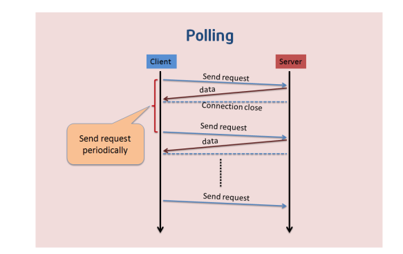
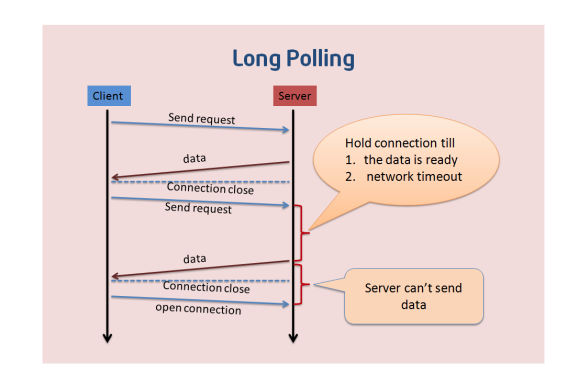

# 使用WebSocket进行聊天

## WebSocket介绍

WebSocket是一种与HTTP不同的协议。两者都位于OSI模型的应用层，并且都依赖于传输层的TCP协议。 虽然它们不同，但RFC 6455规定：“WebSocket设计为通过80和443端口工作，以及支持HTTP代理和中介”，从而使其与HTTP协议兼容。 为了实现兼容性，WebSocket握手使用HTTP Upgrade头从HTTP协议更改为WebSocket协议。

WebSocket协议支持Web浏览器（或其他客户端应用程序）与Web服务器之间的交互，具有较低的开销，便于实现客户端与服务器的实时数据传输。 服务器可以通过标准化的方式来实现，而无需客户端首先请求内容，并允许消息在保持连接打开的同时来回传递。通过这种方式，可以在客户端和服务器之间进行双向持续对话。 通信通过TCP端口80或443完成，这在防火墙阻止非Web网络连接的环境下是有益的。另外，Comet之类的技术以非标准化的方式实现了类似的双向通信。

大多数浏览器都支持该协议，包括Google Chrome、Firefox、Safari、Microsoft Edge、Internet Explorer和Opera。

与HTTP不同，WebSocket提供全双工通信。此外，WebSocket还可以在TCP之上启用消息流。TCP单独处理字节流，没有固有的消息概念。 在WebSocket之前，使用Comet可以实现全双工通信。但是Comet存在TCP握手和HTTP头的开销，因此对于小消息来说效率很低。WebSocket协议旨在解决这些问题。

WebSocket协议规范将`ws`（WebSocket）和`wss`（WebSocket Secure）定义为两个新的统一资源标识符（URL）方案，分别对应明文和加密连接。除了方案名称和片段ID（不支持`#`）之外，其余的URI组件都被定义为此URI的通用语法。

使用浏览器开发人员工具，开发人员可以检查WebSocket握手以及WebSocket框架。

### Web上的即时通信

在没有WebSocket之前，服务器很难主动向客户端推送数据

Web为了实现即时通信，经历了最初的polling到之后的Long polling 等若干种方式

#### 短轮询Polling



这种方式下,是不适合获取实时信息的,客户端和服务器之间会一直进行连接,每隔一段时间就询问一次。客户端会轮询,有没有新消息。这种方式连接数会很多,一个接受,一个发送。而且每次发送请求都会有 HTTP 的 Header,会很耗流量量,也会消耗 CPU 的利用率。
在 Web 端,短轮询用 A JAX JSONP Polling 轮询实现。

+ 优点：短连接，服务器处理简单，支持跨域，浏览器兼容性较好
+ 缺点：有一定的延迟，服务器压力较大，浪费时间，大部分时无效请求

#### 长轮询 Long Polling



长轮询和短轮询最大的区别是，短轮询去服务端查询的时候，不管库存量有没有变化，服务器就立即返回结果了。而长轮询则不是，在长轮询中，服务器如果检测到库存量没有变化的话，将会把当前请求挂起一段时间（这个时间也叫作超时时间，一般是几十秒）。在这个时间里，服务器会去检测库存量有没有变化，检测到变化就立即返回，否则就一直等到超时为止。

　　而对于客户端来说，不管是长轮询还是短轮询，客户端的动作都是一样的，就是不停的去请求，不同的是服务端，短轮询情况下服务端每次请求不管有没有变化都会立即返回结果，而长轮询情况下，如果有变化才会立即返回结果，而没有变化的话，则不会再立即给客户端返回结果，直到超时为止。　

　　这样一来，客户端的请求次数将会大量减少（这也就意味着节省了网络流量，毕竟每次发请求，都会占用客户端的上传流量和服务端的下载流量），而且也解决了服务端一直疲于接受请求的窘境。

+ 优点：无消息的情况下不会再次发起请求
+ 缺点： 会耗费服务端的性能

#### 与长短连接的区别

首先区分概念，HTTP是基于**请求/响应**模式的无状态协议（属于应用层协议），因此只要服务端做出了反应，则HTTP连接消失。因此，HTTP本身并没有长短连接之分，所以根本没有长短连接这种说法。
TCP是一个双向通道，它可以保持一段时间不关闭。长连接是指TCP连接。

**1、短连接**
工作模式： 连接->传输数据->关闭连接
客户端每一次与服务器端建立连接后进行一次HTTP操作就关闭请求。

**2、长连接**
工作模式：连接->传输数据->保持连接->传输数据.......->保持连接->传输数据->关闭连接。
建立连接之后无论是否有数据通信都保持连接状态，存在某种机制可以销毁连接。
**3、总结**
长短连接是基于协议的，一个TCP连接是否为长连接，是通过设置HTTP的Connection Header来决定的，而且是需要客户端和服务器端都设置才有效。

## WebSocket

WebSocket 是 HTML5 开始提供的一种独立在单个 TCP 连接上进行全双工通讯的有状态的协议 (它不同于无状态的 HTTP),并且还能支持二进制帧、扩展协议、部分自定义的子协议、压缩等特性

### 与普通HTTP协议的异同

+ WebSocket协议的URL是`ws://`或者`wss://`开头的，而不是`HTTP://`或者是`HTTPS://`
+ WebSocket使用与普通HTTP或HTTP协议相同的80端口和443端口进行连接
+ WebSocket的Header中有连接特殊字段，代表它是由HTTP协议升级为WebSocket协议

### 通过JS建立一个简单的WebSocket连接

```javascript
var ws = new WebSocket('ws://example.com/socket');  // 建立连接
ws.onopen = function () {
ws.send("Connection established. Hello server!");   // 向服务器发送消息
}
ws.onmessage = function(event) {
console.log('client recv: ', event.data)  // 接受服务发送过来的消息
};
ws.onclose = function () { ... }  // 关闭连接
ws.onerror = function (error) { ... }  // 抛出错误
```

### tornado中使用WebSocket

```python
class MsgHandler(tornado.websocket.WebSocketHandler):
    conn_pool = set()

    def open(self):
        print('客户端建立了连接')
        self.conn_pool.add(self)

    def on_message(self, message):
        print('接收到了客户端的消息：%s' % message)
        self.broadcast(message)

    def on_close(self):
        print('客户端断开连接')
        self.conn_pool.remove(self)

    def broadcast(self, message):
        '''广播消息'''

        for conn in self.conn_pool:
            if conn is not self:
                conn.write_message(message)
        
        
    def write_message(self, message):
			'''发送消息'''
			pass
```

## 任务目标

+ 通过tornado开发一个聊天室程序

  ```python
  #!/usr/bin/env python
  
  import os
  import logging
  
  import tornado.web
  import tornado.ioloop
  from tornado.options import define, options, parse_command_line
  
  from views import MainHandler, ChatSocketHandler
  
  define("host", default='0.0.0.0', help="地址", type=str)
  define("port", default=8000, help="端口", type=int)
  
  
  def main():
      parse_command_line()
  
      web_app = tornado.web.Application(
          [
              (r"/", MainHandler),
              (r"/chatsocket", ChatSocketHandler),
          ],
          template_path=os.path.join(os.path.dirname(__file__), "templates"),
          static_path=os.path.join(os.path.dirname(__file__), "statics"),
      )
      web_app.listen(options.port, options.host)
  
      logging.info('Server running on %s:%s' % (options.host, options.port))
      tornado.ioloop.IOLoop.current().start()
  
  
  if __name__ == "__main__":
      main()
  ```

  

+ 通过WebSocket进行长连接通信

  ```python
  class ChatSocketHandler(tornado.websocket.WebSocketHandler):
      # 所有连接 的连接池
      members = set()
      # 历史消息对象
      history = MsgHistory()
      # 客户端的计数器
      client_id = 0
  
      def get_compression_options(self):
          # Non-None enables compression with default options.
          return {}
  
      def open(self):
          """与客户端连接时进行的处理"""
          ChatSocketHandler.client_id += 1
          self.client_id = ChatSocketHandler.client_id
  
          # 从cookie中取出用户名
          b64_name = self.get_cookie('username')
          if not b64_name:
              # 用户没有cookie，给一个默认名称
              self.username = "游客%d" % self.client_id
          else:
              # 将cookie中 base64 编码的名称进行解码，并赋值
              self.username = b64decode(b64_name).decode('utf8')
          # 将用户连接添加到连接池
          ChatSocketHandler.members.add(self)
  
          # 定义登录消息，并向其他用户进行广播
          message = {
              "id": str(uuid.uuid4()),
              "type": "online",
              "client_id": self.client_id,
              "username": self.username,
              "datetime": datetime.datetime.now().strftime("%Y-%m-%d %H:%M:%S")
          }
          ChatSocketHandler.broadcast(message)
  
      def on_close(self):
          """断开连接时处理"""
          # 首先从连接池删除用户自身对象
          ChatSocketHandler.members.remove(self)
          # 向所有用户广播用户离开的消息
          message = {
              "id": str(uuid.uuid4()),
              "type": "offline",
              "client_id": self.client_id,
              "username": self.username,
              "datetime": datetime.datetime.now().strftime("%Y-%m-%d %H:%M:%S")
          }
          ChatSocketHandler.broadcast(message)
  
      @classmethod
      def broadcast(cls, message):
          '''进行广播'''
          logging.info("sending message to %d members", len(cls.members))
          for member in cls.members:
              try:
                  member.write_message(message)
              except:
                  logging.error("Error sending message", exc_info=True)
  
      def on_message(self, message):
          """发送消息"""
          logging.info("got message %r", message)
          # 对json文件进行解码
          parsed = tornado.escape.json_decode(message)
          # 组装消息结构
          self.username = parsed["username"]
          message = {
              "id": str(uuid.uuid4()),
              "body": parsed["body"],
              "type": "message",
              "client_id": self.client_id,
              "username": self.username,
              "datetime": datetime.datetime.now().strftime("%Y-%m-%d %H:%M:%S")
          }
          # 通过解码，对网页进行渲染
          message["html"] = tornado.escape.to_basestring(
              self.render_string("message.html", message=message)
          )
  		
          # 获得历史消息
          ChatSocketHandler.history.add(message)
          # 进行广播
          ChatSocketHandler.broadcast(message)
  ```

  

+ 使用redis保留100条离线信息

  ```python
  import json
  
  from redis import Redis
  
  rds = Redis()
  
  
  class MsgHistory:
      key = 'chat_history'
      size = 100
  
      @classmethod
      def add(cls, msg):
          """记录一条历史消息"""
  
          # 将消息转换成json字符串
          json_msg = json.dumps(msg)
          # 将消息推入 redis 的list中
          rds.rpush(cls.key, json_msg)
          # 截取最新的100条记录
          rds.ltrim(cls.key, -cls.size, -1)
  
      @classmethod
      def all(cls):
          """取出所有的历史消息"""
          all_msg = []
          for json_msg in rds.lrange(cls.key, -1, -cls.size):
              msg = json.loads(json_msg)
              all_msg.append(msg)
          return all_msg
  ```

  ## 元类
  
  Python中的类也是对象。元类就是用来创建这些类（对象）的，元类就是类的类，你可以这样理解为：
  
  ```
  MyClass = MetaClass()    #元类创建类
  MyObject = MyClass()     #类创建实例
  ```
  
  实际上MyClass就是通过type()来创创建出MyClass类，它是type()类的一个实例；同时MyClass本身也是类，也可以创建出自己的实例，这里就是MyObject
  函数type实际上是一个元类。type就是Python在背后用来创建所有类的元类

使用type元类，进行类的创建过程

```python
In [10]: def drink(self):    # 定义实例方法
    ...:     print('%s正在喝水' %self.name)
    ...:     

In [11]: def run(self):
    ...:     print('%s正在用%d条腿在奔跑' %(self.name, self.legs))
    ...:     

In [12]: attr = {
   ...:		# 定义实例属性
    ...:     'name':'旺财',
    ...:     'age':1.5,
    ...:     'head':1,
    ...:     'body':1,
    ...:     'legs':4,
    ...:     'tail':1,
    ...:     'drink':drink,
    ...:     'run':run
    ...: }

In [13]: Dog = type('Dog',(object,),attr)  # 通过type进行类的创建

In [14]: dog = Dog()  # 类的实例化

In [15]: dog.name,dog.age,dog.head,dog.body,dog.legs,dog.tail
Out[15]: ('旺财', 1.5, 1, 1, 4, 1)

In [16]: dog.drink()
旺财正在喝水

In [17]: dog.run()
旺财正在用4条腿在奔跑

In [18]: 
```

