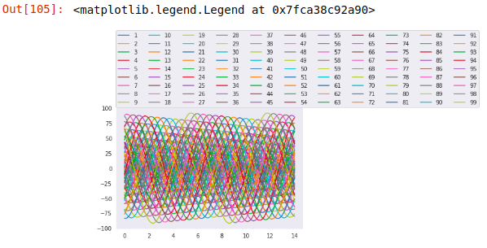
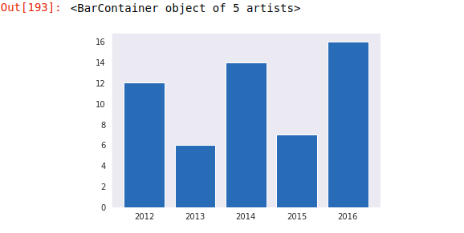
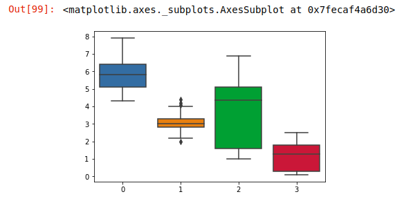

# 数据分析-03

## matplotlib和seaborn

### Seaborn的五种风格的画板

+ darkgrid 暗网格
+ whitegrid 白网格
+ dark 黑色
+ white 白色
+ ticks 标记

设置风格：seaborn.set_style()

控制刻度：seaborn.set_context('paper')

调色板：

+ seaborn.color_palette()   设置颜色
+ seaborn.set_palette()   设置颜色
+ seaborn.palplot()    显示颜色
+ seaborn.hls_palette(8,l=.7,s=.8):设置圆形画板色，l是亮度，s是饱和度

### 线形图

二维图形，需要设置x,y轴信息

直线

```python
x = np.linspace(-5,5,100)
y = 0.5*x
plt.plot(x,y)
```


曲线

```python
x = np.linspace(-5,5,100)
# .exp求元素的指数
y = np.exp(-x**2)
plt.plot(x,y)
```


三角函数

```python
x = np.linsapce(-5,5,100)
y = np.sin(x)
y1 = np.cos(x)
plt.plot(x,y)
plt.plot(x,y1)
```


使用for循环进行生成

```python
x = np.linspace(0,14,100)
for i in range(1,100):
    plt.plot(x,np.exp(-x+i*0.5))
```


多项式，高次方程

```python
x = np.linspace(-14,14,100)
y = 5*x**2+x**4-3.5
plt.plot(x,y)
plt.gird(color='hotpink', alpha=.5,axis='both')   # 设置网格,alpha设置网格线的透明度，axis选择线条的方向，both为水平和垂直方向都进行设置
plt.axis('on')  # 设置轴的属性，off不需要轴线,on设置轴线
```


设置成圆

```python
x = np.linspace(-1,1,100)
y = (1-x**2)**.5
plt.plot(x,y,x,-y)
 # plt.axis('image')  # 压缩的意思
plt.axis('equal')  # 也是压缩的意思
```


### 设置图片标题

```python
x = np.linspace(-1,1,100)
y = (1-x**2)**.5
plt.axis('equal')
# 注意：title在Linux系统下不支持中文，color设置字体颜色，fontsize设置字体大小
plt.title('this is a circle', color='puper', fontsize=20)
# 设置xy轴的标题，color支持RGB格式，rotation与x轴的倾斜度
plt.xlabel('X', color=(0.35,0.55,0.11), fontsize=20,rotation=0)
plt.ylabel('X', color=(0.35,0.55,0.11), fontsize=20,rotation=0)
```


### 图例

```python
x = np.linsapce(-5,5,100)
y = np.sin(x)
y1 = np.cos(x)
# label设置相对应的图例内容
plt.plot(x,y, label='sin')
plt.plot(x,y1,label='cos')
```


```python
x = np.linsapce(0,14,100)
for i in range(1,100):
    plt.plot(x,np.sin(x+i*.5)(7-i), label=i)
    
# 这左边轴上设置图例，loc的参数是一个数组，数组第一个值是距离y轴的倍数，第二个值是距离x的倍数,ncol设置图例的行数
plt.legend(loc=[0,1], ncol=11)
```



### 点与线的风格设置

```python
x = np.linspace(-5,5,10)
y = np.sin(x)**2
# 设置图形的大小
plt.figure(figsize=(8,4))
# plot的参数marker用来设置点的形式,o表示圆形，s表示方行，d表示菱形，D表示大菱形，10表示三角形,markersize设置点的大小 ，ls设置先的形状：--表示虚线
plt.plot(x,y,marker='o'，markersize=5,ls='--')
```


### 画布对象的创建

```python
# subplot的参数：1.代表的行数 2.列数 3.画布的编号(默认从1开始,不能为0)
axes = plt.subplot(1,3,1)
axes1 = plt.subplot(1,3,2)
axes2 = plt.subplot(1,3,3)
axes
axes1
axes2
```

### 刻度映射

```python
axes = plt.subplot()  # 如果不写参数，默认只有一个画布
x = np.linspace(-np,pi,np,pi,100)
y = np.sin(x)
# lw设置线条的宽度
axes.plot(x,y,ls=':',lw=10)
pi = np.pi
# set_xticks() 重新设置x轴刻度值
set_xticks([-pi,-pi/2,0,pi/2,pi])
# 刻度映射,注意需要与上面设置的刻度值个数相同
axes.set_xtickslabels(['$-\pi$, $-\pi/2$,0, $\pi/2$, $\pi$ '])
# set_yticks() 重新设置y轴刻度值
set_yticks([-1,0,1])
# 刻度映射,注意需要与上面设置的刻度值个数相同
axes.set_ytickslabels(['min', 0, 'max'], fontsize=20)
```


### 直方图

需要一个一维数组，统计数据中每个元素出现的次数，hist()

```python
a = np.random.randint(0,10,20)
# bins设置两个图像之间的间隙
plt.hist(a,bins=20)
```


投票

```python
a = ['a','b','a','c','a','d','b']
plt.hist(a)
```


seaborn的直方图

seaborn的直方图不支持离散类型

数字类型是连续的，字符串是离散

```python
a = ['a','b','a','c','a','d','b']
sns.distplot(a, bins=20)
```


### 柱状图

二维的，一般与时间进行捆绑

```python
# load_dataset引入数据集，titanic
titanic = sns.load_dataset('titanic')
titanic
```

```python
# seaborn柱状图的设置
# x 的值是字段sex,y的值是字段survices
sns.barplot(x='sex', y='survived', hue='pclass', data=titanic)
```


```python
# maltplotlib柱状图的设置
data = ['2012','2013','2014','2015']
GDP = [12,6,14,7,16]
plt.bar(data,GDP)
```



```python
sns.barplot(data,GDP)
```


### 饼图

是一种比例图

```python
# 所绘制的数据的值加起来要超过1，否则则生成的饼状图不完整
a = np.array([.1,.2,.35])
plt.pie(a)
plt.axis('image')
```


```python
labels = ['sh', 'bj','sz','gz','hz','nb','sz','wx','cd','qd']
gdp = [10000, 9900, 9400, 6000, 8000, 7000, 8001, 5000,7000,4000 ]
# expload 设置相应模块的突出
expload = [0.2,0,0,0,0,0,0,0,0,0.1]
# autopct：在图中显示对应模块所占的百分比
plt.pie(gdp, lables=labels, autopct='%.2f%', explode=expload，color=sns.color_palette('rainbow',10))
plt.axis('equal')
```


### 箱图

```python
a = np.random.randn(10,3)
a
```


```python
# 左右边缘 均值-3*标准差 均值-3*标准差
# 超出左右边缘的值为异常值
sns.boxplot(a)
```


### 散布图

观察数据的分布情况和离散值(聚集度、相似度)

二维，以列代表一个轴

```python
# 导入可以直接引用的数据
from sklearn.datasets import load_iris

iris = load_iris()
# 共150个样本数据，4个特征值：花萼的长度 宽度 花瓣的长度和宽度
# 一共3个花种 每一类50个
data = iris.data
target = iris.target

# c = class种类 类别 cmap设置颜色
plt.scatter(data[:,1], data[:,3],c=target, cmap='rainbow')
```


```python
import pandas as pd

d = pd.DataFrame(data)

sns.boxplot(data=d)
```



### 散布密度图

```python
sns.jointplot(data[:,0],data[:,1])
```


```python
sns.jointplot(data[:,0], data[:,1],kind='kde')   # 生成ked热力图
```


```python
sns.jointplot(data[:,0], data[:,1],kind='hex')  # 生成蜂窝图
```


### 回归散布图

``` python
sns.regplot(data[:,2], data[:,-1])
```


### 散布图矩阵

散布图矩阵是多组值之间相互比较的的显示

```python
sns.pairplot(d)
```

