# Pandas

## series

serise是一种类似与一维数组的对象，有下面两个部分组成：

+ values：一组数据(ndarray类型)
+ key：相关的数据索引

### series的创建

两种创建方式：

+ 由列表或ndarray数组创建，默认索引为0到N-1的整数型索引

  ```python
  import numpy as np
  import matplotlib.pyplot as plt
  import pandas as pd
  
  # index设置指定索引
  a = pd.Series(range(1,6),index=list('bacde'))
  # name参数为数据设置一个名字
  c = pd.Series(data=range(5), name=id)
  ```

  特别地，由ndarray创建的是引用，而不是副本。对Series元素的改变也会改变原来的ndarray对象中的元素。（列表没有这种情况）

  ```python
  # list是python自己的，而numpy和pandas不是，所以使用上有点差异
  nd = np.random.randint(0,10,10)
  ```

+ 由字典创建

```python
pd.Series(dict(a=1,b=2))
```

练习1：

使用多种方法创建以下Series，命名为s1：
语文 150
数学 150
英语 150
理综 300

```python
# score = pd.Series(data=['150','150','150','300'],index=['语文','数学','英语','理综'], name='s1')
score = pd.Series(dict(语文=150,数学=150,英语=150,理综=300),name='s1')
score
```

### 索引和切片

可以使用中括号取单个索引(此时返回的是元素类型)，或者中括号里一个列表或多个索引(此时返回的仍然是一个Series类型)，分为普通索引，显式索引和隐式索引：

### 普通索引

```python
a = pd.Series(np.random.randint(0,100,5), index=list('abcde'))

# 
# 直接通过关系型类型来进行查找，离散
a['a']
# 枚举类型索引 连续
a['0']

# 通过关系型索进行切片，是半闭区间
a[0:4]

#通过枚举类型进行切片，是 闭区间
a['a':'e']
```

### 显式索引

+ 使用index中的元素作为索引
+ 使用.loc[]推荐

可以理解为pandas是ndarray的升级版，但是Series也可以是dict的升级版

注意：此时是闭区间

```python
# 显式索引 只能使用关联，即枚举类型索引
# 取值
a['a']
# 切片
a.loc['b':'d']
```

### 隐式索引

+ 使用整数作为索引值
+ 使用.iloc[]  (推荐)

注意：此时是半闭区间

```python
# 隐式索引 既可以使用枚举类型索引 也可以使用关联索引
# 取值
a.iloc[0]
a.iloc['a']
#切片
a.iloc[0:-1]
a.iloc['a':'c']
```


练习2：

使用多种方法对练习1创建的Series s1进行索引和切片：

索引： 数学 150

切片： 语文 150 数学 150 英语 150

```python
score[1]
score[0:3]

score['数学']
score['语文':'英语']


score.loc['数学']
score.loc['语文':'英语']

score.iloc[1]
score.iloc[0:3]
```

### Series的方法和属性

Series的基本概念

可以把Series看成一个定长的有序字典

属性：

+ shape：获得数据的形状
+ size：获得数据的元素个数
+ index：获得数据所有的索引值
+ values：获得数据所有的元素值
+ ndim：获得数据的维数
+ dtype：获得数据的类型

```python
a.shape
a.size
a.index
a.values
a.ndim
a.dtype
```

结果

```python
(5,)
5
Index(['a', 'b', 'c', 'd', 'e'], dtype='object')
[32 88 81 28 40]
1
int64
```

方法：

+ astyoe：修改类型
+ keys：得到所有的keys值，和索引功能相似
+ head()：查看前N行的数据，N默认为5
+ tail()：查看末尾的N行数据，N默认为5

```python
b=pd.Series(range(5))

b.astype(np.int8)

b.keys()  #  结果：RangeIndex(start=0, stop=5, step=1)

b.head(n=1) 
b.tail(n=1)
```


注意：如果Series数据没有设置index,那么index和keys()查出来的是RangeIndex()，如果设置了index和keys查询的结果是Index()


### Series的运算

+ 适用于numpy的数组运算也适用于Series

  ```python
  # 对应位置的值相加
  np.array([1,2,3]) + np.array([3,2,1])  
  
  pd.Series([1,2,3]) + pd.Series([3,2,1])
  
  # 如果关联索引不能对应，那么相加得到NaN
  pd.Series([1,2,3], idnex=list('abc')) + pd.Series([3,2,1], index=list('bcd'))
  ```

+ sum()

  + 在运算中自动对齐不同索引的数据
  + 如果索引不对应，则补NaN
  + 注意：要保留所有的index，则需要使用.add()函数

  ```python
  pd.Series([1,2,3,np.nan]).sum()  # 结果：6.0
  ```

+ add()

  ```python
  a = pd.Series([1,2,3],index=list('abc'))
  b = pd.Series([3,2,1],index=list('bcd'))
  a.add(b)
  ```

  

练习3：

1. 想一想Series运算和ndarray运算的规则有什么不同？

   如果ndarray数据中有空值那么sum()的结果为NaN，而series数据的sum()，则会指定过滤空值，ndarray如果想要求和则使用argsum()

2. 新建另一个索引包含“文综”的Series s2，并与s2进行多种算术操作。思考如何保存所有数据。

   ```python
   score2 = pd.Series(dict(语文=150,数学=150,英语=150,理综=300,文综=300), name='s2')
   score+score2
   score * score2
   score.sum()
   score.add(score2)
   ```

   

## Pandas对象的操作

### 使用pandas读取scv文件

```python
order = pd.read_csv('./order_info_utf.csv')

# 获取数据的详细信息
order.info
```

### NaN

当索引没有对应值是，可能出现缺失数据显示NaN(Not a Number)的情况

```python
a.a = np.nan
a
```

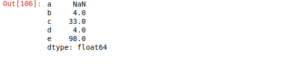

### isnull()和notnull()

```python
# 如何剔除空值
index = pd.notnull(a)

a[index]  # 只有当index为True时才会返回值
```

```python
# 如何查找值为NaN的索引
s = pd.isnull(a)
a[s].index
```

### pandas层次化索引

+ 创建 多层行索引

  + 隐式构建

    最常见的方法是给DataFrame构造函数的index参数传递两个或更多的数组

    Series也可以创建多层索引

  ```python
  s = pd.Series(data=range(6),index=[list('aabbcc'),list('甲乙甲乙甲乙')])
  s
  ```

  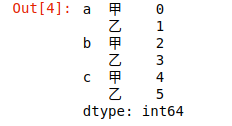

  ```python
  # 通过索引获取值
  #显式索引
  s.loc['a','甲']
  
  #多级索引不对隐式产生效果
  s.iloc[3]
  ```

  + 显式构建pd.MultiIndex

    + 使用数组

    + 使用元组
    + 使用product   最简单，推荐使用

  ```python
  df1 = pd.DataFrame(data=np.random.randint(0,100,(4,6)),
                    columns=pd.MultiIndex.from_arrays([['数学','数学','英语','英语','语文','语文'],['期中','期末','期中','期末','期中','期末']]),
                    index=[list('蓝蓝绿绿'),['贾亮','王强','陈凡','张三']])
  df1
  ```

  ```python
  df2 = pd.DataFrame(data=np.random.randint(0,100,(4,6)),
                    columns=pd.MultiIndex.from_arrays([['数学','数学','英语','英语','语文','语文'],['期中','期末','期中','期末','期中','期末']]),
                    index=pd.MultiIndex.from_tuples([('蓝','PGTWO'),('蓝','宋鸡'),('绿','李三日'),('绿','蒋人韦')]))
  df2
  ```

  ```python
  df3 = pd.DataFrame(data=np.random.randint(0,100,(4,6)),
                    columns=pd.MultiIndex.from_product([['数学','英语','语文'],['期中','期末']]),
                    index=pd.MultiIndex.from_product([['蓝','绿'],['甲','乙']]))
  df3
  ```

  

+ 创建二级列索引

  ```python
  df = pd.DataFrame(data=np.random.randint(0,100,(4,6)),columns=[['数学','数学','英语','英语','语文','语文'],
                                                                 ['期中','期末','期中','期末','期中','期末']],
                   index=['贾亮','王强','陈凡','张三'])
  df
  ```

  

```python
# 找到陈凡的英语期末成绩
# 普通取值，先找列再找行
df.英语.期末.陈凡
# 显式索引 先找行再找列
df.loc['陈凡','英语'].期末
```

+ 多层列索引+行索引

除了行索引index，列索引columns也能用同样的方法创建多层索引

+ 多层索引对象的索引与切片操作

  + Series的操作

    对于Series来说，直接中括号[]与使用.loc()完全一样，因此，推荐使用中括号索引和切片。

  .loc()先取一级索引 再取二级索引

  ```python
  df3.loc["蓝","甲"]
  ```

  .loc()显式索引先取行 再取列

  ```python
  df3.loc["蓝","数学"]
  ```

  + DataFrame的操作
    + 可以直接使用列名称来进行列索引
    + 使用行索引需要用ix()，loc()等函数

  【极其重要】推荐使用loc()函数

  注意在对行索引的时候，若一级行索引还有多个，对二级行索引会遇到问题！也就是说，无法直接对二级索引进行索引，必须让二级索引变成一级索引后才能对其进行索引！

+ 索引的堆（stack）

  + stack()

    ```python
    df
    ```

    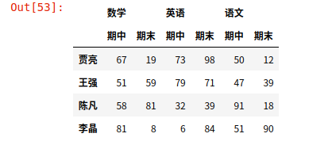

    ```python
    #列索引转变为行索引, 注意，如果有多级索引，先从里面的索引进行转变
    df.stack()
    ```

    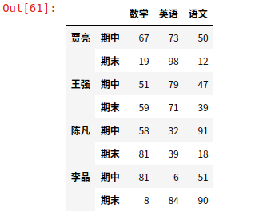

    

  + unstack()

    ```python
    #行索引转变为列索引，只有一级索引，所以转变之后变成一维
    df.unstack()
    ```

    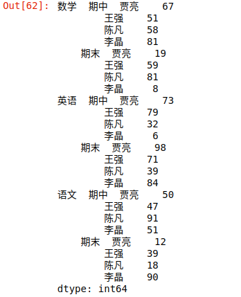

注意：使用stack()和unstack()的时候，有个参数level来进行哪一级索引的指定，level等于哪一个，就转变哪一级索引，如果没有进行指定默认转变内层索引

+ 聚合函数

  + sum()：求和

    ```python
    df = pd.read_csv('order_info_utf.csv',header=None,names=['orderid','userid','ispaid','price','paidtime'])
    df.isnull().sum()
    ```

    

  + mean()：求平均值

    ```python
    #object代表的是str类型
    df.iloc[:5000].mean()
    ```

    $$
    var = \frac{\sum_{m=1}^{m}(item-mean)^2}{m}
    std = \sqrt\frac{\sum_{m=1}^{m}(item-mean)^2}{m}
    $$

    
    $$
    var = \frac{\sum_{m=1}^{m}(item-mean)^2}{m-1}
    std = \sqrt\frac{\sum_{m=1}^{m}(item-mean)^2}{m-1}
    $$
  
+ std()：标准差
  
  ```python
    # 记住个数需要减1  
    for c in df1:
        mean = df1[c].mean()
        print((((df1[c]-mean)**2).sum()/(len(df1[c])-1))**.5)
        
        
    #标准差 数据的波动性 
    df1.std()
  ```
  
+ var()：方差
  
  ```python
    for c in df1:
        mean = df1[c].mean()
        print(((df1[c]-mean)**2).sum()/(len(df1[c])-1))
        
        
    #方差
    df1.var()
  ```

每个元素减去本列中的均值 = 去中心化

```python
import matplotlib.pyplot as plt
one = df1.iloc[:,0]
two = df1.iloc[:,1]
mean_1 = one.mean()
mean_2 = two.mean()
none = one-mean_1
ntwo = two-mean_2

plt.scatter(one,two)
plt.scatter(mean_1,mean_2)
```

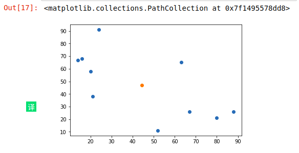

```python
plt.scatter(none,ntwo)
```

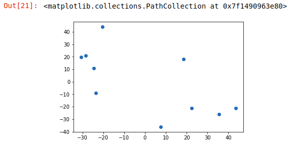


## DataFrame

DataFrame是一种表格形势的数据结构，可以看做是由Series组成的字典(共用同一个索引)。DataFrame由按一定顺序排列的多列数据组成，设计初衷是将Series的使用场景从一维拓展到多为。DataFrame既有行索引也有列索引

+ 行索引：index
+ 列索引：columns
+ 值：values(numpy的二维数组)

```python
df = pd.DataFrame(data=np.random.randint(1,10,(5,4)),columns='ABCD',index=list('金木水火土'))
df
```

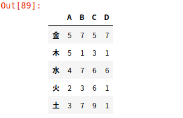

### DataFrame的创建

最常用的方法是传递一个字典来创建，DataFrame以字典的键作为每一列的名称，以字典的值(一个数组)来作为每一列

此外，DataFrame会自动加上每一行的索引(和Series一样)

同样Series一样，若传入的列与字典的键不匹配，则相应的值为NaN

### DataFrame的属性

+ values：获得所有的元素值
+ cloumns：获得所有列索引
+ index：获得所有行索引
+ dtypes：获得数据的类型
+ shape：获得数据的形状
+ ndim：获得数据的维数

练习4：

根据以下考试成绩表，创建一个DataFrame，命名为df：

​	       张三  李四

语文   150      0
数学   150      0
英语   150      0
理综   300      0

```

```

```python
df = pd.DataFrame(data=[[150,0],[150,0],[150,0],[300,0]],columns=['张三','李四'],index=['语文','数字','英语','理综'])
df
```

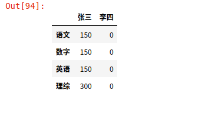

### DataFrame的索引

+ 对列进行索引
  + 通过类似字典的方式
  + 通过属性的方式

可以将DataFrame的列获取为一个Series。返回的Series拥有原DataFrame相同的索引，且name属性也已经设置好了，就是相对应的列

```python
df = pd.DataFrame(data=np.random.randint(1,10,(5,4)),columns='ABCD',index=list('金木水火土'))

# dataframe只能取列索引，要想取行索引，得先取列再取行
df['A']

df.A

# 取两列
df[['A','B']]
```

+ 对行进行索引
  + 使用.loc[]加index来进行行索引
  + 使用.iloc[加整个来进行索引

同样返回一个Series，index为原来的columns

```python
# 显式索引和隐式索引需要先取行再取列
df.loc['金','A']

# 取第一行数据
df.iloc[0]

# 取第一列数据
df.iloc[:,0]
```

### DataFrame的切片

+ 使用行索引loc进行切片

```python
# []取值的话只能取 列
# []切片只能取行

df['金':'土']

#显示索引的主要作用是取值
df.loc["金":'水',"A":"C"]
```

+ 隐式索引iloc进行切片

```python
#隐式索引适合切片
df.loc[:100,10:]
```

### DataFrame的运算

+ DataFrame之间的运算
  - 在运算中自动对齐不同索引的数据
  - 如果索引不对应，则补NaN

```python
# dataframe类型转置
df.T

# 乘法
df.dot(df.T)

df1 = pd.DataFrame(data=np.random.randint(0,100,(5,4)),index=list('东南西北中'),columns=list('QWER'))
df1

#datafrarm也是做值存储和查找的
df.dot(df1.T)  # 报错
```

DataFrame的运算方法

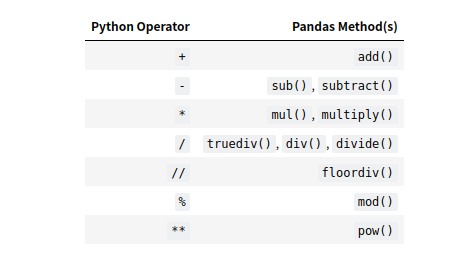

### Series与DataFrame之间的运算

+ 使用python操作符：以行为单位操作(参数必须是行)，对所有的行都有效。类似于numpy中二维数组与一维数组的运算，但是可能出现NaN
+ 使用pandas操作函数
  + axis = 0：以列为单位操作(参数必须是列)，对所有的列都有效
  + axis = 1：以行为单位操作(参数必须是列)，对所有的行都有效

多维的数据乘一维会将多维数据进行降维，其他维度的乘法都不会进行降维

```python
A = np.random.randint(0,100(5,4,3))
A
```

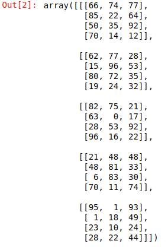

```python
b = np.random.randint(0,10,4)
b

# 注意 一维加三维 一维的元素个数必须和三维数据的最后一维的列数相等 否则无法运算
b+A
```

```python
# 乘法时，使用dot函数 此时一维数据的元素个数必须和三维数据的第二维的列数相等 才能进行正常的乘法运算
np.dot(b,A)
```

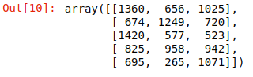

三维乘二维

```python
A = np.random.randint(0,100,(5,4,3))

b = np.random.randint(0,10,(3,4))

np.dot(A,b)
```


四维乘二维 

```python
A = np.random.randint(0,10,(6,5,4,3))
b = np.random.randint(0,10,(5,4,3))

np.dot(A,b)
```

四维乘一维

```python
A = np.random.randint(0,100,(6,5,4,3))
b = np.random.randint(0,10(3))

np.dot(A,b)

```

```python
import matplotlib.pyplot ad plt

cat = plt.imread('cat.jpg')
plt.imshow(cat)

new = (np.dot(cat,[.29,.58,.13]))
plt.imshow(new, cmap='gray')

plt.imshow(np.meat(cat, axis=-1), cmap='gray')
```

### 处理丢失数据

+ python中有两种
  + np.nan
  + None

```python
import pandas as pd

pd.Series([1,None,2,np.nan])
```

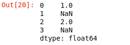

### pandas中对于空的操作

+ isnull()
+ notnull()
+ dropna():过滤空值
+ fillna():填充空值

```python
df = pd.DataFrame(data=np.random.randint(0,100,(5,3)), columns='ABC', index=list('金木水火土'))

df.iloc[3,2] = np.nan
df.iloc[2,1] = np.nan

df
```

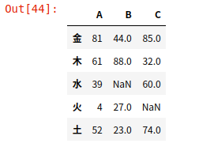

```python
# 判断哪些列中有nan
# isnull()函数的返回值为布尔类型。如果是nan怎返回True  sum()求和 True为1 当结果部位0时 则存在nan
df.isnull().sum()
```

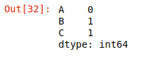

+ dropna()：过滤nan

```python
# all全部的行为nan
# any某一行中有一个值为nan
# inplace 把原数组的值进行替换
df.dropna(axis=0, how='any', inplace=True)

# 如果列中的值大部分都是空的那么删除列
# 如果行中的值为空的比较多 则删除行
```

+ fillna()：填充

```python
# 众数
a = np.array([1,1,7,7,7,7,7,3,5])
index = []
for i in np.unique(a):
    index.append(np.sum(a==i))
    
index = np.array(index)
np.unique(a)[np.argmax(index)]
```

```python
# 中位数
import math
b = np.array([1,7,3,6,1,1.2,4,8])
b.sort()
m = None
if len(b)%2:
    m = b[math.ceil(len(b)/2)]
else:
    one = len(b)/2
    two = len(b)/2-1
    m = (b[int(one)] + b[int(two)])/2
    
m
```

```python
#使用fillna进行填充时，一般使用众数进行填充
# 相似数据 一般用前后填充

#  ffill，pad 使用同一行或列(由axis指定)的前一个数据进行填充  bfill,backfill同一行或列(由axis指定)的后一个数据进行填充
df.fillna(method='ffill', axis=0)
```

