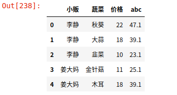

# 数据分析-07

## 数据处理

### 数据清洗

#### 空值过滤

#### 数据去重

```python
import numpy as np
import pandas as pd
import matplotlib.pyplot as plt
```

```python
df = pd.DataFrame(dict(姓名=['赵本山','宋小宝','小沈阳','赵本山','郭冬临'], 编号=[1,2,3,1,4]))
df
```


```python
# 使用函数进行数据的去重
res = []
for i in range(len(df)):
    a,b = df.loc[i]
    str_ = str(a) + '-' + str(b)
    res.append(str)
    
res
```


```python
set_ = set(res)
for i in res:
    if n in set_:
        print(False, n)
        set_.remove(n)
    else:
        print(True,n)
```


什么是重复数据？

两行数据的每一列的数据都相同 就算是重复数据

如何获取重复数据的索引?

```python
drop_cond = df.duplicated()

drop_index = df.loc[drop_cond].index
df.drop(labels=drop_index, axis=0,inplace=True)

# 删除重复数据后 元素的行索引不正确 需要进行重新赋值
#行索引的范围就是样本数量的范围
df.index = range(len(df))
df

# 删除重复数据
df.drop_duplicates()
```

冗余信息：冲复数句中第一次出现的数据

检测冗余数据

删除的是冗余数据

```python
cat = plt.imread('cat.jpg')
plt.imshow(cat)
```


```python
cat_color = pd.DataFrame(cat.reshape(-1,3), columns=list('RBG'))

cat_color.shape

cat_color.duplicated().sum()

len(cat_color.drop_duplicates())
```

### 映射

+ map()
+ apply()
+ transform()
+ replace()：替换DataFrame中的值
+ rename()：替换行索引

```python
df = pd.DataFrame(dict(汽车品牌=['夏利','奥拓','五菱','众泰','时风'], 价格=[10000,'?',50000,100000,np.nan]))
df
```


```python
# 将一些奇异的数值替换成nan
dict_ = {'?':np.nan, '??':np.nan,'&':np.nan}
df.replace(dict_, inplace)
# 对nan进行填充
df.fillna(value=0)
```

+ rename

```python
# 替换行索引
# mapper = dict()
index = {0:'郭靖',1:'虚竹',2:'无名',3:'独孤求败',4:'风清扬',5:'琦玉',6:'火云邪神'}
df.rename(index)
```


+ map

```python
df = pd.DataFrame(data=np.random.randint(10,100,(5,3)), idnex=list('东南西北中'), columns=['化学','地理','生物'])
df
```


```python
def create(item):
    if item<60:
        return '渣渣'
    elif item > 79:
        return '学霸'
    else:
        return '混子'
```

```python
# 对化学成绩进行评估 渣渣:<60  60-80 混子  >80学霸
# map函数的参数要求是一个字典 或者 自定义函数
# map 自带遍历的功能
df['评估'] = df['化学'].map(create)

df
```


```python
# 离散值映射成可计算值    男 女  ---->    1 0
df['sex'] = list('男男女女男')

def change(item):
    unq = df.sex.unique()
    for i in range(len(unq)):
        if item == unq[i]:
            return i
        
        
df
```


```python
df['sex'] = df.sex.map(change)

d = {0:'男', 1:'女'}
df['sex'] = df.sex.map(d)
```

### 异常检测

```python
df = pd.DataFrame(data=np.random.normal(loc=90, scale=30, size=(50,3)), columns=['化学','地理','生物'])

df.describe()
```


```python
df.plot(kind='box')
```


异常值临界点：
$$
mean - 3 * \sigma
$$

### 数据的聚合

+ 分组

+ 函数处理
+ 合并

```python
df = pd.DataFrame({"小贩":['李静','李静','李静','姜大妈','姜大妈','姜大妈','喵大爷','喵大爷','喵大爷','喵大爷'],
                  "蔬菜":['秋葵','大蒜','韭菜','金针菇','木耳','秋葵','大蒜','韭菜','金针菇','木耳'],
                  "价格":np.random.randint(10,25,10)})
df
```


```python
# 拿到每一种蔬菜的数量
df.groupby(by=['蔬菜']).价格.count()

df.groupby(by='蔬菜').价格.min()

# 查找每一种蔬菜的均值 然后把均值添加为一列
# map函数不能被Groupby对象调用
df['均值 '] = df.groupby(by='蔬菜').价格.transform(np.mean)

df.head()
```



```python
a = pd.DataFrame(df.groupby(by='蔬菜').价格.apply(np.mean))

pd.merge(df,a,left_on='蔬菜', right_index=True).sort_index()
```


###  离散化和分箱

+ 数字类型  普遍是连续的
+ 字符串类型  离散的
+ 时间类型 一般认为是连续的

pd.cut()数据离散化

```python
usa = pd.read_csv('usa_election.csv')
usa.head()


usa.cand_nm.unique()

usa.contb_receipt_amt.sum()

# pd.cut()自带遍历
# bins 范围必须是一个序列类型
bins = [0,1,10,100,1000,10000,100000,1000000,1000000,10000000,100000000]
usa['contb_receipt_amt_cut'] = pd.cut(usa.contb_receipt_amt,bins)

usa.head()
```

### 重采样

降采样(频度变换) 把日的数据变成月的数据

resample() 要求行索引是时间类型序列

```python
usa.contb_receipt_td =  pd.to_datatime(usa.contb_receipt_dt)

# 行索引
usa.set_index(keys='contb_receipt_dt', inplace=True)

usa.sort_index()

usa.cand_nm.unique()

data = usa.query("cand_nm=='Obama Barack' | cand_nm=='Romney, Mitt'")

# 投票数据进行统计
# rule D天 M月 Y年
# select count(amt) from data group by cand_nm;
vs_month = data.groupby(by='cand_nm').resample('M')['contb_receipt_dt'].count().unstack(level=0)

vs_month.plot(kind='bar')
```

```python
vs_month.plot(kind='area', figsize=(32,10), alpha=0.5)

# dpi清晰度
plt.savefig('vs_month.jpg', dpi=100)
data.columns
```


```python
# 分析每个州两个候选人分别投了多少票
vs_state = data.groupby(by=['cand_nm', 'contbr_st'])['contb_receipt_amt'].count().unsatck(level=0)

vs_state.fillna(value=0, inplace=True)

# 堆叠图 是一个比例图
state_rate = vs_state.div(vs_state.sum(axis=1), axis=0)

state_rate.plot(kind='bar', figsize=(32,16),stacked=True)
```

