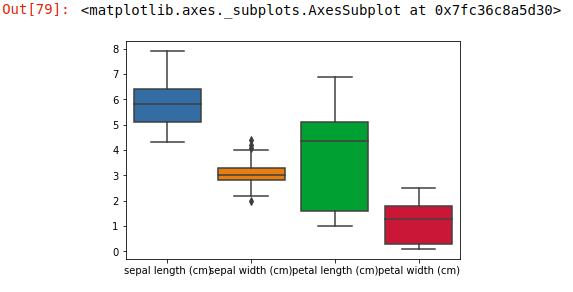

# 机器学习-01

+ 机器学习->机器学习算法->程序的迭代
+ 传统机器学习(在公司的数据挖掘中比较适用):有监督(有目标值)
+ 强化学习:在学习的基础,机器自己训练自己
+ 深度学习:图像识别,自然语言处理

## 机器学习的介绍

机器学习不断的进步，应用场景相当广泛，例如推荐系统、定向广告、需求预测、垃圾

邮件过滤、医学诊断、自然语言处理、搜索引擎、欺诈检测、证券分析、视觉识别、语

音识别、手写识别、频率识别等等

### 机器学习架构

机器学习（Machine Learning）通过算法、使⽤历史数据进⾏训练，训练完成后会产⽣

模型。未来当有新的数据提供时，我们可以使⽤训练产⽣的模型进⾏预测。机器学习训

练⽤的数据是由Feature、Label组成的。

+ Feature :数据的特征,也叫做特征列，例如湿度、⻛向、季节、⽓压。
+ Label：数据的标签，也叫做⽬标值，例如降⾬（0.不会下⾬，1.会下⾬），天⽓状况（1.晴天，2.⾬天，3.阴天，4.雾


1. 训练阶段(Training)

   训练数据是过去累计的历史数据 可能是文本文件、数据库文件或者是其他的来源。经过Feature Extraction(特征提取)，产生Feature(数据特征)于Label(预测数据)，然后经过机器学习算法的训练后产生模型

2. 预测阶段(Predict)

   新输入的数据，经过Feature Extraction(特征提取)产生Feature(数据特征)，使用训练完成的模型进行预测，最后产生预测结果

### 机器学习分类

+ 有监督学习

  对于有监督的学习（Supervised Learning），从现有数据我们希望预测的答案有下列分类。

  + 二元分类：我们已知湿度、风向、风俗、季节、气压等数据特征 希望预测当天是否下雨(0.不回下雨，1，会下雨)
  + 多元分类：我们已知湿度、风向、风俗、季节、气压等数据特征，希望预测当天的天⽓（1.晴天，2.⾬天，3.阴天，4.雾天）。⽬标Label有多个选项。
  + 回归分析：我们已知湿度、⻛向、⻛速、季节、⽓压等数据特征，希望预测当天的⽓温。⽬标Label是⼀个连续值，是⼀种⽅程的计算⽅法

+ 无监督学习

  对于⽆监督的学习（Unsupervised Learning），从现有的数据我们不知道要预测的答案，所以没有Label（预测的⽬标）。

  + cluster聚类分析：⽬的是将数据分成⼏个相异性最⼤的群组，⽽群组内的相似度最高

+ 机器学习算法类别概括图表


| 分类       | 算法                                     | Feature(特征)                         | Label(预测)                  |
| ---------- | ---------------------------------------- | ------------------------------------- | ---------------------------- |
| 有监督学习 | 二元分类(Binary<br/>Classification)      | ⻛向、⻛速、季节、⽓压等<br/>数据特征 | 只有0,1的选项                |
| 有监督学习 | 多元分类(Multi-Class<br/>Classification) | ⻛向、⻛速、季节、⽓压等<br/>数据特征 | 有多个选项                   |
| 有监督学习 | 回归分析(Regression)                     | ⻛向、⻛速、季节、⽓压等<br/>数据特征 | 值是一个范围(-10,30)度的范围 |
| 无监督学习 | 聚类分析(Clustering)                     | ⻛向、⻛速、季节、⽓压等<br/>数据特征 | 无Label, 物以类聚            |

### 机器学习的四个阶段


+ 数据准备阶段

  原始数据(可能是文本文件，数据库或其他来源)经过数据转类，提取数据特征 提取特征字段与标签字段，产生机器学习所需要的格式，然后将数据以随机方式分为3部分(trainData、vaidationData、testData)并返回数据，供下一阶段的训练评估

+ 训练评估阶段

  我们将使⽤ trainData数据进⾏训练，并产⽣模型，然后使⽤validationData验证模型的准确率。这个过程要重复很多次才能够找出最佳的参数的组合。评估⽅式：⼆元分类使⽤AUC、多元回归使⽤accuracy、回归分析使⽤RMSE。训练评估完成后，会成产⽣⼀个最好的模型bestModel

+ 测试阶段

  之前阶段产⽣了最佳模型bestModel，我们会使⽤另外⼀组数据testData再次测试，以避免overfitting(过拟合)的问题。如果训练评估阶段准确度很⾼，但是测试阶段的准确度很低，代表可能有overfitting的问题。如果测试与训练评估阶段的结果准确度差异不⼤，代表没有没有overfitting问题。

+ 预测阶段

  新输⼊的数据，经过Feature Extraction（特征提取）产⽣Feature（特征），使⽤训练完成的最佳模型，也就是bestModel进⾏预测，最后产⽣⽐较不错的预测结果。

## K-近邻值算法

KNN算法是有监督的学习,数据必须带有目标值

要求数据的样本要平衡

k值的作用:找周围离自己最近的几个数据

数据处理

+ 建立模型->训练数据->模型评估->预测数据
+ 机器学习应对的三种数据:结构化数据,半结构化数据(html),非结构化数据


### K-近邻值算法

- 定义：如果一个样本在特征空间中的k个最相似(即特征空间中最近邻)的样本中的大多数属于某一类别，则该样本也属于这个类别
- 简单的说 K-近邻算法采用测量不同的特征值之间的距离方法进行分类

  + 优点：精准度高、对异常值不敏感、无数据输入假定
  + 缺点：时间复杂度高、空间复杂度高
  + 使用数据范围：数值型和标称型

### 工作原理

存在一个样本数据集合，也称作训练样本集，并且样本集中每一个数据都存在标签，即我们知道样本集中每一个数据与所属分类的对应关系，输入没有标签的新数据后，将新数据的每一个特征与样本集中数据对应的特征进行比较，然后算法提取样本集中特征最相似数据(最近邻)的分类标签。一般来说，我们只选择样本数据集中前K个最相似的数据，这就是K-近邻算法中K的出处，通常*K是不大于20的整数，最后，选择K个相似数据中出现次数最多的分类，作为新数据的分类


### 算法公式

两个样本的距离可以通过如下公式计算，又叫欧式距离，关于距离公式会在后面进行讨论


#### 分类

K-NN针对于离散型分类目标的一种非线性多分类，基于加权距离的最大投票方案算法，公式如下：
$$
f(z)=max_j\sum_{i=1}^k\psi(d_y)I_y
$$

+ 预测函数f(z)是所有分类j的最大加权值
+ 预测数据点到训练数据点的加权距离用$\psi(d_y)$表示
+ $I_y$是指表示函数，表示数据点i是否属于分类j时，指数函数为1，否则为0。同时k是距离预测数据点最近的训练数据个数

#### 回归

K-NN针对于连续类型回归目标，预测值是所有k个最近邻域数据点到预测数据点的加权平均，公式如下：

$$f(z)=\frac{1}{k}\sum_{i=1}^k\psi(d_i)$$

在K-NN中可以发现，预测值严重依赖距离度量$\psi(d)$方式的先择，需要的距离度量方式是L1范数和L2范数 公式如下：

#### L1和L2范数距离

+ L1范数距离(曼哈顿距离)：

$$
\psi d_{L1}(x_i,x_j)=|x_i-x_j|=|x_{i1}-x_{j1}|+|x_{i2}-x_{j2}|+...+|x_{in}-x_{jn}|
$$

+ L2范数距离(欧⼏⾥得距离):

$$
d_{L2}(x_i,x_j)=||x_i-x_j|| = \sqrt {(x_{i1}-x_{j1})^2+(x_{i2}-x_{j2})^2+...+(x_{in}-x_{jn})^2}
$$

+ 闵可夫斯基(knn中使⽤的)

  + 当p=1的时候，它是曼哈顿距离
  + 当p=2的时候, 它是欧式距离
  + 当p不选择的时候,它是切⽐雪夫

  $$ d_{12}=p\sqrt{\sum_{i=1}^k|x_{1k}-x_{2k}|^p}$$

### K值选择

K值选择问题，李航博⼠的⼀书 统计学习⽅法 上所说：

+ 选择较小的K值，就相当于⽤较小的领域中的训练实例进⾏预测，“学习”近似误差会减小，只有与输⼊实例较近或相似的训练实例才会对预测结果起作⽤，与此同时带来的问题是“学习”的估计误差会增⼤，换句话说，K值的减小就意味着整体模型变得复杂(指的是数值发⽣⼀点点改变，分类结果就不相同了，模型的泛化性不佳)，容易发⽣过拟合；

+ 选择较⼤的K值，就相当于⽤较⼤领域中的训练实例进⾏预测，其优点是可以减少学习的估计误差，但缺点是学习的近似误差会增⼤。这时候，与输⼊实例较远（不相似的）训练实例也会对预测器作⽤，使预测发⽣错误，且K值的增⼤就意味着整体的模型变得简单。
+ K=N（N为训练样本个数），则完全不⾜取，因为此时⽆论输⼊实例是什么，都只是简单的预测它属于在训练实例中最多的类，模型过于简单，忽略了训练实例中⼤量有⽤信息


在实际应⽤中，K值⼀般取⼀个⽐较小的数值，例如采⽤交叉验证法（简单来说，就是把训练数据在分成两组:训练集和验证集）来选择最优的K值。对这个简单的分类器进⾏泛化，⽤核⽅法把这个线性模型扩展到⾮线性的情况，具体⽅法是把低维数据集映射到⾼维特征空间。

+ 近似误差：对现有训练集的训练误差，关注训练集，如果近似误差过小可能会出现过拟合的现象，对现有的训练集能有很好的预测，但是对未知的测试样本将会出现较⼤偏差的预测。模型本⾝不是最接近最佳模型。

+ 估计误差：可以理解为对测试集的测试误差，关注测试集，估计误差小说明对未知数据的预测能⼒好，模型本⾝最接近最佳模型

### ⽋拟合和过拟合

定义

+ 过拟合：⼀个假设在训练数据上能够获得⽐其他假设更好的拟合， 但是在测试数据集上却不能很好地拟合数
  据，此时认为这个假设出现了过拟合的现象。(模型过于复杂)

+ ⽋拟合：⼀个假设在训练数据上不能获得更好的拟合，并且在测试数据集上也不能很好地拟合数据，此时认
  为这个假设出现了⽋拟合的现象。(模型过于简单)


原因以及解决办法

⽋拟合原因以及解决办法

+ 原因：学习到数据的特征过少

+ 解决办法：
  + 添加其他特征项，有时候我们模型出现⽋拟合的时候是因为特征项不够导致的，可以添加其他特征项来很好地解决。例如，“组合”、“泛化”、“相关性”三类特征是特征添加的重要⼿段，⽆论在什么场景，都可以照葫芦画瓢，总会得到意想不到的效果。除上⾯的特征之外，“上下⽂特征”、“平台特征”等等，都可以作为特征添加的⾸选项。
  + 添加多项式特征，这个在机器学习算法⾥⾯⽤的很普遍，例如将线性模型通过添加⼆次项或者三次项使模型泛化能⼒更强。

过拟合原因以及解决办法

+ 原因：原始特征过多，存在⼀些嘈杂特征， 模型过于复杂是因为模型尝试去兼顾各个测试数据点
+ 解决办法：
  + 重新清洗数据，导致过拟合的⼀个原因也有可能是数据不纯导致的，如果出现了过拟合就需要我们重新清洗数据。
  + 增⼤数据的训练量，还有⼀个原因就是我们⽤于训练的数据量太小导致的，训练数据占总数据的⽐例过小。
  + 减少特征维度，防⽌维灾难
  + 对于Knn来说,近邻的数量⾮常的重要


```python
# 读取excel文件 sheet_name是选取第几张表，从0开始
m = pd.read_excel('tests.xlsx', sheet_name=1)
m
```


```python
# 1.数据准备 --> 数据清理  --> 特征提取
# 要求特征必须是二维的
features = m.iloc[:,1:-1]
# labels的数据必须和特征是一致的
labels = m.iloc[:,-1]

# 2.建立模型
# n_neighbors=5 n_neighbors相当于k值   n_jobs=1  数学计算 进程 p=2
knn = KNeinghborsClassifier(n_jobs=2)
# 适应=训练
# x是特征   y是目标
knn.fit(features, labels)

# 3.评估模型
knn.score(features, labels)

# 4.测试模型
new_m = np.array([['双子杀手',100,0,'动作片'],,['前任3',3,50,'爱情片'],['海王',30,20,'动作片'],['天气之子',0,30,'爱情片']])

x_test = new_m[:,1:-1].astype(np.int32)
y_test = new_m[:,-1]

# 预测
knn.predict(x_test)


# 测试评估
knn.score(x_test, y_test)

l = labels.map({'动作片':0,'爱情片':1})
plt.scatter(features.iloc[:,0], features.iloc[:,1],c=l,cmap='rainbow')
plt.scatter(x_test[:,0],x_test[:,1])
```


### 欧几里得距离

欧氏距离是最常见的距离度量，衡量的是多为孔家安中各个节点之间的绝对距离，公式如下：
$$
dist(X,Y)=\sqrt{\sum_{i=1}^n(x_i-y_i)^2}
$$
在scikit-clearn库中使用k-近邻算法

+ 分类问题：from sklearn.e=neighbors import KNeighborsClassifier
+ 回归问题：from sklearn.neighbors import KNeighborsRegressor

### 鸢尾花识别

```python
from sklearn.datasets import load_iris
from sklearn.model_selection import train_test_split
import seaborn as sns

rirs = load_iris()

data = iris.data
target = iris.target
target_names  = iris.target_names
feature_names = iris.feature_names

irisdf = pd.DataFrame(data=data, columns=feature_names)

irisdf['labels'] = target_names[target]

# 异常值检测
irisdf.describe()

# 绘制箱形图
sns.boxplot(data=irisdf)
```



```python
o = data[:,[0]]
l = datap[:,2:]
data_ = np.concatenate([o,l], axis=1)

# 数据切分 训练数据 和 测试数据
x_target, x_test, y_target, y_test = train_test_split(data_, target, test_size=0.1)

# 优化算法 网格搜索 超参数 
knn = KNeighborsClassifier(n_neighbors=1).fit(x_target, y_target)

knn.score(x_target, y_target)  # 1.0

knn.score(x_target, y_test)  # 1.0
```

