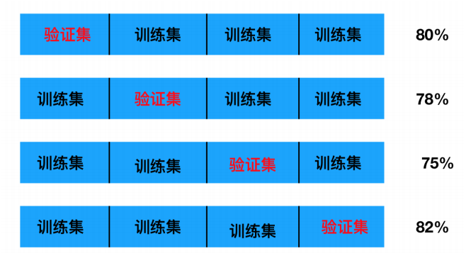

# 机器学习-02

### KNN的优缺点

+ 优点：
  + 简单有效
  + 重新训练的代价低
  + 对于异常值不太敏感(基于领域分类)
+ 缺点：
  + 时间复杂度高，空间复杂度高
  + 惰性学习，效率低下
  + 输出的结果可解释性不强
  + 适用数据范围，数值型和标称型
  + 可解释性不强

### 手写识别

```python
import numpy as np
import matplotlib.pyplot as plt
import pandas as pd
from sklearn.model_selection import train_test_split
from sklearn.neighbors import KNeighborsClassifier

zero = plt.imread('./knn_num_data/0/0_1.bmp')

shape = zero.shape

plt.imshow(zero)


data_ = []
target_ = []
for i in range(10):
    for i in range(1,501):
        data_.append(plt.imread(f'./knn_num_data/{i}/{i}_{j}.bmp'))
        target_.append(i)
        
        
data_ = np.array(data_)
target_ = np.array(target_)


data_ = data_.astype(np.int64)
data_ = data_.reshape(5000, -1)

# 数据准备  测试的 训练
x_train, x_test, y_train, y_test = train_test_split(data_, target_, test_size=50)

# 建立模型
knn = KNeighborClassifier(n_neighbors=5, n_jobs=6).fit(x_train, y_train)

knn.score(x_train, y_train)
 
# 相关性分析 
# 数据的主对角线值 均为1 是每个数据与其他数据进行相关型对比
knn.corrcoef(data_)
```


序列化：dump、dumps

反序列化：load、loads

区别：

`pickle.dumps()`方法跟`pickle.dump()`方法的区别在于，`pickle.dumps()`方法不需要写入文件中，它是直接返回一个序列化的bytes对象

`pickle.loads()`方法跟`pickle.load()`方法的区别在于，`pickle.loads()`方法是直接从bytes对象中读取序列化的信息，而非从文件中读取

```python
# joblib的作用是相当于pickle 序列化和反序列化
from sklearn.externals import joblib

joblib.dump(knn, 'num.m')
```


### 使用Python实现knn

```python
import numpy as np
from sklearn.neighbors import KNeighborsClassifier
from sklearn.datasets import load_iris
from sklearn.model_selection import train_test_split

data = load_iris().data
target = load_iris().target

X_train,X_test,y_train,y_test = train_test_split(data,target,test_size=10)

knn = KNeighborsClassifier().fit(X_train,y_train)
knn.score(X_train,y_train),knn.score(X_test,y_test)


# 结果：(0.9714285714285714, 0.9)
```

python分装

```python
class KNN:
    # 进行初始化 构造方法
    def __init__(self, n_neighbors=5):
        self.k = n_neighbors
        
    def fit(self, x, y):
       self.x_train = x
       self.y_train = y
        return self
    
    def predict(self, x):
        x_test = np.array(x)
        # 获取预测数据的样本设置
        n_test_sample = len(x_test)
        # 预测数据和训练数据的L2距离
        dist = self.distance(x_test, n_test_sample)
        y_pred = np.zeros(shape=n_test_sample, dtype_sample, dtype=np.int8)
        for i in range(n_test_sample):
            # 获取类别
            cls_y = self.y_train[np.argsort(dist[i])[:self.k]]
            # 计算加权值
            y_pred[i] = np.argmax(np.bincount(cls_y))
            
        return y_pred
    
    
    def distance(self, x_test, n_test_sample):
        # 获取训练数据的样本数量
        n_train_sample = len(self.x_train)
        dist = np.zeros(shape=(n_test_sample, n_train_sample))
        for i in range(n_test_sample):
            # square是用来返回输入元素的平方
            dist[i] = np.sqrt(np.sum(np.square(x_test[i]- self.x_train), axis=1))
            
        return dist
    
    def score(self, x, y):
        # 准确率
        y = np.array(y)
        y_pred = self.predict(x)
        true = (y_pred==y).sum()
        return true/len(y)
            
```


```python
knn_.score(x_train, y_train)

# 结果：0.9714285714285714

knn_.score(x_test, y_test)

# 结果0.9

knn_.predict(X_test)

# 结果：array([0, 0, 1, 1, 0, 1, 0, 1, 0, 2], dtype=int8)
```

### 模型提升KD-Tree

k最近邻法的实现是线性扫描（以穷举搜索的⽅式进⾏距离测算，加权分类），即要计算输⼊实例与每⼀个训练实
例的距离。计算并存储好以后，再查找K近邻。当训练集很⼤时，计算效率⾮常的低下。

为了提⾼KNN最近邻搜索的效率，可以考虑使⽤特殊的结构存储训练数据，以减小计算距离的次数。

根据KNN每次需要预测⼀个点时，我们都需要计算训练数据集⾥每个点到这个点的距离，然后选出距离最近的k个
点进⾏投票。当数据集很⼤时，这个计算成本⾮常⾼，针对N个样本，D个特征的数据集，其算法复杂度为
O（DN^2）。

kd树：为了避免每次都重新计算⼀遍距离，算法会把距离信息保存在⼀个树状结构中，这样在计算之前从树结构查询距离信息，尽量避免重复计算。其基本原理是，如果A和B距离很远，B和C距离很近，那么A和C的距离也很远。

有了这个信息，就可以在合适的时候跳过距离远的点。(A和B这两个类别是近邻类，B和C是近邻类,A和C不相近)
原理：


+ ⻩⾊的点作为根节，上⾯的点归左⼦树，下⾯的点归右⼦树，接下来再不断地划分，分割的那条线叫做分割超平⾯（splitting hyperplane）
+ 在⼀维中是⼀个点，⼆维中是线，三维的是超平⾯


+ ⻩⾊点为根节点，⼀层⼦节点是红⾊，再下⼀层⼦节点是绿⾊，叶⼦节点为蓝⾊


总结：

⾸先通过⼆叉树搜索（⽐较待查询节点和分裂节点的分裂维的值，小于等于就进⼊左⼦树分⽀，⼤于就进⼊右⼦树分⽀直到叶⼦结点），顺着“搜索路径”很快能找到最近邻的近似点，也就是与待查询点处于同⼀个⼦空间的叶⼦结点；
然后再回溯搜索路径，并判断搜索路径上的结点的其他⼦结点空间中是否可能有距离查询点更近的数据点，如果有可能，则需要跳到其他⼦结点空间中去搜索（将其他⼦结点加⼊到搜索路径）。重复这个过程直到搜索路径为空


```python
from sklearn.datasets import load_iris
from sklearn.neighbors import KNeighborsClassifier

data = load_iris().data
target = load_iris().target
 
# 用参数algotithm(算法)进行算法设置   它的值有'auto', 'ball_tree', 'kd_tree', 'brute'几种
# kd_tree 就是选择kd_tree模型 如果选择auto或者不选默认为knn
kdtree = KNeighborsClassifier(algotithm='kd_tree').fit(data,target)
```

```python
# 获得运行时间
%time
kdtree.predict(data)

knn = KNeighborsClassifier(algorithm='auto').fit(data,target)
%time
knn.predict(data)
```


### 特征工程-特征预处理-幅度调整

什么是特征预处理？

通过⼀些转换函数将特征数据转换成更加适合算法模型的特征数据过程

两种常⽤的幅度调整的⽅式：

+ 归⼀化
+ 标准化

为什么我们要进⾏归⼀化/标准化？
特征的单位或者⼤小相差较⼤，或者某特征的⽅差相⽐其他的特征要⼤出⼏个数量级，容易影响（⽀配）⽬标结果，使得⼀些算法⽆法学习到其它的特征


#### 归一化

通过计算把数据归纳同一到指定范围中去
$$
x'=\frac {item-min}{max-min}
$$
$$x'' = x' * (mx-mi) + mi$$

+ item代表每列中索引从0开始到-1的元素
+ max为列表中的最大值，min为列中的最小值
+ ma为选定范围的最大值 mi为选定范围的最小值

直接调用接口函数使用

```python
from sklearn.preprocessing import MinMaxScaler

# 参数：feature_range=(0,1)为归一化调整的范围
sca = MinMaxScaler(feature_range=(1,3))
# fit的数据仅被保存在内存中 并没有被执行转换
sca.fit(data)
# 当数据被stransform以后才会被执行归一化
sca_data = sca.transform(data)

# 获取梅列中的最大值 返回一个向量
sca.data_max
# 将归一化的数据反转回去
sca_inverse_transform(sca_data)

```

```python
mm = MinMaxScaler(feature_range=(0, 1))
mm.fit(f)
data = mm.transform(f)

X_train,X_test,y_train,y_test = train_test_split(data,labels,test_size=69)
kdtree = KNeighborsClassifier().fit(X_train,y_train)

kdtree.score(X_train,y_train)  # 0.978
kdtree.score(X_test,y_test)   # 0.9710144927536232
```

python代码实现归一化

```python
class MMS:
    def __init__(self, feature_range=(0,1)):
        self.min = feature_range[0]
        self.max = feature_range[1]
        
    
    # 特征值处理
    def fit(self, x):
        print(f'MMS(copy=True, feature_range=({self.min}, {self.max}))')
        return self
        
    def transform(self, feature):
        data = np.array(feature)
        col_num = len(feature.columns)
        for i in range(col_num):
            min_ = data[:,i].min()
            max_ = data[:,i].max()
            
            x = (data[:,i]-min_)/(max_-min_)
            data[:,i] = x * (self.max-self.min)+self.min
        return data
```

#### 标准化

通过对原始数据进行变换把数据变换到均值为0，标准差为1的范围内

+ 分子是去中心化$item-mean$代表每个元素减去本列中的均值
+ 分母是列中的标准差$\sigma=\sqrt{\frac {\sum_{i=1}^k(item-mean)^2}{k}}$
+ 整体公式为$X = \frac{item-mean}{\sigma}$
+ 对于归一化来说：如果出现异常点，影响了最大值和最小值 那么结果显然会发生改变
+ 对于标准化来说：如果出现异常点 由于具有一定的数据量，少量的异常点对于平均值的影响并不大，从而方差改变较小

直接调用接口函数使用

```python
from sklearn.preprocessing import StandardScale

#处理之后每列来说所有数据都聚集在均值0附近标准差差为1
std_ = StandardScale()

#fit_transform = fit() + transform()函数
res = std_.fit_transform(data)

#X:numpy array格式的数据[n_samples,n_features]
#返回值：转换后的形状相同的array
```

```python
std_ = StandardScaler()

data_=std_.fit_transform(f)

data_.mean()

data_.std()

X_train,X_test,y_train,y_test = train_test_split(data_,labels,test_size=69)

kdtree = KNeighborsClassifier().fit(X_train,y_train)

kdtree.score(X_train,y_train)

kdtree.score(X_test,y_test)
```

python实现

```python
class StdScaler:
    def fit_transform(self, x):
        data = np.array(x)
        col_num = len(x.columns)
        for i in range(col_num):
            mean_ = data[:,i].mean()
            # dist[i] = np.sqrt(np.sum(np.square(X_test[i] - self.X_train),axis=1))
            std_ = np.sqrt((np.sum(np.square(data[:,i]-mean_)))/len(data[:,i]))
            x = (data[:,i]-mean_)/std_
            data[:,i] = x
            
        return data
```

### 网格搜索和交叉验证

#### 网格搜索

通常情况下，有很多参数是需要⼿动指定的（如k-近邻算法中的K值），这种叫超参数。但是⼿动过程繁杂，所以需要对模型预设⼏种超参数组合。每组超参数都采⽤交叉验证来进⾏评估。最后选出最优参数组合建⽴模型。


在代码的执⾏过程中是⼀个循环的过程，将每个不同的超参数进⾏笛卡⼉积组合，⽣成⼤量的模型，记录模型每次的准确率值，并找到准确率⽐较⾼的模型。是⼀种暴⼒尝试的⽅法


#### 交叉验证

交叉验证：将拿到的训练数据，分为训练和验证集。以下图为例：将数据分成4份，其中⼀份作为验证集。然后经过4次(组)的测试，每次都更换不同的验证集。即得到4组模型的结果，取平均值作为最终结果。⼜称4折交叉验证。

我们之前知道数据分为训练集和测试集，但是为了让从训练得到模型结果更加准确。做以下处理

+ 训练集：训练集+验证集

- 测试集：测试集



交叉验证的目的是为了让被评估的模型更加准确可信(泛化性更好)

```python
from sklearn.model_selection import GridSearchCV
gc = GridSearchCV(estimator,param_grid=None,cv=None)gc.fit(X_train,y_train)

#estimator：估计器对象
#param_grid：估计器参数(dict){“n_neighbors”:[1,3,5]}
#cv：指定⼏折交叉验证
#n_jobs:指定开启进程数量#gc.best_score_:在交叉验证中验证的最好结果#gc,best_estimator_:返回泛化性和准确率⽐较⾼的模型
#gc,best_params_:返回最优参数
#gc.cv_results_:每次交叉验证后的验证集准确率结果和训练集准确
```

```python
kdtree = KNeighborsClassifier()
param_grid = dict(n_neighbors=list(range(2,30)))
gc = GridSearchCV(kdtree, param_grid, cv=10, n_job=6)

gc.fit(x_train, y_train)


# 最好的一次训练结果
gc.best_score_

# 最好一次训练的超参数
gc.best_parmas_

# 最好的容器
kd = gc.best_estimator_

# 使用最好的容器进行训练
kd.score(x_train, y_train)

# 使用最好的容器进行预测
kd.score(x_test, y_test)
```


