# 机器学习-03

## 线性回归(`LinearRegression`)

### 线性回归的概念

回归是一种解题的方法，或者说是”学习的方法“，也是机器学习中比较重要的概念，回归一词的英文单词为Regression，单词的原型regress大致意思是”回退，倒退，退化“。其实Regression回归分析的意思借用了这么一层含义，室友果索引的过程，是一种归纳的思想当看到⼤量的事实所呈现的状态，推断出原因是如何的；当看到⼤量的数字的时候，推断出他们之间的关系是什么样的

线性回归是利用数理统计中的回归分析来确定两种集两种以上变量间相互依赖的定量关系的一种统计扥洗方法，公式$$y = ax + b + e 或f(x) = wx + b + c$$

$e$为误差服从均值为0的高斯分布

现实生活中很多东西和线性回归有着密切的关系，在气温预测，台分行径预测，风速预测，贷款金额预测等等

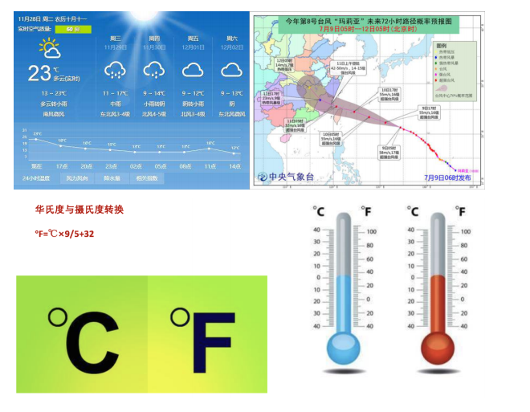我们经常使用的回归叫做多元一次回归方程：

$$h(w) = w_1x_1 + w_1x_2...+ w_nx_n + b + e = w^T+ b + c$$

其中w,x是一个矩阵，$w = \bigl( \begin{smallmatrix} b \\ w_1\\w_2 \end{smallmatrix} \bigr)$  $x=\bigl(\begin{smallmatrix} 1\\x_1\\x_2\end{smallmatrix}\bigr)$

用函数分段的方式表示：
$$
\left\{
\begin{aligned}
3*x_1 + x_2 = 10\\
0* x_1 + x_2 = 10\\
5 * x_1 + x_2 = 15
\end{aligned}
\right.
$$
矩阵的表现方式:
$$
A= \begin{bmatrix} 3&1\\0&1\\5&2\end{bmatrix}x=\begin{bmatrix}x_1\\x_2\end{bmatrix}b=\begin{bmatrix}10\\10\\15\end{bmatrix}\mapsto Ax=b
$$

### 线性回归的特征与目标的关系分析

线性回归当中主要有两种模型，一种是线性关系，另一种是非线性关系，在这里我们只能画一个平面更好去理解 ，所以都用单个特征或者两个特征举例子

+ 线性关系

  + 单变量线性关系

    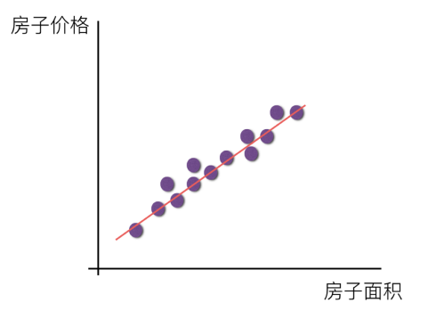

  + 多变量线性关系

    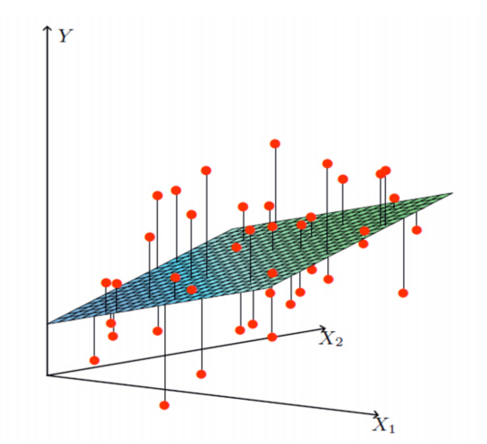

> 注释：单特征与目标值的关系呈直线关系，或者两个特征值与目标值呈现平面的关系

+ 非线性关系

  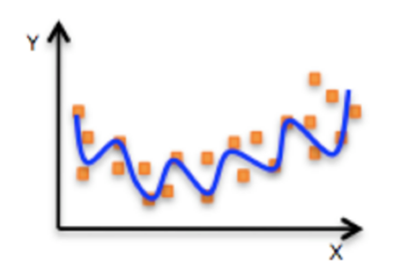

> 注释：为什么会这样的关系能？原因是什么？
>
> 如果是非线性关系，那么回归方程理解为：$w_1*1 + (w_2*2)^2 + (w_3*3)^2$

### 导数

(1) 常⻅的函数导数

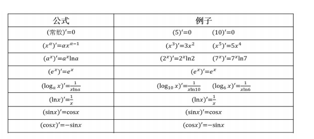

(2) 倒数的四则运算

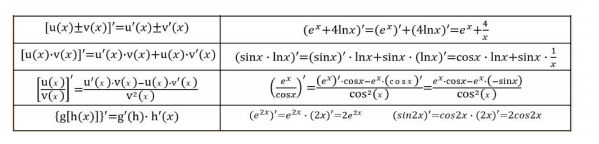

(3) 矩阵求导

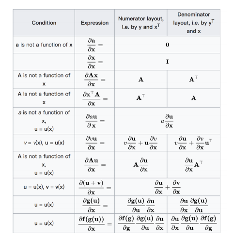

### 普通的线性回归

利用矩阵解方程

```txt
以一个具体的例子来看。假设一帮孩子和家长出去旅游，去程坐的是bus，小孩票价为3元，家长票价为3.2元,总价是118.4元；回程坐的是Train，小孩票价为3.5元，家长票价为3.6元,总价是135.2元。问题是分别求小孩和家长的人数。我们就可以用下列矩阵求之。
```

```python
import numpy as np

feature = np.matrix([[3,3.2],[3.5,3.6]])
lables = np.matrix([[118.4],[135.2]])

# 求逆矩阵
feature.I

# 用特征矩阵的逆矩阵乘上目标矩阵
np.dot(feature.I,lables)
```

```python
fe = np.array([
    [4000,25],
    [8000,30],
    [5000,28],
    [7500,33],
    [12000,40]
])

la = np.array([
    [20000],
    [70000],
    [35000],
    [50000],
    [85000]
])

# 导入线性回归模块
from sklearn.linear_model import LinearRegression

# LinearRegression函数的参数说明
# fit_intercept 在计算的时候有考不考虑误差
# normal  归一化

lrg = LinearRegression(fit_intercept=False).fit(fe, la)

# 决定系数
lrg = score(fe, la)   # 0.929394975338312

# 获取系数
lrg.coef_   # array([[   9.24570807, -507.04131571]])

# 获取误差
lrg_intercept    # 0.0

pred = np.dot(fe, lrg.coef_.T)

# 求逆矩阵
inv = np.linalg.inv(np.daot(fr.T, fe))
```


线性回归解方程

```python
lrg = LinearRegression(fit_intercept=False).fit(feature,lables)

# 系数就是方程的解
lrg.coef_   # array([[16., 22.]])
```


### 线性回归的损失函数

假设以波士顿房价为例，真实的数据之间存在这样的关系

> 真实关系：真实房价 = 0.02 \* 中心区域的距离 + 0.04\*城市一氧化碳浓度 +(-0.12\*自住房平均价格)+0.254×城镇犯罪率

那么现在，我们随机一个指定一个关系

> 随机指定关系：预测房子的价格 =  0.05 \* 中心区域的距离 + 0.14\*城市一氧化碳浓度 +0.42\*自住房平均价格+0.34×城镇犯罪率

上述的问题真是结果与我们预测的结果支架会存在一些误差

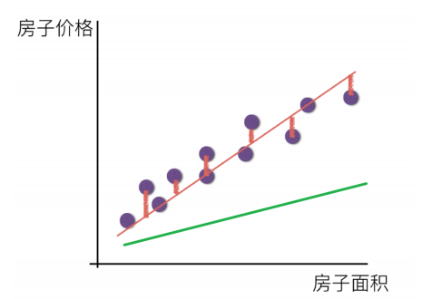

既然存在这个误差，那我们就将这个误差给衡量出来，那么衡量误差的公式就是损失函数。

预测⽬标公式为：$h_\theta(x) = \theta_0+\theta_1x_1+\theta_2x_2...+\theta_mx_m=\sum_{i=1}^m\theta^Tx$

损失公式定义为：

$J(\theta)=(h_\theta(x_1)-y_1)^2+(h_\theta(x_2)-y_1)^2+...+(h_\theta(x_m)-y_m)^2=\sum_{i=1}^m(h_\theta(x_i)-y_i)^2$

+ $y_i$为第 个训练样本的真实值
+ $h_\theta(x_i)$为第i个训练样本特征值组合预测函数
+ 这种⽅法在计算时使⽤了平⽅项，使误差为正膨胀值，⼜叫最⼩⼆乘法

如果$\sum_{i=1}^{m}(h_{\theta(x_i)-y_i})^2$ 说明没有损失，但有极⼤的可能是过拟


### 线性回归的常用解决方法

(1)最小二乘法

最小二乘法就是普通的方程推导直接求得结果的方程。公式为：

$w=(X^TX)^{-1}X^Ty$

$b=\frac{1}{2}\sum_{i=1}^{m}(y_i-\theta^Tx^i)^2$

> 理解：X为特征值矩阵，y为目标值矩阵。 直接求到最好结果

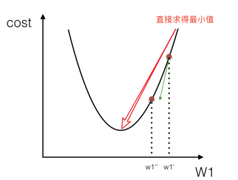

(a)最⼩⼆乘系数推导：

把该损失函数转换成矩阵写法：

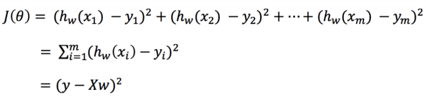

其中y是真实值矩阵，X是特征值矩阵，w是权重矩阵

对其求解关于w的最⼩值，起⽌y,X 均已知⼆次函数直接求导，导数为零的位置，即为最⼩值。求导：

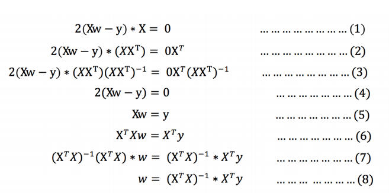

注：式(1)到式(2)推导过程中, X是⼀个m⾏n列的矩阵，并不能保证其有逆矩阵，但是右乘XT把其变成⼀个⽅阵，保证其有逆矩阵。式（5）到式（6）推导过程中，和上类似。

(b)最⼩⼆乘法误差推导：

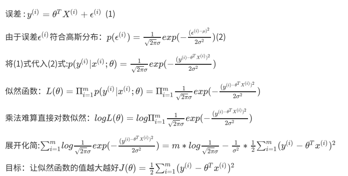

(5)最⼩⼆乘法总结：

> 优点 : 可以准确的求解得到当前样本的系数和误差
>
> 缺点 : 对于异常值的⽀持不好，模型⼏乎⼀直在过拟合。特征数量过多的时候，计算复杂度⼤，计算效率低下。

最小二乘法解银行借贷问题

```python
fe = np.array([
    [4000,25],
    [8000,30],
    [5000,28],
    [7500,33],
    [12000,40]
])

la = np.array([
    [20000],
    [70000],
    [35000],
    [50000],
    [85000]
])

np.dot(np.dot(np.linalg.inv(np.dot(fe.T, fe)), fe.T), la)
```

```
结果：
array([[   9.24570807],
       [-507.04131571]])
```

```python
fe=np.array([
    [4000,25],
    [8000,30],
])
la = np.array([
    [20000],
    [70000],
])
np.dot(np.dot(np.linalg.inv(np.dot(fe.T,fe)),fe.T),la)
```

```
结果
array([[   14.375],
       [-1500.   ]])
```

```python
f = np.array([[12000,40]])
w = np.array([[14.375],[-1500]])
np.dot(f,w)
```

```txt
array([[112500.]])
```

通过以上例子可以看出，数据量越少，的到数值的误差越大

### 梯度下降(Gradient Descent)的回归⽅程

(a)什么是梯度下降？

梯度下降法的基本思想可以类⽐为⼀个下⼭的过程。

假设这样⼀个场景：⼀个⼈被困在⼭上，需要从⼭上下来(i.e. 找到⼭的最低点，也就是⼭⾕)。那么如何快速的下⼭?寻找这个位置最陡峭的地⽅，然后朝着⼭的⾼度下降的地⽅⾛,对于计算机来说就是没⾛⼀段重新寻找坡度最陡峭的地⽅

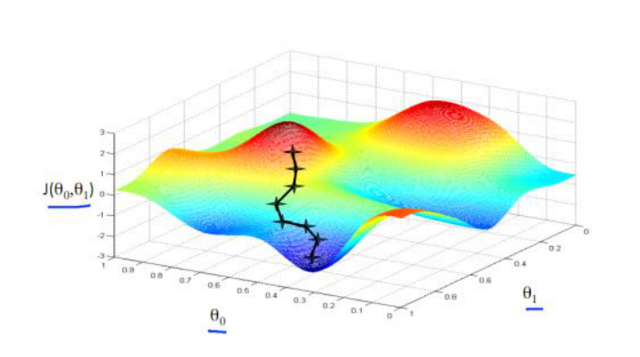

梯度下降的基本过程就和下⼭的场景很类似。

⾸先，我们有⼀个可微分的函数。这个函数就代表着⼀座

我们的⽬标就是找到这个函数的最⼩值，也就是⼭底。
根据之前的场景假设，最快的下⼭的⽅式就是找到当前位置最陡峭的⽅向，然后沿着此⽅向向下⾛，对应到函数中，就是找到给定点的梯度 ，然后朝着梯度相反的⽅向，就能让函数值下降的最快！因为梯度的⽅向就是函数之变化最快的⽅向。 所以，我们重复利⽤这个⽅法，反复求取梯度，最后就能到达局部的最⼩值，这就类似于我们下⼭的过程。⽽求取梯度就确定了最陡峭的⽅向，也就是场景中测量⽅向的⼿段。
(b)梯度的概念
梯度是微积分中⼀个很重要的概念

在单变量的函数中，梯度其实就是函数的微分，代表着函数在某个给定点的切线的斜率

在多变量函数中，梯度是⼀个向量，向量有⽅向，梯度的⽅向就指出了函数在给定点的上升最快的⽅向

这也就说明了为什么我们需要千⽅百计的求取梯度！我们需要到达⼭底，就需要在每⼀步观测到此时最陡峭的地⽅，梯度就恰巧告诉了我们这个⽅向。梯度的⽅向是函数在给定点上升最快的⽅向，那么梯度的反⽅向就是函数在给定点下降最快的⽅向，这正是我们所需要的。所以我们只要沿着梯度的反⽅向⼀直⾛，就能⾛到局部的最低点！

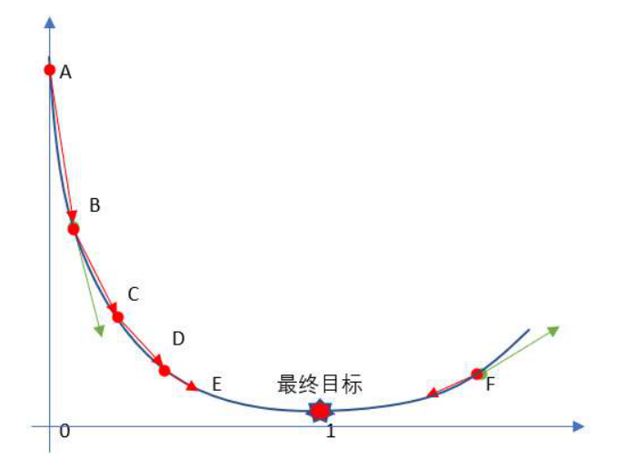

```python
import numpy as np
import matplotlib.pyplot as plt

x = p.arange(-5,5,0.001)
y = x**4 + 3*x**3 + 5

plt.plot(x,y)
```

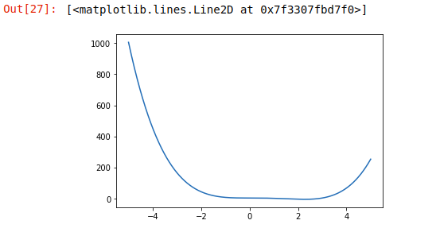

```python
# 定义一个步长
step = 0.001
# 上一次的值
old = 0
# 本次的值
new = 5
# 精度
pre = 0.0001
# 求导
def fun(x):
    return 4*x**3 - 9*x**2


while abs(new-old) > pre:
    print(new)
    old = new
    
    new = new - step*fun(old)
```


​    使用另外一种方式进行循环迭代

上面是通过精度来控制循环次数，下面是通过指定次数来控制循环次数

```python
#定义一个步长
step = 0.001
#上一次的值
old = 0
#本次的值
new = 5
#精度
pre = 0.0001
#求导
def fun(x):
    return 4*x**3 - 9*x**2
#迭代的次数
n = 0
while n < 2000:
    n += 1
    print(new)
    old = new 
new = new - step*fun(old)
```

经运行结果可以看出精度来控制循环，得到的结果会更加精准

随机梯度下降

由于FG每迭代更新⼀次权重都需要计算所有样本误差，⽽实际问题中经常有上亿的训练样本，故效率偏低，且容易陷⼊局部最优解，因此提出了随机梯度下降算法。

其每轮计算的⽬标函数不再是全体样本误差，⽽仅是单个样本误差，即每次只代⼊计算⼀个样本⽬标函数的梯度来更新权重，再取下⼀个样本重复此过程，直到损失函数值停⽌下降或损失函数值⼩于某个可以容忍的阈值。

此过程简单，⾼效，通常可以较好地避免更新迭代收敛到局部最优解。其迭代形式为

$\theta = \theta-\eta*\nabla_\theta J(\theta;x^{(i)};y^{(i)})$

每次只使⽤⼀个样本迭代，若遇上噪声则容易陷⼊局部最优解。

> 其中，x(i)表⽰⼀条训练样本的特征值，y(i)表⽰⼀条训练样本的标签值

但是由于，SG每次只使⽤⼀个样本迭代，若遇上噪声则容易陷⼊局部最优解。

```python
from sklearn.linear_model import SGDRegressor #随机梯度下降

# eta0=0.01   #步长
#1000
#数据量要大才可以使用SGD回归
sgd=SGDRegressor(fit_intercept=False).fit(fe,la)

sgd.coef_  # array([-2.40699285e+13, -1.46281432e+11])

sgd.score(fe,la)  # -6.478336574191482e+25
```

