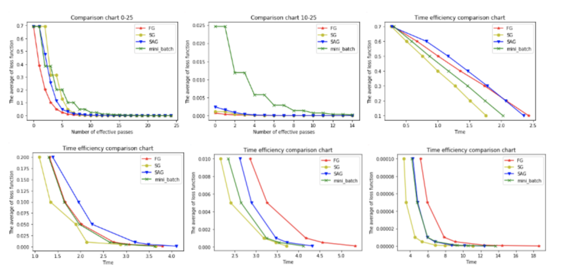
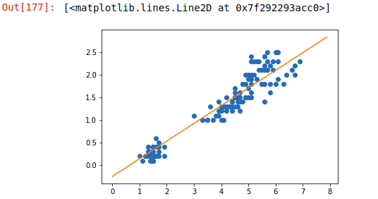
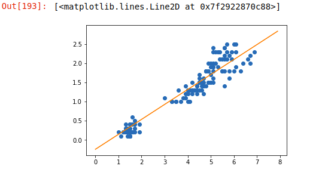
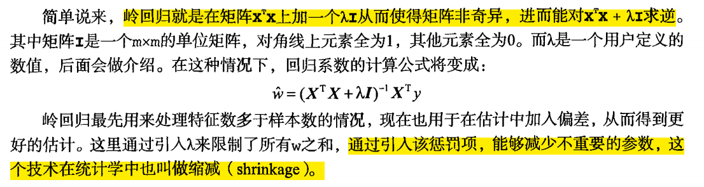

# 机器学习-04

## 梯度下降

### 梯度下降的种类

+ 全梯度下降算法(Full gradient descent)
+ 随机梯度下降算法(Stochastic gradient descent)
+ 随机平均梯度下降算法(Stochastic average gradient descent)
+ 小批量梯度下降算法(Mini-batch gradient descent)

它们都是为了正确的调节权重向量，通过为每个权重计算一个梯度，从而

更新权值，使目标函数尽可能最小化。其差别在于样本的使用方式不同

1. 全梯度下降算法(FG)

   计算训练集所有样本误差，对其求和在取平均值作为目标函数

   权重向量沿其梯度相反的方向移动，从而使当前目标函数减少得最多

   因为在执行每次更新时，我们需要在整个数据集上计算所有的梯度，所以批梯度下降的速度会很慢，同时，批梯度下降无法处理超过内存容量限制的数据集

   批梯度下降法同样也不能在更新模型，即在运行的过程中，不断增加新的样本

   其实在整个训练数据集上计算损失函数关于参数$\theta$的梯度：
   $$
   \theta=\theta-\eta*\nabla_\theta J(\theta)
   $$

2. 随机梯度下降算法(SG)

   由于FG每迭代更新⼀次权重都需要计算所有样本误差，⽽实际问题中经常有上亿的训练样本，故效率偏低，且容易陷⼊局部最优解，因此提出了随机梯度下降算法。

   其每轮计算的⽬标函数不再是全体样本误差，⽽仅是单个样本误差，即每次只代⼊计算⼀个样本⽬标函数的梯度来更新权重，再取下⼀个样本重复此过程，直到损失函数值停⽌下降或损失函数值⼩于某个可以容忍的阈值。

   此过程简单，⾼效，通常可以较好地避免更新迭代收敛到局部最优解。其迭代形式为：
   $$
   \theta=\theta-\eta*\nabla_\theta(\theta;x^{(i)};y^{(i)})
   $$
   每次只是用一个样本迭代，若遇上噪声则容易陷入局部最优解、

   > 其中，$x(i)$表示一条训练样本的特征值，$y(i)$表示一条训练样本的标签纸

3. 小批量梯度下降算法(mini-bantch)

   ⼩批量梯度下降算法是FG和SG的折中⽅案,在⼀定程度上兼顾了以上两种⽅法的优点。

   每次从训练样本集上随机抽取⼀个⼩样本集，在抽出来的⼩样本集上采⽤FG迭代更新权重。被抽出的⼩样本集所含样本点的个数称为batch_size，通常设置为2的幂次⽅，更有利于GPU加速处理。

   特别的，若batch_size=1，则变成了SG；若batch_size=n，则变成了FG.其迭代形式为：
   $$
   \theta=\theta-\eta*\nabla_\theta J(\theta;x^{(i:i+n)};y^{(i:i+n)})
   $$
   
4. 随机平均梯度下降算法(SAG)

   在SG⽅法中，虽然避开了运算成本⼤的问题，但对于⼤数据训练⽽⾔，SG效果常不尽如⼈意，因为每⼀轮梯度更新都完全与上⼀轮的数据和梯度⽆关。

   随机平均梯度算法克服了这个问题，在内存中为每⼀个样本都维护⼀个旧的梯度，随机选择第i个样本来更新此样本的梯度，其他样本的梯度保持不变，然后求得所有梯度的平均值，进⽽更新了参数。

   如此，每⼀轮更新仅需计算⼀个样本的梯度，计算成本等同于SG，但收敛速度快得多

5. 算法⽐较为了⽐对四种基本梯度下降算法的性能，我们通过⼀个逻辑⼆分类实验来说明。本⽂所⽤的Adult数据集来⾃UCI公共数据库（http://archive.ics.uci.edu/ml/datasets/Adult）。 数据集共有15081条记录，包括“性别”“年龄”“受教育情况”“每周⼯作时常”等14个特征，数据标记列显⽰“年薪是否⼤于50000美元”。我们将数据集的80%作为训练集，剩下的20%作为测试集，使⽤逻辑回归建⽴预测模型，根据数据点的14个特征预测其数据标记（收⼊情况）。

   以下6幅图反映了模型优化过程中四种梯度算法的性能差

在图1和图2中，横坐标代表有效迭代次数，纵坐标代表平均损失函数值。图1反映了前25次有效迭代过程中平均损失函数值的变化情况，为了便于观察，图2放⼤了第10次到25次的迭代情况。

从图1中可以看到，四种梯度算法下，平均损失函数值随迭代次数的增加⽽减少。FG的迭代效率始终领先，能在较少的迭代次数下取得较低的平均损失函数值。FG与SAG的图像较平滑，这是因为这两种算法在进⾏梯度更新时都结合了之前的梯度；SG与mini-batch的图像曲折明显，这是因为这两种算法在每轮更新梯度时都随机抽取⼀个或若⼲样本进⾏计算，并没有考虑到之前的梯度。

从图2中可以看到虽然四条折现的纵坐标虽然都趋近于0，但SG和FG较早，mini-batch最晚。这说明如果想使⽤mini-batch获得最优参数，必须对其进⾏较其他三种梯度算法更多频次的迭代。

在图3，4，5，6中，横坐标表⽰时间，纵坐标表⽰平均损失函数值。

从图3中可以看出使⽤四种算法将平均损失函数值从0.7降到0.1最多只需要2.5s，由于本⽂程序在初始化梯度时将梯度设为了零，故前期的优化效果格外明显。其中SG在前期的表现最好，仅1.75s便将损失函值降到了0.1，虽然SG⽆法像FG那样达到线性收敛，但在处理⼤规模机器学习问题时，为了节约时间成本和存储成本，可在训练的⼀开始先使⽤SG，后期考虑到收敛性和精度可改⽤其他算法。

从图4，5，6可以看出，随着平均损失函数值的不断减⼩，SG的性能逐渐反超FG，FG的优化效率最慢，即达到相同平均损失函数值时FG所需要的时间最久。

综合分析六幅图我们得出以下结论：

（1）FG⽅法由于它每轮更新都要使⽤全体数据集，故花费的时间成本最多，内存存储最⼤。

（2）SAG在训练初期表现不佳，优化速度较慢。这是因为我们常将初始梯度设为0，⽽SAG每轮梯度更新都结合了上⼀轮梯度值。

（3）综合考虑迭代次数和运⾏时间，SG表现性能都很好，能在训练初期快速摆脱初始梯度值，快速将平均损失函数降到很低。但要注意，在使⽤SG⽅法时要慎重选择步⻓，否则容易错过最优解。

（4）mini-batch结合了SG的“胆⼤”和FG的“⼼细”，从6幅图像来看，它的表现也正好居于SG和FG⼆者之间。在⽬前的机器学习领域，mini-batch是使⽤最多的梯度下降算法，正是因为它避开了FG运算效率低成本⼤和SG收敛效果不稳定的缺点

6. 梯度下降优化算法(拓展)

   以下这些算法主要⽤于深度学习优化

   + 动量法
     + 其实动量法(SGD with monentum)就是SAG的姐妹版
     + SAG是对过去K次的梯度求平均值
     + SGD with monentum 是对过去所有的梯度求加权平均
   + Nesterov加速梯度下降法
     + 类似于⼀个智能球，在重新遇到斜率上升时候，能够知道减速
   + Adagrad
     + 让学习率使⽤参数
     + 对于出现次数较少的特征，我们对其采⽤更⼤的学习率，对于出现次数较多的特征，我们对其采⽤较⼩的学习率。
   + Adadelta
     + Adadelta是Adagrad的⼀种扩展算法，以处理Adagrad学习速率单调递减的问题。
   + RMSProp
     + 其结合了梯度平⽅的指数移动平均数来调节学习率的变化。
     + 能够在不稳定（Non-Stationary）的⽬标函数情况下进⾏很好地收敛。
   + Adam
     + 结合AdaGrad和RMSProp两种优化算法的优点。
     + 是⼀种⾃适应的学习率算法

### 线性回归的API接口

+ 最小二乘法线性模型

  ```python
  from sklearn.linear_model import LinearRegression
  
  # 先进性实例化
  # 参数说明：
  # fit_intercept：有没有误差(截距)
  # n_jobs没有在作用，回归只能在一个进程中运行
  lrg = LinearRegression(fit_intercept=False)
  # 训练数据
  lrg.fit(x_train, y_train)
  # 训练结束后，可以获得w和b
  # 获取系数
  lrg.coef_
  # 获取误差
  lrg.intercept_
  ```

+ 随机梯度下降下降线性模型

  ```python
  from sklearn.linear_model import SGDRegression
  
  sgd = SGDRegressor(fit_intercept=False)
  # 参数说明
  # alpha=0.001      步长
  # eta = 0.01    学学习率
  # fit_intercept=True   是否计算误差
  # max_iter=1000  最大迭代次数
  # penalty=None  正则乘法项
  
  # 训练
  sgd.fit(x_train, y_train)
  
  # 获取参数
  sgd.coef_
  # 获取误差
  sgd.intercept_
  ```

python实现随机梯队下降回归

```python
# 全批量梯度下降回归,好处是计算的精确度要高,可以实现增量式机器学习,计算的效率要低
class LRD:
    def __init__(self, max_iter=1000, eta=0.01, w=None, b=None, fit_intercept=None, random_size=0.3):
        # 初始化系数
        self.coef_ = None
        # 初始化误差
        self.intercept_ = None
        
        self.learning_rate = eta
        
        self.rate = max_iter
        
        #随机抽样的比例
        self.num = random.size
        self.fit_intercept = fit_intercept
        
    # 训练
    def fit(self, x, y):
        x = np.array(x)
        y = np.array(y)
        
        # 获取样本数量和特征的数量
        sample_num, feature_num = x.shape
        
        if self.coef_ is None:
            self.coef_ = np.random.randn(feature_num, 1)
        if self.intercept is None:
            self.intercept_ = 0
            
        # 梯度下降
        for i in range(self.rate):
            num = int(smaple_num + self.num)
            # 随机抽样
            index = np.random.choice(smaple_num, num)
            
            random_x = x[index]
            random_y = y[index]
            
            # x,y
            # y-(wx+b) = loss 损失
            l1 = np.mean(np.abs(self.coef_))
            l2 = np.mean(np.square(self.coef_))
            h = np.dot(random_x, self.coef_+(l1*0.1*0.15)+(l2*0.1*0.85)) + self.intercept_
            #计算损失
            grad_w, gran_b = self.loss(random_x, random_y,h)
            
            # 进行系数和误差的微调
            self.coef_ -= slef.learning_rate*grad_w
            if self.fit_intercept:
                self.intercept_ -= self.learning_rate*grad_b
            else:
                self.intercept_ = 0
                
        self.coef_ = self.coef_.ravel()
        return self
    
    
    def loss(self, x,y,h):
        y = y.reshape(-1,1)
        smaple_num = len(y)
        
        grad_w = x.T.dot(h-y)/smaple_num
        grad_b = 0.5*np.sum(h-y)/smaple_num
        
        
    def predict(self, x):
        x_test = np.array(x)
        y_pred = x_test.dot(self.coef_) + self.intercept_
        return y_pred
```

```python
import numpy as np
from sklearn.linear_model import SGDRegressor #随机梯度下降
#统计需要的是统计意义
from sklearn.datasets import load_iris
import matplotlib.pyplot as plt
from sklearn.model_selection import train_test_split

iris = load_iris()
feature = iris.data[:,-2].reshape(-1,1)
labels = iris.data[:,-1]

lrg_ = LRG().fit(feature, labels)

lrg_.coef_, lrg_.intercept_

max_,min_ = feature.max()+1,feature.min()-1
```

```python
x = np.linspace(min_, max_, 100)
y = lrg_.coef_*x + lrg_.intercept_

plt.plot(feature, labels,lw=0,marker='o')
plt.plot(x,y)
```



```python
# 进行增量式机器学习，将得到的值，带入算法中，重新得到一实例，在进行训练
lrg_2=LRG(w=lrg_.coef_,b=lrg_.intercept_).fit(feature,labels)
lrg_2.coef_, lrg_2.intercept_

x = np.linspace(min_,max_,100)
y = lrg_2.coef_ * x + lrg_2.intercept_

plt.plot(feature,labels,lw=0,marker='o')
plt.plot(x,y)
```



### 正则化

### 岭回归L2范数

L2范数距离：欧式距离a = [3,2,-2]

数值膨胀

$\sum(item)^2$

L1范数距离：曼哈顿距离a = [3,2,-2]

数值膨胀

$\sum|item|$

岭回归原理

缩减系数来“理解”数据

如果数据的特征比样本点还多应该怎么办？是否还可以使用线性回归和之前的方法来做预测？

答案是否定的，即不能再使用前面介绍的方法。这是因为输入数据的矩阵X不是满秩矩阵。非满秩矩阵在求逆时会出现问题。

为了解决这个问题，统计学家引入了岭回归（ridge regression)的概念

L2范数可有效的防止过拟合



+ 岭回归计算

```txt
#岭回归有两种功能
1.把奇异矩阵变得非奇异
2.系数平滑处理

#极端数据集
特征的数量大于样本的数量

样本数量不足的时候可以使用岭回归

#样本数量小 特征数量多

#cuda  cuDNN  gpu->cupy  cudf


#梯度下降计算 岭回归可以防止过拟合
(1-lambda) * 系数
```

```python
from sklearn.linear_model import Ridge #山脊

#alpha=1.0  =  lambda
#sklearn中默认的岭回归是梯度下降的岭回归
Ridge(alpha=0.01,fit_intercept)
```

缩减方法可以去掉不重要的参数，因此能更好地理解数据。此外，与简单的线性回归相比，缩减法能取得更好的预测效果。 岭回归是加了二阶正则项（单位矩阵）的最小二乘，主要适用于过拟合严重或各变量之间存在多重共线性的时候，岭回归是有bias的，这里的bias是为了让variance更小。

### lasso回归 L1范数 拉索回归

+ 原理

$\sum_{k=1}^{n}|w_k|\leq\lambda$

拉格朗日乘数法

+ 计算机在运算的时候某一个系数过小，会被缩减,其他列的系数会放大
+ 在平常运算的时候，lasso回归不会被直接使用
+ lasso回归是一个特征工程处理手段

```python
from sklearn.linear_model import Lasso

X = np.random.randint(0,150,(2,5))
w = np.array([0.1,3,4,3.5,6.2])
y = np.dot(X,w)

las=Lasso(fit_intercept=True,alpha=0.1).fit(X,y)
las.coef_
```

lasso回归会将过小的系数直接置为零

岭回归算法是将系数进行平滑化，主键降低系数的值

### ElasticNet弹性网

```python
from sklearn.linear_model import ElasticNet

#结合了 Ridge+Lasso  l1_ratio=0.5  L1占有的比例 L2
#线性回归中最准确的算法,但是效率特别低
ElasticNet() 
```

