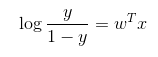
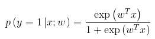
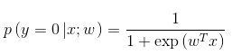
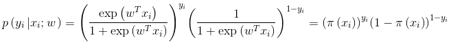
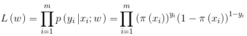
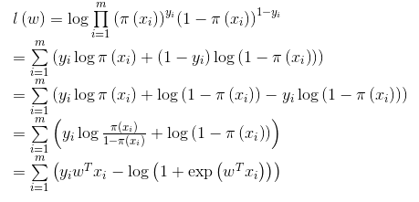
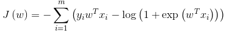
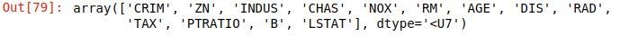

# 机器学习-05

## 逻辑斯蒂回归

案例：

假如有一个罐子，里面有黑白两种颜色的球，数目多少不知，两种颜色的比例也不知。我 们想知道罐中白球和黑球的比例，但我们不能把罐中的球全部拿出来数。现在我们可以每次任意从已经摇匀的罐中拿一个球出来，记录球的颜色，然后把拿出来的球 再放回罐中。这个过程可以重复，我们可以用记录的球的颜色来估计罐中黑白球的比例。假如在前面的一百次重复记录中，有七十次是白球，请问罐中白球所占的比例最有可能是多少？很多人马上就有答案了：70%。而其后的理论支撑是什么呢？

我们假设罐中白球的比例是p，那么黑球的比例就是1-p。因为每抽一个球出来，在记录颜色之后，我们把抽出的球放回了罐中并摇匀，所以每次抽出来的球的颜色服从同一独立分布。这里我们把一次抽出来球的颜色称为一次抽样。题目中在一百次抽样中，七十次是白球的概率是P(Data | M)，这里Data是所有的数据，M是所给出的模型，表示每次抽出来的球是白色的概率为p。如果第一抽样的结果记为x1，第二抽样的结果记为x2... 那么Data = (x1,x2,…,x100)。这样，
$$
\begin{eqnarray}
&P(Data|M)\\& = &P(x_1,x_2,...,x_{100}|M)P\\& = &(x_1|M)P(x_2|M)...P(x_{100}|M)\\& = &p^{70}(1-p)^{30}
\end{eqnarray}
$$

```python
p^70 * (1-p)^30 = 0

(ab)` = a`b+ab`

70*P^69 * (1-P) ^ 30 - P^70 * 30(1-P)^29 = 0

70 - 70P - 30P =0

P = 0.7
```

```python
import numpy as py
import matplotlib.pyplot as plt

x = np.linspace(-10,10,100)
y = 1/(1+np.exp(-x))

plt.plot(x, y)
```


### Logistics回归的原理

利用Logistics回归进行分类的主要思想是：根据现有数据对分类边界线建立回归公式，以此进行分类。这里的“回归” 一词源于最佳拟合，表示要找到最佳拟合参数集。

训练分类器时的做法就是寻找最佳拟合参数，使用的是最优化算法。接下来介绍这个二值型输出分类器的数学原理

Logistic Regression和Linear Regression的原理是相似的，可以简单的描述为这样的过程：

（1）找一个合适的预测函数，一般表示为h函数，该函数就是我们需要找的分类函数，它用来预测输入数据的判断结果。这个过程是非常关键的，需要对数据有一定的了解或分析，知道或者猜测预测函数的“大概”形式，比如是线性函数还是非线性函数。

（2）构造一个Cost函数（损失函数），该函数表示预测的输出（h）与训练数据类别（y）之间的偏差，可以是二者之间的差（h-y）或者是其他的形式。综合考虑所有训练数据的“损失”，将Cost求和或者求平均，记为J(θ)函数，表示所有训练数据预测值与实际类别的偏差。

（3）显然，J(θ)函数的值越小表示预测函数越准确（即h函数越准确），所以这一步需要做的是找到J(θ)函数的最小值。找函数的最小值有不同的方法，Logistic Regression实现时有梯度下降法（Gradient Descent）。

### 1) 构造预测函数

Logistic Regression虽然名字里带“回归”，但是它实际上是一种分类方法，用于两分类问题（即输出只有两种）。首先需要先找到一个预测函数（h），显然，该函数的输出必须是两类值（分别代表两个类别），所以利用了*Logistic函数（或称为Sigmoid函数）*，函数形式为：
$$
\sigma(z)=\frac{1}{1+e^{-z}}
$$


测试函数可以写为：
$$
\begin{eqnarray}
h_\theta(x)=g(\theta^Tx)=\frac{1}{1+e^{-\theta^Tx}}&&&&&&&&&&&&&&&&&&&&&&(1)
\end{eqnarray}
$$
解释：

+ $\theta^Tx$为线性回归，系数乘上目标值

将任意输入映射到区间内，实现由值到概率的转换。为便于讨论，使$b=w_0*x_0$，其中$x_0=1$，此时$w$就成为了$w=(w_0,w_1,..,w_d)$，就成为了$x_i=(1,x_{i1}),...,x_{id}$，$z=w^Tx+b$就成为了$z=w^Tx$，代入（1）中得到：

$$
\begin{eqnarray}
y=\frac{1}{1+e^{-w^Tx}}&&&&&&&&&&&&&&&&&&&&&&&&&(2)
\end{eqnarray}
$$
（2）可以变换为：

$$
\begin{eqnarray}
log\frac{y}{1-y}=w^Tx&&&&&&&&&&&&&&&&&&&&&&(3)
\end{eqnarray}
$$
若将视为样本为正例的可能性，则视为样本为反例的可能性。两者的比值称为“几率（odds）”，一个事件的几率就是指该事件发生的概率与该事件不发生的概率的比值，反映了作为正例的相对可能性。对几率取对数得到对数几率$log\frac{y}{1-y}$（log odds，亦称logit）。即（2）实际上是用线性回归模型的预测结果去逼近真实标记的对数几率。

此时，若将（2）的中视为类后验概率$P(y=1|x)$（就是说，对于样本点的x，可以用S形函数的结果来当做该点属于类别1的概率），则（3）可重写为：

​                                                                          (4)

显然可以得到我们希望学得的逻辑斯蒂模型：

​                                              (5)

​                                                 (6)

令$P(y=1|x;w)=\pi(x)$，则$P(y=0|x;w)=1-\pi(x)$。将（5），（6）整合称为一般形式，得到在已知参数$w$和数据$x_i$的情况下，$y_i$为预测值的条件概率：

  (7)

将（7）连乘，得到已知参数$w$和数据$x$的情况下，$y$为预测值的条件概率。这个条件概率在数值上等于likelihood（W | X，Y），也就是在已知现有数据的条件下，W是真正参数的概率。似然函数为：

​                              (8)

由于乘法难解，通过取对数可以将乘法转换为加法，简化计算。对数似然函数为：

                   

上式结果为(9)，似然函数表示样本成为真实的概率，似然函数越大越好，此时我们可以用梯度上升法求最大值，也可以引入一个负号转换为梯度下降法来求解。

代价函数为：

            (10)


## 构造损失函数

Cost函数和J函数是基于最大似然估计推导得到的

每个样本属于起真实标记的概率，即似然函数，可以写成：
$$
\begin{eqnarray}
P(y|x;\theta)=(h_\theta(x))^y(1-h_\theta(x))^{1-y}      &&&&&&&&&&&&&&&&&&&   (7)
\end{eqnarray}
$$
所有样本都属于其真实标记的概率为：
$$
\begin{eqnarray}
L(\theta) = \prod_{i=1}^{m}P(y^{(i)}|x^{(i)};\theta)\\=\prod_{i=1}^m(h_\theta(x^{(i)}))^{1-y^{(i)}} &&&&&&&&&&&&&&&&&&&&&&&&&&&&&&&&&&& (8)
\end{eqnarray}
$$
对数似然函数为：
$$
\begin{eqnarray}
&l(\theta)=logL(\theta)\\&=&\sum_{i=1}^m(y^{(i)}logh_\theta(x^{(i)})+(1-y^{i})log(1-h_\theta(x^{(i)}))) &&(9)
\end{eqnarray}
$$
最大似然估计就是要求得使l(θ)取最大值时的θ，其实这里可以使用梯度上升法求解，求得的θ就是要求的最佳参数


### 梯度下降求法$J(\theta)$的最小值

求$J(\theta)$的最小值可以使用梯度下降法，根据梯度下降法可得$\theta$的更新过程
$$
\begin{eqnarray}
\theta_j:=\theta_j-\alpha\frac{\delta}{\delta\theta_j}J(\theta),  (j=0...n)&&&&&&&&&&&&&&&&(11)
\end{eqnarray}
$$
式中为$\alpha$学习步长，下面来求偏导：


上式的求解过程中用到如下公式：


因此，$\theta$的更新过程可以写成：


因为式中$\alpha$本来为一个常亮，所以$1/m$一般将省略，所以最终的$\theta$更新过程为：


### python实现逻辑斯蒂回归

```python
from sklearn.datasets import load_iris
from sklearn.model_selection import train_test_split
import numpy as np
import matplotlib.pyplot as plt

data = load_iris().data[:100,[0,2]]
target = load_iris().target[:100]

x_train, x_test, y_train, y_test = train_test_split(data, train, test_size=10)
```

```python
log = Logistic().fit(x_train, y_train)

log.score(x_train, y_train)

log.score(x_test, y_test)

log.predict(X_test)

logtic = LogisticRegression().fit(X_train,y_train)
logtic.score(X_train,y_train)

logtic.score(X_test,y_test)

logtic.predict(X_test)
```


```python
class Logistic(object):
    def __init__(self, max_iter=1000, eta=0.001):
        self.coef_ = None
        self.learning_rate = eta
        self.rate = max_iter
       
    def fit(self,x,y):
        x = np.array(x)
        y = np.array(y)
        
        # 目标值的映射
        self.clsname = np.unique(y.ravel())
        
        # 累的数量
        self.clsnum = len(self.clsname)
        for i in range(self.clsnum):
            index = y == self.clsname[i]
            y[i] = i

        # 类型的转换
        y = y.astype(np.int8)
        
        # 获取样本数量
        smaple_num, feature = x.shape
        
        # 设置初始化系数
        self.coef_ = np.random.radn(feature, -1)
        # 梯度下降
        for i in range(self.rate):
            # 计算损失
            l, dw = self.loss(x,y,smaple_num)
            
            # 粗调和精调
            self.coef_ -= self.learning_rate * dw
            
            if (i+1)%200==0:
                print('===========')
                print('梯度：'+str(i+1))
                print('系数：'+str(self.coef_))
                print('损失：'+str(l))
            
            
    def loss(self, x, y, smaple_num):
        h = self.output(x)
        
        loss = -np.sum(y*np.log(h)+(1-y)*np.log(1-h))
        
        l = loss/smaple_num
        
        # 梯度系数
        dw = x.T.dot(h-y)/smaple_num
        return l, dw
    
    def output(self, x):
        op = np.dot(x, self.coef_)
        
        return self.sigmoid(op)
    
    def sigmoid(self, x):
        return 1/(1+np.exp(-x))
    
    def predict(self, x):
        x = np.array(x)
        
        # 预测目标值
        h = self.putput(x)
        y_pred = np.round(x)
        y_pred = y_pred.astype('<U64')
        
        for i in range(self.clsnum):
            index = y_pred == i
            y_pred[index] = self.clsname[i]
            
        return y pred_ravel
    
    def score(self, x,y):
        y = np.array(y)
        
        y_pred = self.predict(x)
        
        return np.mean(y=y_pred)
```

回归测试实例

```python
from sklearn.datasets import load_boston
from sklearn.metrics import mean_absolute_error,mean_squared_error
import numpy as np
from sklearn.linear_model import SGDRegressor, Lasso  # 以AI制AI
from sklearn.preprocessing import StandardScaler  # 标准化
from sklearn.model_selection import train_test_split, GridSearchCV # 优化 提高模型范化性和识别率

lb = load_boston()
lb.feature_names
```



```txt
数据字段介绍：
'CRIM',    犯罪率
'ZN',      大面积的住宅比例
'INDUS',   非零售用地的比例
'CHAS'     周围的邻居数
'NOX',     一氧化氮浓度
'RM',      每栋房子的居住人数
'AGE',     1940年以前建造比例
'DIS',     离波士顿五个就业中心的距离
'RAD',     到公路的径值距离
'TAX',     财产税
'PTRATIO', 教师学生的比例
'B',       黑人比例
'LSTAT'    低收入人群的比例
```

```python
lb.data.shape

ld.data.nbytes

lb.data[:5]

data = lb.data
target = lb.target

# 梯度爆炸
x_train, x_test, y_train, y_test = train_test_split(data, target, test_size=26)

# 训练
sgd = SGDRegressor(fit_intercept=False).fit(x_train, y_train)
sgd.score(x_train, y_train)
y_train_pred = sgd.predict(x_train)


# y_true 真实的目标值, y_pred 预测的目标值
# np.sqrt(np.mean(np.square(y_true))) np.mean(np.square(y_pred))
mean_squared_error(y_train, y_train_pred)
```

```python
# 标准化
data = lb.data
target = lb.target

std_fea = StandardScaler()
data_ = std_fea.fit_transform(data)

std_la = StandardScaler()
target_ = std_la.fit_transform(target.reshape(-1,1))

x_train, x_test, y_train, y_test = train_test_split(data_, target_, test_size=56)

sgd = SGDRegressor(fit_intercept=False, alpha=0.1, eta0=0.01).fit(x_train, y_train)

y_pred = sgd.predict(x_test)

np.sqrt(mean_squared_error(y_test, y_pred))

np.mean(np.abs(y_test))

mean_absolute_error(std_la.inverse_transform(y_test.reshape(-1,1)),std_la.inverse_transform(y_pred.reshape(-1,1)))

# RMSE 误差比较大的模型
np.sqrt(mean_squared_error(std_la.inverse_transform(y_test.reshape(-1,1)),std_la.inverse_transform(y_pred.reshape(-1,1))))

sgd = SGDRegressor(fit_intercept=False)

param_grid = {"eta0":[1,0.1,0.01,0.001],"max_iter":[10000,100000],"alpha":[0.1,0.01,0.001]}
gc = GridSearchCV(estimator=sgd, param_grid=param_grid, cv=2).fit(x_train, y_train)

gc.best_score_
gc.best_params_


best_sgd = gc.best_estimator_

best_sgd.score(x_train, y_train)

best_sgd.score(x_test, y_test)
```


