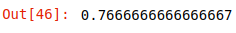
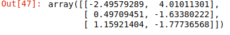
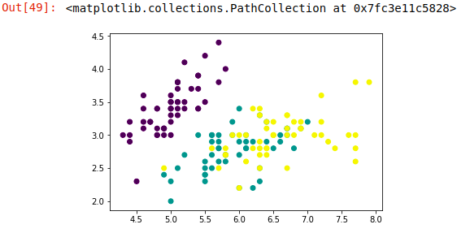
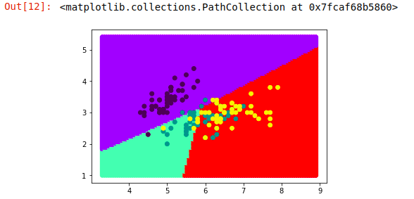
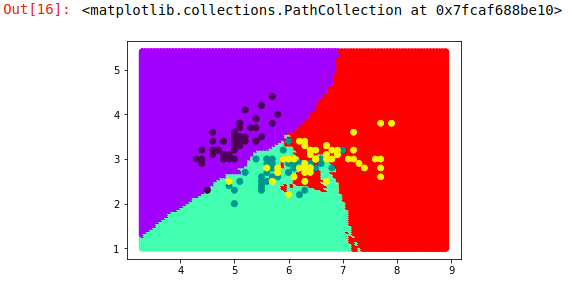

# 机器学习-06

### 逻辑斯蒂回归实战

```python
from sklearn.linear_model import LogisticRegression
from sklearn.neighbors import KNeighborsClassifier
import numpy as np
import matplotlib.pyplot as plt
from sklearn.datasets import load_iris
from sklearn.model_selection import train_test_split


data = load_iris().data[:,[0,1]]
target  = load_iris().target


log = LogisticRegression(fit_intercept=True).fit(data, target)

log.score(data, target)
```



```python
log.coef_
```



+ 决策边界

```python
plt.scatter(data[:,0], data[:,1], c=target)
```



```python
# 获取两个特征中的最大值和最小值
x1 = data[:,0]
x2 = data[:,1]

x1_max,x1_min = x1.max()+1, x1.min()-1
x2_max,x2_min = x2.max()+1, x2.min()-1

# 生成10000个数据集
x1_range = np.linspace(x1_min, x1_max, 100)
x2_range = np.linspace(x2_min, x2_max, 100)

# meshgrid：生成网格采样点
x,y = np.meshgrid(x1_range, x2_range)
# np.concatenate([x.reshape(-1,1), y.reshape(-1,1)], axis=1)
# np.c_：是按行连接两个矩阵，就是把两矩阵左右相加，要求行数相等，类似于pandas中的merge()。
# np.r_：是按列连接两个矩阵，就是把两矩阵上下相加，要求列数相等，类似于pandas中的concat()
x_test = np.c_[x.ravel(), y.ravel()]

y_pred = log.predict(x_test)

plt.scatter(x_test[:,0],x_test[:,1],c=y_pred, cmp='rainbow')
plt.scatter(data[:,0], data[:,1],c=target)
```



使用knn进行计算

```python
kdtree = KNeighborsClassifier(algorithm='kd_tree').fit(data, target)

kdtree.score(data, target)  # 0.8333333333333334

y_pred_knn = kdtree.predict(x_test)

plt.scatter(x_test[:,0],x_test[:,1], c=y_pred_knn, cmap='rainbow')
plt.scatter(data[:,0], data[:,1], c=target)
```



### 二元分类

```python
import pandas as pd
from sklearn.preprocessing import StandardScaler

cancer = pd.read_csv('cancer.csv', sep='\t')

featrues = cancer.iloc[:,2:]
labels = cancer,iloc[:,1]

# 特征工程
std_ = StandardScaler()
features_ = std_.fit_transform(features)

x_train, x_test, y_train, y_test = train_test_split(features_, labels, test_size=69)

log = LogisticRegression(fit_intercept=False, C=0.1).fit(x_train, y_train)

log.score(x_train, y_train), log.score(x_test,y_test)

knn = KNeighborsClassifier().fit(x_train, y_train)

knn.score(x_train, y_train), knn.score(x_test, y_test)
```

## 朴素贝叶斯

+ 朴素：独立性假设
+ 贝叶斯公式
+ 文本分类

优点：

+ 朴素贝叶斯模型发源于古典数学理论，有着坚实的数学基础，以及稳定的分类效率
+ 对小规模的数据表现很好
+ 能处理多分类任务，适合增量式训练
+ 对缺失数据不敏感，算法也比较简单，常用于文本分类

缺点：

+ 只能用于分类问题
+ 需要计算先验概率
+ 分类决策存在错误率
+ 对输入数据的表达形式很敏感

### 逆向概率

现分别有 A、B 两个容器，在容器 A 里分别有 7 个红球和 3 个白球，在容器 B 里有 1 个红球和 9 个白球，现已知从这两个容器里任意抽出了一个球，且是红球，问这个红球是来自容器 A 的概率是多少?

```python
概率计算公式，时间B发生的情况下，A发生的概率：
p(A|B) = P(B|A) * p(A) / P(B)
```

先定义A事件 选中A容器

定义B事件  选中红球
$$
P(A) = 1/2\\
P(B) = 8/20\\
p(B|A) = 7/20\\
p(A|B) = p(B|A) *P(B) / P(A)
$$
一座别墅在过去的 20 年里一共发生过 2 次被盗，别墅的主人有一条狗，狗平均每周晚上叫 3 次，在盗贼偷窃时狗叫的概率被估计为 0.9，问题是：在狗叫的时候发生盗窃的概率是多少？

A 事件：狗在晚上叫

B事件：盗贼偷窃
$$
P(A) = 3/7\\
P(B) = 2/(20*365+5)\\
P(A|B) = 0.9\\
p(B|A) = (0.9) * (2/(20*365+5))/(3/7)
$$

### 朴素贝叶斯原理

朴素贝叶斯算法是一个典型的统计学习方法，主要理论基础就是一个贝叶斯公式，贝叶斯公式的基本定义如下：
$$
P(Y_k|X) = \frac{P(XY_k)}{P(X)} = \frac{P(Y_K)P(X|Y_K)}{\sum_jP(Y_j)P(X|Y_j)} 
$$
这个公式虽然看上去简单，但是它能总结历史，预支未来

+ 公式右边是总结历史
+ 公式左边是预支未来

如果把Y看成类别，X看成特征，P(Yk|X)就是在已知特征X的情况下求Yk类别的概率，而对P(Yk|X)的计算又全部转化到类别Yk的特征分布上来。

举个例子，大学的时候，某男生经常去图书室晚自习，发现他喜欢的那个女生也常去那个自习室，心中窃喜，于是每天买点好吃点在那个自习室蹲点等她来，可是人家女生不一定每天都来，眼看天气渐渐炎热，图书馆又不开空调，如果那个女生没有去自修室，该男生也就不去，每次男生鼓足勇气说：“嘿，你明天还来不？”,“啊，不知道，看情况”。

然后该男生每天就把她去自习室是与否以及一些其他情况做一下记录，用Y表示该女生是否去自习室，即Y={去，不去}，X是跟去自修室有关联的一系列条件，比如当天上了哪门主课，蹲点统计了一段时间后，该男生打算今天不再蹲点，而是先预测一下她会不会去，现在已经知道了今天上了常微分方程这么主课，于是计算P(Y=去|常微分方程)与P(Y=不去|常微分方程)，看哪个概率大，如果P(Y=去|常微分方程) >P(Y=不去|常微分方程)，那这个男生不管多热都屁颠屁颠去自习室了，否则不就去自习室受罪了。P(Y=去|常微分方程)的计算可以转为计算以前她去的情况下，那天主课是常微分的概率P(常微分方程|Y=去)，注意公式右边的分母对每个类别（去/不去）都是一样的，所以计算的时候忽略掉分母，这样虽然得到的概率值已经不再是0~1之间，但是通过比较大小还是能选择类别。

后来他发现还有一些其他条件可以挖，比如当天星期几、当天的天气，以及上一次与她在图书馆的气氛，统计了一段时间后，该男子一计算，发现不好了，因为总结历史的公式：
$$
P(X=x|Y=c_k) = P(X^{(1)}=x^{(i)},...,X^{(n)}=x^{(n)}|Y=c_K)
$$
这里n=3，x(1)表示主课，x(2)表示天气，x(3)表示星期几，x(4)表示气氛，Y仍然是{去，不去}，现在主课有8门，天气有晴、雨、阴三种、气氛有A+,A,B+,B，C五种，那么总共需要估计的参数有8×3×7×5×2=1680个，每天只能收集到一条数据，那么等凑齐1680条数据，大学都毕业了，男生大呼不妙，于是做了一个独立性假设，假设这些影响她去自习室的原因是独立互不相关的，于是：
$$
P(X=x|Y=c_k) = P(X^{(1)},...,X^{(n)}=x^{(m)}|Y=c_k)=\Pi_{j=1}^nP(X^{(j)}=x^{(j)}|Y=c_k)有了这个独立假设后，需要估计的参数就变为，(8+3+7+5)×2 = 46个了，而且每天t 收集的一条数据，可以提供4个参数，这样该男生就预测越来越准了。
$$
文本类型处理成稀疏矩阵

重要程度分析  TF(词语频率)IDF(逆文档频率)
不重要的词语   语气词  出现的次数多
重要的词语  出现的次数比较少

```python
import numpy as np
import pandas as pd
import copy

text = ['Life is short ,I user  Python Pyhton', 'Life is long, I do not need Python']

wordDict = dict()
wordLists = []
for i in text:
    wordList = []
    words = i.replace(',',' ').split(' ')
    for word in words:
        if len(word) > 1:
            wordList.append(word)
            wordDict[word] = 0
    wordLists.append(wordList)

wordDicts = []
for i in wordLists:
    wordDict_ = copy.deepcopy(wordDict)
    for word in i:
        if word in wordDict.keys():
            wordDict_[word] += 1
    wordDicts.append(wordDict_)
    
    
tfDicts = []
difDict = copy.deepcopy(wordDict)
N = len(wordDicts)
for i in range(N):
    tfdict = dict()
    # 单个文本中的词总量
    tdcount = len(wordLists[i])
    for word,count in wordDicts[i].items():
        tfdict[word] = count/tdcount
        if count > 0:
            difDict[word] += 1  
    tfDicts.append(tfdict)
    
for word, count in difDict.items():
    difDict[word] = np.log((N+1)/(count+1))
    
tfdifs = []
for tf in tfDicts:
    tfdif = dict()
    for word, tfval in tf.items():
        tfdif[word] = tfval*difDict[word]
    tfdifs.append(tfdif)
```


### 朴素贝叶斯分类器

朴素贝叶斯分类器发的表示方式：
$$
y=f(x)=argmax_{c_k}P(Y=c_k|X=x)=argmax_{c_k}\frac{P(Y=c_k)\prod_jP(X^{(j)}=x^{(j)}|Y=c_k)}{\sum_kP(Y=c_k)\prod_jP(X^{(j)}=x^{(j)}|Y=c_k)}
$$
当特征为x时，计算所有类别的条件概率，选取条件概率最大的类别作为待分类的类别。由于上公式的分母对每一个类别都是一样的，因此计算时可以不考虑分母，即：
$$
y=f(x)=argmax_{c_k}P(Y=c_k|X=x)\prod_jP(X^{(j)}=x^{(j)}|Y=c_k))
$$
朴素贝叶斯的朴素体现在其对各个条件的独立性假设上，加上独立假设后，大大减少了参数假设空间

