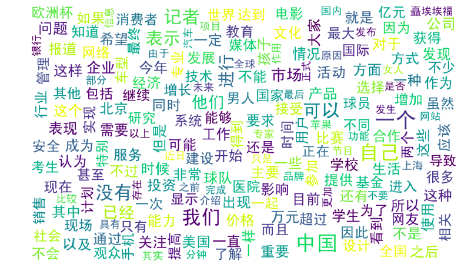

# 机器学习-07

## 朴素贝叶斯

### 在文本分类上的应用

文本分类的应用很多，比如垃圾邮件和垃圾短信的过滤就是一个2分类问题，新闻分类、文本情感分析等都可以看成是文本分类问题，分类问题由两步组成：训练和预测，要建立一个分类模型，至少需要有一个训练数据集。贝叶斯模型可以很自然地应用到文本分类上：现在有一篇文档d（Document），判断它属于哪个类别ck，只需要计算文档d属于哪一个类别的概率最大：
$$
c=argmax_{c_k}P(c_k|d)
$$
在分类问题中，我们并不是把所有的特征都用上，对一篇文档d，我们只用其中的部分特征词项t1,t2,...,tnd（nd表示d中的总词条数目），因为很多词项对分类是没有价值的，比如一些停用词“的,是,在”在每个类别中都会出现，这个词项还会模糊分类的决策面，关于特征词的选取，我的这篇文章有介绍。用特征词项表示文档后，计算文档d的类别转化为：
$$
c=argmax_{c_k}P(c_k|d)=argmax_{c_k}\prod_{1 \leq j \leq n_d}P(t_j|c_k)
$$
注意P(Ck|d)只是正比于后面那部分公式，完整的计算还有一个分母，但我们前面讨论了，对每个类别而已分母都是一样的，于是在我们只需要计算分子就能够进行分类了。实际的计算过程中，多个概率值P(tj|ck)的连乘很容易下溢出为0，因此转化为对数计算，连乘就变成了累加：
$$
c=argmax_{c_k}P(c_k|d)=argmax_{c_k}[logP(c_k)+\sum_{1 \leq j \leq n_d}logP(t_j|c_k)]
$$
我们只需要从训练数据集中，计算每一个类别的出现概率P(ck)和每一个类别中各个特征词项的概率P(tj|ck)，而这些概率值的计算都采用最大似然估计，说到底*就是统计每个词在各个类别中出现的次数和各个类别的文档的数目*：
$$
P(c_k)=\frac{N_{c_k}}{N}\\
P(t_j|c_k)=\frac{T_{jk}}{\sum_{1 \leq i \leq |V|}T_{ik}}
$$

### 3中贝叶斯模型

1. 高斯分布朴素贝叶斯

   高斯分布就是正态分布

   用途：用于一般分类问题

   使用自带的鸢尾花数据

   不适合做文本分类，做结构化数据分类

   ```python
   from sklearn.naive_bayes import GaussianNB
   ```

2. 多项式分布朴素贝叶斯

   多项式分布：
   $$
   P(X_1=n_1,...,X_k=n_k)=\begin{cases}\frac {n!}{n_1!...n_k!}P_1^{n_1}...P_k^{n_k}&,&\sum_{i=1}^{k}n_i=n \\ 0&,&otherwise\end{cases}
   $$
   用途：适用于文本数据(特征表示的是次数，例如某个词语的出现次数)

   ```python
   from sklearn.naive_bayes import MultinomalNB
   ```

3. 伯努利分布朴素贝叶斯

   伯努利分布：
   $$
   \frac{n!}{r!(n-r)!}p^k(1-p)^{n-k}
   $$
   用途：适用于伯努利分布，也适用于文本数据(此时特征表示的是是否出现，例如某个词语的出现为1，不出现为0)

   绝大多数情况下表现不如多项式分布，但是有时候伯努利分布表现得要比多项式分布要好，尤其是对于小数据量的文本数据

   ```python
   from sklearn.navie_bayes import BernoulliNB
   ```

   ### 词云的制作
   
   ```python
   import numpy as np
   import pandas as pd
   import matplotlib.pyplot as plt
   import jieba
   from sklearn.model_selection import train_test_split
   from sklearn.feature_extraction.text import CountVectorizer, TfidfVectorizer
   from sklearn.naive_bayes import BernoulliNB, MultinomialNB, GaussianNB
   # 词云生成库
   from wordcloud import WordCloud
   
   df_news = pd.read_table('./data/val.txt', header=None, names=['labels','title', 'url', 'content'], encoding='utf-8')
   
   df_news_content = df_news.content.tolist()
   contents = []
   for line in df_news_content:
       list_ = jieba.lcut(line)
       content_s = []
       if len(list_) > 0:
           for word in list_:
               if len(word) > 1:
                   content_s.append(word)
       contents.append(np.array(content_s))
       
   contents = np.array(contents)
   
   
   s1 = pd.read_table('stopwords.txt', sep='/n', header=None)
   s2 = pd.read_table('四川大学机器智能实验室停用词库.txt', sep='/n', header=None)
   s3 = pd.read_table('中文停用词库.txt', sep='/n', header=None)
   s4 = pd.read_table('哈工大停用词表.txt', sep='/n', header=None)
   
   # 合并停用词
   stopwords = pd.concat([s1,s2,s3,s4])
   stopwords.columns = ['stopword']
   
   # 去除文本中的停用词
   # 所有的单词
   all_word = []
   # 去除停用词之后的所有单词
   conut_clear = []
   # 所有单词出现的次数
   wordcount = {}
   for i in contents:
       line_clear = []
       for word in i:
           if word not in stopwords.stopword:
               line_clear.append(word)
               all_word.append(word)
               if word in wordcount.keys():
                   wordcount[word] += 1
               else:
                   wordcount[word] =0
       conut_clear.append(np.array(line_clear))
   conut_clear = np.array(conut_clear)
   
   word_count = pd.DataFrame(dict(all_word=all_words))
   
   word_count_order = word_count.groupby(by='all_word')['all_word'].agg({'count':np.size}).reset_index().sort_values(by='count',ascending=False)
   
   
   wc = WordCloud(font_path='./data/simhei.ttf',width=1000, height=600, background_color='white', max_font_size=50)
   # 词云 要求：传入的数据是一个dict类型 关键字作key 统计数量当value
   # word_dict = dict(zip(words_count.all_word.tolist(), words_count['count'].tolist()))
   res = wc.fit_words(wordcount)
   
   plt.figure(figsize=(18,12))
   plt.imshow(res)
   plt.axis('off')
   plt.savefig('wc.png', dpi=10)
   ```
   
   

```python
data = []
for line in content_clears:
    data.append(' '.join(line))
data = np.array(data)

# 字符串 向量化
c_ = CountVectorizer()
sm_data = c_.fit_transform(data)

c_.get_feature_names()

# 高斯分布朴素贝叶斯
target = df_news.labels
x_train, x_test, y_train, y_test = train_test_split(sm_data, target, test_size=0.1)
# 高斯分布贝叶斯不识别稀疏矩阵 
GNB = GaussianNB().fit(x_train.toarray(), y_train)

GNB.socre(x_train.toarray(),y_train), GNB.score(x_test, y_test)
```

```python
# 多项式
MNB = MultinomialNB().fit(x_train, y_train)
MNB.score(x_train, y_train), MNB.score(x_test, y_test)
```

```python
# 伯努利
BNB = BernoulliNB().fit(x_train, y_train)
BNB.score(x_train, y_train), BNB.score(x_test, y_test)
```

### 垃圾邮件分类

```python
import numpy as np
import pandas as pd
from sklearn.model_selection import train_test_split
from sklearn.feature_extraction.text import TfidfVectorizer
from sklearn.naive_bayes import BernoulliNB,MultinomialNB

sm_data=pd.read_table('day12_data/SMSSpamCollection',header=None,names=['labels','content'])

feature = sm_data.content
labels = sm_data.labels

tfidf = TfidfVectorizer()
# fit_transform：数据标准化
feature_ = tfidf.fit_transform(feature)

# 多项式朴素贝叶斯
MNB=MultinomialNB().fit(X_train,y_train)
MNB.score(X_train,y_train),MNB.score(X_test,y_test)
# 伯努利朴素贝叶斯
BNB=BernoulliNB().fit(X_train,y_train)
BNB.score(X_train,y_train),BNB.score(X_test,y_test)
```

