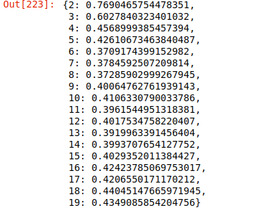

# 机器学习-08

## k均值算法(K-means)聚类

### K-means算法原理

聚类的概念：一种无监督学习，实现不知道类别，自动将相似的对象归到同一个簇中

K-Means算法是一种聚类分析(cluster analysis)的算法，其主要是用来计算数据聚集的算法，主要通过不断的取离种子点最近均值算法

K-Means算法主要解决的问题如下图所示，我们可以看到，在的左边有一些点，我们用肉眼可以看出来有四个点群，但是我们怎么通过计算机程序找出这几个点群来呢》于是出现了我们的K-Means算法


这个算法其实很简单，如下图所示：


从上图中，我们可以看到，A，B，C，D，E是五个在图中点。而灰色的点是我们的种子点，也就是我们用来找点群的点。有两个种子点，所以K=2。

然后，K-Means的算法如下：

1. 随机在图中取K（这里K=2）个种子点。
2. 然后对图中的所有点求到这K个种子点的距离，假如点Pi离种子点Si最近，那么Pi属于Si点群。（上图中，我们可以看到A，B属于上面的种子点，C，D，E属于下面中部的种子点）
3. 接下来，我们要移动种子点到属于他的“点群”的中心。（见图上的第三步）
4. 然后重复第2）和第3）步，直到，种子点没有移动（我们可以看到图中的第四步上面的种子点聚合了A，B，C，下面的种子点聚合了D，E）。

这个算法很简单，重点说一下“求点群中心的算法”：欧氏距离（Euclidean Distance）：差的平方和的平方根
$$
d_{ij} = \sqrt{\sum_{k=1}^n(x_{ik}-x_{jk})^2}
$$
K-Means主要最重大的缺陷都和初始值有关：

K是事先给定的，这个K值的选定是非常难以估计的。很多时候，事先并不知道给定的数据集应该分成多少个类别才最合适。（ISODATA算法通过类的自动合并和分裂，得到较为合理的类型数目K）

K-Means算法需要用初始随机种子点来搞，这个随机种子点太重要，不同的随机种子点会有得到完全不同的结果。（K-Means++算法可以用来解决这个问题，其可以有效地选择初始点）

总结：K-Means算法步骤：

1. 从数据中选择k个对象作为初始聚类中心
2. 计算每个聚类对象到聚类中心的距离来划分
3. 再次计算每个聚类中心
4. 计算标准测度函数，知道达到最大迭代次数，则停止，否则，继续操作
5. 确定最优的聚类中心

K-Means算法应用

看到这里，你会说，K-Means算法看来很简单，而且好像就是在玩坐标点，没什么真实用处。而且，这个算法缺陷很多，还不如人工呢。是的，前面的例子只是玩二维坐标点，的确没什么意思。但是你想一下下面的几个问题：

1）如果不是二维的，是多维的，如5维的，那么，就只能用计算机来计算了。

2）二维坐标点的X，Y 坐标，其实是一种向量，是一种数学抽象。现实世界中很多属性是可以抽象成向量的，比如，我们的年龄，我们的喜好，我们的商品，等等，能抽象成向量的目的就是可以让计算机知道某两个属性间的距离。如：我们认为，18岁的人离24岁的人的距离要比离12岁的距离要近，鞋子这个商品离衣服这个商品的距离要比电脑要近，等等。

### 实战

重要参数：

+ n_clusters：聚类的个数

重要属性：

+ cluster_center_：[n_cluster, n_features]的数组，表示聚类中心点的坐标
+ labels_：每个样本点的标签

```python
from sklearn.datasets import make_blobs,make_circles
import matplotlib.pyplot as plt
import numpy as np
import seaborn as sns
from sklearn.cluster import KMeans
sns.set_style('dark')

feature, labels = make_blobs(n_samples=100, n_features=2, centers=3,cluster_std=1.0)

plt.scatter(features[:,0], feature[:,1], c=labels,cmap='cool')
```


```python
# n_clusters 需要聚集成多少类
km = KMeans(n_clusters=3).fit(features)

km.lables_
```


```python
plt.scatter(features[:,0], feature[:,1]c=km.lables_,cmap='cool')
```


```python
# 将两个目标数据进行映射
true_ = []
for i in labels:
    if i not in true:
        true.append(i)
        
 true_

pred = []
for i in km.lables_:
    if i in not in pred:
        pred.append(i)
pred

m = {0:'A',1:'B',2:'C'}
lables = labels.astype('<U1')
y_pred = labels.astype('<U1')

for k, v in m.item():
    index = labels == str(true_[k])
    labels[idnex] = v
    idnex = y_pred == str(pred[k])
    y_pred[idnex] = v
    
    
np.means(labels == y_pred)
```

### 聚类评估：轮廓系数(Silhouette Coefficient)

$s(i)=\frac{b(i)-a(i)}{max\{a(i),b(i)\}}$                 $s(i)=\begin{cases}1-\frac{a(i)}{b(i)}&,&a(i)<b(i)\\0&,&a(i)=b(i)\\\frac{b(i)}{a(i)}-1&,&a(i)>b(i)\end{cases}$

+ 计算样本i到同簇其他样本的平均距离ai。ai越小，说明样本应该被聚类到该簇，将ai称为样本i的簇内不相似度
+ 计算样本i到其他某簇Cj的所有样本的平均距离bij，称为样本i与簇cj的不相似度，定义为样本i的簇的不相似度：bi=min{bi1,bi2,...,bik}
+ si接近1，则说明样本i聚类合理
+ si接近-1，则说明样本i更应该分类到另外的簇
+ 若si近似为0，则说明样本i在两个簇的边界上

```python
from sklearn.metrics import silhouette_score

silhouette_score(features,km.labels_)

# 暴力破解
param = list(range(2,20))
best_params = dict()
for i in param:
    km = KMeans(n_clusters=i).fit(features)
    score = silhouette_score(features,km.labels_)
    best_params[i] = score
    
best_param
```



#### 常见错误

导包，使用make_blobs创建样本点

+ k值不合适，make_blobs默认中心点三个

+ 数据偏差

  trans = [[0.6,-0.6],[-0.4,0.8]]

  x2 = np.dot(x, trans)

+ 标准偏差不相同cluster_std

+ 样本数量不同

+ 非线性可分数据

```python
data, target = make.circles(noise=.1, factor=.2)

plt.scatter(data[:,0], data[:,1], c=target, cmap='autumn')
plt.axis('equal')
```


K-Means对非线性数据的聚类：

```python
km = KMeans(2).fit(data)

cc = km.cluster_centers_

plt.scatter(cc[:,0],cc[:,1])
plt.axis('equal')
```


逻辑斯蒂回归对非线性数据的分类

```python
from sklearn.linear_model import LogisticRegression

log = LogisticRegression().fit(data, target)

plt.scatter(data[:0,],data[:,1],c=log.predict(data),cmap='autumn')
```


KNN对非线性数据的分类

```python
from sklearn.neighbors import KNeighborsClassfiler

knn = KNeighborsClassifier().fit(data, target)

plt.scatter(data[:,0],data[:,1],c=knn.predict(data),cmap='autumn')
```


### DBSCAN(聚类)

```python
from sklearn.cluster import DBSCAN
#eps=0.5  半径, min_samples=5 最少几个样本可以聚集为一个类别  
dbscan = DBSCAN(eps=0.4, min_sample=3).fit(data, target)

plt.scatter(data[:,0], data[:,1],c=dbscan.labels_,cmap='autumn')
```


```python
dbscan.labels_

len(np.unique(dbscan.labels_))
```

```python
eps = [0.1, 0.2, 0.3, 0.4, 0.5]
min_sample = [3,5,7,9,11]
def gc(params=dict(),x=None,h=2,fit_noise=True):
    eps = params.get('eps', [])
    min_sample = params.get('min_samples', [])
	p = list()
    for e in eps:
        for s in min_samples:
            dict_ = {}
            dbscan = DBSCAN(eps=e,min_tamples=s).fit(x)
            clusnum = len(np.unique(dnscan.labels_))
            if fit_noise:
                if -1 in dbscan.labels_:
                    if clsnum == h:
                        dict_['eps'] =e
                        dict_['min_samples'] = s
                        p.append(dict_)
                else:
                     if -1 in dbscan.labels_:
                     if clsnum == h:
                        dict_['eps'] =e
                        dict_['min_samples'] = s
                        p.append(dict_)
                        
       return p 
```

```python
gc(dict(eps=eps,min_samples=min_samples),x=data,fit_noise=False)
```

